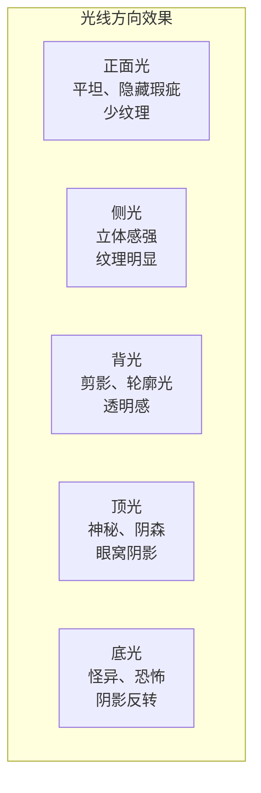

# 光照设置速查

## 光源质量速查

| 光源类型 | 光源大小 | 阴影边缘 | 对比度 | 典型场景 |
|---------|---------|---------|-------|---------|
| 正午太阳 | 极小（遥远） | 锐利 | 极高 | 晴天户外正午 |
| 黄昏太阳 | 小但边缘柔化 | 较锐利但远端柔化 | 中等 | 傍晚 |
| 阴天天空 | 极大（整个天空） | 非常柔和 | 低 | 阴天户外 |
| 窗户（漫射） | 大 | 柔和 | 中低 | 室内日间 |
| 裸灯泡 | 小 | 锐利 | 高 | 台灯、顶灯 |
| 灯罩灯泡 | 中 | 柔和 | 中 | 家用照明 |
| 摄影柔光箱 | 大 | 非常柔和 | 低 | 人像/产品摄影 |
| 烛光/火光 | 小且不稳定 | 锐利（闪动） | 高 | 夜间、氛围 |


## 光线方向速查




### 正面光 Front Lighting
- **特点**：隐藏纹理和瑕疵，使物体看起来扁平
- **适用**：柔光人像（隐藏皱纹）、产品展示
- **注意**：硬正面光可能过于生硬
- **自然出现**：日出日落时太阳在你背后

### 侧光 Side Lighting
- **特点**：突出纹理和立体感，阴影明显
- **适用**：任何需要强调质感的场景
- **自然出现**：清晨或傍晚低角度阳光
- **注意**：可能暴露皮肤瑕疵

### 背光 Back Lighting
- **特点**：剪影、轮廓光、半透明感
- **适用**：戏剧性场景、表现透明/半透明材质
- **自然出现**：逆光场景
- **技巧**：可用于在暗背景下分离主体

### 顶光 Top Lighting
- **特点**：眼窝深陷、表情阴森
- **自然出现**：阴天（天空为光源）、正午
- **效果**：硬顶光→神秘；软顶光→柔和

### 底光 Bottom Lighting
- **特点**：异常感、恐怖感、阴影反转
- **自然出现**：篝火、手电筒从下方照射
- **效果**：因为罕见，适合创造不安氛围

## 常见布光方案

### 自然布光
```
场景：窗户边的肖像
方案：窗户为主光（柔光），墙壁反射为补光
特征：从窗户方向逐渐衰减到暗部
注意：房间墙壁颜色会影响补光颜色
```

### 混合布光
```
场景：黄昏室内
方案：窗户进来的冷蓝天光 + 钨丝灯的暖橙色光
效果：冷暖对比，富有氛围
应用：适合讲故事、创造情绪
```

### 户外晴天
```
方案：太阳（主光，硬）+ 蓝天（补光，软）
阴影颜色：蓝色（来自天光）
注意：阴影中的颜色饱和度取决于补光颜色
```

### 户外阴天
```
方案：整个天空（单一的柔光源）
特征：阴影极柔和、色彩饱和度高、对比度低
优势：适合拍摄人像和微距
```

## 情绪与用光对照

| 情绪 | 亮度 | 对比度 | 光质 | 色温 | 方向 |
|------|------|--------|------|------|------|
| 愉悦/轻松 | 高 | 低 | 柔 | 暖/中性 | 正面/侧光 |
| 神秘/悬疑 | 低 | 高 | 硬 | 冷 | 侧光/顶光 |
| 恐怖 | 极低 | 极高 | 硬 | 绿/冷 | 底光/顶光 |
| 浪漫/温暖 | 中 | 低 | 柔 | 暖 | 背光/漫射 |
| 英雄/史诗 | 中高 | 中 | 硬 | 暖 | 背光+补光 |
| 哀伤/孤独 | 低 | 中 | 柔 | 冷 | 侧光/顶光 |
| 平凡/日常 | 中 | 中 | 中 | 中性 | 环境光 |
| 梦幻/超凡 | 中低 | 低 | 柔 | 多变 | 背光+色彩 |

## 常见误区

> [!WARNING] 三点照明并非万能
> 三点照明是历史产物，看起来刻意且过时。除非特意追求风格化效果，否则不要机械地套用。

> [!WARNING] 阴影不是纯黑
> 现实中的阴影总是被某种补光照亮的，应该包含颜色和信息。灰色/黑色阴影让画面死气沉沉。

> [!WARNING] 白平衡陷阱
> 人眼会自动过滤色偏。参考照片的色彩可能是"准确"的但看起来很假——以你的感知为准而非绝对真实。

## 快速诊断清单

遇到光照问题时检查以下要素：

- [ ] 光源有几个？各自是什么颜色？
- [ ] 主光源的大小（决定阴影软硬度）
- [ ] 光的方向（正面/侧面/背面/上面/下面）
- [ ] 是否有补光？什么颜色？
- [ ] 阴影是黑色还是有颜色？
- [ ] 是否有混合色温的光源？
- [ ] 是否有反射光（辐射）影响相邻表面？
- [ ] 是否有半透明物体的次表面散射？
- [ ] 高光的位置和形状是否与表面类型匹配？

---

## 相关课程

- [[reference/glossary|术语表]]
- [[reference/color-temperature|色温参考]]