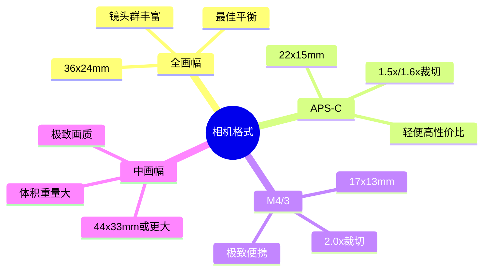
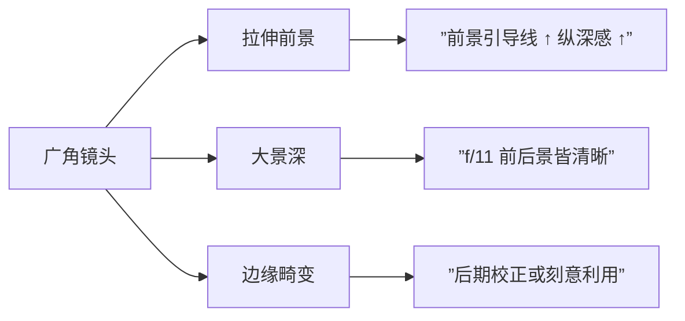
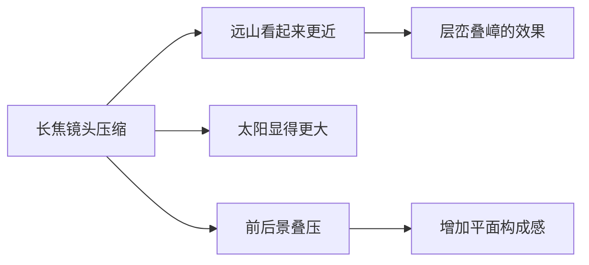
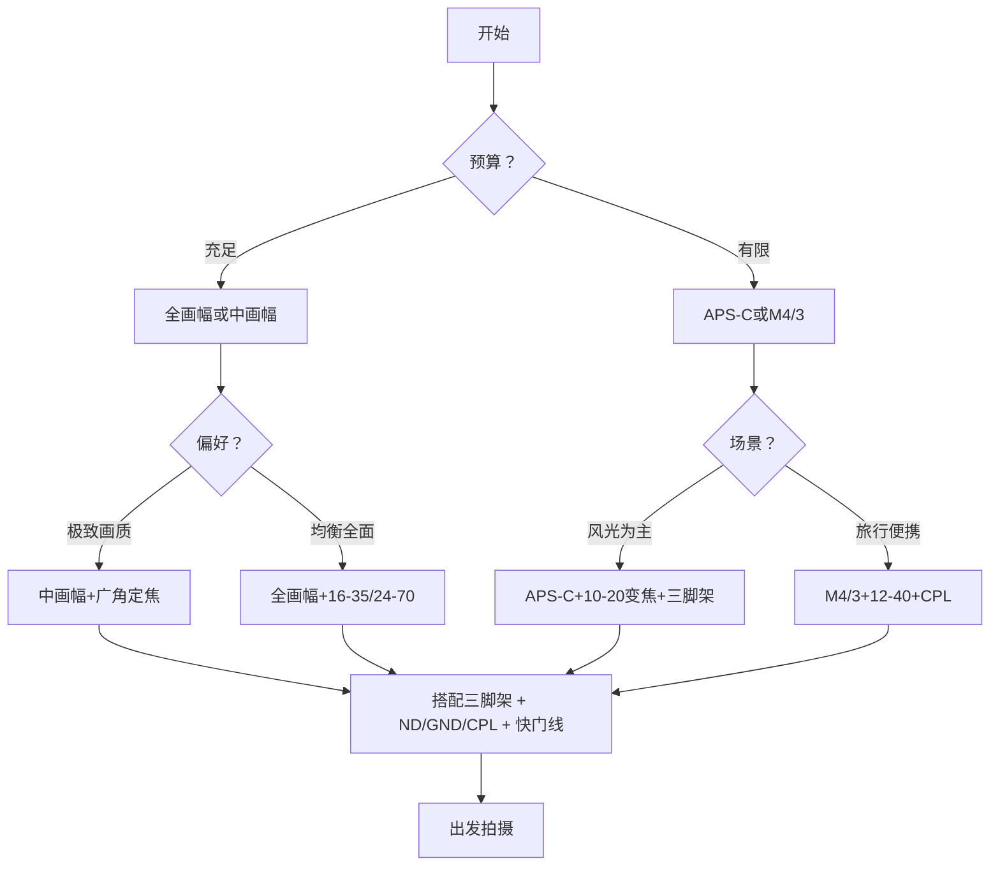

# 第01课：装备选择

## Learning Objectives

- 理解不同相机格式（全画幅、APS-C、M4/3、中画幅）的核心差异及其对风光摄影的影响
- 掌握裁切系数与等效焦距的概念，能进行不同格式间的焦距换算
- 辨析广角、标准、长焦镜头的透视特性，理解移轴镜头的工作原理
- 学会根据拍摄场景选择三脚架、云台、滤镜系统及其他关键配件

## Core Idea

风光摄影的装备选择不是"越贵越好"，而是"越匹配越好"。理解每种工具的原理和取舍，才能在不同的拍摄场景中做出最优选择。

### 一、相机格式

相机格式（Sensor Format）决定了成像圈的大小，直接影响画质、景深控制、高感表现和便携性。

**关键参数对比：**

| 格式 | 传感器尺寸 | 裁切系数 | 动态范围 | 高感表现 | 系统重量 |
|------|-----------|---------|---------|---------|---------|
| 中画幅 | 44×33mm | 0.79x | 极优 | 极优 | 重 |
| 全画幅 | 36×24mm | 1.0x | 优 | 优 | 中等 |
| APS-C | 22×15mm | 1.5x | 良 | 良 | 轻 |
| M4/3 | 17×13mm | 2.0x | 中 | 中 | 极轻 |

> [!TIP] 初学者建议
> 全画幅是风光摄影的"甜点"选择——它在画质、体积、成本和镜头生态之间达到了最佳平衡。APS-C是优秀的入门选择，中画幅适合专业输出和大画幅打印需求。

**宽高比的影响：**

不同相机格式的天然宽高比会影响构图方式：

- **3:2**（全画幅、APS-C）：横向构图时视野宽广，适合[[0003-balance|横构图]]表现宏大场景
- **4:3**（M4/3、中画幅）：更接近方形，在竖构图时比例更自然
- **16:9**（部分相机裁切模式）：电影感宽幅，适合全景接片
- **1:1**（方形）：对称构图的理想画幅

> [!WARNING] 裁切系数陷阱
> 50mm镜头在APS-C机身上等效全画幅75mm视角。广角风光时，APS-C用户需要更广的镜头才能获得相同视野。例如，要获得全画幅16mm的视角，APS-C需要约10-11mm的镜头。

### 二、镜头类型

#### 广角镜头（14-35mm全画幅等效）

广角镜头是风光摄影的主力，具有以下特性：
- **拉伸前景**：近距离拍摄时，前景物体会被夸张放大，增加纵深感
- **景深大**：相同光圈下比长焦镜头有更大的景深
- **汇聚线**：垂直线条在画面边缘会向内倾斜

#### 标准镜头（35-70mm全画幅等效）

- 视角接近人眼自然视野（约43mm）
- 透视关系真实自然
- 适合环境人像与细节特写

#### 长焦镜头（70mm以上）

长焦镜头在风光摄影中常被低估，实际上有独特价值：

- **压缩透视**：远距离的景物会被"压缩"在一起，产生层层叠叠的效果
- **隔离主体**：窄视角帮助排除杂乱元素
- **日出日落**：压缩太阳使其在画面中显得更大

#### 移轴镜头（Tilt-Shift Lens）

移轴镜头通过前后组镜片的平移和倾斜，实现两种特殊功能：

- **Shift（平移）**：校正透视畸变——拍摄建筑时保持垂直线条平行。平移后视角发生偏移，相当于在不倾斜相机的情况下"向上看"
- **Tilt（倾斜）**：改变焦平面角度，实现"沙姆定律"——即使在大光圈下也能让整个画面从前到后合焦

> [!EXAMPLE] 移轴镜头的典型应用
> - 拍摄森林时，利用Tilt功能让从脚下到远方的树木全部合焦
> - 拍摄建筑时，利用Shift功能保持建筑垂直线条笔直
> - 创意应用：反向Tilt创造出"微缩模型"效果（类似移轴摄影的伪微缩景观）

#### 定焦 vs 变焦

| 维度 | 定焦镜头 | 变焦镜头 |
|------|---------|---------|
| 光学素质 | 通常更优（更少镜片、更少像差） | 便利性强 |
| 最大光圈 | f/1.4-f/2.8常见 | f/2.8-f/4为主 |
| 重量 | 更轻 | 更重 |
| 灵活性 | 需"变焦靠走" | 一支覆盖多个焦段 |
| 风光场景 | 适合慢节奏、有计划的拍摄 | 适合徒步、旅行等变化场景 |

### 三、三脚架

三脚架在风光摄影中的作用远超"防抖"——它是构图的精密辅助工具。

> [!TIP] 三脚架的隐藏价值
> 1. **放慢节奏**：架设三脚架的过程迫使摄影师慢下来，更仔细地审视构图
> 2. **精确取景**：微调位置和角度，做到像素级精度
> 3. **多次曝光**：HDR、全景接片、长曝光的前提
> 4. **释放双手**：可以使用各种滤镜，或等待光线的最佳瞬间

**三脚架选择要点：**

- **材质**：碳纤维（轻便、减震好、贵）vs 铝合金（稳定、便宜、重）
- **节数**：3节（最稳定）vs 4节（更便携）
- **高度**：不升中柱时达到视线高度为理想
- **承重**：至少承载相机+镜头的3倍重量

#### 云台类型

| 云台类型 | 优点 | 缺点 | 适合场景 |
|---------|------|------|---------|
| **球形云台** | 快速调节、紧凑 | 大镜头可能点头 | 大部分风光场景 |
| **三维云台** | 独立控制三个轴 | 操作慢、体积大 | 建筑、静物 |
| **齿轮云台** | 微调精确到毫米级 | 速度慢、重 | 全景接片、建筑 |

### 四、滤镜系统

#### 插片式 vs 旋入式

| 维度 | 插片式（方形） | 旋入式（圆形） |
|------|-------------|-------------|
| 叠用 | 可多片同时使用（如GND+ND） | 叠用易产生暗角 |
| 水平调整 | GND可上下滑动调整水平位置 | 固定不可调 |
| 通用性 | 不同口径镜头通用（需转接环） | 每支镜头需单独口径 |
| 便携性 | 需携带支架和片夹 | 小巧方便 |

#### 三种核心滤镜

> [!WARNING] 滤镜 vs 后期
> ND和CPL的效果难以通过后期模仿。GND的效果可以通过包围曝光+后期合成实现，但在拍摄时使用GND能获得更自然的过渡和更好的实时预览体验。

**1. ND（中性密度）滤镜**

减少进入镜头的光量，用于：
- 长曝光流水（0.5-30秒）
- 消除行人/车流
- 云层拉丝效果

ND滤镜的减光量以"档位"（Stop）衡量：

| ND标识 | 减光档位 | 透光率 | 典型应用 |
|-------|---------|-------|---------|
| ND4 | 2档 | 25% | 白天浅景深 |
| ND8 | 3档 | 12.5% | 轻微流水模糊 |
| ND64 | 6档 | 1.56% | 流水丝绸效果 |
| ND1000 | 10档 | 0.1% | 正午长时间曝光 |

**2. GND（渐变中性密度）滤镜**

一半透明、一半减光，中间渐变过渡，用于平衡天空与地面的亮度差。

- **软渐变（Soft GND）**：过渡平缓，适合不规则的地平线（山脉、树木）
- **硬渐变（Hard GND）**：过渡锐利，适合平整的地平线（海洋、沙漠）

**3. CPL（偏振镜）**

通过旋转偏振角度选择性过滤偏振光，实现：
- 消除水面和玻璃反光
- 增加蓝天饱和度
- 减少树叶表面的反光，使绿色更浓郁
- 增加云层对比度

> [!TIP] 偏振镜使用技巧
> CPL在镜头轴线与太阳方向成90度时效果最明显。使用超广角镜头时，CPL会在天空产生不均匀的偏振效果——部分天空过暗。这种情况可用GND替代或在后期处理。

### 五、其他配件

- **快门线/遥控器**：避免按下快门时产生震动，也是B门长曝光必备
- **水平仪**：无论是气泡水平仪还是电子水平仪，保持水平是风光摄影的基本功
- **取景器网格**：开启相机内置网格（三等分网格），辅助构图的即时参考

## 装备选择决策树

## Worked Example

**场景：** 计划拍摄一处海景日落，前景有礁石，远处有岛屿剪影。

**装备选择分析：**

1. **机身：** 全画幅——需要宽广的动态范围捕捉日落高光与礁石阴影的细节
2. **镜头：** 16-35mm f/4——广角端突出前景礁石的纹理和形状
3. **三脚架：** 碳纤维3节——稳固且在沙滩上防腐蚀，中柱不升起以确保稳定
4. **滤镜：**
   - GND软渐变0.9（3档）——平衡天空与海面的亮度差
   - CPL——消除海面反光，增加礁石纹理对比
5. **快门线：** 避免震动，配合反光镜预升

## Practice

> [!QUESTION] 自测题
>
> 1. 你在APS-C相机（裁切系数1.5x）上使用16mm镜头，等效全画幅的焦距是多少？如果要获得全画幅16mm的视角，你需要使用多少mm的镜头？
>
> 2. 拍摄流水瀑布时，你需要哪种滤镜？要实现流水完全雾化效果，至少需要减光几档？
>
> 3. 球形云台和齿轮云台分别适合什么类型的风光拍摄场景？

参考答案

1. **等效焦距：** 16mm × 1.5 = 24mm。**需要镜头：** 16mm ÷ 1.5 ≈ 10.7mm，即需要约11mm的镜头才能获得全画幅16mm的视角。

2. 需要**ND滤镜**。要获得流水完全雾化的丝绸效果（曝光1-30秒），通常在白天需要6-10档减光（ND64到ND1000），具体取决于环境光线的强弱。

3. **球形云台**适合需要快速调整构图的自然风光场景，如日出日落时快速追光。**齿轮云台**适合需要精细调整的建筑摄影和全景接片场景，如室内建筑、城市风光。

## 复习要点

- 相机格式决定裁切系数，影响视角计算和景深控制
- 广角拉伸前景制造纵深感，长焦压缩透视制造叠压效果
- 三脚架不仅是稳定工具，更是构图辅助和慢摄影的核心理念
- ND控制曝光时间，GND平衡光比，CPL消除偏振反光
- 移轴镜头的Tilt改变焦平面，Shift校正透视

## 参考与延伸

- [[index|课程首页]]
- [[0002-shooting-technique|第02课：拍摄技术]]
- [Camera Sensor Size Comparison Tool](https://www.dpreview.com) — 在线传感器尺寸对比工具

