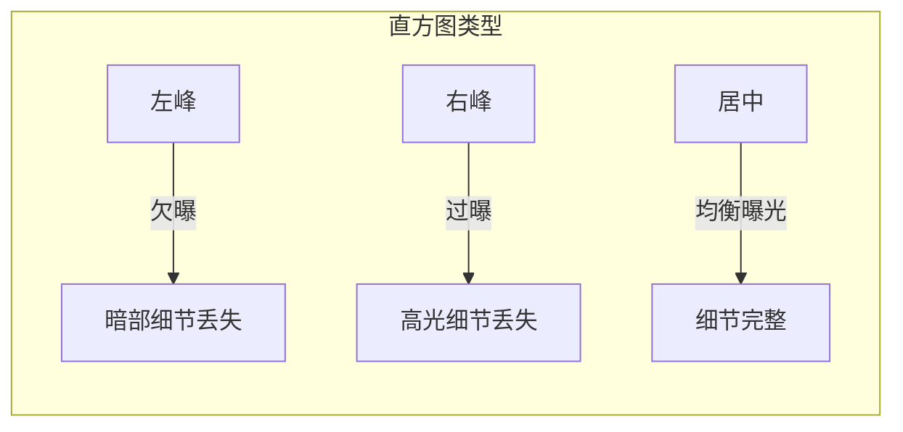
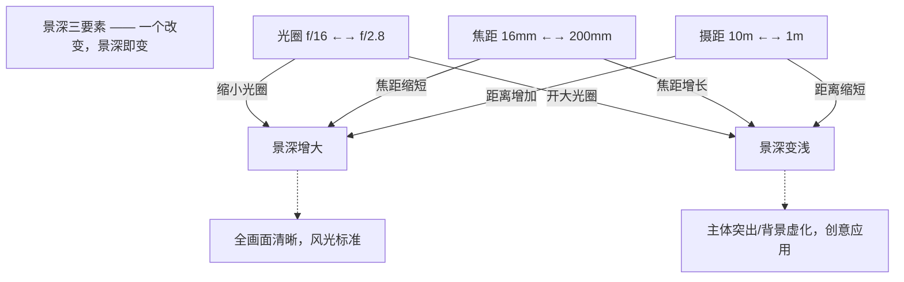
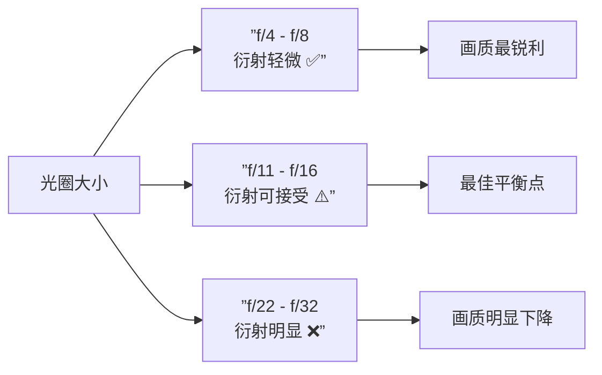
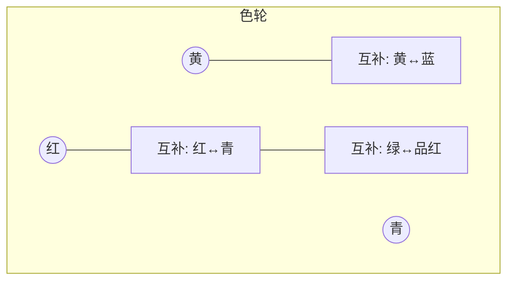

# 第02课：拍摄技术

## Learning Objectives

- 掌握曝光三角（光圈、快门、ISO）的互动关系与创意控制
- 理解直方图的含义，学会ETTR（向右曝光）技术的应用场景
- 掌握景深三要素及其相互制约关系，学会超焦距的实用计算方法
- 理解衍射效应对画质的影响，找到最佳光圈
- 掌握色彩理论基础，学会运用色轮、互补色与白平衡营造画面情绪

## Core Idea

拍摄技术是风光摄影从"拍得到"到"拍得好"的分水岭。曝光控制决定画面的明暗基调，景深控制决定观众的视觉焦点，色彩控制决定照片的情绪表达。

### 一、曝光三角

曝光是光圈、快门、ISO三者协同作用的结果。改变其中任何一个参数都会影响另外两个。

```mermaid
graph TD
    center((”曝光三角”))
    center --> A[光圈 Aperture]
    center --> B[快门 Speed]
    center --> C[ISO 感光度]
    
    A --> A1[”值越大(f/16) → 景深大 ↑ 进光少 ↓”]
    A --> A2[”值越小(f/2.8) → 景深浅 ↓ 进光多 ↑”]
    
    B --> B1[”时间长(30s) → 运动模糊 ↑ 进光多 ↑”]
    B --> B2[”时间短(1/1000s) → 凝固瞬间 ↓ 进光少 ↓”]
    
    C --> C1[”ISO高(3200) → 噪点多 ↑ 灵敏度高 ↑”]
    C --> C2[”ISO低(100) → 画质纯净 ↓ 灵敏度低 ↓”]
```

#### 曝光模式选择

| 模式 | 摄影师控制 | 相机控制 | 适用场景 |
|------|----------|---------|---------|
| **光圈优先 (Av/A)** | 光圈 | 快门 | 风光（需要控制景深时）|
| **快门优先 (Tv/S)** | 快门 | 光圈 | 流水、运动 |
| **手动 (M)** | 光圈+快门 | 无 | 长曝光、全景接片、使用GND |
| **程序自动 (P)** | 无 | 光圈+快门 | 快速抓拍 |

> [!TIP] 风光摄影的曝光模式选择
> 绝大多数风光场景使用**光圈优先**即可：设定所需光圈，相机自动匹配快门速度。但在使用GND滤镜、长曝光（超过30秒需B门）或全景接片时，建议切换为**手动模式**以确保曝光一致性。

#### 正确曝光 vs 创意曝光

- **正确曝光**：画面明暗符合场景的实际视觉感受，直方图分布均衡
- **创意曝光**：
  - **高调（High-key）**：以明亮为主，保留少量暗部，营造轻盈空灵感，适合雪景、雾景
  - **低调（Low-key）**：以暗调为主，局部高光，营造戏剧性和神秘感，适合日落剪影、森林

### 二、直方图与ETTR

直方图是曝光控制的"仪表盘"——横轴表示亮度（左暗右亮），纵轴表示像素数量。



**ETTR（Expose To The Right，向右曝光）技术：**

在不造成高光溢出的前提下，尽可能增加曝光量，使直方图向右"堆积"。原因在于数码传感器的信噪比特性——亮部包含更多有效信号，后期提亮暗部会产生噪点，但压暗亮部损失较小。

> [!WARNING] ETTR的误用
> ETTR不是让直方图"碰到右边界"——高光溢出（Clipping）造成的细节丢失是无法恢复的。安全做法：打开相机的"高光警告"（斑马纹或闪烁提示），确保高光区域不过曝。

**ETTR操作流程：**
1. 使用光圈优先或手动模式，设置所需光圈和ISO
2. 查看直方图，增加曝光补偿（+0.3至+1.0 EV）或加长快门
3. 确认高光警告未触发——如果出现，降低曝光补偿
4. 拍摄，后期在Lightroom或类似软件中将曝光回调至正常水平

> [!TIP] 后期回调建议
> ETTR拍摄的照片在直方图上看偏亮是正常的。在后期处理中，将曝光滑块向左调整（减曝光），你会发现画面噪点明显少于"正常曝光"后提亮的照片。

### 三、景深控制

#### 景深三要素

景深（Depth of Field）由三个因素共同决定，理解它们的互动关系是精准控制焦点的关键。

| 因素 | 操作方式 | 效果 |
|------|---------|------|
| **光圈** | 光圈越小（f/16）→ 景深越大 | 变化最直观，最常用 |
| **焦距** | 焦距越短（16mm）→ 景深越大 | 广角天然大景深 |
| **摄距** | 距离越远 → 景深越大 | 超焦距即利用此原理 |



**浅景深的创意应用：**

虽然风光摄影追求大景深是常态，但浅景深在以下场景中非常有用：
- **前景虚化**：用大光圈对焦远山，让近处的花朵虚化成色块
- **引导视线**：只让特定元素合焦，其他元素虚化，引导观众视线
- **抽象风光**：用浅景深拍摄细节纹理，创造抽象画面

#### 景深预览按钮

现代相机的取景器默认以最大光圈显示画面（保证亮度），这意味着你看到的景深并非实际拍摄结果。按下**景深预览按钮**后，相机收缩到设定光圈，你才能看到真实的景深效果。

> [!EXAMPLE] 景深预览的使用场景
> 在用小光圈（f/16）拍摄前景有花朵、远处有山脉的场景时：
> 1. 取景器里看到的f/2.8画面——前景花朵清晰，远处山脉也很亮
> 2. 按下景深预览按钮——画面变暗（f/16进光少），但你能看到前景花朵到远处山脉都在景深范围内
> 3. 如果山脉不够清晰，说明需要进一步缩小光圈或调整对焦位置

### 四、超焦距

超焦距（Hyperfocal Distance）是指当镜头对焦在某一点时，从该点距离的一半到无穷远都处于景深范围内的那个对焦距离。

#### 1/3对焦法（近似操作）

对于使用广角镜头、小光圈的风光摄影，一个实用的经验法则：将对焦点放在画面垂直方向的**下1/3处**。这个方法虽然不精确，但在大多数情况下能获得足够的景深覆盖。

#### 精确计算

超焦距的精确计算公式：

$$H = \frac{f^2}{N \times c} + f$$

其中：
- $H$ = 超焦距
- $f$ = 镜头焦距（mm）
- $N$ = 光圈值
- $c$ = 弥散圆直径（全画幅通常取0.03mm，APS-C取0.02mm）

> [!TIP] 实用估算
> 对于全画幅+16-35mm广角镜头：
> - 16mm端，f/11：超焦距约**0.78m**——对焦在约0.78m处，从0.39m到无穷远都清晰
> - 24mm端，f/11：超焦距约**1.75m**
> - 35mm端，f/11：超焦距约**3.71m**
>
> 使用手机App如"PhotoPills"或"DOF Calculator"可在现场快速计算。

### 五、衍射效应

衍射（Diffraction）是指光线穿过小光圈时发生弯曲，导致画质下降的现象。光圈越小（如f/22），衍射越严重，画面越"软"。



**最佳光圈建议：**

- **全画幅**：f/11到f/16是风光摄影的最佳平衡点——在景深和画质之间取得最优结果
- **APS-C**：建议不超过f/11，因为更小的传感器对衍射更敏感
- **M4/3**：建议不超过f/8

#### 星芒效果

衍射也是星芒效果（Starburst）的来源。当光源（太阳、路灯）被小光圈遮挡时，光线在光圈叶片边缘衍射，形成星芒：

- 光圈叶片数目决定星芒的射线数量——偶数叶片产生相同数量的射线，奇数叶片产生双倍数量的射线
- f/11到f/16是拍摄星芒的常用光圈范围
- 星芒效果在小光源（如点状太阳）上最明显

### 六、色彩理论

#### 色轮基础



**和谐色（Analogous Colors）：** 色轮上相邻的颜色，如蓝-青-绿。和谐色的画面平和自然，适合宁静的风光场景。

**互补色（Complementary Colors）：** 色轮上相对的颜色，如红-青、黄-蓝。互补色的画面充满张力和冲击力，适合戏剧性的日出日落。

#### 前进色与后退色

颜色的"温度"影响画面的空间感和纵深感：

| 色系 | 视觉特性 | 风光应用 |
|------|---------|---------|
| **前进色（红、黄、橙）** | 视觉上向前突出，显得更近 | 前景暖色增强纵深感 |
| **后退色（绿、蓝、紫）** | 视觉上向后退缩，显得更远 | 远山冷色增强空间距离 |

**应用技巧：** 在前期构图或后期调色时，让前景偏暖（前进色）、背景偏冷（后退色），可以显著增强画面的空间纵深感。

#### 白平衡与色温

色温以开尔文（K）为单位：

| 色温 | 光源 | 视觉效果 |
|------|------|---------|
| 2000-3000K | 日出日落、烛光 | 暖色调（橙红）|
| 3500-4500K | 黄金时段 | 温暖柔和 |
| 5000-5500K | 正午日光 | 中性白 |
| 6000-7000K | 阴天、阴影 | 冷色调（偏蓝）|
| 8000K以上 | 蓝色时刻 | 极冷（深蓝）|

> [!WARNING] 白平衡的创意运用
> 相机的自动白平衡（AWB）倾向于让画面"中性"，但这往往会抹去日出日落时的暖色调。建议：
> - 日出日落手动设为**日光（5200K）**或**阴天（6000K）**，保留暖色氛围
> - 蓝色时刻手动设为**荧光灯（4000K）**或更低，强化冷色氛围
> - 使用RAW格式拍摄，白平衡可在后期自由调整

## Worked Example

**场景：** 日出一小时后，拍摄一处有溪流和枫叶的山谷场景。前景有红叶，中景是溪流，远景是覆盖薄雾的山脉。

**技术决策分析：**

1. **曝光模式：** 光圈优先（Av），需要控制景深
2. **光圈：** f/11——在景深和画质间取得平衡，同时利用小光圈产生轻微星芒（阳光穿过树叶间隙）
3. **对焦策略：** 超焦距法——24mm焦距，对焦在约1.8米处（约下1/3位置），确保从前景到山脉都在景深内
4. **ISO：** 100——最低原生ISO保证画质
5. **测光与曝光补偿：** 使用中央重点测光，增加+0.7 EV实施ETTR——确保溪流亮部接近但不过曝
6. **白平衡：** 设为"阴天"（6000K），保留清晨阳光的暖色调
7. **色彩策略：** 前景红叶（前进色·暖）←→远景蓝色薄雾（后退色·冷），利用色彩差异强化纵深感

## Practice

> [!QUESTION] 自测题
>
> 1. 你使用全画幅相机、24mm镜头、f/16光圈拍摄风光，超焦距大约是多少？对焦在何处可以使从多近到无穷远都合焦？
>
> 2. 什么是ETTR？它的物理原理是什么？使用ETTR时最重要的注意事项是什么？
>
> 3. APS-C画幅（裁切系数1.5x）的相机在风光摄影中，建议最大光圈不超过多少？为什么？
>
> 4. 在色轮上，蓝色（Blue）的互补色是什么？如果想让日落照片的冷暖对比更强烈，应如何利用互补色？

<details>
<summary>参考答案</summary>

1. **超焦距：** 使用公式 $H = (24^2) / (16 \times 0.03) + 24 = 576 / 0.48 + 24 = 1224mm ≈ 1.22m$。对焦在**1.22米**处，从**0.61米**到无穷远都在景深范围内。

2. **ETTR（向右曝光）：** 在不产生高光溢出的前提下尽可能增加曝光量，使直方图向右堆积。**物理原理：** 数码传感器的信噪比在亮部更高——亮部包含更多有效信号，后期提亮暗部会产生明显噪点，而压暗亮部造成的画质损失较小。**注意事项：** 必须确保高光区域不过曝（使用高光警告功能检查），一旦高光溢出则细节无法恢复。

3. APS-C相机建议最大光圈**不超过f/11**。因为更小的传感器尺寸意味着像素密度更高，同样的光圈值在APS-C上的衍射效应比全画幅更明显。超过f/11后，衍射导致的画质损失将超过小光圈带来的景深收益。

4. 蓝色的互补色是**黄色**。在日落照片中，保留或增强天空的暖黄色调，同时让阴影和暗部偏蓝——这对互补色在一起会产生强烈的视觉张力。

</details>

## 复习要点

- 曝光三角的互动关系：改变任一参数必须考虑其他两个的影响
- ETTR技术利用传感器物理特性获得更纯净的画质，但需小心高光溢出
- 景深三要素（光圈、焦距、摄距）相互制约，超焦距（1/3对焦法）是风光摄影的核心技巧
- 衍射效应限制了最小可用光圈：全画幅f/11-f/16为最佳平衡区
- 色轮互补色（红-青、黄-蓝）和前进色/后退色的冷暖对比是增强画面纵深感的有力工具
- 白平衡是创意工具而非"校正工具"——根据画面情绪手动选择合适的色温

## 参考与延伸

- [[0001-equipment|第01课：装备选择]]
- [[0003-balance|第03课：画面平衡]]
- [PhotoPills](https://www.photopills.com) — 超焦距计算与摄影计划App
- 色轮参考工具：Adobe Color — 在线色轮配色方案生成器
</details>