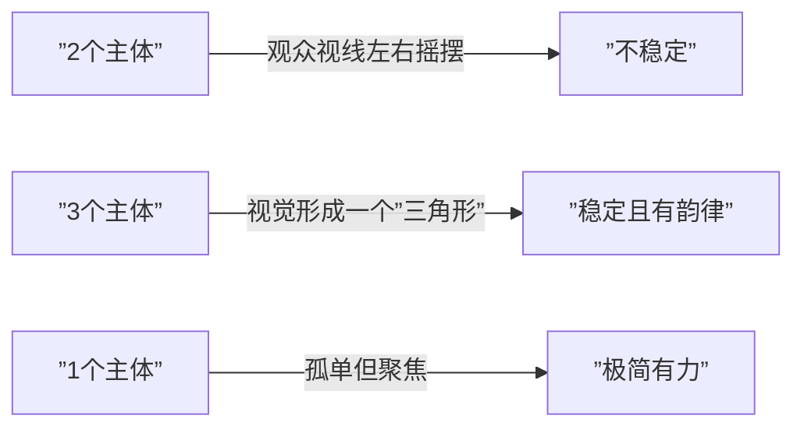
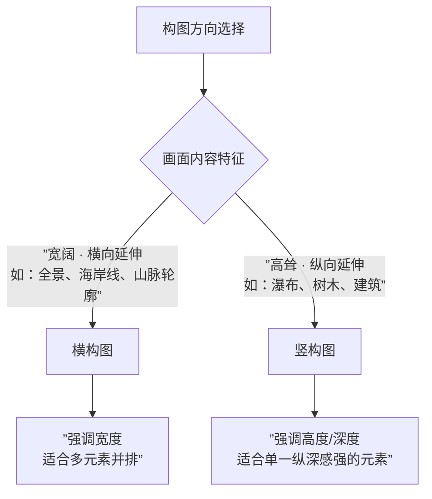

# 第03课：画面平衡

## Learning Objectives

- 理解视觉平衡的跷跷板原理，能分析画面中不同元素的视觉重量
- 掌握三分法的应用方法，并能识别需要打破三分法的场景
- 理解黄金比例（Φ = 1.618）的数学基础及其在构图中的体现
- 学会识别和应用不同类型的对称构图
- 掌握横构图与竖构图的选择原则

## Core Idea

构图不是刻板的规则清单，而是对视觉重量分布的理解和运用。好的构图引导观众的视线在画面中流畅游走，而不好的构图让观众感到不安或困惑。

### 一、视觉平衡的基本原理

视觉平衡类似一个**跷跷板**——画框的不同区域有不同的"重量"分布。中心点的权重最大，边缘的权重较小。一个元素如果在画面一侧，就需要另一侧有足够的"视觉重量"来平衡。

```mermaid
graph TD
    subgraph ”视觉重量决定因素”
        A1[大小] -->|越大越重| C[总视觉重量]
        A2[颜色] -->|暖色重/冷色轻| C
        A3[亮度] -->|亮部重/暗部轻| C
        A4[对比度] -->|高对比重| C
        A5[纹理] -->|复杂纹理重| C
        A6[位置] -->|边缘轻/中心重| C
    end
```

**视觉重量的决定因素：**

| 因素 | 重量更大 | 重量更小 |
|------|---------|---------|
| **大小** | 大面积元素 | 小面积元素 |
| **颜色** | 红、黄、橙（前进色） | 蓝、绿、紫（后退色） |
| **亮度** | 高亮区域 | 暗部区域 |
| **对比度** | 高对比边缘 | 平滑过渡区域 |
| **纹理** | 密集纹理 | 光滑表面 |
| **位置** | 画面中心附近 | 画面边缘 |

> [!TIP] 平衡不等于对称
> 视觉平衡有两种形式：**对称平衡**（左右或上下镜像一致）和**非对称平衡**（两侧元素不同但重量相当）。非对称平衡通常比对称平衡更有趣味性，因为它通过差异创造张力。

#### 主体放置：居中 vs 偏离中心

| 放置方式 | 视觉感受 | 适用场景 |
|---------|---------|---------|
| **居中** | 静态、稳定、庄重 | 对称场景、极简构图、反射倒影 |
| **偏离中心** | 动态、张力、叙事感 | 大多数风光场景，引导视线在画面中游走 |

### 二、三分法

三分法是最广为人知的构图规则：将画面水平和垂直各分为三等份，形成4个交叉点。将主体放在交叉点或三分线上，通常比居中放置更具视觉吸引力。

```mermaid
graph TD
    subgraph ”三分法网格”
        A[”[A] · · · [B]<br/>· · · · · ·<br/>· · · · · ·<br/>[C] · · · [D]”]
    end
    
    A -.-> B1[”四个交叉点(A,B,C,D)<br/>是最佳主体位置”]
    
    A -.-> B2[”水平线对齐上1/3或下1/3<br/>（取决于天空还是地面更有趣）”]
```

**应用原则：**
- **地平线位置**：天空有趣→地平线在下1/3；地面（或水面）有趣→地平线在上1/3
- **主体位置**：放在交叉点上，通常是前景兴趣点
- **线条导引**：引导线沿三分线走向

#### 三分法的批评

> [!WARNING] 三分法不是万能公式
> 三分法是一个**教学起点**，而非终极构图法则。过度使用三分法会导致画面千篇一律。以下情况**应该打破三分法**：
> - **完美对称的场景**（如镜面倒影）——居中对称更有力量
> - **极简主义构图**——主体偏离极端位置产生张力
> - **引导线指向中心**——汇聚线自然引导视线到画面中心
> - **方形画幅（1:1）**——中心构图在方形中常常更有效
> - **抽象细节**——纹理和图案的重复不需要遵循三分法

### 三、黄金比例与黄金分割

#### 黄金比例 $\Phi$

黄金比例 $\Phi$（Phi）是美学史上最重要的数学常数之一：

$$\Phi = \frac{1 + \sqrt{5}}{2} \approx 1.618:1$$

这个比例在自然界和艺术中广泛存在，从鹦鹉螺的螺旋到帕特农神庙的建筑比例。

```mermaid
graph LR
    A[”整体 : 较大部分 = 较大部分 : 较小部分”] 
    A --> B[”a + b : a = a : b = Φ”]
    A --> C[”(a+b)/a = a/b = 1.618”]
```

#### 黄金分割网格

黄金分割网格与三分法网格类似，但中间分割线不在1/3处，而在**约0.382和0.618**处（即从左侧到右侧的0.382处分割 = 从右侧到左侧的0.618处分割）。

相比三分法，黄金分割网格的交叉点更向画面中心靠拢，放置主体时视觉上更"自然"。

#### 斐波那契数列与螺旋

斐波那契数列：0, 1, 1, 2, 3, 5, 8, 13, 21, 34, 55...

数列中相邻两项的比值逐渐趋近于 $\Phi$（1.618）。基于斐波那契数列的**黄金螺旋**是构图中引导视线的有力工具：

> [!TIP] 黄金螺旋的实用方法
> 将画面中最重要的元素放在螺旋的**中心起点**（最密集的漩涡处），然后让画面中的其他元素沿着螺旋路径展开。观众的目光会自然地被螺旋引导，从起点"游走"到画面的其他部分。
>
> 风光摄影中的典型应用：海岸线沿着螺旋路径展开，起点处放置一块纹理丰富的前景岩石。

#### 黄金三角

黄金三角是将矩形画框通过对角线连接，再从剩余两个顶点向对角线作垂线，形成三个三角形。这种构图方式适合：

- 具有强烈对角线元素的画面
- 需要在画面中创造"之"字形视觉路径
- 同时容纳两个主要的兴趣点

```mermaid
graph TD
    subgraph ”黄金三角构图”
        A[”[A]───[B]<br/> │ \\  / │<br/> │  \\/  │<br/> │  /\\  │<br/> │ /  \\ │<br/>[C]───[D]”]
    end
    A -.-> B1[”主体放在三角形顶点<br/>引导线沿着三角形边缘”]
```

### 四、对称

对称是追求视觉平衡最直接的方式，但它绝不等于"平淡"。

#### 垂直对称

- 最常见的对称形式
- 镜面倒影是风光摄影中垂直对称的典型案例
- 通过水面反射形成上下对称
- 为了增强对称感，将水平线严格居中放置

#### 水平对称

- 左右两侧镜像一致
- 适合建筑、树木排列等场景
- 对焦精准要求高——左右任何一侧的偏差都会被放大

#### 放射对称

- 元素围绕一个中心点向外辐射排列
- 适合拍摄星轨、洞穴顶部的冰柱、圆形建筑内部
- 中心点位置的确定至关重要

> [!EXAMPLE] 对称的应用场景
> - **水面倒影**：完全无风的湖面是最完美的对称场景——将水平线放在正中间，让上下完全对称
> - **林荫大道**：两排树木在道路两侧对称排列——站在正中间拍摄，用广角镜头强调汇聚线
> - **放射状**：拍摄星轨时以北极星为中心，星星围绕北极星画出的同心圆弧形成放射对称

### 五、奇数法则

奇数法则（Rule of Odds）指出：画面中奇数个主体（特别是3个）比偶数个更有视觉吸引力。



**数字3的魔力：**
- 3个元素在画面中自然形成一个虚拟三角形
- 三角形是最稳定的几何形状
- 观众的目光会在3个元素之间自然循环，延长观看时间
- "1"最聚焦，"3"有韵律，"2"次之

### 六、横构图 vs 竖构图



**选择原则：**

| 考量因素 | 横构图 | 竖构图 |
|---------|-------|-------|
| **视觉方向** | 横向延伸，适合广阔场景 | 纵向延伸，适合高低对比 |
| **主体形状** | 横向线条、水平走向 | 垂直线条、纵向走向 |
| **元素数量** | 适合容纳多个并列元素 | 适合聚焦单一主体 |
| **观看媒介** | 电脑屏幕、印刷品 | 手机屏幕、杂志封面 |
| **叙事感** | 讲述场景的故事 | 强调主体的存在感 |

> [!TIP] 不限于一种方向
> 面对同一场景，同时拍摄横构图和竖构图是很好的训练——它迫使你用不同的视角审视同一个场景。横构图可能是场景的全景叙事版，竖构图则是场景的细节聚焦版。两个都可以是"好照片"，只是表达方式不同。

## Worked Example

**场景：** 清晨在山顶拍摄云海日出。

**平衡与构图分析：**

1. **方向选择：** 竖构图——前景有孤松，中景是云海，远景是日出和远山轮廓。竖构图能够完整容纳从前景到远景的纵向层次。

2. **主体放置：** 孤松放在画面左下三分之一交叉点处，太阳位于右上三分之一交叉点。两个主体形成对角线呼应，引导观众视线从左下到右上自然游走。

3. **平衡分析：**
   - 左侧松树（暗色、纹理复杂、垂直走向）←→右侧太阳（亮色、平滑、圆形）
   - 两者视觉重量相当，形成非对称平衡

4. **黄金比例考量：** 云海和山体的分界线位于画面垂直方向约0.382处（从下往上），接近黄金分割线的位置。

5. **色彩平衡：** 远处日出的暖色（前进色）←→近处松树的冷色剪影（后退色），冷暖对比进一 步强化纵深感。

## Practice

> [!QUESTION] 自测题
>
> 1. 以下哪些因素会增加画面中一个元素的"视觉重量"？（多选）
>   a. 鲜红色
>   b. 平滑表面
>   c. 冷蓝色
>   d. 大面积
>   e. 高对比度
>
> 2. 三分法和黄金分割网格的主要区别是什么？各自在什么情况下更适用？
>
> 3. 何时应该使用居中对称构图？何时应该使用偏离中心构图？请各列出一种典型场景。
>
> 4. 你拍摄一张有瀑布、前景岩石和远处山峰的照片。哪些因素会让你选择竖构图而非横构图？

<details>
<summary>参考答案</summary>

1. **正确答案：a, d, e**。鲜红色是前进色，视觉重量大；大面积元素自然更重；高对比度吸引视觉注意。平滑表面的视觉重量较小；冷色（蓝色）是后退色，视觉重量较轻。

2. **三分法**将画面三等分，交叉点在1/3位置，更适合快速构图和标准化操作。**黄金分割网格**的分割线在0.382和0.618位置，交叉点更靠近中心，基于Φ≈1.618的比例，视觉上更自然。黄金分割适合想要追求更具美学深度的构图，而三分法适合快速高效的日 常拍摄。

3. **居中对称构图：** 拍摄湖面完美倒影时，将水平线放在中间，上下完全对称，强调宁静和庄严感。**偏离中心构图：** 拍摄海岸线时，将主要岩石放在左侧三分之一处，让视线从岩石沿着海岸线向右自然延伸。

4. 选择竖构图的理由：
   - 瀑布是垂直走向的元素
   - 将前景岩石（底部）、中景瀑布（中部）、远山（顶部）垂直排列，形成纵深感
   - 竖构图适合手机和社交媒体展示
   - 竖构图强化了从下到上的视觉引导路径

</details>

## 复习要点

- 视觉平衡是跷跷板原理：暖色、大面积、高对比、亮色的元 素重量更大
- 三分法是基础起步点，但对称场景、极简构图、方形画幅时应打破三分法
- 黄金比例 Φ = 1.618:1 是比三分法更"自然"的分割比例
- 三种对称：垂直（倒影）、水平（建筑）、放射（星轨）
- 奇数法则：3个主体比2个更有视觉韵律
- 横构图强调宽度和并列元素，竖构图强调高度和纵深层次

## 参考与延伸

- [[0001-equipment|第01课：装备选择]]
- [[0002-shooting-technique|第02课：拍摄技术]]
- [[index|课程首页]]
</details>