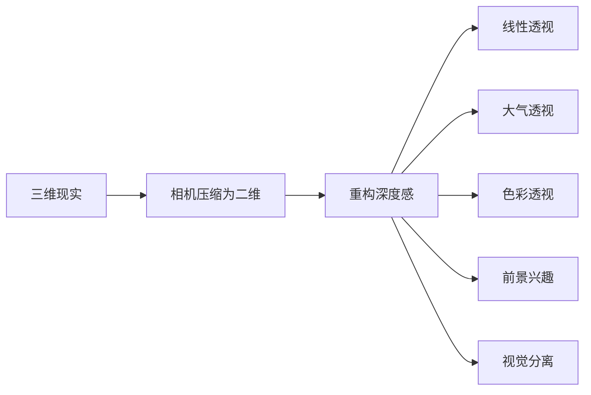

# 第04课：深度与透视

## Learning Objectives

- 理解摄影将三维世界压缩为二维的本质，掌握重构深度感的原理
- 掌握线性透视、纹理梯度、大气透视和色彩透视四大透视工具
- 学会通过前景兴趣、视觉分离和天然画框强化纵深感
- 了解移轴镜头与沙姆弗卢格原理及其应用场景

## Core Idea

风光摄影面临一个根本矛盾：现实世界是三维的，而照片是二维的。**每一次按下快门都是一次压缩——我们失去了真实的深度感，必须通过构图手段将其重建。**

成功的风光摄影师并非仅仅记录所见，而是**创造性地运用各种透视线索**，引导观众的眼睛"进入"画面，在二维平面上体验三维空间。这不是一个技巧，而是一整套相互配合的视觉语言。

---

### 摄影的二维困局

相机将世界投射到一个焦平面上——无论传感器是35mm、中画幅还是大画幅，结果都是一张平面图像。我们失去了：

- **双眼视差**：左右眼看到的不同角度
- **动态深度线索**：移动头部时产生的视差变化
- **真实的尺度感**：无法通过对比直接判断距离

因此，摄影师必须**制造深度线索**来欺骗观众的大脑。

---

### 线性透视 — 最强大的单点工具

线性透视是重构深度感的基石，其核心原则极其简单：

> **平行线在远处汇聚于一点（消失点）；同样大小的物体，远处的看起来更小。**

#### 影响因素

| 因素 | 效果 | 操作建议 |
|------|------|----------|
| **摄距**（最关键） | 离前景越近，近大远小效果越强 | 靠近前景物体拍摄 |
| **焦距** | 广角允许你更近地拍摄 | 不是焦距本身，而是摄距 |
| **相机高度** | 越低，汇聚线越强烈 | 蹲下甚至趴下拍摄 |

> [!WARNING] 焦距误区
> 很多人认为"广角拉伸空间、长焦压缩空间"。严格来说，**真正改变透视的是摄距，而非焦距**。广角之所以能夸大透视，是因为它允许你在更近的距离拍摄；长焦之所以压缩空间，是因为你被迫从更远的位置构图。用广角从远处拍摄，透视效果与长焦无异。

#### 相机高度对透视的影响

这是一个经常被忽视但极其强大的变量：

- **低角度**（贴近地面）：地面上的线条（道路、栅栏、水流）强烈汇聚，产生极强的深度感
- **眼平高度**：最自然的透视，与人眼所见接近
- **高角度**（俯拍）：汇聚减弱，更强调平面图形关系

> [!TIP] Key Insight
> 改变相机高度对透视的影响，往往比改变焦距更显著。下次拍摄时，先不着急换镜头，试试蹲下来。

---

### 消失点构图

将消失点作为构图的视觉锚点，是风光摄影中最经典的构图策略之一。

**理想场景**：

- 道路、小径、河流、溪流、海岸线与岩石纹路
- 桥梁、栅栏线、干石墙、犁沟
- 任何在画面中形成汇聚线的自然或人造元素

将消失点放置在画面的**黄金分割点**附近而非正中心，通常能产生更强的视觉张力。正中心放置则产生高度对称和引导感。

---

### 纹理梯度

当我们观察一个表面——草原、沙丘、雪地或水面——纹理的密度随距离增加而增大。近处可以看到每一片草叶，远处则融合成一片连续的色调。

**摄影师可以放大纹理梯度**：

- 低角度拍摄强调近处纹理
- 使用广角镜头靠近地面，让最近的纹理极其清晰
- 配合小光圈（f/11-f/16）保证从前景到远处都有足够的锐度

---

### 前景兴趣

前景兴趣是风光摄影中最常被提及（也最常被滥用）的技巧之一。其基本原理是：

> 在前景中放置一个有视觉重量的元素，与中景/远景形成大小对比，从而创造深度感。

**有效的前景**：

- 具有纹理和细节的岩石
- 野花丛
- 沙滩上的贝壳或漂流木
- 倒木或树桩
- 冰晶或雪纹

#### "大石头前景"的陷阱

英国海岸摄影师常被戏称为"大石头摄影师"——因为画面中总有一块纹理清晰的岩石做前景。这种风格有效，但**如果前景与背景没有视觉关联，就显得生硬和刻意**。

> [!NOTE] 好前景的标准
> 1. 与主体/背景在主题上相关
> 2. 具有引导性（指向主体）
> 3. 在色调/纹理上互补
> 4. 不喧宾夺主

#### 前景执念

并非每张风光照片都需要一个突出的前景。有时候：

- **极简构图**中，大面积留白本身就是力量
- **远景主导**的场景，前景元素会分散注意力
- **抽象构图**中，平面的色彩和形状关系比深度更重要

学会**何时不加入前景**，和学会何时加入一样重要。

---

### 大气透视（空气透视）

远处的物体看起来更亮、更淡、对比度更低、色彩饱和度更低——这是因为光线穿过更厚的大气层时发生了散射。

**大气透视的特征**：

- **色调递减**：远处山脉/景物色调变浅
- **对比度递减**：细节因大气模糊而损失
- **色彩偏移**：远处的暗部偏蓝

#### 如何利用

- 在**有薄雾或轻霾**的天气拍摄，大气透视最强
- 使用长焦镜头**压缩**距离，强化大气透视效果
- 如果需要**破除**大气透视——使用偏振镜或等到雨后空气清澈时拍摄
- 阴天和雾天天然产生柔和的大气透视，适合传达距离感

---

### 色彩透视

色彩本身具有"前进"和"后退"的视觉特性。

| 色相 | 视觉行为 | 效果 |
|------|----------|------|
| 暖色（红、橙、黄） | **前进** | 感觉离观众更近 |
| 冷色（蓝、青） | **后退** | 感觉离观众更远 |
| 高饱和度 | **前进** | 先被注意到 |
| 低饱和度/灰色 | **后退** | 退入背景 |

**构图应用**：

- 将暖色元素放在前景或兴趣点，强化其"接近"感
- 蓝色的远山自然产生纵深感（结合大气透视）
- 日落时分的暖色调天空搭配冷色前景，冷暖对比创造深度

---

### 光线在定义深度中的作用

光线是创造立体感的另一个关键工具，它与透视手法结合时效果倍增：

- **方向光**（尤其是低角度的侧光）：产生阴影和高光，揭示表面的纹理和起伏
- **逆光**：勾勒轮廓，在主体和背景之间创造清晰的分离
- **顺光**：光线均匀但缺乏阴影，画面容易显得扁平——此时需要靠其他透视手段

> 没有好的光线，再好的透视技巧也无法充分展现。光线使深度"可见"，透视使深度"可感"。

---

### 视觉分离

主体与背景在**色调、色彩或亮度上**的差异，决定了主体能否从背景中"跳"出来。

| 分离方式 | 方法 | 举例 |
|----------|------|------|
| 色调分离 | 亮主体对暗背景 / 暗主体对亮背景 | 深色树影在浅色天空前 |
| 色彩分离 | 互补色搭配 | 金黄秋叶对蓝色天空 |
| 亮度分离 | 主体曝光不同于背景 | 剪影对亮背景 |

**机位高度关键作用**：

改变相机高度几厘米，就可能让主体从背景线条中"脱离"出来。例如：

- 一棵树在眼平高度可能与背景山脊线重叠
- 降低10厘米，树的主体完全脱离山脊，浮现在天空前
- 这是最简便却最有效的视觉分离手段——**通过机位微调获得分离**

---

### 创造尺度感

人类大脑通过对比已知大小的参照物来判断空间距离。在风光摄影中，缺少参照物的画面会使观众无法判断真实尺度——一座"巨大的"山脉可能看起来像一个小土丘。

**常用参照物**：

- 人物（最直观）
- 树木、动物
- 建筑、车辆
- 船只

> [!WARNING] 参照物放置
> 参照物应放在中景或远景中的关键位置，而非随意放置。参照物的作用是**提供比例**，而非成为主体本身。

---

### 天然画框

利用画面前景边缘的元素作为画框，可以创造强烈的深度感和包围感。

**天然画框的形式**：

- **V形边框**：向下的树枝从左上/右上进入
- **U形边框**：岩石拱门、树洞
- **L形边框**：一侧的树干或建筑边缘
- **完整画框**：洞穴、窗户状的缝隙

**关键原则**：画框应比主体暗，因为暗部在视觉上"退后"，而亮部"前进"。

---

### 移轴镜头与沙姆弗卢格原理

这是深度控制的高级工具。移轴镜头允许你独立控制镜头的**光轴**相对于传感器的角度。

> [!INFO] Scheimpflug Principle（沙姆弗卢格原理）
> 当镜头平面、焦平面和传感器平面延长后相交于一条直线时，整个斜面都能获得清晰的合焦——而非仅仅垂直于镜头光轴的平面。

**典型应用场景**：

| 场景 | 问题 | 移轴方案 |
|------|------|----------|
| 前景花朵 + 远景山脉 | 即使f/16也无法同时清晰 | 倾斜镜头使焦平面与地面平行 |
| 森林地面纹理 | 景深不足 | 沙姆弗卢格倾斜让整个地面清晰 |
| 建筑俯拍 | 透视汇聚变形 | 保持镜头/传感器平行，仅平移镜头 |

对于大多数风光摄影师，移轴镜头并非必需品——**小光圈+超焦距**已经足够在绝大多数场景下获得足够景深。但在极端的近-远构图中，移轴是无可替代的工具。

> [!NOTE] 没有移轴镜头怎么办？
> 景深合成（focus stacking）是移轴的数码替代方案：在不同焦距下拍摄多张照片，后期合成全清晰图像。参见 [[0002-shooting-technique|第02课：拍摄技术]] 中的对焦技巧。

---

### Live View 辅助判断二维效果

数码相机的实时取景（Live View）是判断二维构图效果的最佳工具：

1. 将相机固定在三脚架上
2. 开启Live View
3. 眯起一只眼睛（模拟二维观看）
4. 观察线条是否汇合、前景是否突出、主体是否与背景分离

> 这一简单的习惯能极大减少后期才发现构图问题的情况。

---

## Worked Example

**场景**：拍摄海岸日落的场景——前景有纹理丰富的岩石和潮水池，中景有沙洲延伸入海，远景有日落天空。

**透视策略**：

1. **前景选择**：找到潮水池中一块纹理鲜明的岩石，使用16mm广角，将相机放在岩石前方约30厘米处
2. **相机高度**：降至距地面约20厘米，让池水中的倒影作为前景引导线
3. **消失点**：沙洲引导线指向画面右侧黄金分割点的日落
4. **视觉分离**：轻微右移机位，使日落处没有云层遮挡
5. **色彩透视**：暖色日落与冷色池水形成冷暖对比
6. **参照物**：等待一个小的人影出现在沙洲上——提供尺度感
7. **f/16 + 超焦距**：保证从前景到远景都清晰

---

## Practice

> [!QUESTION] Self-check
> 你站在一条通向远处的河岸边，河对岸有一棵树，远处有山脉。你认为以下哪种操作最能增强画面的纵深感？
>
> A. 换上长焦镜头从远处拍摄
> B. 蹲下并靠近岸边的前景草丛，使用广角镜头
> C. 提高ISO让画面噪点增加"胶片感"
> D. 使用最大光圈虚化背景

Reveal answer

**正确答案：B**

蹲下并靠近前景草丛，使用广角镜头——这同时满足了三个增强纵深的条件：
1. 降低相机高度 → 河岸线汇聚感增强
2. 靠近前景 → 近大远小效果最大化
3. 广角允许更近的对焦距离

A中的长焦会压缩空间、减弱深度；C的噪点与纵深无关；D的大光圈导致景深过浅，反而可能损失远处的细节。

## Next Step

掌握深度与透视之后，你将进入 [[0005-geometry-composition|第05课：构图的几何学]]——学习线条、形状与层次如何构成画面骨架，引导观众的视觉流动。