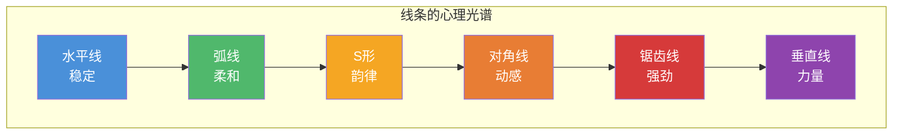
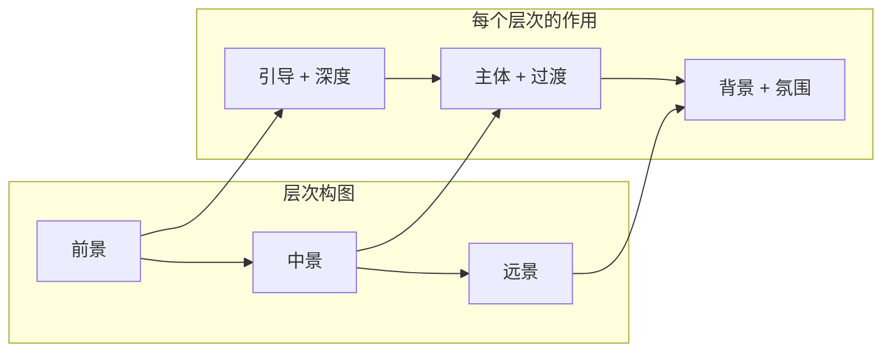

# 第05课：构图的几何学

## Learning Objectives

- 掌握不同线型的心理效果及其在构图中的应用
- 理解形状对视觉感知的影响——三角形、矩形、圆形的心理效应
- 学会运用层次与平面制造画面深度
- 掌握运动模糊的创作参数——ND滤镜与快门速度选择

## Core Idea

上一课 [[0004-depth-perspective|第04课：深度与透视]] 关注的是如何在二维平面上制造"深度"的错觉；而本课关注更为基础的命题：**线条和形状如何构建画面的骨骼**。

> 摄影构图本质上是在一个矩形框内，**安排线条与形状之间的关系**。

几何学是视觉语言的基础语法。在风光摄影中，地形和自然元素已经提供了大量的线条和形状——你的任务是**识别、选择和组织**它们，使观众的视觉沿着你设计的路径流动。

---

### 线条——视觉的引导者

线条是画面中最活跃的几何元素。它们的功能不是"充当主体"（尽管有时可以），而是**引导观众的视线**从一处移动到另一处。

#### 线型分类与心理效果

| 线型 | 心理效果 | 典型场景 |
|------|----------|----------|
| **水平线** | 稳定、宁静、广阔 | 海平面、地平线、水平岩层 |
| **垂直线** | 生长、力量、庄严 | 树干、瀑布、岩柱 |
| **对角线** | 动感、张力、速度 | 山坡线、斜向海岸线 |
| **弧线/曲线** | 柔和、流动、优雅 | 沙丘脊线、海岸弧线 |
| **S形曲线** | 韵律、优美、舒缓 | 河流、山间公路 |
| **锯齿线/Z形** | 强劲、有力、崎岖 | 山脊线、裂谷岩壁 |

#### 线条的配角本质

> [!WARNING] 线条不是主体
> 线条很少单独作为照片的主体。它们是**指向器**，负责将视线引向画面的焦点。一条漂亮的河流曲线本身不是照片——曲线尽头的远山或树丛才是。

**需求检查**：当你发现一条好线条时，问自己："这条线条在引导我看什么？" 如果答案只是"线条本身"，那可能是一张失败的照片。

---

### 汇聚线——最强引导力

汇聚线是线性透视（[[0004-depth-perspective#消失点构图|第04课]]）的几何化应用。当两条或更多线条从画面边缘向内汇聚时，它们产生的引导力是所有线型中最强的。

**显著特征**：汇聚越快（角度越大），视线被推向消失点的力量越强。

---

### 角落与指向器

画面边缘向内指向的三角形或V形元素，是从角落引导视线进入画面的有效工具。

**自然指向器**：

- 从画面角落伸出的树枝
- 斜向的山坡边缘
- 海岸线从角落切入
- 栅栏线或石墙

> 角落是视线进入画面的"入口"。如果你不主动设计入口，观众的眼睛就会在画面表面漂浮。

---

### 形状的心理效应

单个形状本身携带着强有力的心理暗示。

#### 三角形

三角形是构图学中最强大的形状。

| 方向 | 心理效果 | 应用场景 |
|------|----------|----------|
| **底边在下** | 稳定、坚实、不可动摇 | 山体、巨石、树的轮廓 |
| **顶点在下** | 失衡、危险、动感 | 倒三角形构图、V形裂谷 |
| **斜向三角形** | 动态方向性 | 侧光形成的阴影三角 |

> [!TIP] Key Insight
> 一个稳定的底边在下的大三角形，加上内部一个倒置的小三角形，是创造视觉张力的经典手法。主结构提供稳定感，次级结构注入动感。

#### 矩形

- **心理效果**：固态、静止、规范
- **构图风险**：矩形会"阻挡"视线——观众的视线会在矩形的边缘停下来
- **应用**：极简构图中的建筑元素，或作为画框的窗口/门

#### 圆形与椭圆

- **心理效果**：流动、完整、包容、永恒
- **自然存在**：太阳、月亮的圆、树木冠幅、湖面形状
- **构图应用**：圆形边缘引导视线环绕运动，适合制造"循环视觉流"
- **在矩形画面中**：圆形与矩形边框形成强烈对比，产生视觉张力

---

### 层次与平面

将画面分解为**前景、中景、远景**三个层次，是现代风光构图的基础框架。

**层次设计原则**：

- 每个层次应具有**独立的形状轮廓**
- 层次之间应有**亮度或色调的差异**（互不粘连）
- 近层应**引导**视线向下一层移动
- 最优情况是三个层次的形状**叠而不粘**

#### 前景作为取景框

V形和U形的前景轮廓是层次构图中最为有效的前景组织方式：

- **V形**：向下的树枝、V形峡谷——将视线集中指向中间的交点
- **U形**：岩洞开口、树冠拱形——包围感更强，视线更集中

> 取景框应比主体暗。暗部在视觉上"退后"，亮部"前进"——这保证了前景不会与主体竞争注意力。

---

### 视觉流动

视觉流动是几何构图的终极目标——**组织所有线条和形状，形成一条从入口到焦点再到出口的连续路径**。

**经典视觉流动模式**：

1. **入口**（通常从画面左下角）
2. **引导**（通过线条/形状将视线移向主体）
3. **焦点**（主体/兴趣点，视线在此停留）
4. **穿行**（视线在画面次要区域移动）
5. **出口**（通常从画面上角离开，或通过构图闭合成环）

> [!NOTE] 流动检查
> 完成构图后，用手机在图像上描出"眼睛的移动路径"。如果路径杂乱、来回跳转或直接冲出画面，说明几何组织需要调整。

---

### 运动模糊——时间的几何

当几何从静态扩展到时间维度，我们得到了**运动模糊**——通过慢速快门将动态物体记录为流动的轨迹，在画面中创造一种特殊的"时间几何"。

**适用对象**：

| 对象 | 快门速度建议 | 效果 |
|------|-------------|------|
| 流水/瀑布 | 0.5s - 30s | 雾化或丝绢效果 |
| 云层 | 30s - 数分钟 | 流动的云轨 |
| 作物/草地（有风时） | 0.5s - 2s | 柔和的植物摆动 |
| 海浪 | 1s - 8s | 雾化海浪 |

#### ND滤镜的应用

实现运动模糊的关键工具是ND（中性密度）滤镜。它通过减少进入镜头的光线量，迫使相机使用更长的快门速度。

| ND滤镜档位 | 减光量 | 适用场景 |
|-----------|--------|----------|
| ND4 (2档) | 1/4 光线 | 流水柔化、浅景深强光拍摄 |
| ND8 (3档) | 1/8 光线 | 丝绢流水、云层模糊 |
| ND64 (6档) | 1/64 光线 | 白天长曝光（30s级） |
| ND1000 (10档) | 1/1000 光线 | 正午数分钟曝光（雾海、云轨） |

**推荐起点**：从0.5秒开始，观察效果，逐步增加快门速度。不是所有水流都需要30秒的曝光——0.5秒已经足以产生流动感。

> [!WARNING] 长曝光注意事项
> - 使用**三脚架**（必备！）
> - 开启反光镜预升或使用电子快门
> - 使用快门线或2秒自拍延迟
> - 关闭防抖功能（镜头固定在三脚架上时）
> - 根据光线计算所需的ND倍数（参见 [[0002-shooting-technique#曝光控制|第02课：曝光控制]]）

---

## Worked Example

**场景**：一条从画面左侧角落流入、向右蜿蜒后消失在山脚下的河流，两侧有秋色树木。

**几何策略**：

1. **S形曲线**：河流从左侧下角进入，向右弯曲再向左，形成经典的S形
2. **层次分离**：前景河岸的暗色树叶 → 中景明亮金黄的秋树 → 远景淡蓝山脉
3. **三角形稳定**：右侧山体构成底边在下的稳定大三角形
4. **指向焦点**：S曲线末端指向山脚下的一个孤树
5. **视觉流动**：左下（入口）→ 沿河流向右 → S弯上转 → 指向孤树（焦点）→ 沿山坡斜线向上（出口）
6. **运动模糊**：使用0.5秒快门 + ND8滤镜让水面产生轻微流动感

---

## Practice

> [!QUESTION] Self-check
> 你正在拍摄一条从画面右侧上角斜向左下角延伸的栅栏线。以下哪种说法正确？
>
> A. 这条栅栏是对角线，能有效引导视线
> B. 栅栏线从右上到左下，与常规阅读方向相反，可能让观察者感到不适
> C. 栅栏线本身已经是一张完整的照片，不需要其他元素
> D. 应该把栅栏放在画面正中心

Reveal answer

**正确答案：B**

在从左到右阅读的文化中，观众的视线自然倾向于从左下向右上移动。一条从右到左的对角线（倾斜方向与阅读习惯相反）会产生视觉张力——在某些场景中这可能是好事，但大多数情况下会造成"逆流"的不适感。

A没有考虑方向；C忘记线条的配角本质，线条需要指向一个主体；D会消除引导方向的灵活性。

## Next Step

几何构图为画面搭建了骨架，而 [[0006-light|第06课：光线]] 将为这具骨架注入灵魂——光的方向、质量与色彩决定了你的照片最终的情绪和氛围。