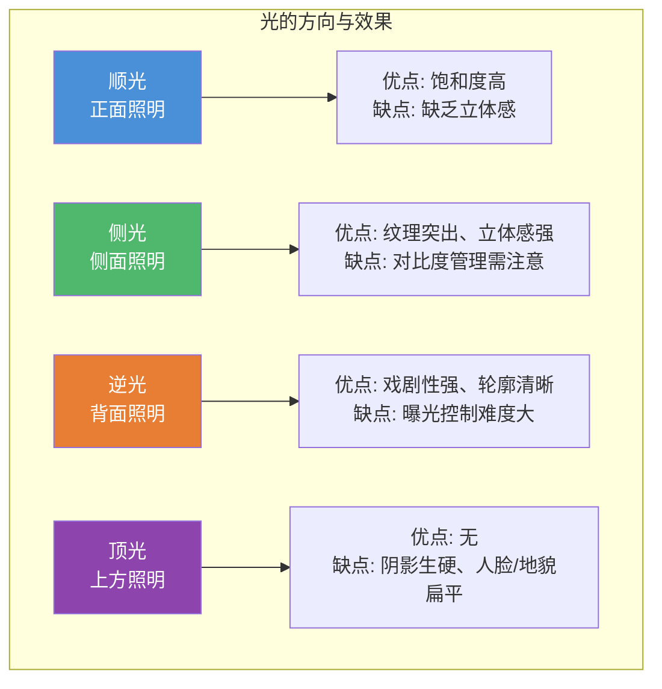

# 第06课：光线

## Learning Objectives

- 掌握光的方向对画面体积感、质感和情绪的影响
- 理解黄金时段与蓝色时刻的拍摄窗口
- 熟悉四季光线特征及相应拍摄策略
- 掌握弱光、黑白和剪影的专项技术与创作思维

## Core Idea

> 摄影是用光作画。没有光线，就没有影像。但一本风光摄影教程之所以要用一整课来讨论光，是因为绝大多数风光摄影师对光的理解停留在"有光就拍"的层面。

光线不仅仅是照亮画面的工具——它是**情绪的决定者、纹理的雕刻者、深度的揭示者、色彩的主宰者**。

[[0004-depth-perspective|第04课]] 讨论了如何在二维画面中重构深度感，[[0005-geometry-composition|第05课]] 讨论了线条和形状的几何组织——但如果没有光的质量支撑，再好的构图也只是一张空洞的骨架。

---

### 光的方向

光的方向决定了被摄体的**体积感、纹理呈现和色彩表现**。

#### 顺光

光线从摄影师背后照射到被摄体正面。

- **优点**：色彩饱和度最高、曝光最均匀、最容易测光
- **缺点**：**缺乏阴影**，画面在视觉上显得"扁平"，立体感和纹理感最弱
- **风光摄影评级**：⭐⭐（可用，但平淡）

**最佳顺光场景**：需要高饱和度色彩且不需要强调纹理时，如秋季的彩色树林。

#### 侧光

光线从侧面照射被摄体，产生高光和阴影。

- **优点**：最能揭示**纹理和立体感**、阴影创造深度感
- **缺点**：对比度较高，需要谨慎曝光（高光/阴影可能超出动态范围）
- **风光摄影评级**：⭐⭐⭐⭐⭐（最佳风光用光）

> [!TIP] Key Insight
> 侧光是最受风光摄影师钟爱的光线方向——没有之一。低角度的侧光（日出后 / 日落前）能够将最平凡的风景转变为充满戏剧性的画面。如果你只能在一个方向的光线下拍摄，选侧光。

**侧光应用技巧**：

- 拍摄山体时，侧光能揭示每一道山脊和沟壑
- 拍摄沙丘时，侧光让沙纹变成优美的线条
- 拍摄岩石时，侧光凸显每一处纹理和裂纹
- 在侧光下使用偏振镜可以进一步强化纹理

#### 逆光

光线从被摄体背后射向相机。

- **优点**：戏剧性最强、轮廓效果突出、容易产生氛围感
- **缺点**：曝光极难控制——需要在天空曝光和主体曝光之间做出取舍
- **风光摄影评级**：⭐⭐⭐⭐（高难度但高回报）

**逆光策略**：

1. **剪影**：针对高光区域测光，让主体完全成为剪影
2. **半剪影**：在后期从Raw文件中拉回部分阴影细节
3. **星芒**：小光圈（f/16-f/22）创造太阳星芒效果
4. **光晕/眩光**：有控制地使用镜头眩光作为氛围元素

> [!WARNING] 逆光对镜头的挑战
> 逆光对镜头镀膜质量要求极高。廉价镜头在逆光下容易产生严重眩光和对比度下降——但高质量的眩光处理得当也可以成为创意工具。

#### 顶光

太阳位于正上方或接近正上方。

- **优点**：几乎没有
- **缺点**：阴影最生硬、地貌显得最平、色彩缺乏层次
- **风光摄影评级**：⭐（尽量避开）

**顶光策略**：

- 顶光时间是休息和**勘察场景**的最佳时机——用手机或指南针App记录日落前的光照方向
- 选择结构性强的场景（建筑、抽象构图）
- 转为黑白
- 进入森林——树冠遮挡顶光，树下仍可拍摄

---

### 黄金时段

> 日出后30分钟、日落前30分钟——风光摄影的时间金矿。

**特征**：

- 太阳角度低，光线穿过的大气层更厚 → 光线更柔和
- 大气散射使光线偏暖 → 色彩更有感染力
- 低角度侧光 → 纹理最强、立体感最佳
- 阴影长而柔 → 提供天然的引导线和形状

**日落黄金时段强度变化**：太阳越接近地平线，光线越温暖柔和。日落前的15分钟通常是色彩最绚丽的时刻。

**日出黄金时段的特殊性**：日出前的亮度爬升往往比日落的色彩变化更难预测。提前30分钟到达现场并完成构图等待，而非日出后才开始找位置。

---

### 蓝色时刻

日出前和日落后，天空呈现冷蓝色调的短暂窗口。

- **持续时间**：约20-40分钟（取决于地理位置和季节）
- **最佳效果**：天空仍有足够亮度呈现蓝色，同时地面细节可辨
- **典型色彩**：深蓝到浅蓝的渐变，搭配城市灯光或暖色补光效果最佳

> [!NOTE] 蓝色时刻的拍摄
> 蓝色时刻适合长时间曝光——水面会变得平滑如镜，城市灯光与蓝色天空形成冷暖对比。曝光时间通常在10秒到数分钟之间，需要使用三脚架和快门线。参见 [[0002-shooting-technique#曝光控制|第02课：曝光控制]]。

---

### 四季光线特征

| 季节 | 光线特点 | 优势 | 挑战 |
|------|----------|------|------|
| **冬季** | 太阳最低、方向光最充足、空气最清澈 | 侧光几乎整天可用；雪地是天然反光板 | 寒冷缩短拍摄时间；电池续航下降 |
| **春季** | 空气清新、薄雾常见、日照时间增长 | 晨雾层次感强；新绿色彩清新 | 天气多变；气流常导致长曝光模糊 |
| **夏季** | 太阳最高、光线最生硬 | 日出时间早，可兼顾睡眠；野花添色 | 正午光最不讨喜；蚊虫多 |
| **秋季** | 光线最温和、晨雾最频繁 | 落叶的色彩构成天然前景；光线角度理想 | 窗口期短（色彩峰值仅1-2周） |

#### 冬季拍摄策略

- 太阳低角度 → 侧光从早到晚持续
- **雪地作为反光板**：地面反射光线 → 阴影不会太黑 → 对比度更可控
- 空气清澈 → 能见度极高 → 适合远距离拍摄山脉
- 注意事项：多带电池，电池在低温下续航减半以上

#### 夏季拍摄策略

夏季的光线对风光摄影最不友好——太阳高、光线硬、阴影反差大。

> [!TIP] 夏季生存指南
> - 利用**早出晚归**策略，仅在黄金时段拍摄
> - 中午进入森林/峡谷拍摄（树冠遮挡光线）
> - 选择**极简和抽象**题材（不需要复杂光线的场景）
> - 长曝光（ND滤镜）使正午的强光转化为拍摄工具
> - 利用夏季野花作为前景色彩补充

---

### 劣质光条件下拍摄

当光线不理想时，不是放下相机——而是**换一种拍摄思路**。

| 策略 | 方法 | 适合题材 |
|------|------|----------|
| **结构性主体** | 选择线条感强的构图 | 抽象、极简、建筑 |
| **极简构图** | 大面积留白，色彩关系取代光线纹理 | 极简风光 |
| **长曝光** | ND滤镜将强光转化为创作工具 | 雾化水、流云 |
| **黑白转换** | 剥离色彩干扰，关注形状和对比度 | 纹理、线条、天气 |
| **微距/细节** | 忽略大场景，聚焦小区域 | 抽象细节 |

---

### 弱光摄影

数字传感器的一个被低估的能力是**记录人眼在弱光下无法感知的色彩**。

- 日落后的天空在人眼看来已经是"灰暗"的，但相机长曝光后能展现出浓郁的深蓝和紫色
- 月光下的风景在相机的30秒曝光中呈现的细节远超肉眼所见
- 城市远山的暮色中，传感器能捕捉到从橙到紫的渐变，而人眼只能看到一片暗色

> [!INFO] 弱光拍摄设置
> 使用三脚架、快门线、关闭防抖。曝光时间从几秒到数分钟不等。开启长曝光降噪（LENR），或者手动拍摄暗帧后期降噪。建议使用M档（手动模式）完全控制曝光。

---

### 夜间摄影

#### 银河拍摄

| 参数 | 建议值 | 说明 |
|------|--------|------|
| 镜头 | 广角（14-24mm）大光圈（f/1.4-f/2.8） | 收集最多光线 |
| 快门速度 | 300 ÷ 焦距 ≈ 最长秒数 | 300规则：避免星轨 |
| ISO | 1600-6400 | 取决于镜头光圈和光污染 |
| 对焦 | 手动对焦到无限远 | 用Live View放大对准亮星微调 |

**300规则**：最长曝光时间（秒）= 300 ÷ 等效全画幅焦距。例如20mm镜头 → 300 ÷ 20 = 15秒。超过此时间，星星开始出现拖尾。

#### 极光拍摄

- 极光变化快 → 曝光时间不宜过长（5-15秒）
- ISO 1600-3200，光圈开到最大
- 需要"极光预报"应用辅助规划

---

### 黑白摄影思维

黑白不是"把彩色照片去饱和"，而是**一种完全不同的观看方式**。

去除色彩后，构成画面的要素变为：

> **形状、线条、纹理、色调对比**——而非色彩关系。

#### 何时选择黑白

| 适合黑白 | 不适合黑白 |
|----------|-----------|
| 强纹理场景（岩石、树皮、沙丘） | 以色彩对比为核心的场景（秋叶、日落） |
| 高对比度光线（正午、逆光） | 柔和渐变场景 |
| 雾景、雨景（色阶柔和自然） | 色彩本身是主体（彩虹、花海） |
| 抽象/极简构图 | 需要真实感的风光照 |

> [!WARNING] 黑白创作的陷阱
> 不要在现场通过相机的黑白模式"预览"——这很危险。你应该先以Raw格式拍摄彩色，在后期处理中再决定是否转为黑白。黑白模式会丢失色彩信息，而这些信息在后期转换时可能很重要。

---

### 剪影技术

剪影是风光摄影中最富戏剧性的表现形式之一。它的本质是**将主体压暗为零细节的黑色，使之以轮廓形式呈现在明亮背景前**。

**剪影成功的关键**：

1. **可识别的轮廓**：剪影必须是一个容易识别的形状——否则观众不知道在看什么。一棵树、一个人、一只鸟、一个建筑轮廓，都是好的剪影主体
2. **干净的背景**：背景必须明亮且相对单一——日落天空、雾景、水面反光都是理想背景
3. **主体分离**：主体之间不要重叠——重叠的剪影会融合为无法辨识的一团黑色

> [!TIP] 剪影测光技巧
> 对背景中最亮的区域测光（点测光模式），然后**锁定曝光**，重新构图。这样主体会自然欠曝成为剪影。**不要使用渐变镜**——渐变镜会在主体和天空之间制造不自然的明暗过渡。

**剪影的曝光原则**：

- 针对**天空/背景**测光
- 不要使用渐变镜（ND Grad）——它会破坏剪影的轮廓清晰度
- 使用点测光模式
- AE-Lock锁定曝光后重新构图
- 拍完后检查直方图：主体区域应在最左端（全黑）

---

### 斑点光

当阳光穿透云层的缝隙，在地面上形成移动的光斑——这种光线被称为"光洞"或"上帝之光"（God Rays）。

**特性**：

- 移动速度快（云层移动时斑点也随之移动）
- 戏剧性极强（高亮区域与深暗区域形成极端对比）
- 无法预测精确位置——但可以预测出现概率

**策略**：

> [!NOTE] 斑点光拍摄建议
> - 预判：当日光被云层间歇遮挡时，就是斑点光可能出现的时候
> - 准备：提前构图，固定好相机，等待光斑移动到你的主体上
> - 曝光：以高光区域为基准（避免过曝），使用包围曝光
> - 节奏：斑点光通常只持续几秒到几分钟——需要快速反应

---

## Worked Example

**场景**：冬日早晨，海岸线朝向东方，一块突出的礁石面向日出的方向，有云层覆盖。

**光线策略**：

1. **提前勘察**：日出前40分钟到现场，在蓝色时刻完成构图
2. **晨光过渡**：蓝色时刻拍摄30秒长曝光 → 水面雾化 + 冷蓝色调
3. **黄金时段**：日出后15分钟，侧光从右侧照亮礁石的纹理
4. **剪影选项**：如果云层遮挡太阳但天空有色彩 → 转为剪影构图，礁石做前景剪影
5. **斑点光**：低云层移动 → 等待光斑打在礁石上 → 点测光对准礁石高光
6. **冬季光线优势**：太阳角度低，侧光持续整个上午 → 有充足时间

---

## Practice

> [!QUESTION] Self-check
> 正午12点，夏季晴空万里，你驾车经过一片壮观的花岗岩地貌。光线从正上方直射，画面非常平。你应该：
>
> A. 放弃拍摄，等日落再来
> B. 用高角度俯拍，强调岩层的平面图形
> C. 寻找有遮挡的区域，或转为极简/黑白构图
> D. 使用大光圈虚化背景，忽略光线问题

Reveal answer

**正确答案：C**

正午的顶光确实是风光摄影中最不利的条件，但放弃（A）或欺骗自己（D）都不是好选择。最佳方案是转换拍摄思路：寻找有遮挡的峡谷或树荫区域，或者利用正午强对比的优势拍摄极简构图或黑白照片。B中的俯拍可能有效，但"平面图形"并不抵消顶光带来的扁平感。

更全面的策略是：先花30分钟**勘察场景**，记录下午后/日落时的光照方向，为真正的黄金时段做好准备——这才是最有价值的"正午工作"。

## Next Step

光线是所有风光摄影的灵魂，接下来的 [[0007-landscape-types|第07课：各类风光拍摄]] 将把前6课的知识综合起来，针对海岸、山地、森林、水域和微缩景观等不同场景制定具体的拍摄策略。