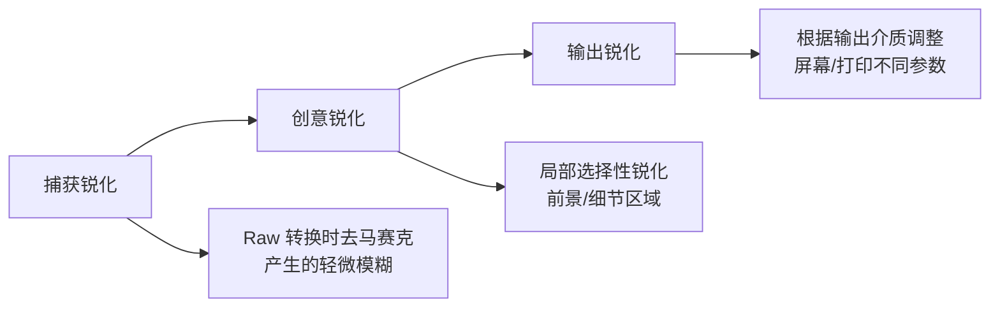
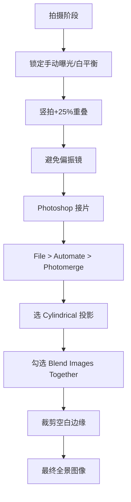

# 第08课：后期处理

## Learning Objectives

- 理解 Raw 格式与后期处理的核心哲学
- 掌握裁剪、锐化、局部增强三大基础调整技术
- 学会焦点合成、全景接片和曝光合成三大高级合成工作流
- 了解黑白转换工具与工作流程

## Core Idea

后期处理不是"作弊"，而是数码摄影的**必要组成部分**。Raw 文件相当于数码底片，需要经过"冲洗"才能呈现出完整的视觉潜力。好的后期处理不是为了让照片看起来"修过"，而是让照片看起来"本该如此"——自然、生动、不露痕迹。

> [!TIP] 后期处理哲学
> 机内直出 JPG 和后期处理 Raw 文件并无矛盾——前者是相机替你做了处理决策，后者是你自己做决策。掌握了后期，你就获得了对最终图像的**完整创作控制权**。

---

## 一、软件选择

### 主流后期软件对比

| 软件 | 优势 | 适用人群 | 价格 |
|---|---|---|---|
| **Lightroom** | 一站式管理+编辑，局部调整强大，批量处理 | 绝大多数风光摄影师 | Adobe Creative Cloud 订阅 |
| **Photoshop** | 图层与蒙版、合成、精准像素级编辑 | 需要高级合成的摄影师 | 同上（含在摄影计划中） |
| **Capture One** | 色彩科学出色，联机拍摄，细节还原佳 | 中画幅/商业摄影师 | 订阅/买断 |
| **GIMP** | 免费开源，功能全面 | 预算有限的摄影爱好者 | 免费 |
| **RawTherapee** | 免费 Raw 处理器，去马赛克算法优秀 | 预算有限的爱好者 | 免费 |

### 推荐插件

- **[Nik Collection](https://www.dxo.com/nik-collection/)（免费）**：Silver Efex Pro 2 是黑白转换的行业标准
- **Photomatix Pro**：HDR 合成的老牌工具，效果可控

> [!WARNING] 插件不是必须的
> Lightroom 和 Photoshop 本身已经足够强大。建议先用好基础工具，再根据需求决定是否需要插件。

---

## 二、裁剪与宽高比

裁剪是后期处理中最简单也最容易被忽视的步骤。恰当的裁剪可以彻底改善构图。

### 常见宽高比

| 宽高比 | 特点 | 常见用途 |
|---|---|---|
| **3:2** | 标准全画幅比例，自然舒适 | 绝大多数风光照片 |
| **4:3** | 接近微单/手机比例，更方正 | 竖构图人像/风光 |
| **5:4** | 接近大画幅，经典稳重 | 艺术展览、大幅输出 |
| **1:1** | 正方形，极简有力 | 社交媒体、抽象作品 |
| **16:9** | 宽银幕比例，电影感 | 全景展示、视频封面 |

> [!TIP] 裁剪建议
> 不要在前期拍摄时想着"后期裁剪就行"——这是非常不好的习惯。尽量在取景时完成构图，裁剪只作为**微调**和**比例适配**的手段。

---

## 三、三分阶段锐化

专业风光摄影的锐化不是一步到位的，而是划分为**三个阶段**：



### 第一阶段：捕获锐化

在 Lightroom 的"细节"面板中完成：
- **数量**：60–80（视传感器分辨率而定）
- **半径**：0.8–1.2（高分辨率传感器用较小值）
- **细节**：50–70
- **蒙版**：按住 Alt 拖动，白色区域为锐化区域，黑色区域被保护不锐化

### 第二阶段：创意锐化

> [!TIP] 创意锐化技巧
> 在 Lightroom 中使用**调整画笔**：
> - 新建调整画笔，将"锐化程度"滑块拉到 +50 到 +80
> - 仅涂抹你希望引导观者目光的区域——前景岩石、瀑布水花、远处的山脊线
> - 天空和柔和区域**不要涂抹**，保持自然的柔和过渡

### 第三阶段：输出锐化

- 在 Lightroom 导出时勾选"输出锐化"
- **屏幕显示**选"屏幕"（标准）
- **打印输出**选"亚光纸"或"光面纸"（高）

---

## 四、局部增强

### 三种核心工具

| 工具 | 功能 | 使用场景 |
|---|---|---|
| **渐变滤镜** | 线性渐变过渡调整 | 模拟 GND 效果压暗天空，或提亮地面 |
| **径向滤镜** | 圆形/椭圆局部调整 | 突出主体，创造自然晕影 |
| **调整画笔** | 任意形状精确涂抹 | 精细控制特定区域的曝光、对比度、色温 |

### 实操技巧

- **渐变滤镜模拟 GND**：从画面顶部向下拉渐变，曝光 -1 到 -2 EV，配合"暖色温"调整让天空更自然。
- **径向滤镜突出主体**：在主体上建立径向滤镜，在"反转蒙版"状态下，**外部**区域的曝光 -0.5 EV，对比度 -20，主体自然凸显。
- **调整画笔精细控制**：放大到 100%，沿着边缘精确涂抹。硬度调低（羽化大），避免生硬边缘。

> [!EXAMPLE] 局部增强工作流
> 1. 全局调整（曝光、对比度、白平衡）
> 2. 渐变滤镜：从上到下压暗天空 -1.3 EV
> 3. 径向滤镜：在前景岩石上提亮 +0.5 EV，增加清晰度 +20
> 4. 调整画笔：瀑布溅水区域锐化 +60，天空云层区域减清晰度 -30 营造柔化效果

---

## 五、焦点合成（Focus Stacking）

### 什么是焦点合成

当场景中的前景非常近（如半米内的岩石），同时需要远景（远处的山峰）也同样清晰时，即使使用 f/22 的最小光圈也无法覆盖整个景深范围。**焦点合成**通过拍摄多张不同对焦点的照片，后期在 Photoshop 中合成一张全景深的图片。

### 操作步骤

1. **拍摄阶段**：
   - 相机固定在三脚架上，**不能有任何移动**
   - 切换到手动对焦（MF）
   - 从最近的对焦点开始拍摄，逐张向远处移动对焦点
   - 拍摄 3–8 张覆盖从近到远的全部景深范围

2. **Photoshop 合成**：
   - `File > Scripts > Load Files into Stack`
   - 勾选 "Attempt to Auto-Align Layers"（自动对齐图层）
   - 选中所有图层，`Edit > Auto-Blend Layers`
   - 选择 "Stack Images"（堆叠图像）
   - 勾选 "Seamless Tones and Colors"

### 限制条件

> [!WARNING] 焦点合成的前提
> - **相机不能移动**——必须在三脚架上
> - **场景中不能有快速运动的元素**——风中的树叶、流动的水都会导致合成失败
> - 建议在**光线充足的条件下**拍摄，避免因小光圈导致快门过慢

---

## 六、全景接片（Panorama Stitching）

### 拍摄规范

成功的全景接片需要**严格的拍摄纪律**：

- **保持水平**：使用三脚架云台上的水平仪，或相机内置水平仪
- **手动曝光和手动白平衡**：锁定曝光参数和白平衡，确保每张照片亮度一致
- **25% 重叠**：相邻照片之间至少重叠 25%，给软件足够的匹配特征点
- **避免使用偏振镜**：偏光效果随角度变化，多张拼接时天空会出现不均匀的明暗条纹

### 为什么用肖像格式拍全景

> [!TIP] 建议使用竖拍（肖像格式）
> 用**肖像（竖拍）格式**旋转拍摄全景，而不是用横拍格式：
> - 减少广角端边缘畸变带来的接缝扭曲
> - 大幅**提高垂直分辨率**——画面上下不会有大量浪费的裁剪区域
> - 最终出图的分辨率远超单张照片

### Photoshop 合成步骤

1. `File > Automate > Photomerge`
2. 版面选择 "Auto" 或 "Cylindrical"（圆柱投影，推荐）
3. 勾选 "Blend Images Together"（混合图像）
4. 取消勾选 "Vignette Removal"（由软件自动处理即可）
5. 点击确定，等待合成完成
6. 最终裁剪边缘的空白区域



---

## 七、曝光合成（Exposure Blending）

### 解决高对比度场景

即使在 [[0007-landscape-types|第07课各类风光拍摄]] 中提到的山地场景里，渐变镜也难以应对不规则地平线的光比。**曝光合成**是更灵活的替代方案。

### 操作流程

1. 使用**包围曝光（AEB）**拍摄 3–7 张，步长 1–2 EV
2. 在 Lightroom 中选中所有照片
3. 右键 > "编辑于" > "在 Photoshop 中合并到 HDR Pro"
4. 或手动合成：将较亮和较暗的照片作为 Photoshop 图层，用图层蒙版擦出各自的最佳曝光区域

> [!EXAMPLE] 手动曝光合成
> 1. 将三张包围曝光的照片（-2 EV、0 EV、+2 EV）加载为 Photoshop 图层
> 2. 从下层到上层：最暗（天空）、中间（主场景）、最亮（阴影）
> 3. 为每个图层添加黑色蒙版，用白色画笔（50% 不透明度）擦出需要保留的区域
> 4. 天空区域用最暗图层、阴影区域用最亮图层

---

## 八、黑白转换

### Silver Efex Pro 2

Nik Collection 的 Silver Efex Pro 2 是目前最强大的黑白转换工具：

- **色调分离**：选项包括"高对比度红色"、"暗调蓝色"等，可以模拟传统黑白胶片的各种色调
- **控制点技术**：在画面特定区域添加控制点，精准调整该区域的亮度和对比度，而不影响其他区域——这与 Lightroom 的调整画笔类似，但更精准

### 在 Lightroom 中进行黑白转换

1. 在基本面板中点击 "黑白"（或按 V 键）
2. 使用**黑白混色器**（HSL 面板）分别调整红、橙、黄、绿、青、蓝、紫各色通道在黑白中的亮度
3. 常用技巧：
   - **压暗蓝天**（降低蓝色亮度），让白云更突出
   - **提亮绿叶**（提高绿色亮度），让植物更有活力
   - **橙色/黄色**控制肤色和岩石色调

> [!TIP] 黑白转换要诀
> 好的黑白照片不是简单地去除色彩——而是重新用灰度来编排画面的影调结构。调整各色通道的亮度分布，本质上是在"重新布光"。

---

## 综合工作流

```mermaid
flowchart LR
    subgraph ”阶段一：全局调整”
        A1[Raw 基础调整] --> A2[裁剪与旋转]
        A2 --> A3[捕获锐化]
    end
    
    subgraph ”阶段二：局部优化”
        B1[渐变滤镜] --> B2[径向滤镜]
        B2 --> B3[调整画笔]
        B3 --> B4[创意锐化]
    end
    
    subgraph ”阶段三：高级合成”
        C1{是否需要合成?}
        C1 -->|焦点| C2[焦点合成 PS]
        C1 -->|全景| C3[全景接片 PS]
        C1 -->|曝光| C4[曝光合成 PS]
    end
    
    subgraph ”阶段四：输出”
        D1[黑白转换] --> D2[输出锐化]
        D2 --> D3[导出/打印]
    end

    A3 --> B1
    B4 --> C1
    C2 --> D1
    C3 --> D1
    C4 --> D1
```

---

## Practice

> [!QUESTION] 场景处理方案
> 根据以下场景，选择最合适的后期处理方案：
> 1. 手持拍摄了一张前景花朵和远处山景的照片，发现前景和远景无法同时合焦。
> 2. 在一个山谷拍摄了 5 张竖拍照片，希望得到一张超宽全景图。
> 3. 日出场景，天空比地面亮约 4 档，仅凭一张 Raw 文件无法完整覆盖动态范围。
> 4. 一张色彩丰富的秋景照片，想转换黑白并强调树林的纹理质感。

<details>
<summary>参考答案</summary>

**第1题 - 景深不足：**
- 方案：焦点合成（Focus Stacking）
- 拍摄阶段需要更多张覆盖从花朵到山峰的对焦点
- 在 Photoshop 中使用 Auto-Blend Layers 合成

**第2题 - 全景接片：**
- 方案：Photomerge
- 如果拍摄时已锁定手动曝光和白平衡，合成效果会更好
- 使用 Cylindrical 投影模式

**第3题 - 高对比度：**
- 方案：曝光合成
- 使用包围曝光拍摄 3–5 张，在 Photoshop 中通过 HDR Pro 或手动蒙版合成
- 如果拍摄时未包围曝光，可以从单张 Raw 文件提取不同曝光的虚拟副本再合成

**第4题 - 黑白转换：**
- 方案：Lightroom 黑白混色器
- 提亮黄色/橙色通道让秋叶变亮，压暗蓝色通道让天空变暗
- 也可导入 Silver Efex Pro 2 用控制点精细调节各区域亮度

</details>

---

## Review Checklist

- [ ] 是否理解 Raw 文件=数码底片的核心观念？
- [ ] 能否说出三分阶段锐化的名称和每个阶段的用途？
- [ ] 是否熟悉 Lightroom 三种局部调整工具（渐变/径向/画笔）的区别？
- [ ] 是否了解焦点合成的拍摄要求和合成步骤？
- [ ] 能否列出全景接片的拍摄规范（水平、手动设置、重叠率、偏振镜）？
- [ ] 是否掌握曝光合成处理高对比度场景的方法？
- [ ] 是否了解黑白转换时各色通道对画面的影响？

## Next Step

你已经掌握了从全局调整到高级合成的完整后期工作流。下一课 [[0009-personal-style|第09课：发展个人风格]] 将是课程的终点——如何从前七课的**技术积累**和第八课的**后期能力**中，生长出属于你自己的摄影语言。