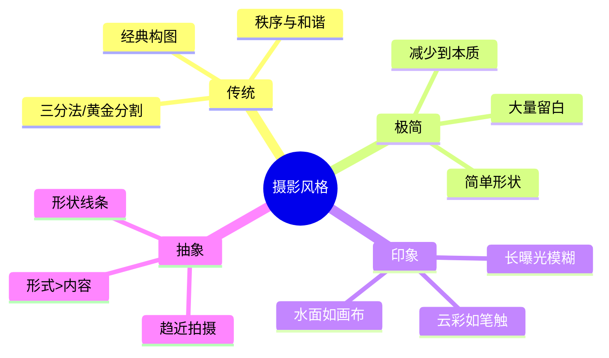
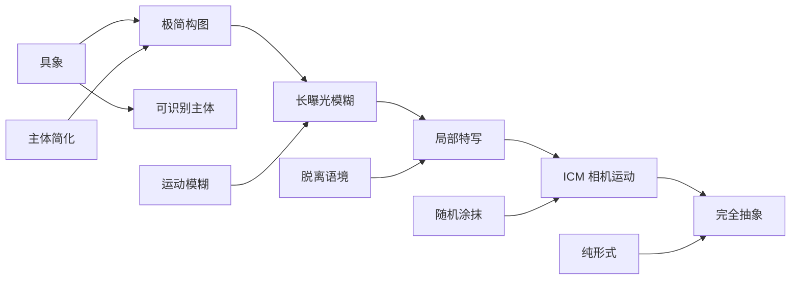
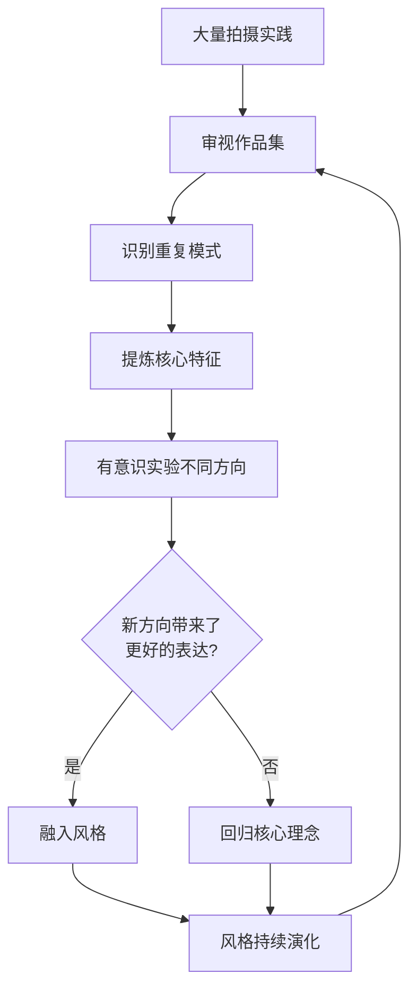

# 第09课：发展个人风格

## Learning Objectives

- 理解传统、极简、印象、抽象四种摄影风格的核心特征
- 学习分析经典摄影师作品并提炼其风格要素
- 掌握定义和锤炼个人风格的系统方法
- 认识到风格是持续演变的动态过程

## Core Idea

个人风格并非一种"标签"或"套路"，而是摄影师**观察世界的方式在画面上的自然投射**。它是技术、审美、经历与性格的综合结晶。前七课积累了拍摄技术，第八课掌握了后期能力——现在是时候追问自己：我想用这些工具**说什么**？

> [!TIP] 风格的本质
> 风格不是你**选择**去拍摄什么，而是你**无法不**去拍摄的东西。它藏在你的审美直觉中 —— 当你在取景器前不假思索地按下快门时，风格已经在起作用。



---

## 一、传统风格

### 核心理念

传统风光摄影追求的是**秩序与和谐**——通过经典构图原则来呈现自然景观的理想形态。这种风格经久不衰，因为它触及了人类视觉对平衡与对称的本能偏好。

### 特征

- 遵循 **三分法、黄金分割、引导线** 等经典构图规则（参见 [[0003-balance|第03课画面平衡]] 和 [[0005-geometry-composition|第05课构图的几何学]]）
- 前景、中景、远景层次分明
- 光线选择在黄金时段（日出后/日落前）
- 画面工整、技术扎实

### 代表人物

传统风格的代表摄影师包括 Ansel Adams（区域曝光法、黑白风光）、Charlie Waite（宁静的古典构图）、Joe Cornish（大片幅彩色风光）。

> [!EXAMPLE] 向大师学习
> 分析传统风格照片时，尝试用透明纸描出画面的主要线条——你会发现大多数经典作品的构图都严格遵循三分法和引导线结构。这不是刻板，而是经过时间检验的视觉语言。

---

## 二、极简主义

### 核心理念

极简主义的核心是**减少到本质要素**——去掉一切多余的信息，只保留最能打动人的元素。这种"少即是多"的理念在当代风光摄影中越来越受推崇。

### 关键手法

- **大量留白**：天空、雾霭、水面占据画面的绝大部分，主体仅占一小部分
- **简单形状**：一棵孤树、一条延伸的海岸线、一片沙漠沙丘的曲线
- **单一色调**：刻意选择低饱和或单色画面，减少色彩的干扰
- **对称与重复**：利用自然中的对称元素创造极强的形式感

### 极简 vs 传统

| 对比维度 | 传统风格 | 极简主义 |
|---|---|---|
| 画面元素 | 丰富、多层次 | 精简到极致 |
| 构图规则 | 严格遵守三分法等 | 可打破规则，追求平衡感 |
| 色彩 | 自然饱和 | 低饱和或单色 |
| 情绪 | 宏大、壮丽 | 宁静、冥想 |
| 技术门槛 | 综合技术高 | 更依赖"减法"的眼光 |

---

## 三、印象主义

### 核心理念

摄影中的印象主义借鉴了绘画印象派的思想——不追求清晰的细节再现，而是用**模糊和运动**来传达情绪与氛围。

### 核心技法

- **长曝光**（数秒到数分钟）：让云层在画面中拉出笔触般的轨迹，让水面变成柔和的色块
- **ND 滤镜**：使用 6–10 档 ND 滤镜在白天实现超长曝光（参见 [[0002-shooting-technique|第02课拍摄技术]]）
- **有意移动相机（ICM）**：在曝光过程中缓慢移动相机，创造抽象的涂抹效果
- **焦点虚化**：故意失焦，让画面变成柔和的色彩和形状

> [!TIP] 印象主义拍摄练习
> 选择一个有云的场景，尝试三组长曝光（15秒、60秒、120秒），观察云层从"可辨认的形态"到"抽象笔触"的变化过程。你会发现，曝光时间越长，画面越接近绘画。

---

## 四、抽象

### 核心理念

抽象风光摄影将**形式置于内容之上**——观者不需要知道"这是什么"，只需要感受形状、线条、色彩和纹理构成的视觉韵律。这与 [[0007-landscape-types|第07课各类风光拍摄]] 中提到的"趋近抽象"技巧一脉相承。

### 关键手法

- **趋近拍摄**：极度贴近自然中的局部细节，让主体脱离原有的识别语境
- **形状优先**：寻找自然的几何形态——沙丘的波浪线、岩石的裂痕、冰面的碎纹
- **色彩对比**：强调色块之间的对比与和谐，而非具体物体的呈现

### 抽象的程度光谱



---

## 五、风格分析：两位大师

### Mark Bauer

Mark Bauer 的风格可以从他的作品和写作中提炼出以下特征：

- **克制与减法**：他的照片往往只包含最少的元素，却在其中蕴含深沉的宁静感
- **色调内敛**：偏爱的色彩范围较窄，从暗调到中间调的过渡极为细腻
- **长曝光印记**：经常使用长曝光简化水面和天空，让时间在画面中沉淀
- **情感主导**：技术服务于情绪传达而非展示技巧

> [!TIP] 从 Mark Bauer 学到什么
> Bauer 的照片提醒我们：真正打动人心的风光照片不一定是"壮丽的日出日落"——更多时候，是那些**安静、克制、留有想象空间**的画面。尝试在你的拍摄中有意识地进行"减法"——如果一个元素不能为画面增添价值，就排除它。

### Ross Hoddinott

Ross Hoddinott 是英国知名的风光和微距摄影师，他的风格特征是：

- **极致的锐度与细节**：作为技术流代表，他的作品在清晰度和纹理还原上达到极致
- **色彩丰富而有控制**：饱和度较高但不过度，色彩之间有明确的和谐关系
- **微距与风光兼修**：从宏大风光到微小细节，他的视角跨度极大
- **视觉冲击力强**：每一张照片都精心设计，第一个瞬间就抓住观者目光

> [!TIP] 从 Ross Hoddinott 学到什么
> Hoddinott 证明了技术精度本身就是一种风格。对于一个场景，他愿意等待数小时甚至数天，只为获得完美的光线条件。这种**耐心和执着**是所有风格形成过程中不可或缺的品质。

### 两种风格的对比

| 维度 | Mark Bauer | Ross Hoddinott |
|---|---|---|
| 画面元素 | 极简、克制 | 丰富、极致细节 |
| 色彩倾向 | 内敛、低饱和 | 饱和、有控制 |
| 技术取向 | 情绪驱动技术 | 技术驱动画面 |
| 时间感 | 缓慢、沉思 | 精准、决定性瞬间 |
| 对观者的要求 | 需要静心品味 | 立即吸引目光 |

---

## 六、定义个人风格的过程

风格不是凭空产生的，而是在持续实践中**逐渐浮现**的。以下是系统化的方法：

### 步骤一：审视现有作品

从你的照片库中选出一百张最满意的作品，然后将它们分类（可以按主题、光线、色调、构图方式等维度）。寻找那些**反复出现的元素**——这些重复就是风格萌芽的迹象。

### 步骤二：找出重复主题

| 维度 | 需要回答的问题 |
|---|---|
| 构图偏好 | 你更倾向于广角还是长焦？对称还是不对称？ |
| 色彩倾向 | 你的照片偏暖还是偏冷？高饱和还是低饱和？ |
| 光线偏好 | 喜欢顺光、侧光还是逆光？黄金时段还是阴天？ |
| 情感基调 | 你的照片传递宁静、壮丽、孤寂还是神秘？ |
| 拍摄时间 | 你是日出型还是日落型摄影师？ |

### 步骤三：实验不同方向

不要过早地锁定风格。有意识地尝试与直觉相反的方向：

- 如果你习惯用广角拍大场景，试试用长焦拍局部
- 如果你习惯拍彩色，试一个月黑白
- 如果你习惯在日出拍摄，试试在暴风雨来临前出门

> [!WARNING] 风格不是终点
> 风格不是一旦找到就永恒不变的东西。它会随着你的**生活经历、技术成长和审美演化**而不断变化。不要害怕风格的转变——那恰恰说明你在进步。



---

## 七、风格启发表：从思考到实践

> [!EXAMPLE] 四种风格拍摄练习
> 找一处你熟悉的场景，用四种不同的风格各拍一张照片：
> 
> 1. **传统**：使用三分法构图，黄金时段光线，前景-中景-远景层次分明
> 2. **极简**：使用长焦镜头，只框取一个主体，周围留白至少 70%
> 3. **印象**：安装 ND 滤镜，设置 60 秒以上曝光，让水面和云层完全模糊
> 4. **抽象**：贴近地面或岩石表面，只取纹理和形状，让观者无法辨认原物体
> 
> 这一练习会让你切身体会：同样的地点，**不同的风格视角可以创造出完全不同的情感体验**。

---

## 八、摄影风格的哲学思考

### 风格是一段旅程

英国风光摄影师 **Joe Cornish** 说过："风格不是你可以去'获取'的东西，而是你'成为'的过程中的副产品。"这句话揭示了风格形成的本质——它来自持续地拍、看、想、再拍的循环，而不是一个可以快速达成的目标。

### 技术与风格的辩证

在课程的前七课中，你学习了大量的技术——从相机设置到构图原则，从曝光控制到光线运用。这些技术是风格的**基础**，但不是风格本身。

- 技术是**语言**——它决定了你能表达什么
- 风格是**口音**——它决定了你说出来的话听起来是什么味道

掌握了语言之后，你的口音会自然而然地形成。

### 真实性的力量

最终，最打动人的风格来自**真实性**。不要试图成为"第二个 Ansel Adams"或"第二个 Mark Bauer"——学习他们的技术和方法，但用自己的眼睛去看世界。

> [!TIP] 最后一条建议
> 将手机或相机设为黑白模式拍摄一个月。这不是为了拍出黑白照片，而是为了训练你用**影调、形状和纹理**而非色彩来"看"世界。许多摄影师将此视为最有效的视觉训练方法。

---

## Practice

> [!QUESTION] 风格诊断
> 回顾你最近拍摄的 20 张风光照片，回答以下问题：
> 1. 这些照片在构图上有什么共同的倾向？（三分法？对称？留白？）
> 2. 色调上有哪些一致性？（偏暖/偏冷/高饱和/低饱和？）
> 3. 如果必须用三个形容词描述你照片的情绪，你会选哪三个？
> 4. 你最常拍摄的场景类型是什么？（海岸/山地/林地/微缩？）
> 5. 你认为自己的风格更接近传统、极简、印象还是抽象？或者介于其中某两种之间？

<details>
<summary>参考答案（指引）</summary>

以上问题没有"标准答案"——这正是风格诊断的意义所在。以下是分析框架：

- **问题 1–2** 揭示你的**视觉偏好**——这是风格中最稳定的部分
- **问题 3** 揭示你的**情感倾向**——技术之外，情绪是风格的核心
- **问题 4** 揭示你的**题材舒适区**——你可以在熟悉题材上打磨风格
- **问题 5** 让你找到**风格定位**——大多数摄影师介于多种风格之间

如果无法回答这些问题，说明你的拍摄量还不够。继续拍，答案会在实践中逐渐清晰。

</details>

---

## 课程总结

恭喜你完成了"风光摄影艺术"课程的全部九课学习！

```mermaid
flowchart TD
    subgraph ”基础篇”
        A[第01课 装备]
        B[第02课 技术]
    end
    
    subgraph ”美学篇”
        C[第03课 平衡]
        D[第04课 深度]
        E[第05课 几何]
        F[第06课 光线]
    end
    
    subgraph ”综合篇”
        G[第07课 场景]
        H[第08课 后期]
    end
    
    subgraph ”升华篇”
        I[第09课 风格]
    end

    A --> B
    B --> C
    C --> D
    D --> E
    E --> F
    F --> G
    G --> H
    H --> I
```

- **第01–02课** 建立了器材和拍摄的技术基础
- **第03–06课** 构建了从构图到光线的美学体系
- **第07–08课** 将技术与美学应用于实践场景和后期创作
- **第09课** 整合全部知识，迈向个人风格的探索

拍摄风光照片的技术可以在几个月内掌握，但找到自己的风格可能需要数年甚至 decades。这是值得的——因为在这个过程中，你不仅学会了摄影，也学会了**如何用自己的方式看世界**。

---

## Review Checklist

- [ ] 是否理解传统、极简、印象、抽象四种风格的区别与联系？
- [ ] 能否分析 Mark Bauer 和 Ross Hoddinott 的风格差异？
- [ ] 是否掌握了审视自己作品并找出风格倾向的方法？
- [ ] 是否有意识地尝试过与自己习惯相反的拍摄方向？
- [ ] 是否理解风格是随时间和经验演变的动态过程？
- [ ] 是否准备好将整个课程的知识融入到持续的创作实践中？

## Next Step

课程学习到此结束。真正的学习从现在开始——带上相机，走进自然，用自己的眼睛发现世界。如果你需要回顾任何章节，以下链接可以快速导航：

- [[0001-equipment|第01课：装备选择]]
- [[0002-shooting-technique|第02课：拍摄技术]]
- [[0003-balance|第03课：画面平衡]]
- [[0004-depth-perspective|第04课：深度与透视]]
- [[0005-geometry-composition|第05课：构图的几何学]]
- [[0006-light|第06课：光线]]
- [[0007-landscape-types|第07课：各类风光拍摄]]
- [[0008-processing|第08课：后期处理]]
- [[0009-personal-style|第09课：发展个人风格]]