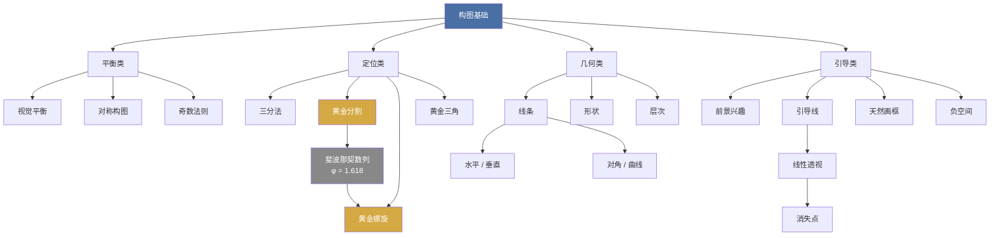
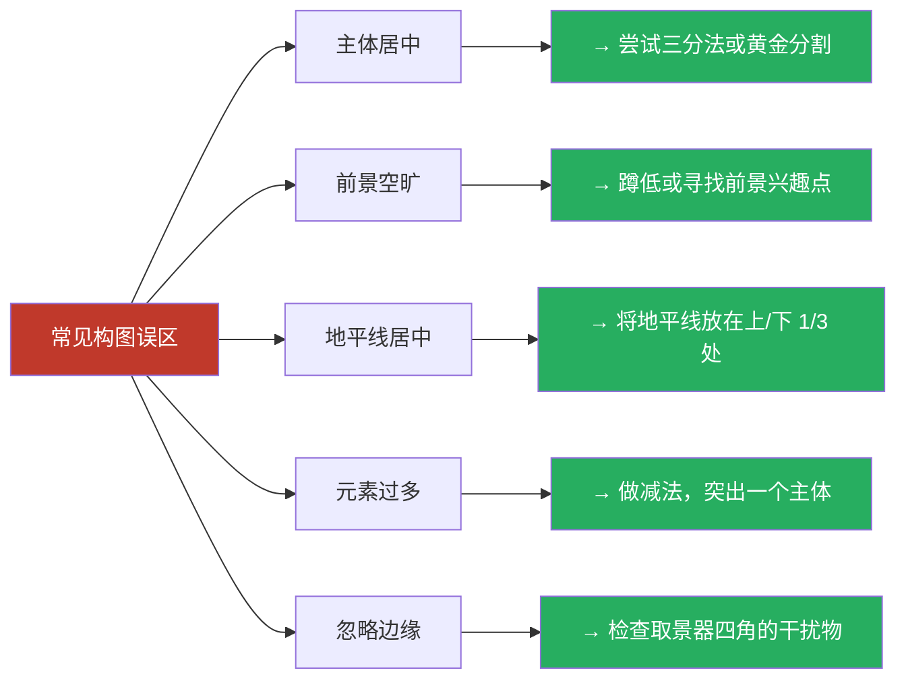

# 构图速查表

> 构图是将眼前的风光转化为有感染力画面的组织艺术。本表汇总了风光摄影中常用的构图方法及其适用场景。

---

## 构图原则总览

| 类别 | 构图方法 | 核心理念 | 适用场景 |
|------|----------|----------|----------|
| **平衡类** | 视觉平衡 | 各元素视觉重量分布均匀 | 几乎所有场景的基础要求 |
| | 对称构图 | 利用镜像对称产生庄重感 | 倒影、建筑、静水面 |
| | 奇数法则 | 主体数量为奇数更生动 | 树木、岩石、动物等重复元素 |
| **定位类** | 三分法 | 将主体放在交叉点或分割线上 | 通用、适合初学者起步 |
| | 黄金分割 (Phi Grid) | 按 1:1.618 比例分割画面 | 需要比三分法更精致时 |
| | 黄金螺旋 | 引导视线沿螺旋向中心汇聚 | 有明确视觉引导路径时 |
| | 黄金三角 | 对角线加垂线构成的三角布局 | 画面中有明显的对角线元素时 |
| **几何类** | 水平线条 | 传达宁静、开阔、稳定 | 海景、平原、草原 |
| | 垂直线条 | 传达高度、力量、庄严 | 森林、瀑布、建筑 |
| | 对角线条 | 传达动感、张力、方向 | 山脊、斜坡、道路 |
| | 曲线（S/C形） | 引导视线蜿蜒流动，增加韵律 | 河流、道路、海岸线 |
| | 三角形构图 | 稳定、坚固的视觉结构 | 山峰、树木组合 |
| | 圆形构图 | 完整、包容、循环感 | 岩洞、拱门、全景 |
| **引导类** | 前景兴趣 | 近景置入兴趣点增加纵深感 | 广角风光、大景深场景 |
| | 引导线 | 线条引导视线深入画面 | 道路、溪流、栅栏、海岸线 |
| | 消失点 | 汇聚线指向远方产生强烈透视 | 铁路、长廊、林间小路 |
| | 天然画框 | 利用环境元素框住主体 | 树枝拱门、窗洞、岩洞 |
| | 负空间 | 大量留白突出主体、营造意境 | 极简风光、雾景、雪景 |
| | 层次感 | 前/中/远景层层递进 | 山景、峡谷、城市天际线 |

---

## 构图方法关系图

> 以下 Mermaid 图表展示了各类构图方法之间的内在联系。



---

## 构图方法对比（什么时候用哪个？）

| 场景 | 推荐构图 | 原因 |
|------|----------|------|
| 海上日落，水平线清晰 | 三分法 + 对称 | 水平线对齐分割线，倒影形成对称 |
| 林间小路通向远方 | 引导线 + 消失点 | 道路自然引导视线进入画面深处 |
| 广阔草原，单一树木 | 三分法 + 负空间 | 极简处理，树木放在交叉点 |
| 秋色山景，层次丰富 | 层次感 + 前景兴趣 | 前景落叶 -> 中景彩林 -> 远景雪山 |
| 河流蜿蜒穿过山谷 | S 曲线 + 引导线 | 河流自然形成曲线引导视线 |
| 城市天际线倒影 | 对称构图 | 倒影与实体形成完美镜像 |
| 雾中森林 | 垂直线条 + 负空间 | 树干形成垂直节奏，雾提供留白 |
| 瀑布从上而下 | 垂直线条 + 黄金螺旋 | 从左上到右下沿螺旋展开 |
| 岩洞外望有风景 | 天然画框 | 岩壁的暗部自然框住亮部风景 |
| 海边礁石群 | 奇数法则 + 前景兴趣 | 选择 3 块礁石作为前景 |
| 大逆光场景 | 黄金分割 | 太阳放在黄金分割点上更精致 |
| 拍摄花丛或石阵 | 节奏与重复 + 奇数法则 | 利用重复形成韵律感 |
| 高角度俯瞰山谷 | 黄金三角 | 对角线切割 + 三角结构稳定画面 |

---

## 黄金比例实用指南

### Phi Grid（黄金分割网格）

```
┌──────────────┬──────────────┬──────────────┐
│              │              │              │
│    1.000     │    1.618     │    1.000     │
│              │              │              │
├──────────────┼──────────────┼──────────────┤
│              │    ★         │              │
│    1.618     │   主体       │    1.618     │
│              │   位置       │              │
├──────────────┼──────────────┼──────────────┤
│              │              │              │
│    1.000     │    1.618     │    1.000     │
│              │              │              │
└──────────────┴──────────────┴──────────────┘
```

> **注意**：三分法的网格是均匀的 1:1:1，而 Phi Grid 的中间两列比例为 1:1.618（较窄），两侧为 1。视觉效果上主体位置更趋向中心。

---

## 构图的常见误区



---

> [!tip] 构图的终极建议
> **规则是拐杖，不是枷锁。** 先熟练掌握三分法和引导线，再逐步尝试黄金比例、对称等高级构图。最重要的是——反复观看大师作品并问自己："这张照片为什么好？"

---

## 实景练习清单

- [ ] 用三分法拍摄同一场景 3 张不同布局
- [ ] 找到一条引导线并沿其构图
- [ ] 俯身寻找前景兴趣点
- [ ] 利用树枝或窗户形成画框
- [ ] 用长焦压缩空间感受线条节奏
- [ ] 拍摄一张完全对称的风光
- [ ] 使用负空间拍摄极简风光
- [ ] 分别用水平和对角线拍同一座山

---

> **关联文档**：[[exposure-cheatsheet|曝光与景深邃查表]] · [[glossary|术语表]]