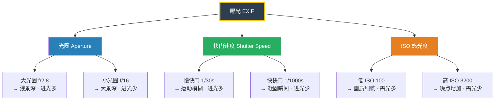
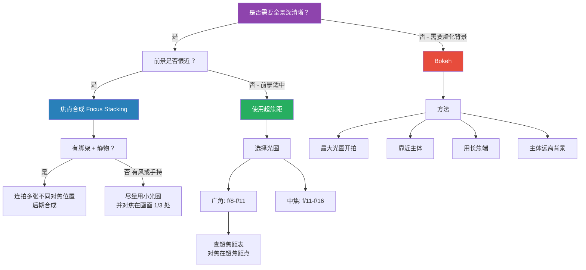

# 曝光与景深邃查表

> 曝光控制是风光摄影的技术基石。本表涵盖曝光三角、景深控制、超焦距、ND 滤镜计算等核心技术参考。

---

## 曝光三角

### 互易律（倒易律）

> 曝光量可用不同参数组合等效替换：**开大一档光圈 ≈ 减慢一档快门 ≈ 提高一档 ISO**，效果等价但画质与景深不同。

**示例：同曝光量的不同参数组合**

| 光圈 | 快门 | ISO | 效果说明 |
|------|------|-----|----------|
| f/8 | 1/250s | 100 | 基础曝光，画质最佳 |
| f/5.6 | 1/500s | 100 | 景深变浅，凝固更快 |
| f/11 | 1/125s | 100 | 景深更大，需防抖 |
| f/8 | 1/60s | 400 | 画质下降，适合手持暗光 |

---

## 不同光线的曝光补偿建议

| 光线场景 | 测光模式 | 曝光补偿 | 说明 |
|----------|----------|----------|------|
| 雪景 | 评价/矩阵测光 | **+1.0 ~ +2.0 EV** | 相机测光会被雪"欺骗"导致欠曝 |
| 海滩/沙漠 | 评价/矩阵测光 | **+0.7 ~ +1.3 EV** | 亮色环境同样测光偏高 |
| 逆光场景 | 点测光（对主体） | **+1.0 ~ +2.0 EV** | 或直接用手动曝光 |
| 日落/日出 | 点测光（对太阳旁天空） | **-0.3 ~ -0.7 EV** | 保留天空色彩饱和度 |
| 夜景/星空 | 手动曝光 | 根据试拍调整 | 一般 ISO 3200+，快门 15-30s |
| 森林阴影 | 评价测光 | **+0.3 ~ +0.7 EV** | 避免阴影区域太暗 |
| 瀑布流水 | 评价测光 | **-0.3 ~ -0.7 EV** | 防止高光（水流）过曝 |
| 雾景 | 评价测光 | **+0.3 ~ +1.0 EV** | 保持雾的轻盈感 |
| 月亮 | 点测光（对月亮） | **-1.0 ~ -2.0 EV** | 月亮很亮，直接测会过曝 |

---

## 景深控制决策树

### 影响景深的四大因素

| 因素 | 大景深倾向 | 浅景深倾向 |
|------|-----------|-----------|
| **光圈** | 小光圈（f/16, f/22） | 大光圈（f/2.8, f/4） |
| **焦距** | 短焦（16mm, 24mm） | 长焦（100mm, 200mm） |
| **对焦距离** | 远处对焦（如 10m+） | 近处对焦（如 1m 内） |
| **传感器尺寸** | 小画幅（M4/3, 1"） | 大画幅（全画幅, 中画幅） |

---

## 超焦距参考表

> 对焦在表中的距离（米），可从该距离的一半到无穷远都保持清晰。
> 基于弥散圆直径：全画幅 0.030mm，APS-C 0.020mm。

### 全画幅超焦距（米）

| 焦距 \ 光圈 | f/8 | f/11 | f/13 | f/16 |
|------------|-----|------|------|------|
| **16mm** | 1.07 | 0.78 | 0.66 | 0.53 |
| **20mm** | 1.67 | 1.21 | 1.03 | 0.83 |
| **24mm** | 2.40 | 1.75 | 1.48 | 1.20 |
| **28mm** | 3.27 | 2.38 | 2.01 | 1.63 |
| **35mm** | 5.10 | 3.71 | 3.14 | 2.55 |
| **50mm** | 10.42 | 7.58 | 6.41 | 5.21 |
| **70mm** | 20.42 | 14.85 | 12.56 | 10.21 |
| **100mm** | 41.67 | 30.30 | 25.64 | 20.83 |
| **200mm** | 166.67 | 121.21 | 102.56 | 83.33 |

### APS-C 超焦距（米）

> 以 1.5× 裁切系数、弥散圆 0.020mm 计算。

| 焦距 \ 光圈 | f/8 | f/11 | f/13 | f/16 |
|------------|-----|------|------|------|
| **16mm** | 1.60 | 1.16 | 0.98 | 0.80 |
| **20mm** | 2.50 | 1.82 | 1.54 | 1.25 |
| **24mm** | 3.60 | 2.62 | 2.22 | 1.80 |
| **28mm** | 4.90 | 3.56 | 3.02 | 2.45 |
| **35mm** | 7.66 | 5.57 | 4.71 | 3.83 |
| **50mm** | 15.63 | 11.36 | 9.62 | 7.81 |
| **100mm** | 62.50 | 45.45 | 38.46 | 31.25 |

> [!note] 使用技巧
> 在风光摄影中，**将对焦点放在超焦距距离处**，而非对焦在无穷远。这样可以利用超焦距原理，在不损失无穷远清晰度的同时，最大化近景清晰范围。

---

## 最佳光圈指南

### 全画幅

| 焦段 | 最佳光圈范围 | 说明 |
|------|-------------|------|
| 14-24mm 超广角 | **f/8 - f/11** | f/8 中心锐度最佳，f/11 边缘提升 |
| 24-70mm 标准 | **f/8 - f/11** | f/8 为最佳甜区 |
| 70-200mm 中长焦 | **f/8 - f/11** | f/8 为最佳甜区 |
| 超长焦 400mm+ | **f/5.6 - f/8** | 避免使用 f/16+，衍射明显 |

### APS-C

| 焦段 | 最佳光圈范围 | 说明 |
|------|-------------|------|
| 10-18mm 超广角 | **f/5.6 - f/8** | APS-C 像素密度高，衍射出现更早 |
| 18-55mm 套头 | **f/8 - f/11** | f/8 最佳 |
| 55-200mm | **f/8 - f/11** | f/8 最佳 |

> [!warning] 衍射提醒
> APS-C 传感器因像素密度更高，衍射效应比全画幅**更早出现**。APS-C 尽量不超过 f/11，全画幅尽量不超过 f/16。若仍需更大景深，优先考虑焦点合成而非继续缩小光圈。

---

## ND 滤镜曝光时间计算

### 常用 ND 减光档位

| ND 标识 | 减光档数 | 透光率 | 无滤镜 1s → 带滤镜 |
|---------|---------|--------|-------------------|
| ND2 | 1 档 | 50% | 2s |
| ND4 | 2 档 | 25% | 4s |
| ND8 | 3 档 | 12.5% | 8s |
| ND16 | 4 档 | 6.25% | 16s |
| ND32 | 5 档 | 3.125% | 32s |
| ND64 | 6 档 | 1.5625% | 64s |
| ND1000 | 10 档 | 0.1% | ~17min |
| ND64000 | 16 档 | 0.0015% | ~18h（需注意！） |

### 曝光时间速查表

> 已知无滤镜时的快门速度，横轴查 ND 档数，交叉点为加装滤镜后的快门。

| 无滤镜 | ND2 (1档) | ND4 (2档) | ND8 (3档) | ND16 (4档) | ND64 (6档) | ND1000 (10档) |
|--------|-----------|-----------|-----------|------------|------------|---------------|
| **1/500s** | 1/250s | 1/125s | 1/60s | 1/30s | 1/8s | 2s |
| **1/250s** | 1/125s | 1/60s | 1/30s | 1/15s | 1/4s | 4s |
| **1/125s** | 1/60s | 1/30s | 1/15s | 1/8s | 1/2s | 8s |
| **1/60s** | 1/30s | 1/15s | 1/8s | 1/4s | 1s | 15s |
| **1/30s** | 1/15s | 1/8s | 1/4s | 1/2s | 2s | 30s |
| **1/15s** | 1/8s | 1/4s | 1/2s | 1s | 4s | 60s |
| **1/8s** | 1/4s | 1/2s | 1s | 2s | 8s | 2min |
| **1/4s** | 1/2s | 1s | 2s | 4s | 15s | 4min |
| **1/2s** | 1s | 2s | 4s | 8s | 30s | 8min |
| **1s** | 2s | 4s | 8s | 15s | 60s | 17min |
| **2s** | 4s | 8s | 15s | 30s | 2min | 34min |

---

## 快门速度创意效果参考

| 效果 | 推荐快门速度 | 技术要点 |
|------|-------------|----------|
| 凝固飞鸟 | 1/1000s 以上 | 连拍模式，追焦 |
| 凝固海浪/水花 | 1/500s - 1/1000s | 高速连拍 + 适当 ISO |
| 普通手持安全快门 | 1/焦距秒（如 50mm→1/50s） | 有防抖可再慢 2-3 档 |
| 流水丝绸效果 | **1/2s - 2s** | 需 ND 滤镜 + 三脚架 |
| 流水完全雾化 | **5s - 30s** | 需 ND64-1000 + 三脚架 |
| 云层拉丝 | **30s - 5min** | 强 ND 滤镜 + 三脚架 + 快门线 |
| 车流光轨 | **10s - 30s** | 小光圈 f/11-f/16，低 ISO |
| 星空（无拖尾） | **500 法则：500 / 焦距**（全画幅） | 如 24mm → ~20s |
| 星轨 | 单张 30s × 多张后期叠加 | 间隔拍摄模式 |
| 人群模糊（人流消失） | **30s - 60s** | ND 滤镜 + 三脚架，日落最佳 |
| 光绘 | **B 门，30s - 数分钟** | 手动控制曝光时长 |

---

## 裁切系数换算

### 常见传感器规格对比

| 传感器规格 | 裁切系数 | 等效系数 | 24mm 等效焦距 | 50mm 等效焦距 |
|-----------|---------|----------|-------------|-------------|
| 中画幅（44×33mm） | 0.79× | ×0.79 | 19mm | 40mm |
| 全画幅（36×24mm） | **1.0×** | ×1.0 | **24mm** | **50mm** |
| APS-C 尼康/索尼/富士 | 1.5× | ×1.5 | 36mm | 75mm |
| APS-C 佳能 | 1.6× | ×1.6 | 38mm | 80mm |
| M4/3（奥林巴斯/松下） | 2.0× | ×2.0 | 48mm | 100mm |
| 1 英寸（索尼 RX100 等） | 2.7× | ×2.7 | 65mm | 135mm |

### 裁切系数对拍摄的实际影响

> [!tip] 等效光圈概念
> 除了等效焦距外，**景深和衍射也受裁切系数影响**：
> - APS-C + 50mm f/2.8 → 等效全画幅 75mm f/4.2（同视角下景深更深）
> - APS-C 使用 f/11 的衍射程度 ≈ 全画幅使用 f/16

**快速换算公式**：
- 等效焦距 = 物理焦距 × 裁切系数
- 等效光圈（景深）= 物理光圈 × 裁切系数
- 安全快门 = 1 /（物理焦距 × 裁切系数）

---

> [!quote] 安塞尔·亚当斯
> 相机最重要的部分是它后面 12 英寸（约 30cm）处的那颗脑袋。

---

> **关联文档**：[[composition-cheatsheet|构图速查表]] · [[glossary|术语表]]