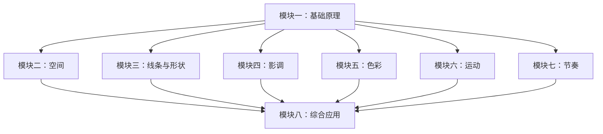

# 课程地图

## 模块一：基础原理

| 课号 | 标题 | 核心概念 |
|---|---|---|
| [[0001-seven-basic-visual-components|第01课]] | 七种基本视觉组件 | 空间、线条、形状、影调、色彩、运动、节奏 |
| [[0002-contrast-and-affinity|第02课]] | 对比与亲和原则 | 对比=高强度，亲和=低强度 |

## 模块二：空间

| 课号 | 标题 | 核心概念 |
|---|---|---|
| [[0003-space-part-one-depth-cues|第03课]] | 空间（一）：深度线索 | 收敛、纹理变化、纵深等深度线索 |
| [[0004-space-part-two-frame|第04课]] | 空间（二）：画面结构与构图 | 宽高比、封闭/开放空间 |

## 模块三：线条与形状

| 课号 | 标题 | 核心概念 |
|---|---|---|
| [[0005-line-ways-of-seeing|第05课]] | 线条：观察方式与母题 | 七种看线方式、线性母题 |
| [[0006-shape-basics|第06课]] | 形状：基础形态与情绪 | 圆形/方形/三角形、3D基础形态 |

## 模块四：影调

| 课号 | 标题 | 核心概念 |
|---|---|---|
| [[0007-tone-control|第07课]] | 影调：控制与叙事 | 三种控制方法、巧合与非巧合 |

## 模块五：色彩

| 课号 | 标题 | 核心概念 |
|---|---|---|
| [[0008-color-systems|第08课]] | 色彩系统与属性 | 加色/减色系统、色相/明度/饱和度 |
| [[0009-color-schemes|第09课]] | 色彩方案与交互 | 配色方案、色彩交互效应 |

## 模块六：运动

| 课号 | 标题 | 核心概念 |
|---|---|---|
| [[0010-movement|第10课]] | 运动：类型与连续体 | 四种运动类型、运动连续体 |

## 模块七：节奏

| 课号 | 标题 | 核心概念 |
|---|---|---|
| [[0011-rhythm|第11课]] | 节奏：视觉韵律 | 静态/动态/剪辑节奏 |

## 模块八：综合应用

| 课号 | 标题 | 核心概念 |
|---|---|---|
| [[0012-story-and-visual-structures|第12课]] | 故事与视觉结构 | 视觉结构如何服务叙事 |

## 参考资料

- [[reference/visual-components-cheatsheet|视觉组件速查表]]
- [[reference/color-systems-reference|色彩系统参考]]
- [[reference/glossary|术语表]]