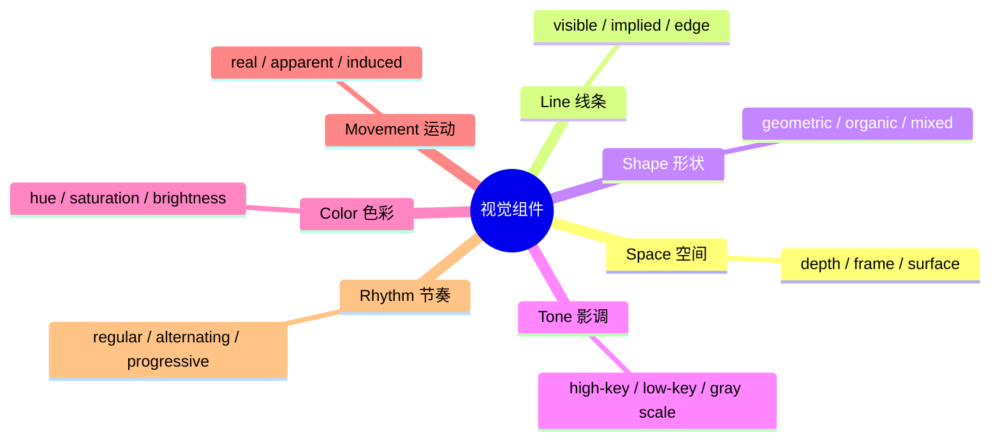

# 第01课：七种基本视觉组件

## Learning Objectives

- 识别并描述电影和影像中的七种基本视觉组件（Space, Line, Shape, Tone, Color, Movement, Rhythm）
- 理解真实世界与屏幕世界的本质区别，以及画面平面（Picture Plane）的核心概念
- 认识视觉组件失控时如何与故事意图产生矛盾

## 影像沟通的三种渠道

电影和视频的沟通依赖三种并行的信息渠道：

1. **故事（Story）**——剧本、叙事、人物弧光
2. **声音（Sound）**——对白、音效、音乐
3. **视觉（Visuals）**——屏幕上的一切画面元素

大多数人将注意力集中在故事和声音上，而视觉层面常常被忽视。但事实上，**视觉组件无时无刻不在向观众传递信息**——无论创作者是否有意控制它们。

> [!WARNING] 未控制的视觉组件
> 当你没有刻意设计视觉组件时，它们依然在传递信息——只是可能传递了与你故事意图**相反**的信息。这是初学者最容易忽略的陷阱。例如，一个本该紧张的场景如果使用了高度亲和的色彩和平缓的运动，观众会感到"不对劲"，即使他们说不清原因。

## 七种基本视觉组件

《The Visual Story》作者 Bruce Block 将视觉元素归纳为七种基本组件：

### 1. 空间（Space）

空间是最复杂、最具表现力的视觉组件。它不仅仅指场景的物理深度，还包括画面框架结构、物体之间的相对位置。空间将在第03课与第04课中深入探讨。

### 2. 线条（Line）

线条可以是**显性**的（实际的轮廓线）或**隐性**的（视线方向、运动轨迹）。线条引导观众的眼睛在画面中移动。希区柯克（Hitchcock）在《迷魂记》（*Vertigo*）中大量使用螺旋线条，暗示主角眩晕的心理状态。

### 3. 形状（Shape）

形状分为**几何形**（方形、圆形、三角形）和**有机形**（自然的、不规则形）。不同形状携带不同的情绪：尖锐的三角形暗示冲突，圆形暗示安全与完整。

### 4. 影调（Tone）

影调指画面从黑到白的亮度范围，即**灰度阶（Gray Scale）**。高调（high-key）画面明亮轻快，低调（low-key）画面阴暗沉重。科波拉（Coppola）在《教父》（*The Godfather*）中使用深沉的低调影调，塑造了黑帮世界的压抑与权威。

### 5. 色彩（Color）

色彩包含三个维度：**色相（Hue）**、**饱和度（Saturation）** 和 **明度（Brightness）**。色彩可以直接作用于情绪——红色传达危险或激情，蓝色传达冷寂或忧郁。

### 6. 运动（Movement）

运动分为三种：
- **真实运动（Real Movement）**——物体本身在动
- **表观运动（Apparent Movement）**——摄影机运动带来的变化（如横摇、推拉）
- **诱导运动（Induced Movement）**——因参照系变化而产生的主观动感

马丁·斯科塞斯（Martin Scorsese）在《好家伙》（*Goodfellas*）中著名的柯帕卡巴纳长镜头，通过摄影机运动（表观运动）将观众带入主角的兴奋与权力感之中。

### 7. 节奏（Rhythm）

节奏是视觉元素在时间上的重复模式，可以是规则的、交替的或渐进的。剪辑的节奏直接影响观众的生理反应——快节奏引发紧张，慢节奏引发沉思。

> [!EXAMPLE] 经典案例：空间的失控
> 想象一部恐怖片中主角走入黑暗走廊的段落：故事意图是制造紧张和恐惧，但如果画面使用了极深的景深（deep space）、亮调（high-key）、水平的静态构图——这些视觉组件传递的是安全、开放和平静，与恐怖意图**直接冲突**。优秀的恐怖片导演会刻意限制深度线索、使用低调影调和失衡的构图来让视觉与故事同步。

## 真实世界 vs 屏幕世界

理解视觉组件的第一步，是区分**真实世界**与**屏幕世界**：

| 真实世界 | 屏幕世界 |
|---------|---------|
| 三维立体 | 二维平面 |
| 无画框限制 | 有固定画框 |
| 多感官体验 | 仅视觉+听觉 |
| 无限视野 | 有限画面 |

屏幕是一个**画面平面（Picture Plane）**——所有三维现实都被压缩到了这个二维平面上。观众看到的并不是"真实的深度"，而是**深度幻觉**。这种压缩本身就为创作者提供了操控空间的可能性。

## 前景 / 中景 / 背景

画面平面上的空间被区分为三个基本层次：

- **前景（Foreground, FG）**——离镜头最近的区域，常用于遮挡或创造深度感
- **中景（Middleground, MG）**——主要动作发生的区域
- **背景（Background, BG）**——最远的区域，提供环境和语境

奥逊·威尔斯（Orson Welles）在《公民凯恩》（*Citizen Kane*）中大量使用前景元素（如巨大的壁炉框）来强化画面的深度和人物之间的隔离感。

> [!TIP] 视觉递进
> 视觉元素遵循从简单到复杂的递进关系：
> **点（Point）→ 线（Line）→ 面（Plane）→ 体（Volume）**
> 一个点是位置，移动的点变成线，线的扩展变成面，面的堆叠变成体。这种递进关系在动画和动态设计中尤为有用——你可以从最简单的视觉单元开始构建复杂的画面。

## 视觉刻板印象及其局限

电影制作中存在许多"视觉刻板印象"——人们直觉上认为某些视觉选择一定对应某种情绪。例如：

- 红色 = 危险
- 蓝色 = 忧郁
- 慢动作 = 悲伤

但 Bruce Block 强调：**视觉组件本身没有固定含义**。同样的红色可以代表爱情、愤怒或警告，这取决于它与其他组件的整体关系和上下文。刻板印象限制了创作者的表达空间，真正的力量来自于对七种组件的系统控制。

## 视觉组件的整体性

七种视觉组件从不独立工作。它们共同构成一个**视觉系统**，彼此之间相互作用。一个镜头中可能空间深邃、影调低沉、色彩饱和、运动缓慢——这些组件的组合效果远大于各自的总和。

当所有组件的方向一致时，视觉表达的力量是最强的。当组件之间互相矛盾时，观众会产生微妙的不适感。

## 推荐观看

- 《迷魂记》（*Vertigo*, 1958）——希区柯克——线条与空间的心理学运用
- 《教父》（*The Godfather*, 1972）——科波拉——影调与色彩控制
- 《好家伙》（*Goodfellas*, 1990）——斯科塞斯——运动与节奏的典范
- 《公民凯恩》（*Citizen Kane*, 1941）——奥逊·威尔斯——深焦摄影与空间叙事
- 《寄生虫》（*Parasite*, 2019）——奉俊昊——空间的阶级隐喻

## Practice

> [!QUESTION] 自检：识别视觉组件
> 回想你看过的任意一部电影中的一个难忘镜头。列出该镜头中七种视觉组件各自的状态（如：空间深还是浅？影调亮还是暗？运动快还是慢？）。然后思考：这些组件的组合是否与故事情绪一致？如果不一致，产生了什么效果？

参考思路

以《教父》开场镜头为例：
- **空间**：深邃（殡仪馆的纵深走廊）
- **线条**：大量垂直线条（人物站立）与水平线条（棺材）
- **形状**：有机形（人物）与几何形（房间框架）
- **影调**：低调，大量阴影
- **色彩**：暖褐色调，低饱和度
- **运动**：极慢——几乎没有运动
- **节奏**：缓慢、庄重

这套视觉组件组合传递了沉重、权威、肃穆的情绪，与黑帮世界中"尊重与死亡"的主题完全一致。如果该场景换成明亮的高调、饱和的色彩和快速运动，即使对白相同，观众感受到的也将截然不同。

## 下一步

在继续学习之前，完成以上自检练习。第02课将介绍对比与亲和原则——这是控制所有七种视觉组件的核心工具。参见 [[0002-contrast-and-affinity|第02课：对比与亲和原则]]。后续还将深入学习最具复杂性的组件：[[0003-space-part-one-depth-cues|空间（一）]] 和 [[0004-space-part-two-frame|空间（一）]]。