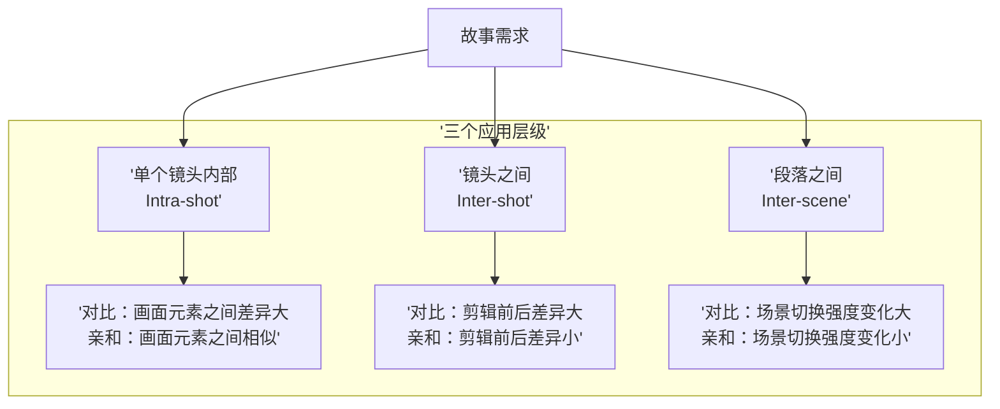
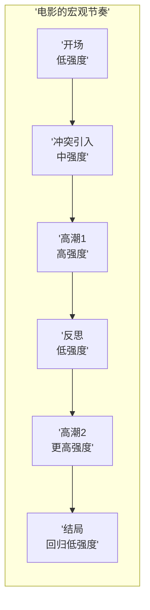

# 第02课：对比与亲和原则

## Learning Objectives

- 理解对比（Contrast）与亲和（Affinity）的定义及其关系
- 掌握视觉强度的判定标准：对比越大强度越大，亲和越大强度越小
- 能够将对比/亲和原则应用于单个镜头、镜头之间和段落之间的分析

## 核心概念

**对比（Contrast）** 指的是视觉组件之间的**差异**，**亲和（Affinity）** 指的是视觉组件之间的**相似**。

这是一个极其简单却极其强大的原则。Bruce Block 将其作为整本《The Visual Story》的理论基石——它可以在所有七种视觉组件上独立或组合地发挥作用。

> [!TIP] Key Insight
> 对比与亲和是一条**连续的光谱**，而非非黑即白的二元对立。两个镜头之间、或一个镜头内部的元素之间，可以在"完全一致"到"完全对立"之间的任何位置。

## 灰度阶：理解对比的可视化工具

灰度阶（Gray Scale）是理解对比与亲和的最佳入门工具。想象一条从纯黑（0%）到纯白（100%）的梯级：

```
0%  10%  20%  30%  40%  50%  60%  70%  80%  90%  100%
黑 ─────────────────────────────────────────────── 白
```

当画面中的两个区域在灰度阶上相距很远时（如20%与80%），它们之间存在**强对比**。当两个区域在灰度阶上靠近时（如40%与50%），它们之间存在**亲和**。

灰度阶的原理可以映射到所有其他视觉组件上——只不过其他组件需要不同的"刻度"。

## 视觉强度：过山车 vs 睡觉的猫

**视觉强度（Visual Intensity）** 是画面在观众眼中产生的"刺激程度"。对比越大，视觉强度越高；亲和越大，视觉强度越低。

| 场景 | 对比程度 | 视觉强度 |
|------|---------|---------|
| 过山车 | 极高（剧烈的运动、色彩、空间变化） | 极高 |
| 睡觉的猫 | 极低（稳定的影调、微弱的运动） | 极低 |

> [!WARNING] 强度≠质量
> 高视觉强度不等于"更好"，低视觉强度不等于"更差"。关键是在**正确的时刻使用正确的强度**。一部两小时的电影如果全程高强度，观众会筋疲力尽；全程低强度，观众会昏昏欲睡。优秀的电影在强度上有节奏地起伏。

## 对比与亲和的应用层级

C&A 原则可以应用于三个层级：



### 层级一：单个镜头内部

在一个镜头内，各视觉组件元素之间的对比/亲和关系决定了该镜头的"内在强度"。例如：

- **高对比镜头**：画面中同时包含极亮和极暗的区域（强烈影调对比）、物体大小从大到小急速变化（强烈空间对比）
- **高亲和镜头**：画面中所有物体亮度接近、色彩统一、运动均匀

### 层级二：镜头之间

剪辑点前后两个镜头的对比/亲和关系决定了"剪辑强度"：

- **高对比剪辑**：从安静的室内跳到喧闹的街头（声音 + 空间 + 运动的复合对比）
- **高亲和剪辑**：连续两个构图相似、影调一致的镜头（观众几乎感受不到剪辑）

斯坦利·库布里克（Stanley Kubrick）在《2001太空漫游》（*2001: A Space Odyssey*）中著名的"骨头到太空飞船"匹配剪辑——虽然跨越了数百万年的时间，但两个物体的**形状亲和**（都是长条形）让这个跳跃在视觉上流畅自然。

### 层级三：段落之间

整个段落（sequence）之间的对比与亲和决定了电影的宏观节奏：

- 紧张段落（高强度）→ 平静段落（低强度）→ 追逐段落（高强度）→ 悲伤段落（低强度）

这种宏观的对比与亲和交替，构成了电影的**节奏骨架**。



> [!EXAMPLE] 《阿拉伯的劳伦斯》中的对比运用
> 大卫·里恩（David Lean）的《阿拉伯的劳伦斯》（*Lawrence of Arabia*, 1962）是空间对比的教科书级案例。导演频繁在**浩瀚无垠的沙漠全景**（极深空间）和**人物脸部的极端特写**（极浅空间）之间切换。这种空间对比的剧烈变化创造了令人窒息的视觉强度，完美呼应了主角在宏大历史与个人命运之间的撕裂感。

## 复合对比

当**多个视觉组件同时呈现出对比关系**时，产生的视觉强度是指数级的，而非简单的加法。例如：

一个场景中同时出现：
- **空间对比**：深空间 → 浅空间
- **影调对比**：亮调 → 暗调
- **运动对比**：静止 → 快速运动
- **色彩对比**：冷色 → 暖色

这种多组合同步变化的场景，视觉强度将达到峰值。典型的例子是动作片中的追逐段落——空间、运动、节奏、影调全部同时变化。

> [!WARNING] 复合对比的滥用
> 许多商业大片陷入"全程高强度"的陷阱，让所有组件持续处于高对比状态。这反而使观众麻木——当一切都很"强烈"时，就没有真正强烈的时刻了。**对比需要低强度来做铺垫**，就像交响乐需要轻柔的段落来凸显强音的震撼。

## 对比/亲和与故事叙事的关系

对比与亲和的选择不能脱离故事需求。每种故事节奏都有其对应的视觉策略：

| 故事需求 | 推荐的视觉策略 |
|---------|--------------|
| 紧张、混乱 | 高对比（空间、影调、运动） |
| 平静、和谐 | 高亲和（色彩统一、运动平缓） |
| 重要转折点 | 在关键组件上制造突然对比 |
| 角色亲密时刻 | 亲和的空间、影调、色彩 |

> [!TIP] 平行剪辑中的对比
> 在平行剪辑（cross-cutting）中，对比的应用尤其重要。诺兰（Christopher Nolan）在《盗梦空间》（*Inception*, 2010）中同时推进四层梦境，每层梦境在色彩、影调、运动节奏上都有系统性的差异——观众即使在快速切换中也能凭视觉直觉判断当前所处的"层次"。

## 推荐观看

- 《2001太空漫游》（*2001: A Space Odyssey*, 1968）——库布里克——匹配剪辑中的形状亲和
- 《阿拉伯的劳伦斯》（*Lawrence of Arabia*, 1962）——大卫·里恩——空间对比的典范
- 《盗梦空间》（*Inception*, 2010）——诺兰——多层叙事的视觉区分
- 《疯狂的麦克斯：狂暴之路》（*Mad Max: Fury Road*, 2015）——乔治·米勒——持续高强度节奏中的对比设计
- 《月光男孩》（*Moonlight*, 2016）——巴里·詹金斯——段落间的对比与亲和控制

## Practice

> [!QUESTION] 自检：分析一个段落的C&A
> 选择一部电影中你印象深刻的3-5分钟段落。逐镜头或逐场景分析以下问题：
> 1. 每个镜头的内部对比/亲和程度如何？
> 2. 镜头之间的对比/亲和程度如何？
> 3. 整体段落的视觉强度曲线是怎样的？是平坦的、上升的还是波浪形的？
> 4. 这种视觉强度曲线是否符合段落的叙事意图？

<details>
<summary>参考思路</summary>

以《疯狂的麦克斯：狂暴之路》开场段落为例：
- **镜头内部**：极高的空间对比（广阔荒漠 vs 车内特写）、极高的影调对比（烈日高光 vs 车身阴影）、极高的运动对比（飞驰的车 vs 静止的远景）
- **镜头之间**：剪辑速度极快（短镜头），大量运动方向的突变，形成强烈的对比剪辑
- **视觉强度曲线**：从开场就推向极高强度，并在整个段落中持续维持在高位
- **与叙事的关系**：符合——电影营造的是一个"没有喘息空间"的疯狂世界。但也请注意，导演在进入较安静的人物对话时会有意降低某些组件的对比（如运动变慢、色彩趋于统一），让观众得到短暂的"休息"。
</details>

## 下一步

完成以上自检练习。将对比与亲和原则牢记于心——它是理解后续所有课程的基础框架。从第03课 [[0003-space-part-one-depth-cues|空间（一）：深度线索]] 开始，我们将运用这个框架来分析具体的视觉组件。