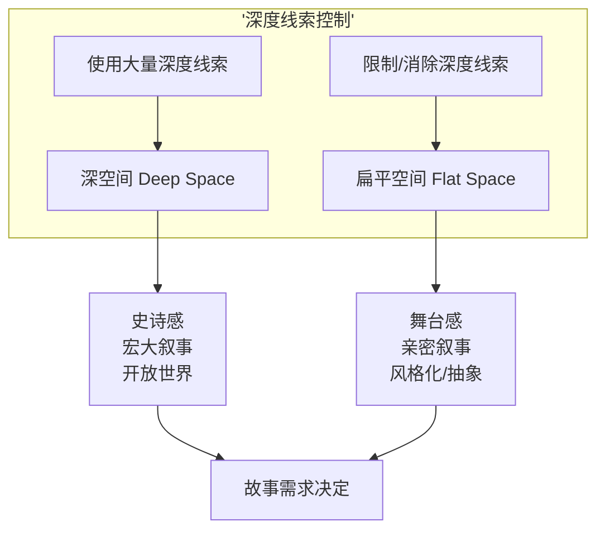

# 第03课：空间（一）：深度线索

## Learning Objectives

- 理解深度线索（Depth Cues）的概念及其在二维表面创造三维幻觉的机制
- 掌握收敛（Convergence）作为最重要深度线索的原理，包括一点与两点收敛
- 识别并运用至少十种不同的深度线索，能够在观看电影时有意识地分析它们

## 空间的复杂性

在七种视觉组件中，**空间（Space）** 是最复杂、最多维度的。它不仅仅关乎"物体在哪里"，还关乎画面如何引导观众感知深度、距离和体积。空间可以分为两个大的研究方向：

1. **深度线索（Depth Cues）**——在二维平面上创造三维深度的幻觉（本课内容）
2. **画面框架（Frame）**——屏幕画框对空间感知的影响（见 [[0004-space-part-two-frame|第04课：空间（二）]]）

> [!WARNING] Deep Space ≠ 好的空间
> "深空间"（deep space）本身并无好坏之分。关键在于：空间的深度是否**服务于故事的需求**。一个亲密的二人对话场景使用极深的空间可能会分散观众注意力；而一个史诗般的沙漠远征场景如果使用扁平空间则会丧失宏伟感。

## 最重要的深度线索：收敛（Convergence）

**收敛（Convergence）** 是最强有力的深度线索。它指的是画面中的平行线在远处汇聚于一点的现象。

### 一点收敛（One-Point Convergence）

当所有平行线汇聚于画面中的一个**消失点（Vanishing Point）** 时，称为一点收敛。消失点的位置决定了观众的"注视中心"。

- 消失点在画面中心→ 对称、稳定、古典
- 消失点在画面一侧→ 不对称、紧张、动态

斯坦利·库布里克在《闪灵》（*The Shining*, 1980）中大量使用一点收敛——酒店的走廊、迷宫般的过道，所有的线条都汇聚到远方，创造了一种"无处可逃"的压迫感。

### 两点收敛（Two-Point Convergence）

当画面中有两个消失点（通常分布在画面左右两侧）时，称为两点收敛。这种方式创造了更复杂的空间关系，常用于表现物体的体积感和建筑的立体性。

```mermaid
flowchart LR
    subgraph '一点收敛'
        A['左平行线'] --> C['消失点<br/>(画面中心或偏移)']
        B['右平行线'] --> C
    end
    subgraph '两点收敛'
        D['左消失点'] --- E['物体'] --- F['右消失点']
    end
```

> [!TIP] 收敛的对比控制
> 你可以通过收敛的**有/无**和**强/弱**来控制空间的视觉强度：
> - 强烈、明显的收敛 → 深空间感 → 更高视觉强度
> - 弱化或消除收敛 → 扁平空间感 → 更低视觉强度
> 在同一个段落中切换收敛状态会产生空间对比，这种对比可用于强调故事关键节点。

## 其他深度线索

除了收敛，还有十多种深度线索可供创作者使用。下面是它们的分组和说明：

### 基于物体属性的线索

| 深度线索 | 描述 | 电影运用 |
|---------|------|---------|
| **大小变化（Size Change）** | 近大远小 | 前景物体巨大与背景物体渺小形成对比 |
| **形状变化（Shape Change）** | 透视造成的形状扭曲 | 倾斜的物体暗示空间深度 |
| **纹理扩散（Textural Diffusion）** | 近处纹理清晰，远处模糊 | 粗糙前景 vs 模糊背景 |
| **色彩分离（Color Separation）** | 远处偏蓝灰，近处色彩饱和 | 大气透视的色彩版本 |
| **影调分离（Tonal Separation）** | 近处暗/亮对比分明，远处对比减弱 | 利用灰度阶的层次区分前后 |

### 基于运动的线索

| 深度线索 | 描述 |
|---------|------|
| **物体运动（Object Movement）** | 物体在画面中的运动方向和速度随深度变化 |
| **相对运动（Relative Movement）** | 视差效应——近处物体移动快，远处移动慢 |
| **摄影机运动（Camera Movement）** | 摄影机移动本身提供深度信息（推轨、升降） |

### 基于大气和位置的线索

| 深度线索 | 描述 |
|---------|------|
| **大气扩散（Aerial Diffusion）** | 远处物体因大气介质变模糊、变蓝 |
| **上下位置（Up/Down Position）** | 画面中偏上的物体通常被视为更远 |
| **重叠（Overlap）** | 一个物体部分遮挡另一个——最基础的深度线索 |
| **焦点（Focus）** | 焦点清晰处 = 重要区域；虚化处 = 远处或次要区域 |

> [!EXAMPLE] 深焦摄影的极致：奥逊·威尔斯
> 奥逊·威尔斯（Orson Welles）和摄影师 Gregg Toland 在《公民凯恩》（*Citizen Kane*, 1941）中发展出**深焦摄影（Deep Focus）**——前景、中景、背景全部保持清晰焦点。这使得观众可以自由选择注视区域，也让导演能在同一画面中安排多层叙事信息。例如，凯恩在背景签署文件，前景是苏珊在弹钢琴——一个镜头讲两个故事。

## 深空间 vs 扁平空间

**深空间（Deep Space）** 使用大量深度线索，让画面看起来有强烈的纵深感和体积感。**扁平空间（Flat Space）** 则限制或消除深度线索，让画面看起来接近二维平面。

| 维度 | 深空间 | 扁平空间 |
|------|--------|---------|
| 收敛 | 强烈、明显 | 弱化或消除 |
| 重叠 | 多层重叠 | 尽量少重叠 |
| 焦点 | 深焦（全部清晰）或分层 | 单一平面清晰 |
| 大小变化 | 明显的近大远小 | 大小均匀 |
| 运动 | 包含视差运动 | 避免视差，平面移动 |
| 色彩 | 有明显的前后色彩分离 | 色彩在平面上均匀 |

韦斯·安德森（Wes Anderson）以其标志性的**扁平空间**风格闻名——他经常使用正面拍摄、避免收敛、将角色安排在同一个焦平面上，创造出舞台般的二维画面感。这种扁平空间与他的对称构图和冷幽默叙事风格完美统一。



## 空间的对比与亲和

将第02课的对比与亲和原则应用于空间：

- **空间对比**：从深空间切换到扁平空间（或反之），创造视觉强度峰值
- **空间亲和**：连续使用相同深度程度的镜头，创造视觉上的连续性和舒适感

奉俊昊在《寄生虫》（*Parasite*, 2019）中精妙地运用了空间的对比——穷人家是狭窄、拥挤的扁平空间（墙壁近、层次少），富人家是宽敞、通透的深空间（大窗户、纵深走廊）。当角色在两个空间之间移动时，观众直观地感受到阶级的差异，而无需通过对白说明。

> [!TIP] 三维（3D）作为深度线索
> 立体电影（3D电影）本质上增加了一条额外的深度线索——**双眼视差（Binocular Disparity）**。理论上3D能创造更强的空间沉浸感，但 Bruce Block 指出：3D并不能替代传统的深度线索。如果画面本身缺乏收敛、重叠、大小变化等深度线索，即使加上3D效果，空间仍然可能显得扁平。深空间首先需要在二维层面上被构建起来。

## 推荐观看

- 《公民凯恩》（*Citizen Kane*, 1941）——奥逊·威尔斯——深焦与多层空间
- 《闪灵》（*The Shining*, 1980）——库布里克——一点收敛的压迫感
- 《布达佩斯大饭店》（*The Grand Budapest Hotel*, 2014）——韦斯·安德森——扁平空间风格
- 《寄生虫》（*Parasite*, 2019）——奉俊昊——空间作为阶级隐喻
- 《地心引力》（*Gravity*, 2013）——阿方索·卡隆——太空中的深度线索操控

## Practice

> [!QUESTION] 自检：识别深度线索
> 找一部提供"幕后花絮"或"制作特辑"的电影，或者直接在 Netflix/流媒体上暂停一个画面。回答以下问题：
> 1. 该画面中使用了哪些深度线索？列出4-5条。
> 2. 其中最主导的深度线索是什么？
> 3. 如果去掉这个主导线索（想象它不存在），画面会变得多扁平？
> 4. 这个空间深度是否符合镜头想要传达的情绪？

<details>
<summary>参考思路</summary>

以《布达佩斯大饭店》中的经典对称镜头为例：
1. **深度线索**：重叠（人物在建筑前）、上下位置（远处的山在画面上方）、少量的大小变化、微弱的大气扩散
2. **主导线索**：实际上是**缺乏收敛**——安德森刻意避免使用线性透视，让所有建筑正面平行于画面
3. **去掉主导线索的效果**：该场景本身已经高度扁平。如果强行加入一个消失点，反而会"破坏"安德森独特的视觉风格
4. **是否合叙事**：完全一致。扁平空间 + 对称构图 = 童话感 + 舞台感 + 秩序感，完美服务于电影"关于讲故事的故事"这一元叙事主题。
</details>

## 下一步

完成以上自检练习。本课覆盖了深度线索——空间的"Z轴"维度。在 [[0004-space-part-two-frame|第04课：空间（二）]] 中，我们将转向空间的"XY轴"维度——屏幕画框的结构、宽高比和封闭/开放空间。两课结合，你将获得对空间组件的完整理解。