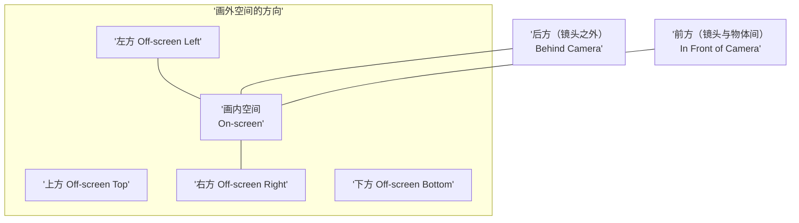

# 第04课：空间（二）：画面结构与构图

## Learning Objectives

- 理解屏幕画框（Frame）对空间感知的根本影响，以及不同宽高比（Aspect Ratio）的情绪特性
- 区分封闭空间（Closed Space）与开放空间（Open Space），以及画内/画外空间的使用策略
- 掌握空间惯例（饱和、扁平、深邃、空旷）及其叙事功能

## 屏幕画框：视觉的边界

在 [[0003-space-part-one-depth-cues|第03课：空间（一）]] 中，我们讨论的是空间如何在**Z轴**（深度方向）上展开。本课将聚焦于空间的**XY轴**——即**画面平面（Picture Plane）** 本身的结构。

**屏幕画框（Frame）** 是所有视觉表达的根本约束——观众只能在画框内看到世界。画框之外的东西，只能通过暗示、声音或角色视线来传达。

> [!TIP] 画框是隐性角色
> Bruce Block 认为，画框是视觉叙事中一个"隐形但永远在场"的角色。它决定了观众**能看到什么**和**不能看到什么**。导演对画框的控制等同于对观众注意力的控制。

## 宽高比（Aspect Ratio）

宽高比是画框宽度与高度的比例关系。不同的宽高比带来截然不同的情绪体验。

| 宽高比 | 名称/常见用途 | 视觉感受 |
|--------|-------------|---------|
| **1.33:1（4:3）** | Academy 标准 / 早期电影 / 电视 | 方形，均衡，适合单人近景和对话 |
| **1.85:1** | 标准宽银幕（美式） | 平实、自然的宽幅，适合大多数叙事 |
| **2.35:1（或2.39:1）** | 变形宽银幕（CinemaScope） | 极宽，史诗感，适合广阔景观和群像 |
| **16:9** | HDTV / 流媒体标准 | 现代标准，兼顾电影感和电视便利 |

### 宽高比的情绪影响

- **更窄的比例（如1.33:1）**：纵向感更强，适合表现人物面部、限制感、亲密感。常用于电视剧和复古风格。帕布罗·拉雷恩（Pablo Larrain）在《斯宾塞》（*Spencer*, 2021）中使用1.33:1来营造戴安娜王妃被困于王室规矩的压抑感。
- **更宽的比例（如2.35:1）**：横向感更强，适合表现广阔景观、群体动态和史诗叙事。但其缺点是近景和对话场景中两侧会留下大量"空白"，需要精心安排构图。大卫·里恩（David Lean）的史诗片都采用此比例。

> [!WARNING] 宽高比的选择是叙事决定
> 许多年轻创作者选择宽高比仅仅因为"看起来更电影化"。但宽高比应该由**故事的情感需求**决定。一个关于幽闭恐惧症的故事用2.35:1就与主题矛盾——极宽的画框天然暗示着广阔和自由。

## 封闭空间 vs 开放空间

这是空间策略中最核心的一对概念。

### 封闭空间（Closed Space）

封闭空间的特点是：**画面中的内容被精心安排，看起来完全被画框"包含"**。角色通常被框在画面内部，视线不看向画框外，构图完整、自足。

- 视觉感受：稳定、受控、安全（或囚禁，取决于上下文）
- 代表人物：韦斯·安德森（对称、盒子般的构图）
- 叙事功能：封闭的空间让观众感觉一切尽在掌握——常用于喜剧、古典叙事

### 开放空间（Open Space）

开放空间的特点是：**画面看起来只是更大空间的一小部分**。角色的视线或动作指向画框外部，暗示画外世界持续存在。

- 视觉感受：扩展、不安、不可预测
- 代表人物：米开朗基罗·弗兰马汀（*Michelangelo Frammartino*，常在画框边缘安排动作）
- 叙事功能：开放的空间让观众意识到更大的世界——常用于悬疑、恐怖、现实主义

> [!EXAMPLE] 封闭与开放的切换
> 希区柯克的《惊魂记》（*Psycho*, 1960）中的私家侦探谋杀场景：镜头一开始是相对封闭的构图，侦探走上楼梯。当凶手突然从画框外冲入（开放空间攻击），观众被这种"空间的突然入侵"震撼——凶手来自于画框之外，来自于观众"看不到"的地方。如果画框始终是封闭的，这种惊吓效果将大打折扣。

## 画内空间 vs 画外空间

| 概念 | 定义 | 叙事功能 |
|------|------|---------|
| **画内空间（On-screen Space）** | 观众能看到的部分 | 直接展示的信息 |
| **画外空间（Off-screen Space）** | 画框之外的六个方向 | 通过暗示创造更大世界 |

画外空间的六个方向：左、右、上、下、后（镜头后方）、前（镜头与物体之间）

恐怖片大师对画外空间的运用炉火纯青——让观众知道"有什么东西在画框外面"，但迟迟不揭示它，这种**空间悬念**比直接展示更加令人紧张。

## 模糊空间（Ambiguous Space）

当创作者有意识地**混淆深度线索**，使观众无法准确判断物体之间的空间关系时，就产生了模糊空间。这是一种高级技巧，常用于：

- **梦境和幻觉场景**——空间逻辑的崩塌
- **角色迷失状态**——观众与角色一同失去方向感
- **抽象或实验性段落**——将注意力引向色彩、形状而非空间关系

达伦·阿伦诺夫斯基（Darren Aronofsky）在《黑天鹅》（*Black Swan*, 2010）中使用倒影和镜子的空间混淆来表现主角精神状态的崩溃——观众无法分辨哪一侧是真实空间，哪一侧是镜像。

> [!TIP] 模糊空间的创造方法
> 创造模糊空间的核心技巧是**移除所有可辨识的深度线索**：
> - 使用长焦镜头压缩空间（消除大小变化和收敛）
> - 均匀的照明（消除影带分离）
> - 没有重叠元素
> - 均匀的纹理（消除纹理扩散）
> - 前景/背景使用相似的色彩和亮度

## 空间的使用惯例

Bruce Block 总结了四种空间使用的"惯例"（conventions），每种惯例对应不同的叙事功能：

### 1. 饱和空间（Saturated Space）
画面被元素**填满**，没有"呼吸空间"。制造拥挤、焦虑、丰富或混乱感。

### 2. 扁平空间（Flat Space）
限制深度线索，强调**画面平面感**。适合风格化、抽象、喜剧或亲密场景。

### 3. 深邃空间（Deep Space）
强调纵深，使用大量深度线索。适合史诗、探索、开放世界的感觉。

### 4. 空旷空间（Empty Space）
画面中有大量**留白**或"没有信息"的区域。制造孤独、寂寥、期待或庄严感。

> [!EXAMPLE] 空间惯例的综合运用
> 雷德利·斯科特（Ridley Scott）的《银翼杀手2049》（*Blade Runner 2049*, 2017）同时使用了所有四种空间惯例：
> - **深邃空间**：洛杉矶城市场景的深远纵
> - **空旷空间**：华莱士办公室的极简空旷大厅
> - **饱和空间**：主角公寓中拥挤的杂务空间
> - **扁平空间**：全息投影的爱人——故意二维化的存在
> 每种空间惯例对应着不同的情感状态和叙事主题，通过空间的切换，观众直观地感受到主角在不同世界之间的穿梭。

## 空间对比与亲和的故事服务

将第02课的原则再次应用于空间：

| 策略 | 效果 | 适用场景 |
|------|------|---------|
| 深度空间 → 扁平空间（对比） | 强烈的空间跳跃感 | 梦境觉醒、现实断裂 |
| 封闭 → 开放（对比） | 从安全到未知的转变 | 恐怖片的"安全区被打破" |
| 持续扁平空间（亲和） | 风格统一、舞台感 | 韦斯·安德森的整部电影 |
| 持续深空间（亲和） | 沉浸感、真实感 | 纪录片风格、现实主义 |
| 饱和 → 空旷（对比） | 社会拥挤 vs 内心孤独 | 角色在人群中感到孤独 |

## 推荐观看

- 《惊魂记》（*Psycho*, 1960）——希区柯克——封闭与开放空间的切换
- 《布达佩斯大饭店》（*The Grand Budapest Hotel*, 2014）——韦斯·安德森——封闭空间与扁平空间
- 《银翼杀手2049》（*Blade Runner 2049*, 2017）——雷德利·斯科特——四种空间惯例的综合
- 《黑天鹅》（*Black Swan*, 2010）——阿伦诺夫斯基——模糊空间的运用
- 《斯宾塞》（*Spencer*, 2021）——帕布罗·拉雷恩——1.33:1的叙事选择
- 《荒野猎人》（*The Revenant*, 2015）——亚历杭德罗·伊纳里图——深空间+开放空间的极致

## Practice

> [!QUESTION] 自检：宽高比分析
> 在流媒体上找三部宽高比不同的电影（1.33:1、1.85:1、2.35:1各一部），各观看开场5分钟。回答：
> 1. 每个宽高比让你在观看时的"身体感受"是什么？（胸部更开阔？还是更专注、更向内？）
> 2. 每个宽高比在构图上有什么独特的挑战或优势？（2.35:1在拍对话时如何处理两侧空间？）
> 3. 如果你可以选择，哪些题材你会用极宽屏？哪些你会用4:3？为什么？

参考思路

从空间策略的角度分析宽高比选择：
- **2.35:1 适合**：公路电影（横向运动）、史诗历史片（广阔战场）、群像戏（多人同时出现在画面中）
- **1.33:1 适合**：人物心理剧（聚焦面部）、封闭环境故事（潜艇、单人太空舱）、复古风格叙事
- **1.85:1 / 16:9 适合**：大多数叙事，在近景和环境之间取得平衡

关键洞察：宽高比的"浪费空间"不是缺点——那些看似"空"的区域可能正是导演留给情绪呼吸的空间。真正重要的是**整个画框内的每个区域都被有目的地使用**。

## 下一步

至此，你已完成了空间组件的完整学习。空间是最复杂的视觉组件，掌握了它就掌握了视觉叙事中一半以上的功力。接下来的课程将转向其他视觉组件——线条、形状、影调、色彩、运动和节奏。在继续前进前，回顾第02课 [[0002-contrast-and-affinity|对比与亲和原则]]，并将C&A框架应用于你周围的一切视觉画面——电影、摄影、绘画甚至窗户外的风景。练习得越多，视觉敏感度提高得越快。