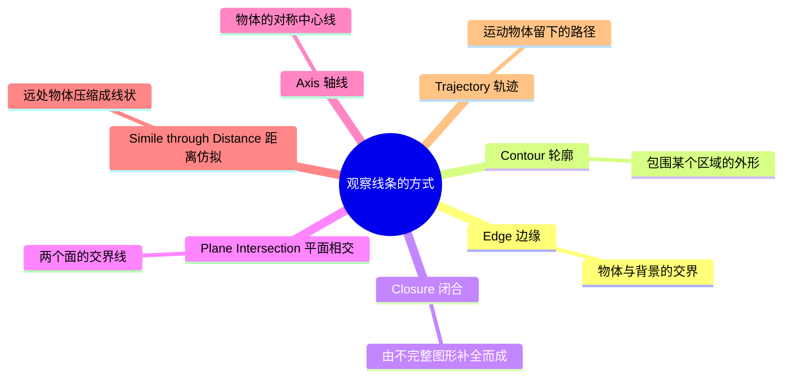

# 第05课：线条：观察方式与母题

## Learning Objectives

- 理解线条作为明度对比产物这一核心本质
- 掌握七种观察线条的方式及其在影像分析中的应用
- 学会通过方向、取向、质量三种维度控制线条的对比与亲和

## 线条：明度对比的产物

在视觉世界中，线条并不是真实存在的物体——它是**明度对比（Value Contrast）** 的产物。当两个不同明度的区域相邻时，我们的大脑会在它们之间"看到"一条线。

> [!TIP] 关键洞见
> 自然界中没有"线条"这种东西。线条只存在于我们的感知中，是视觉系统对明度差异的反应。这意味**线条的存在完全取决于对比**——消除对比，线条就会消失。

这一本质对影像创作者有重大意义：如果你希望画面中出现或消除某条线，你不需要真的去画或擦除它，**只需控制明度对比**即可。

## 七种观察线条的方式

《The Visual Story》提出了观察线条的七种方式，这是分析画面结构的基础工具：

### 1. Edge（边缘）

边缘是两个相邻区域之间的边界。当你看到一张脸贴在黑色背景上时，脸与背景之间的那条分界线就是边缘。边缘是**被动感知**的——它自然存在于明度交界处。

### 2. Contour（轮廓）

轮廓是包围一个完整区域的线条。与边缘不同，轮廓更强调**形状的整体性**——它是我们识别物体外形的依据。剪影（silhouette）就是最纯粹的轮廓表现。

### 3. Closure（闭合）

闭合是人类视觉的独特能力：我们会自动将不完整的图形补全为完整线条。这是一个**心理学完形原则（Gestalt Principle）**。例如，一个缺了四分之一圆仍然会被感知为一个圆形。电影构图中被画框切断的物体，观众会自动将其"补全"。

### 4. Plane Intersection（平面相交）

当两个平面相遇时，它们的交线就构成了一条线。这是三维空间中最常见的线条来源——墙壁与天花板的交界、桌子的边角、建筑的棱线。

### 5. Axis（轴线）

轴线是穿过物体中心的假想线，用来理解物体的方向和平衡。人体的垂直中轴线、车辆的行驶方向线都是轴线。轴线虽然不可见，但观众**通过它可以理解姿态和运动趋势**。

### 6. Simile through Distance（距离仿拟）

当一个三维物体处于足够远的距离时，它看起来会压缩成一条线。远处的电线杆是点，远处的人行道是一条细线，远处的地平线是分界线。利用这一原理，你可以在画面中**创造或消除线条**——只需控制摄影机与物体的距离。

### 7. Trajectory（轨迹）

运动物体留下的路径就是轨迹（trajectory）。当一颗流星划过天空，我们看到的不是流星本身，而是它留下的光轨迹。在电影中，角色的运动路径、镜头的移动方向都会在观众心中留下虚拟的轨迹线。

## 线性母题（Linear Motif）

**线性母题（Linear Motif）** 是指：任何画面都可以被简化为由若干基本线条构成的骨架。这个骨架决定了画面的**视觉结构**和**情绪基调**。

分析一个画面的线性母题，只需问三个问题：
1. 画面中有哪些主要的线条？
2. 这些线条的方向、取向和质量是怎样的？
3. 它们之间是对比关系还是亲和关系？

> [!WARNING] 注意
> 线性母题分析并不是要你找到画面中所有的线条，而是找到**主导性的线条结构**。一张背景杂乱的街拍照片，其线性母题可能只是一个人物剪影的轮廓线。

## 线条的对比与亲和

线条通过三种属性产生对比或亲和：

| 属性 | 对比 | 亲和 | 效果 |
|------|------|------|------|
| **Direction（方向）** | 多种方向并存 | 方向一致 | 对比制造动感与张力，亲和制造统一与平静 |
| **Orientation（取向）** | 水平/垂直/斜向混合 | 同一种取向 | 混合取向增加复杂性，单一取向更简洁 |
| **Quality（质量）** | 直线 vs 曲线 | 同为直线或曲线 | 直线刚硬，曲线柔和 |

### 方向的情绪密码

- **水平线（Horizontal）** —— 视觉上**最弱**的线条。在对抗中，水平线会自然"认输"。它传达平静、安宁、稳定。地平线、平静的海面都是水平线的代表。
- **垂直线（Vertical）** —— 代表**对抗与尊严**。垂直线对抗重力，挺拔直立。人群中站立的一个人、一根旗杆、一座高塔——垂直线传达力量、庄严和抗衡。
- **斜线（Diagonal）** —— 代表**运动和攻击**。斜线的本质是"不平衡"，因此天然蕴含动势。格斗中的刀锋、飞驰的车辆、倾斜的构图——斜线传达速度、危险和冲突。

> [!EXAMPLE] 电影案例
> 在《战舰波将金号》（Battleship Potemkin）的"敖德萨阶梯"段落中，爱森斯坦大量使用斜线构图来表现混乱与暴力——阶梯本身就是巨大的斜线，加上士兵的步枪与倒下的平民，形成强烈的攻击性视觉结构。

### 直线与曲线

- **直线（Straight Line）** —— 传达**直接、刚硬、理性、人为**。建筑物、铁丝网、人行道都是直线构成的。
- **曲线（Curve）** —— 传达**柔和、有机、感性、自然**。人体的线条、河流的蜿蜒、树叶的边缘都是曲线。

如果一个场景中线条质量高度亲和（全是直线或全是曲线），画面就会显得风格统一；如果对比强烈（直线与曲线混合），则会产生视觉张力。

## 制作中的线条控制方法

在实际拍摄或制作中，控制线条的手段主要有：

1. **眯眼观察（Squinting）** —— 眯起眼睛可以模糊细节，让你只看到明度和线条结构。这是导演和摄影师最常见的视觉分析技巧。
2. **布光（Lighting）** —— 通过调整光源方向、强度和面积，控制物体与背景的明度对比，从而创造或消除线条。
3. **调度（Staging）** —— 通过调整摄影机位置、拍摄角度和被摄物体的排列，改变画面中线条的分布和方向。

> [!TIP] 实践技巧
> 当你拿到一个场景的剧本时，先眯起眼睛看场景草稿，找出其中主要的明度对比区域。那些对比最强的边界就是你需要关注的线条。然后问自己：这些线条的方向与质量是否符合这场戏的情绪需求？

## 自检练习

> [!QUESTION] 自检问题
> 请分析以下情况：你正在拍摄一场两个人平静对话的室内戏。两人坐在沙发上，背景是垂直的窗帘和水平的书架。请你判断：
> 1. 这个场景的线性母题以什么方向为主导？
> 2. 你应该如何利用线条的对比与亲和来增强"平静"的情绪？
> 3. 如果想在对话中制造紧张感，可以通过什么方式改变线条结构？

查看答案

1. 水平线为主导（沙发上的两人处于水平姿态），书架的水平层板也强化了这一方向。水平线本身传达平静与稳定。
2. 为了增强平静感，应保持线条的亲和：让主要线条保持水平或垂直（而非斜线），控制光线避免产生破坏性的斜向阴影；曲线（如圆形的靠垫、柔和的台灯轮廓）可以增加柔和感。
3. 要制造紧张感，可以引入斜线：调整灯光产生斜向阴影、让一位演员站起来（创造垂直线与水平线对比）、或者稍微倾斜摄影机（荷兰角）使整个画面的取向变得不稳定。斜线的引入会打破水平线的平静，产生冲突的视觉暗示。

## 推荐观看的影片

- 《战舰波将金号》（Battleship Potemkin, 1925）—— 谢尔盖·爱森斯坦的蒙太奇与线条运用杰作
- 《第七封印》（The Seventh Seal, 1957）—— 英格玛·伯格曼对水平线（死亡）与垂直线（生命）的极致对比
- 《黑暗骑士》（The Dark Knight, 2008）—— 大量使用垂直线（摩天大楼）与斜线（蝙蝠侠的轨迹）塑造哥谭市

## 下一步：进入形状的世界

线条是视觉结构的基础，而线条的**闭合**就形成了[[0006-shape-basics|第06课：形状]]。在下一课中，我们将探讨三种基础形状的情绪力量、它们的视觉强度排序，以及如何通过剪影快速识别形状结构。继续学习之前，请完成上述自检练习。
