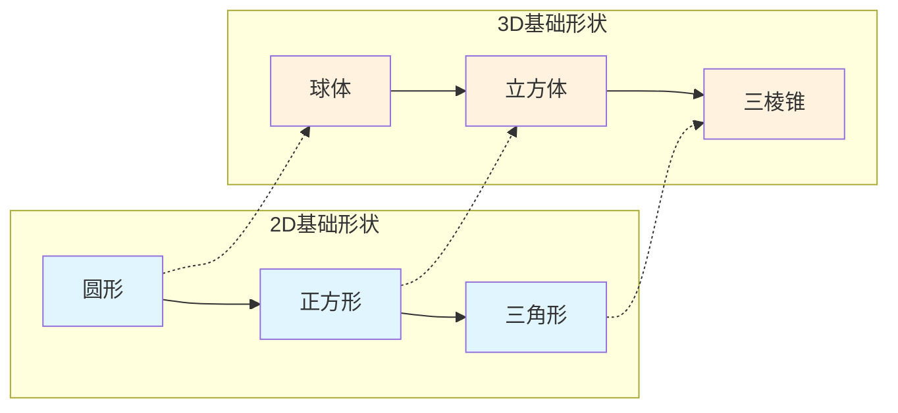

# 第06课：形状：基础形态与情绪

## Learning Objectives

- 掌握三种基础形状（圆形、正方形、三角形）及其对应的三维形态
- 理解形状的视觉强度层级与情绪关联，能对应到电影实例
- 学会通过剪影快速识别画面中的主导形状，并运用对比与亲和法则

## 由线条到形状

上一课我们学习了线条，而**形状（Shape）** 就是线条的闭合结果。当一组线条首尾相连、包围出一个封闭区域时，它就构成了一个形状。

> [!TIP] 关键洞见
> 形状是对线条的进一步抽象。如果说线性母题是画面的"骨架"，那么形状就是"血肉"——它是观众在视觉上最先识别和记忆的要素。**观众在看清细节之前，先看到形状。**

## 三种基础形状

《The Visual Story》提出，所有复杂的视觉形态都可以拆解为三种**基础形状**：

### 2D 基础形状

| 形状 | 名称 | 视觉强度 |
|------|------|----------|
| 圆形 | Circle | 弱 |
| 正方形 | Square | 中 |
| 等边三角形 | Equilateral Triangle | 强 |

### 3D 基础形状

| 形状 | 名称 | 对应的2D |
|------|------|----------|
| 球体 | Sphere | 圆形 |
| 立方体 | Cube | 正方形 |
| 三棱锥 | Triangular Pyramid | 三角形 |

### 视觉强度层级

为什么三角形最强而圆形最弱？

- **圆形（Circle）** —— 没有角、没有攻击点。圆形的边界均匀弯曲，视觉能量均匀分散，因此**刺激性最小**，让人感到舒适和安全。
- **正方形（Square）** —— 有四个角，但每一个角都是90度，相对稳定。正方形的平行对边给人一种**秩序感和人为感**——自然界很少有完美的正方形。
- **等边三角形（Triangle）** —— 有三个尖角，每个角都是锐角，视觉上最具攻击性。三角形指向某个方向，产生**方向感和威胁感**。尖锐的角就像箭头或刀刃。

> [!WARNING] 注意
> 视觉强度的强弱没有好坏之分，只取决于叙事需要。一场浪漫的戏需要圆形的亲和力，一场打斗戏需要三角形的攻击性。

## 形状的情绪关联

### 圆形 —— 友好 / 浪漫 / 柔和

圆形没有起点也没有终点，它是一种**无限循环**的形状。在电影中，圆形构图常用于表现：
- 爱情与亲密（两个人的拥抱形成圆形）
- 和谐与完整（圆桌会议）
- 梦幻与柔软（柔焦的圆形光斑）
- 温柔的女性形象（鲁本斯画作中大量使用圆形曲线描绘女性身体）

### 正方形 —— 有序 / 人为 / 稳固

正方形象征人类的秩序感和逻辑思维。在电影中，正方形构图常用于表现：
- 系统性压迫（牢笼的方形栏杆、办公室的格子间）
- 人为构筑的文明（建筑物的方窗、门框）
- 可靠与稳定（英雄的方形轮廓）
- 被困与束缚（人物被方框"框住"）

### 三角形 —— 攻击 / 威胁 / 混乱

三角形是**最具戏剧性**的形状。它的尖角指向哪里，视觉张力就指向哪里。在电影中，三角形构图常用于表现：
- 争斗与冲突（三人对峙的三角形站位）
- 危险的暗示（尖锐的刀、破碎的玻璃形成的三角碎片）
- 宗教与权力（文艺复兴绘画中的三角形圣光、金字塔式的权力结构）
- 动感与不稳定（斜向的三角形打破平衡）

> [!EXAMPLE] 电影案例分析
> **《Closer》（偷心, 2004）**
> 导演迈克·尼科尔斯在四主角的情感冲突中反复使用三角形构图。当两个男人与一个女人对峙时，三人的站位构成明确的三角形——被"夹击"的那个人处于三角形的顶点，承受最大的情感压力。三角形的尖角暗示着这段关系中的伤害与被伤害。
>
> **《The Crow》（乌鸦, 1994）**
> 影片中大量使用锐利的三角形形状——哥特式建筑的尖顶、破碎玻璃的三角形碎片、乌鸦翅膀在展开时形成的三角轮廓。三角形的重复出现强化了影片的复仇、暴力与黑暗基调。
>
> **《Stranger Than Fiction》（奇幻人生, 2006）**
> 马克·福斯特在这部影片中利用了**正方形**来表现主人公哈罗德·克里克（威尔·法瑞尔饰）被数字和规则束缚的生活——他的眼镜是方形的、他使用的办公桌是方形的、他的公寓被方形构图框住。当他开始获得自由时，画面中才逐渐出现更多的圆形和曲线元素。

## 通过剪影识别形状

**剪影（Silhouette）** 是识别画面主导形状的最有效手段。当你眯起眼睛或完全忽略内部细节只看外形时，你看到的就是剪影。

分析剪影时问自己：
1. 这个剪影的外形最接近哪种基础形状？
2. 画面中多个剪影之间是对比关系还是亲和关系？
3. 这个形状的情绪是否支持当前叙事的需要？

> [!TIP] 实战技巧
> 在查看分镜或布景设计时，做一个快速剪影测试：将所有画面转为纯黑剪影，忽略内部细节。此时你看到的**形状结构**就是观众在远处或在动态中首先感知到的。如果剪影级别的形状对比是错误的，那么再精致的内部细节也无法挽救视觉叙事。

## 形状的对比与亲和

和线条一样，形状也可以通过两种方式组织：

- **形状亲和（Shape Affinity）** —— 画面中所有形状大致相同（全是圆形 / 全是方形 / 全是三角形）。这会产生和谐、统一、平静的效果，但也可能显得单调。
- **形状对比（Shape Contrast）** —— 画面中包含多种形状（圆形与三角形并存）。这会产生视觉张力、戏剧性和复杂性。

> [!EXAMPLE] 应用场景
> 在一场风暴来临前的戏中，导演可以先用大量圆形云层和弧形曲线维持平静（亲和），当风暴即将降临时，让尖锐的三角形闪电、破碎的船帆三角形状进入画面（对比），通过形状的突然变化预告危险的来临。

## 自检练习

> [!QUESTION] 自检问题
> 请为以下场景设计形状策略：
> 你正在拍摄一位独居老人的日常生活。清晨阳光照进公寓，老人坐在圆桌旁喝咖啡，背景是方形的窗户和书架。下午她走到公园，周围是圆形的树冠和柔软的自然线条。
> 1. 这个场景中出现了哪些基础形状？各自传达什么情绪？
> 2. 如何通过形状的变化来表现老人从"被困"到"自由"的情绪转变？
> 3. 如果这是一个悬疑片的开头，你会对形状做怎样的调整？

查看答案

1. **圆形**——圆桌、咖啡杯、树冠，传达柔软与平和；**正方形**——方形窗户、书架，传达秩序与人为感。两种形状并存，但圆形占主导，适合表现温和的情绪基调。
2. 前段（家中）可以**强化方形元素**：用窗框、门框、书架等方形元素"框住"老人，暗示她被日常规律束缚。后段（公园）**过渡到以圆形为主**：圆形的树冠、弯曲的小径、弧形的湖岸——通过形状从方形到圆形的变化表现情绪的释放。
3. 如果这是悬疑片，可以改变图形策略：在看似平静的场景中**混入三角形元素**——窗外的晾衣架形成三角形、打碎的杯子变成三角形碎片、钟表的指针形成锐角——这些三角形在圆形和方形的背景中形成强烈的形状对比，制造不安感。

## 推荐观看的影片

- 《偷心》（Closer, 2004）—— 迈克·尼科尔斯，三角形构图的教科书级运用
- 《乌鸦》（The Crow, 1994）—— 三角形与哥特式视觉风格的情绪强化
- 《奇幻人生》（Stranger Than Fiction, 2006）—— 方形秩序的建立与打破
- 《红菱艳》（The Red Shoes, 1948）—— 圆形与三角形的极致对比（芭蕾舞的旋转圆形 vs 控制者的三角拐杖）

## 下一步：走进影调的世界

形状由线条构成，而线条由明度对比产生。明度本身就是一种强大的叙事工具——这就是我们下一课要讨论的**影调（Tone）**。在[[0007-tone-control|第07课：影调]]中，你将学到如何通过控制物体的明暗来引导观众的注意力，创造悬念与惊喜。
