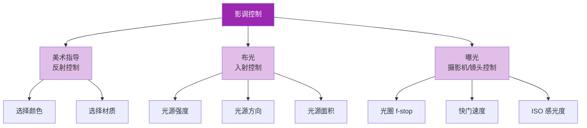

# 第07课：影调：控制与叙事

## Learning Objectives

- 理解影调（tone）的本质及其三种控制方法（美术指导、布光、曝光）
- 掌握巧合（coincidence）与非巧合（non-coincidence）的区别及其叙事功能
- 学会运用影调的对比与亲和引导观众注意力

## 什么是影调？

**影调（Tone）** 指的是物体在画面中的明暗程度——从纯白到纯黑的渐变范围。影调是视觉叙事的基础要素之一，因为它直接决定了观众**能看到什么、先看到什么、看不到什么**。

影调与线条的关系：上一课提到，线条产生于明度对比。也就是说，**没有影调的变化，就没有线条**。影调是比线条更底层的视觉元素。

> [!TIP] 关键洞见
> 影调是视觉语言中**最强大也最容易被忽视**的工具。一个场景的情绪可以仅仅通过影调的分布来改变，而不需要调整任何内容或表演。影调控制着观众的视线——人眼天然趋向于看向画面中明度反差最大的区域。

## 控制影调的三种方法

要控制画面中某个物体的影调，创作者有**三个独立的控制点**：

### 1. 美术指导（Art Direction）—— 反射控制

物体本身的**反射率（Reflectance）** 决定了它"应该"有多亮或有多暗。一面白墙无论怎么打光都是亮的，一块黑绒布无论怎么打光都是暗的——这是由物体表面的物理特性决定的。

**控制手段**：选择物体的颜色、材质和纹理。浅色、光滑的表面反射更多光；深色、粗糙的表面反射更少光。

> [!EXAMPLE] 美术指导的影调控制
> 在《Whiplash》（爆裂鼓手, 2014）中，弗莱彻（J.K. 西蒙斯饰）的排练室被设计为深色背景和深色地板——这使得人物的面部在聚光灯下像被"剥离"出来一样。鼓手日常穿着的黑色T恤强化了这种影调策略。

### 2. 布光（Lighting）—— 入射控制

射到物体表面的**光的强度和方向**决定了它的最终亮度。同样的白色墙壁，在阳光下是亮的，在阴影中就是暗的。

**控制手段**：调整光源的亮度、距离、角度和面积。主光、辅光、背光、侧光——不同的布光方案产生不同的影调分布。

### 3. 曝光（Exposure）—— 摄影机/镜头控制

摄影机**记录**光线的方式决定了最终呈现的影调。同样的场景，不同的曝光参数（光圈、快门、ISO）会产生完全不同的影调效果。

**控制手段**：调整光圈（f-stop）、快门速度、ISO感光度，以及使用ND滤镜或后期调色。

> [!WARNING] 注意
> 这三种控制方法**相互影响**。如果你把场景中所有的墙都刷成黑色（美术指导），那么你就需要更多的光（布光）和更大的光圈（曝光）才能看到它们。三者必须协同工作。在任何拍摄项目中，**三者中最弱的一环决定了最终影调的质量**。

## 巧合 vs 非巧合

这是影调叙事中最重要的概念之一，由《The Visual Story》作者布鲁斯·布洛克提出。

### 巧合（Coincidence）

**巧合**是指影调的组织方式恰好"揭示"被摄主体——主体与背景的影调明显不同，使得主体清晰可见。巧合是**信息透明**的影调策略。

> 视觉比喻：一个穿白色衣服的人站在黑色背景前。主体一目了然。

**巧合的叙事功能**：
- 清晰传达信息
- 不制造悬念
- 适合商业片、广告、纪录片中需要明确展示对象的镜头

### 非巧合（Non-coincidence）

**非巧合**是指影调的组织方式"隐藏"被摄主体——主体与背景的影调接近或相同，使得主体难以辨认。非巧合是**信息模糊**的影调策略。

> 视觉比喻：一个穿白色衣服的人站在白色背景前。主体"消失"了。

**非巧合的叙事功能**：
- 制造**好奇** —— 观众想知道那里到底有什么
- 制造**焦虑** —— 观众知道那里有什么但看不清楚
- 制造**恐惧** —— 观众不确定看到的是不是自己想象的那个东西

> [!EXAMPLE] 电影中的非巧合运用
> **《Apocalypse Now》（现代启示录, 1979）**
> 弗朗西斯·福特·科波拉的越战史诗中，大量场景发生在丛林深处的暗影中。当威拉德上尉（马丁·辛 饰）接近库尔兹上校（马龙·白兰度 饰）的领地时，影调越来越暗、越来越模糊——人物常常与阴影混为一体，难以分辨。这种非巧合的影调组织方式制造了强烈的**不安和神秘感**，观众和威拉德一样"看不清"前面的危险。
>
> **《Kill Bill Vol.1》（杀死比尔1, 2003）**
> 昆汀·塔伦蒂诺在影片中极致地运用了影调的巧合与非巧合对比。青叶屋大战中，新娘（乌玛·瑟曼 饰）的黄色紧身衣在深色背景中极为突出——这是**极致的巧合**，让主角永远处于视觉中心。但在闪回和暗杀场景中，昆汀又突然切换到极度欠曝的暗影中——几乎看不见人物的非巧合——制造突如其来的恐惧感。

## 影调的对比与亲和

| 策略 | 效果 | 应用场景 |
|------|------|----------|
| **影调对比（Tone Contrast）** | 画面中明暗差距大，视觉冲击力强 | 动作场面、戏剧性时刻、冲突 |
| **影调亲和（Tone Affinity）** | 画面中明暗差距小，视觉统一柔和 | 情绪平缓、日常时刻、气氛渲染 |

> [!WARNING] 关键平衡
> 影调对比太强可能导致画面分裂（一边全白一边全黑，观众不知道该看哪里）；影调亲和太强可能导致画面平淡乏味。优秀的视觉叙事在对比与亲和之间保持**动态平衡**——该对比时对比，该亲和时亲和。

### 利用影调引导注意力

具体来说，观众的眼睛会被以下因素吸引：

1. **画面中最亮的区域** —— 人眼天生趋向于光
2. **画面中反差最大的区域** —— 人和背景明度差异最大的地方
3. **画面中唯一打破影调亲和的地方** —— 如果整体偏暗，那么唯一亮着的地方就是视觉焦点

> [!TIP] 实操技巧
> 在布光时，问自己一个问题："如果整场戏只让观众看一处，那一处应该是什么？"——然后确保那一处是画面中影调对比最强的地方。这就是"先布光，后布景"的工作逻辑。

## 自检练习

> [!QUESTION] 自检问题
> 你正在拍摄一个悬疑短片的开场：主角走进一间废弃的地下室。通道很长，尽头可能有危险。请你设计影调策略：
> 1. 你会选择巧合还是非巧合来呈现地下室入口的主角？为什么？
> 2. 随着主角深入地下室，影调应该发生怎样的变化？
> 3. 当危险最终出现时（例如一张人脸突然出现在黑暗中），你如何利用影调的变化制造惊吓效果？
> 4. 三种控制方法（美术指导、布光、曝光）分别如何配合实现上述效果？

查看答案

1. 前半段（入口处）可以用**巧合**——让主角在入口的光亮中清晰可见，让观众看清是谁、在做什么。这样可以建立对主角的认同感，也为进入黑暗后的"看不见"做铺垫。
2. 随着主角深入，逐步转向**非巧合**——通道越来越暗，主角与阴影融为一体。观众开始看不清主角的脸、看不清脚下有什么、看不清前面是什么。这种逐渐消失的视觉信息制造了焦虑和悬念。
3. 当危险（人脸）突然出现时，可以用**快速的巧合反转**——在惊吓瞬间，用一束强光（手电筒或闪光）照亮人脸，制造极端的影调对比。之前所有的非巧合在这一刻被打破，强烈的明暗反差本身就是惊吓效果的放大器。
4. **美术指导**：地下室的墙面和地面选择深灰色或深棕色材质，减少反射率；**布光**：用点光源（手电筒的光锥）逐步缩小可见范围；**曝光**：适当降低曝光补偿（-1到-2档），让暗部细节陷入纯黑；**三者配合**确保主体与环境在阴暗中的影调亲和，在惊吓瞬间制造绝对对比。

## 推荐观看的影片

- 《现代启示录》（Apocalypse Now, 1979）—— 影调从光明到黑暗的渐进叙事
- 《杀死比尔1》（Kill Bill Vol.1, 2003）—— 巧合与非巧合的极致切换
- 《爆裂鼓手》（Whiplash, 2014）—— 利用影调将观众焦点锁定在主角身上
- 《教父》（The Godfather, 1972）—— 戈登·威利斯的传奇布光：阴影中隐藏着权力的秘密

## 下一步：进入色彩的维度

影调解决的是"明与暗"的问题，而色彩则为画面增加了第三个维度——**色相（Hue）**。在[[0008-color-systems|第08课：色彩系统与属性]]中，我们将讨论RGB加色系统与CMY减色系统的区别、色彩三属性（色相、明度、饱和度）以及如何通过色温控制画面情绪。
