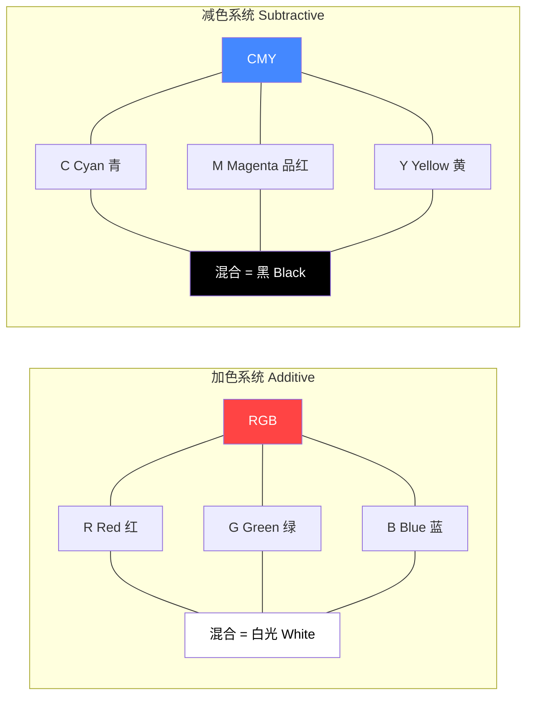

# 第08课：色彩系统与属性

## Learning Objectives

- 区分加色系统（RGB）与减色系统（CMY），理解它们是独立的色彩模型
- 掌握色彩三属性：色相（Hue）、明度（Brightness）、饱和度（Saturation）
- 理解明度与饱和度的制约关系，掌握色温对画面情绪的影响

## 两个独立的色彩系统

在讨论色彩之前，必须明确一个根本性前提：**色彩不是一个东西，而是两个独立系统**。

### 加色系统（Additive / RGB）—— 光的色彩

加色系统的工作基础是**光**。当红（Red）、绿（Green）、蓝（Blue）三种色光叠加时，它们的能量相加，越叠加越亮。红+绿=黄，红+蓝=品红，绿+蓝=青，**红+绿+蓝=白光**。

加色系统适用于：
- 摄影机传感器
- 显示器／电视／投影仪
- 任何以**发光**为媒介的设备

### 减色系统（Subtractive / CMY）—— 颜料的色彩

减色系统的工作基础是**颜料和染料**。当青（Cyan）、品红（Magenta）、黄（Yellow）三种颜料混合时，每种颜料吸收一部分光，越混合越暗。青+品红=蓝，青+黄=绿，品红+黄=红，**青+品红+黄=黑**（理论上是黑色，实际印刷中会加入纯黑色K，形成CMYK）。

减色系统适用于：
- 绘画和印刷
- 服装和场景设计中的染色
- 任何以**反射光**为媒介的物体

> [!WARNING] 核心禁忌
> **永远不要混淆两个系统，也不要在两个系统之间做线性类比**。例如，不要因为"红色+绿色=黄色"（加色），就认为黄色由红色和绿色组成（这是错误的——在减色系统中，黄色是原色之一）。这两种色彩逻辑是独立的，思考色彩时必须根据介质选择正确的系统。

## 色彩三属性

无论哪种色彩系统，每一种颜色都可以用**三个维度**来描述：

### 1. 色相（Hue）

色相就是颜色的"种类"——红色、橙色、黄色、绿色、蓝色、紫色。色相在色轮（Color Wheel）上呈环状排列。色相改变的是颜色的**定性特征**，即"这是什么颜色"。

### 2. 明度（Brightness）

明度是指颜色的明亮程度——**加白变亮，加黑变暗**。明度改变的是颜色的**定量特征**，即"这个颜色有多亮"。

- 在加色系统中，明度通过增加或减少光的强度来控制
- 在减色系统中，明度通过加白（稀释）或加黑（加暗颜料）来控制

### 3. 饱和度（Saturation）

饱和度指的是颜色的**纯度**或**鲜艳程度**。高饱和度的颜色是纯色、饱和的、强烈的；低饱和度的颜色是灰暗的、柔和的、接近无色的。

- 高饱和度 = 颜色"纯"且"满"
- 低饱和度 = 颜色被灰色"稀释"

> [!TIP] 关键洞见
> 饱和度不是明度。一种颜色可以**又暗又鲜艳**（深红——明度低，饱和度高），也可以**又亮又灰暗**（浅灰蓝——明度高，饱和度低）。不要把"亮"当作"鲜艳"，也不要把"暗"当作"不鲜艳"。

### 明度与饱和度的制约关系

这是一个重要的视觉原理：**不可能让所有色相在同一个画面中同时达到饱和且具有相同的明度**。

例如，黄色的固有明度很高（黄色天生就是"亮"的），而蓝色的固有明度很低（蓝色天生就是"暗"的）。如果你试图让黄色和蓝色同时饱和并且看起来一样亮，你会发现：
- 如果让蓝色匹配黄色的明度，蓝色就会变得很淡（饱和度降低）
- 如果让蓝色保持饱和，它就不可能显得和黄色一样亮

> [!EXAMPLE] 电影中的色彩策略
> 正因为黄色与蓝色的固有明度差异，电影制作者经常利用黄色在高明度发光（阳光、火光、灯光），利用蓝色在低明度隐退（阴影、夜景、水下）。这种互补色的明度差异本身就是一种天然的对比工具。

## 对比与亲和：色彩的四个维度

和线条、形状、影调一样，色彩也在多个维度上存在对比与亲和关系：

### 色相对比 vs 色相亲和

- **色相对比**：使用色轮上相距较远的颜色（互补色如红与绿、蓝与橙），创造视觉冲击和戏剧性
- **色相亲和**：使用色轮上相邻的颜色（如蓝与蓝绿、红与橙），创造和谐统一的氛围

### 明度对比 vs 明度亲和

- **明度对比**：颜色之间的明暗差距大（深蓝配浅黄），清晰度和可读性高
- **明度亲和**：颜色之间的明暗差距小（深蓝配深紫），画面统一但辨析度低

### 饱和度对比 vs 饱和度亲和

- **饱和度对比**：在低饱和背景中放置高饱和主体（黑白背景中的一朵红花），极强地吸引注意力
- **饱和度亲和**：所有颜色饱和度相近，画面柔和统一

### 暖/冷对比 vs 暖/冷亲和

这是色相的一个特殊维度。色轮可分为暖色（红、橙、黄）和冷色（蓝、绿、紫）：

- **暖冷对比**：暖色与冷色并置，产生强烈的视觉张力
- **暖冷亲和**：只使用暖色或只使用冷色，营造统一的温度感受

> [!WARNING] 注意
> 色彩的四个维度的对比与亲和是**同时存在**的。一场戏可能色相是亲和的（全是蓝色系），但在明度上是对比的（深蓝背景 + 浅蓝主体）。创作者需要同时管理这四个维度，而不是孤立地看某一种。

## 光源与色温

色彩的呈现不仅取决于物体的固有色，还取决于**照亮它的光源**。光源的**色温（Color Temperature）** 以开尔文（K）为单位度量：

| 光源 | 色温范围 | 色彩倾向 |
|------|----------|----------|
| 烛光 | ~1800K | 暖橙 |
| 白炽灯 | ~3200K | 暖黄 |
| 日光 | ~5600K | 中性白 |
| 阴天/阴影 | ~7000K+ | 冷蓝 |

摄影机需要根据光源色温进行**白平衡（White Balance）** 校正。但创作者也可以故意"错误"使用白平衡来改变情绪——例如用暖色调表现怀旧，用冷色调表现疏离。

> [!EXAMPLE] 色温的叙事运用
> 在一个场景中，如果室内是暖色的钨丝灯（3200K），透过窗户的月光是冷色的（7000K），两种色温的并置本身就暗示了"安全（暖）vs 危险（冷）"的对立。这种色温对比不需要任何台词就能传达。

## 自检练习

> [!QUESTION] 自检问题
> 你正在为一支科技产品广告设计视觉方案。产品是一台银白色笔记本，目标观众是年轻创意工作者，需要传达"创新、自由、专业"的品牌情绪。
> 1. 你会选择加色系统还是减色系统来思考这个项目的色彩？为什么？
> 2. 你会使用哪种色相为主色调？为什么？
> 3. 你会让饱和度整体偏高还是偏低？明度整体偏高还是偏低？
> 4. 你的色彩策略在色相、明度、饱和度、暖/冷这四个维度上分别是什么？对比还是亲和？

查看答案

1. 以**加色系统（RGB）** 为主来思考，因为最终呈现媒介很可能是数字屏幕（显示器、投影、手机），加色系统才是决定最终视觉呈现的色彩逻辑。场景设计和美术指导阶段可以用减色系统思考，但最终评估必须在加色系统下进行。
2. 可以以**蓝色系**为主色调——蓝色传达科技、专业、冷静。配合银白色的笔记本（冷色调的金属质感），整体形成冷色亲和，传达理性和创新感。
3. **明度偏高**——明亮的画面传达开放和积极；**饱和度中等**——太饱和显得幼稚，太低显得老旧，中等饱和度配合高明度比较适合现代科技品牌。
4. **色相**：亲和（集中在蓝色系，可能略有蓝绿或蓝紫）；**明度**：对比（银白色产品在高明度背景中要有适度的明暗差异才能被看到）；**饱和度**：亲和（整体中等饱和度）；**暖/冷**：亲和（整体冷色调）。这种以冷色调亲和为主导、通过明度对比突出产品的策略，适合科技品牌的专业形象。

## 推荐观看的影片

- 《英雄》（Hero, 2002）—— 张艺谋通过色彩分区叙事，不同故事段落用不同色相系统（红色、蓝色、白色、绿色），每一段内部的色相高度亲和，段与段之间通过色相的巨大对比来区分叙事层次
- 《黑客帝国》（The Matrix, 1999）—— 经典的绿黑色调（Matrix内部，冷调亲和）与蓝灰色调（真实世界，另一套冷调亲和）的色相对比，区别两个世界
- 《布达佩斯大饭店》（The Grand Budapest Hotel, 2014）—— 韦斯·安德森对饱和度和色相的精妙控制，粉色与红色系的极致运用

## 下一步：色彩的调制与实践

本课介绍了色彩的理论基础——两个系统、三个属性、色温。在[[0009-color-schemes|第09课：色彩方案与交互]]中，我们将深入探讨如何在实际创作中设计色彩方案——色轮的使用、互补色方案、相似色方案、三分色方案，以及如何将色彩策略系统地应用于整部影片的视觉叙事中。
