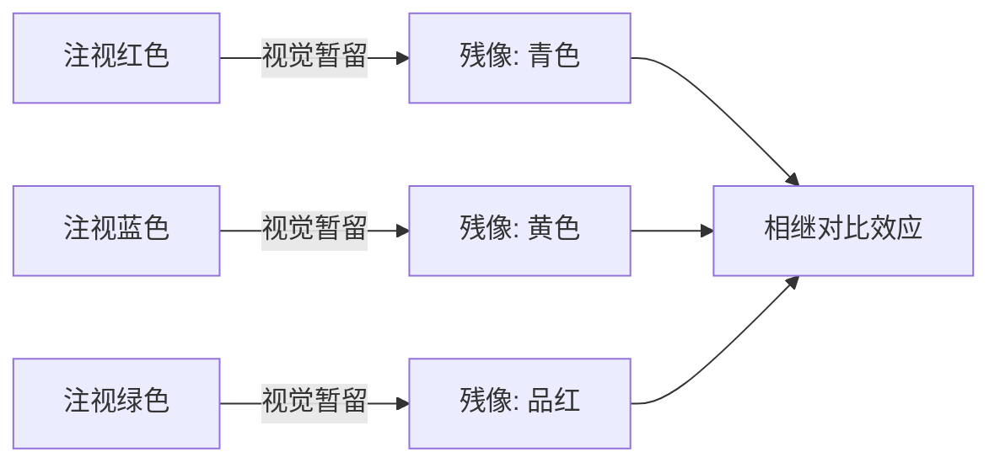
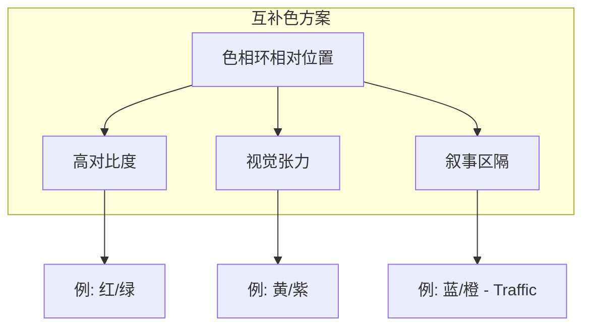

# 第09课：色彩方案与交互

---

## Learning Objectives

- 理解色彩交互（Interaction of Color）的三大法则与两种对比效应
- 掌握四种基本色彩方案及其在电影中的叙事功能
- 了解 Color Script 的概念及制作中控制色彩的多种手段

## 色彩交互：Josef Albers 的发现

> [!TIP] Key Insight
> Josef Albers 在《Interaction of Color》中证明：**颜色不是孤立存在的，它永远受周围颜色的影响**。在电影中，这意味着同一帧画面内的颜色关系比单个颜色的绝对值更重要。

色彩交互（interaction of color）遵循三条基本规则：

1. **色相 + 黑/白改变明度** — 在纯色中加入黑色或白色，会改变其明度（value），从而产生新的视觉层次。
2. **互补色增加饱和度** — 将一对互补色（如红/绿、黄/紫）并置时，彼此会显得更加鲜艳饱和。
3. **类似色改变色相** — 相邻的类似色会产生色相偏移的错觉，使彼此看起来比实际更接近。

### 同时对比 (Simultaneous Contrast)

同时对比发生在**单一镜头内部**：当两种颜色相邻时，它们会相互影响，观众的感知会往相反方向偏移。例如，灰色方块放在红色背景上会显得偏绿（红色的互补色），而放在绿色背景上会显得偏红。

> [!WARNING] 视觉陷阱
> 同时对比效应意味着：你在调色软件里看到的单个颜色，放到实际画面中会"变成"另一个颜色。**必须在全画面上下文中评估色彩**，否则会出错。

### 相继对比 (Successive Contrast)

相继对比发生在**镜头与镜头之间**，源自人眼的视觉暂留与残像（afterimage）效应。当你长时间注视一个强烈的颜色后移开视线，视网膜上会残留其互补色的残像。

电影剪辑中，从一个强色调镜头切到中性色镜头时，观众会在瞬间看到前一个颜色的互补色残像。斯皮尔伯格在《辛德勒的名单》中利用了这一点：从红色大衣的镜头切走时，残像强化了观众的视觉记忆。

## 四种基本色彩方案

色彩方案（color scheme）是在影片中系统地选择和组合颜色的策略。每种方案都创造独特的视觉情绪和叙事含义。

> [!TIP]
> 在继续学习之前，请先回顾 [[0008-color-systems|第08课：色彩系统与属性]] 中关于色相环、明度与饱和度的概念。色彩方案建立在色相环的位置关系之上。

### 1. 单色方案 (Monochromatic)

全片以单一色相为主导，仅通过明度和饱和度的变化来构建视觉层次。

- **代表影片**：《黑客帝国》（Matrix）—— 标志性的绿色调，将虚拟世界的冷酷与技术感具象化。
- **代表影片**：《闪灵》（The Shining）—— 库布里克在特定场景中大量使用红色，从地毯图案到血液电梯，营造压迫与疯狂感。

> [!EXAMPLE] 《黑客帝国》的绿色
> 当摄影机在矩阵世界中移动时，绿色光线的方向性衰减（从高处光源到低处阴影）创造了纵深感和几何的美学秩序。这不仅是配色选择，更是世界观的视觉定义。

### 2. 互补色方案 (Complementary)

使用色相环上相对位置的两种颜色，利用彼此的对比创造视觉张力。

- **代表影片**：《毒品网络》（Traffic）—— 索德伯格用蓝色调表现冷峻的执法线，用橙黄色调表现燥热的墨西哥贩毒线。两条故事线通过互补色方案在视觉上区隔，又在交汇处产生强烈的色彩碰撞。

### 3. 三色分割 (Three-Way Split)

在色相环上选择三个等距分布的颜色。此方案在视觉上最为丰富和活泼，但也是最难控制的，需要确定一个主导色来维持统一性。

### 4. 四色分割 (Four-Way Split)

选择四组颜色（两对互补色），能创造极为丰富的视觉调色板，常见于色彩饱满的动画片和歌舞片。

## Color Script（色彩脚本）

Color Script 是皮克斯（Pixar）推广的预可视化工具：按照叙事时间线，将每场戏/每个关键情节点用一幅小色稿排列出来，形成整部影片的色彩弧线。

> [!TIP] 实践建议
> 在分镜阶段就开始做 Color Script，即使只是粗略的色块也能帮你看到全片的色彩节奏。这是沟通导演和摄影指导（DP）之间色彩意图的强效工具。

## 制作中的色彩控制手段

在电影制作的不同阶段，有多种方法控制色彩：

| 阶段 | 手段 | 说明 |
|------|------|------|
| Pre-production | 调色板限制 | 美术指导限制定调和道具颜色 |
| Production | 滤镜 | 镜头前物理滤镜调整色温 |
| Production | 时间/地点 | 黄金小时、阴天、特定外景 |
| Post-production | 数字/LUT | DaVinci Resolve, LUT 查找表 |
| Post-production | 胶片 | 不同胶片乳剂的色彩特性 |
| Post-production | 调色 | 二级调色（secondary color correction） |

## 色彩本地化与观众色彩记忆

**色彩本地化（color localization）**：在画面中用一个局部颜色吸引观众的注意力，通常用于引导视线到关键叙事元素。

**观众色彩记忆（audience color memory）**：观众对影片中色彩的回忆是高度选择性的。如果某种颜色与重要的叙事线索绑定（如《辛德勒的名单》中的红衣女孩），观众会记住这个颜色，即使它在全片中只出现了极少的时间。

> [!WARNING]
> 不要滥用色彩本地化。如果每一个镜头都"突出"某种颜色，观众就无法分辨什么是真正重要的。**克制 = 力量**。

## 实践与自检

> [!QUESTION] Self-check
> 1. 同时对比（simultaneous contrast）和相继对比（successive contrast）的根本区别是什么？它们在电影中分别发生在什么层面？
> 2. 如果一部影片想在开场使用单色方案、在冲突高潮切换到互补色方案，你需要如何规划 Color Script？
> 3. 色彩本地化和观众色彩记忆之间的关系是什么？

参考答案

1. **同时对比**发生在单一镜头内部（同一帧画面中颜色之间的相互作用）；**相继对比**发生在镜头之间（利用残像效应，一个镜头的颜色影响下一个镜头的感知）。前者是空间维度，后者是时间维度。

2. 在 Color Script 中，开场用单色色块，在冲突引入阶段逐渐加入互补色的微量元素，到高潮段让互补色完全展开形成对抗。关键是要留有**过渡阶段**，避免生硬的色彩跳跃。

3. 色彩本地化是**手法**——在画面中突出某个局部颜色，使其成为视觉锚点；观众色彩记忆是**效果**——观众会记住这个有意义的局部颜色。两者形成"手法→效果"的因果链。

## 推荐观看

- 《黑客帝国》（The Matrix, 1999）—— 单色方案与色彩本地化
- 《毒品网络》（Traffic, 2000）—— 互补色叙事区隔
- 《辛德勒的名单》（Schindler's List, 1993）—— 色彩本地化的经典范例
- 《布达佩斯大饭店》（The Grand Budapest Hotel, 2014）—— 多色彩方案的分章运用

## 下一步

继续进入 [[0010-movement|第10课：运动：类型与连续体]]，探索视觉叙事中的另一个基本维度——运动和节奏。或者回到 [[0008-color-systems|第08课：色彩系统与属性]] 巩固色彩基础知识。
