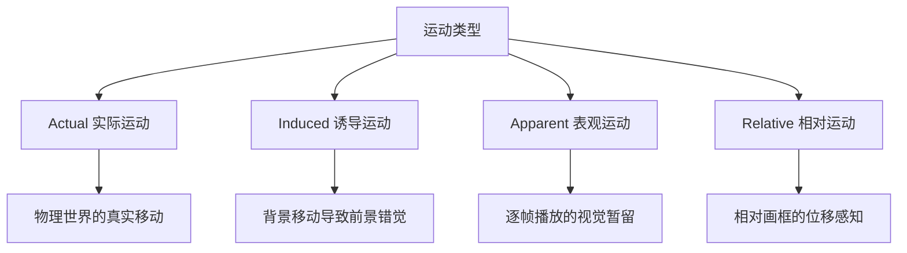

# 第10课：运动：类型与连续体

---

## Learning Objectives

- 识别四种运动类型及其在电影中的呈现方式
- 分析物体运动、摄影机运动和观众注意力运动的交互关系
- 运用运动连续体理论，通过对比与亲和控制视觉节奏

## 四种运动类型

运动是电影区别于静态视觉艺术的核心特质。理解运动的不同类型，是从"看到运动"到"设计运动"的第一步。



### 1. 实际运动 (Actual Movement)

真实世界中物体的物理运动：人走路、车行驶、风吹树叶。这是最直观的运动形式，也是观众最容易理解的。

### 2. 诱导运动 (Induced Movement)

当背景移动时，静止的物体会显得在运动。"云动月不动"就是这个原理——云在移动，月亮看起来像在云后穿行。电影中常用于制造不安定的心理效果。

> [!TIP] Key Insight
> 诱导运动的本质是**视觉参照系的转移**。当画框中缺少稳定的参照物时，观众会将运动归因于更突出的物体。这解释了为什么在摇摄（pan）镜头中，静止的建筑看起来在"后退"。

### 3. 表观运动 (Apparent Movement)

电影的基石。24帧/秒的静止画面快速连续播放，利用视觉暂留（persistence of vision）和 phi 现象，让观众"看到"连续运动。这不是真实运动，而是大脑补完的知觉。

### 4. 相对运动 (Relative Movement)

物体相对于画框（frame）的运动。同样速度的汽车，在广角镜头中显得比长焦镜头中慢，因为广角镜头中画框内的参照物更多。相对运动是摄影师通过镜头选择和构图来操控运动感知的利器。

> [!WARNING]
> 在实际操作中，观众永远同时经验多种运动类型。不要孤立地设计一种运动——问问自己：**诱导运动是否干扰了表观运动的连续性？** 镜头切换时相对运动的突变是否会造成视觉断裂？

## 三种创造运动的方式

在电影中，运动可以通过三种方式被创造和控制：

### 1. 物体运动 (Object Movement)

画面中的人或物在移动。关键参数包括：
- **速度（speed）**：快速运动传达能量和紧张，慢速运动传达慵懒或压抑
- **方向（direction）**：横向运动最自然（阅读习惯），纵向运动强调力量感，对角线运动最具动态

### 2. 摄影机运动 (Camera Movement)

摄影机的物理运动改变观众视角：

| 运动类型 | 视觉效果 | 叙事功能 |
|---------|---------|---------|
| 推（Dolly In） | 靠近主体，空间压缩 | 强调关键信息，制造亲密或压迫 |
| 拉（Dolly Out） | 远离主体，空间展开 | 揭示环境，产生疏离感 |
| 摇（Pan） | 水平旋转 | 展示空间关系，跟随运动 |
| 仰俯（Tilt） | 垂直旋转 | 揭示高度，强调权力关系 |
| 升降（Boom/Crane） | 摄影机整体升降 | 改变视点高度，气势恢宏 |
| 手持（Handheld） | 不稳定抖动 | 真实感、焦虑、纪录片质感 |
| 稳定器（Steadicam/Gimbal） | 平滑流畅 | 长镜头跟随，空间连续 |

### 3. 观众注意力运动 (Audience Attention Movement)

观众视线在画面内的移动，受明暗、色彩、运动、构图引导线的控制。即使摄影机和物体都静止，观众的注意力仍然在"运动"。

> [!EXAMPLE] 注意力运动的经典案例
> 希区柯克《后窗》中，杰弗瑞的视线在公寓窗户之间来回移动。摄影机几乎没有运动，但观众的注意力随着他的目光不断跳转，形成了强烈的"视觉搜索"运动。

## 运动连续体 (Continuum of Movement)

运动不是二元的（运动 vs. 静止），而是从**完全静止**到**极度动态**的连续体：

```
静止 → 微妙运动（呼吸/微表情）→ 小幅度运动（手势）→ 大幅度运动（走路）→ 剧烈运动（奔跑/打斗）→ 极端动态（爆炸/车祸）
```

在设计一场戏时，确定该场景在运动连续体上的位置，然后通过对比或亲和来组织镜头。

## 对比与亲和在运动中的应用

- **运动亲和（Affinity）**：前后镜头的运动特性相近——速度一致、方向一致。创造平滑流畅的视觉流。
- **运动对比（Contrast）**：前后镜头的运动特性差异大——突然从慢速切到快速，或从稳定切到手摇。创造视觉冲击或节奏变化。

> [!TIP]
> 动作片并非"越动越好"。**对比才是力量**——如果在整段追逐戏中保持同等的激烈运动，观众会很快疲劳和麻木。在追逐中插入短暂的静止或低速段落，会让下一段高速运动重新获得冲击力。

## 实践与自检

> [!QUESTION] Self-check
> 1. 四种运动类型中，哪一种是你认为最容易被忽视但在电影中最常被利用的？为什么？
> 2. 为一个追逐场景设计运动连续体：用亲和来建立流畅感，再用对比来制造节奏变化。
> 3. 什么时候应该选择手持摄影而不是稳定器？它们的运动特性差异如何服务于叙事？

<details>
<summary>参考答案</summary>

1. **诱导运动**最容易被忽视。观众很少意识到自己把背景运动归因到了前景物体上。但导演利用这一点可以巧妙地传递不稳定感——例如用缓慢的摇摄让静止的室内显得"不安"。

2. 一个可能的方案：稳定器中速跟跑（亲和）→ 切换到三个快切手持镜头加速节奏 → 突然切到空镜静止（对比）→ 对手突然入画高速运动。这个"慢-快-停-快"的连续体利用了对比来重置观众的能量感受。

3. 手持摄影适用于需要**主观真实感**的场景（如战争、危机、个人创伤记忆）；稳定器适用于需要**空间连续性**和**优雅跟随**的场景（如《鸟人》、《1917》）。选择的根本依据是：你希望观众感觉自己是参与者（手持）还是观察者（稳定器）。
</details>

## 推荐观看

- 《鸟人》（Birdman, 2014）—— 稳定器长镜头与空间连续运动
- 《谍影重重3》（The Bourne Ultimatum, 2007）—— 手持摄影与快速剪辑的运动节奏
- 《1917》（1917, 2019）—— 摄影机运动与叙事时间的同步
- 《后窗》（Rear Window, 1954）—— 观众注意力运动的典范

## 下一步

进入 [[0011-rhythm|第11课：节奏：视觉韵律]]，深入理解运动在时间维度上的结构化模式——视觉节奏。节奏和运动是密不可分的两个维度。
