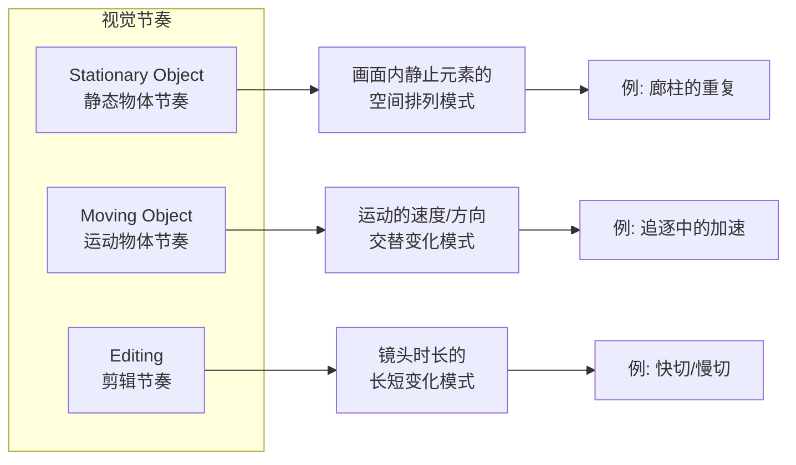

# 第11课：节奏：视觉韵律

---

## Learning Objectives

- 区分三种视觉节奏类型及其在电影中的表现形式
- 理解节奏对比与亲和如何影响观众的情绪能量
- 掌握镜头时长对视觉强度的影响，并用节奏设计叙事弧线

## 什么是视觉节奏？

> [!TIP] Key Insight
> 节奏（rhythm）不是音乐或声音的专属概念——**视觉一样有节奏**。在视觉叙事中，节奏是空间中物体排列与时间中运动变化所形成的**结构化模式**。好的视觉节奏让观众感到"对"，而不好的节奏让人感到"哪里不对劲"。

如果说 [[0010-movement|第10课：运动]] 讨论的是单个运动事件的特性，那么节奏讨论的是这些事件在**时间轴上如何排列**。

## 三种视觉节奏类型

### 1. 静态物体节奏 (Stationary Object Rhythm)

画面内静止元素的排列产生的视觉节奏。柱子、窗户、树木、人脸——当这些元素在画框中以某种模式排列时，就形成了节奏。

**关键参数**：重复间距（spacing）、数量、形态的重复与变化。

> [!EXAMPLE] 静态节奏的应用
> 韦斯·安德森（Wes Anderson）的电影是静态物体节奏的极致范例。他对称构图中的门框、书架、人物站位，都经过精确的间距计算。每一个静止镜头本身都带有强烈的节奏感。

### 2. 运动物体节奏 (Moving Object Rhythm)

画面中运动物体的速度、方向和交替运动模式形成的节奏。

**关键参数**：
- **速度交替**：快-慢-快-慢 或 持续加速-持续减速
- **方向交替**：左-右-左-右（如网球比赛中的视线切换）
- **相位交替**：多个运动元素之间的时间错位

一部追逐戏之所以让人紧张，不是因为每个镜头都在高速运动，而是因为**速度在不断变化**——偶尔的减速让下一次加速更加有力。

### 3. 剪辑节奏 (Editing Rhythm)

镜头的持续时间模式——这是视频独有的节奏维度。剪辑节奏不仅取决于镜头长度，还取决于镜头间的**内容差异度**。

**镜头时长与视觉强度效应**：
- 短镜头（1-2秒）：高强度，急促，紧张
- 中镜头（3-5秒）：中等强度，舒适阅读
- 长镜头（10秒+）：低强度，沉思，压抑或恢弘

> [!WARNING]
> 剪辑节奏的陷阱：**不要用单一速度剪完全片**。即使是一部快节奏的动作片，也需要偶尔的长镜头来"呼吸"。失去节奏变化 = 失去观众的情感参与。

## 节奏的对比与亲和

与前面课程中的其他组件一样，节奏也是通过对比和亲和来创造叙事弧线：

| 节奏策略 | 效果 | 适用场景 |
|---------|------|---------|
| 亲和 | 平滑、稳定、可预期 | 建立常态、日常生活 |
| 渐进变化 | 逐步紧张或放松 | 悬疑升级、情绪过渡 |
| 突然对比 | 震惊、打破预期 | 转折点、惊吓、揭示 |

> [!TIP]
> 在电影《爆裂鼓手》（Whiplash）中，排练场景的剪辑节奏从稳定的中速逐渐加速到狂暴的快速，配合鼓点的加速，让观众和主角一起体验到近乎窒息的压力。

## 经典电影分析

### 《极盗车神》（Baby Driver）

埃德加·赖特将剪辑节奏与音乐节拍精确同步。每一场动作戏的剪辑切点都踩在音乐的节拍上——视觉节奏和听觉节奏完全统一。这不仅让动作场面更有韵律感，也让剪辑节奏成为叙事的一部分。

### 《疯狂的麦克斯：狂暴之路》（Mad Max: Fury Road）

乔治·米勒在全片几乎持续的高速运动中，**用对比来创造节奏**：沙暴追逐段的高强度快速剪辑，切换到短暂的静谧夜景，然后再次爆发。这些"呼吸"段落让观众得以恢复，也让下一波高潮更有冲击力。

## 实践与自检

> [!QUESTION] Self-check
> 1. 三种视觉节奏中，哪一种对你来说最容易控制？哪一种最难？为什么？
> 2. 取一段你熟悉的电影片段（3-5分钟），标记每个镜头的时长，画出"镜头时长曲线"。这条曲线的形状说明了什么？
> 3. 如果一个场景需要表达"逐渐陷入焦虑"，你需要如何设计剪辑节奏和运动物体节奏？

参考答案

1. 没有标准答案。多数人觉得**剪辑节奏最容易控制**（因为可以在剪辑软件里直观地调整时长），而**静态物体节奏最难**（因为需要在拍摄前，在空间设计和美术指导阶段就做决定）。这正是视觉笔记课程强调"视觉素养"的原因——节奏决策发生在制作的各个阶段。

2. "镜头时长曲线"通常呈现山峰形态：开场建立（中速）→ 冲突发展（加速）→ 高潮（最短镜头）→ 释放（减速）。曲线越极端，情感体验越强烈。

3. 增加**运动物体节奏**的反复性（如主角烦躁地来回踱步），同时让**剪辑节奏**从稳定的4秒逐步压缩到1-2秒。当运动频率和剪辑频率同步加速时，焦虑感会成倍放大。

## 推荐观看

- 《极盗车神》（Baby Driver, 2017）—— 视觉节奏与音乐节拍的完美同步
- 《疯狂的麦克斯：狂暴之路》（Mad Max: Fury Road, 2015）—— 对比节奏制造的情感曲线
- 《布达佩斯大饭店》（The Grand Budapest Hotel, 2014）—— 静态物体节奏的教科书
- 《爆裂鼓手》（Whiplash, 2014）—— 剪辑节奏与叙事的情绪同步

## 下一步

进入 [[0012-story-and-visual-structures|第12课：故事与视觉结构]]，本课程的最后一课——将所有视觉组件整合为服务于叙事的故事结构。在此之前，也可以回顾 [[0010-movement|第10课：运动]] 巩固运动与节奏的关系。
