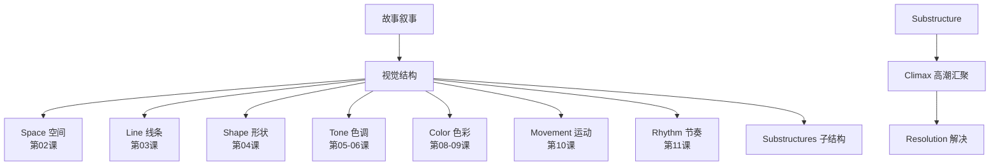

# 第12课：故事与视觉结构

---

## Learning Objectives

- 理解视觉结构如何直接服务于故事叙事，而非独立存在的装饰
- 掌握视觉组件在叙事高潮处汇聚的设计方法
- 建立从粗略视觉想法到最终成片的协作方法论

## 视觉结构必须为故事服务

> [!TIP] Key Insight
> 整本书《The Visual Story》的核心信条只有一句话：**形式追随功能（Form Follows Function）**。视觉结构不是一套可以被随意套用的模板，而是故事的视觉翻译。每一个视觉决策都应该回答一个更根本的问题：**这个故事此刻需要观众感受到什么？**

本课是对整个课程体系的总结。之前学过的所有组件——空间、线条、形状、色调、色彩、运动、节奏——在这一课中汇合到一起。

## 叙事中的视觉结构递进

好的视觉结构不是静态的，而是在影片进程中**递进**的。这意味着：

- **开场**：视觉组件在此阶段建立"基准"——观众学会如何阅读影片的视觉语言
- **发展**：视觉组件开始变化，逐步偏离基准，反映故事的张力积累
- **高潮**：视觉组件到达极端状态（或前所未有的组合），对应叙事的最强情感点
- **解决**：视觉组件回归基线，或转变为代表新常态的新结构

> [!WARNING]
> 最常见的错误是**一场戏内部好看，但整部影片没有视觉弧线**。检查你的视觉结构是否存在"递进"——问问自己：主角从开场到结局，视觉组件的变化路径是什么？

## 视觉组件在故事高潮处的汇聚

在最关键的场景——通常是高潮（climax）——所有视觉组件应该协同作战：

- 空间被压缩到极致（close framing），或扩张到最大（wide framing）
- 线条最为动荡（对角线、锯齿线），或最为稳定（水平线）
- 色调对比达到全片极限（最黑 vs. 最亮，或极端的低调光）
- 色彩饱和度处在极端（最鲜艳或完全褪色）
- 运动最为剧烈或完全静止
- 节奏达到最快剪辑或最长停顿

> [!EXAMPLE] 经典案例：《黑暗骑士》的高潮
> 诺兰在《黑暗骑士》的最后对峙场景中，大量使用极端特写（空间压缩）、锯齿状线条（小丑的面部疤痕）、低调光（高对比色调）、补色碰撞（紫/绿 vs. 橙/蓝）。所有视觉组件同时达到峰值，制造了无法逃避的紧张感。

## 视觉子结构

长片不是单一的视觉结构，而是由多个**子结构**交织而成。每个角色、每一条故事线都可以有其独特的视觉处理：

- **角色的视觉子结构**：主角的色调弧线 vs. 反派的色调弧线，两者在冲突点发生视觉碰撞
- **场景/地点的视觉子结构**：不同的空间使用不同的线条和形状语言
- **时间线的视觉子结构**：过去 vs. 现在 vs. 未来，通过色彩饱和度或色调区分

## 实践方法论：从粗略视觉想法开始

布鲁斯·布洛克（Bruce Block）在书中强调：**不要从细节开始，从粗略开始（Start rough）**。

1. **第一步**：分析剧本，确定每个场景的情感目标
2. **第二步**：选择 1-2 个主要视觉组件来承载该场景的情感
3. **第三步**：用简单的草图、色块、箭头画出场景的"视觉弧线"
4. **第四步**：检查整部影片的视觉结构递进——是否存在从头到尾的变化？
5. **第五步**：将视觉结构方案传达给各协作部门

> [!TIP] 实践建议
> 不擅长画图？无所谓。Bruce Block 说你可以用卡片和色纸来排列视觉结构。关键在于**看到整体结构**，而不是沉迷于单个镜头的完美。

## 导演/美术指导/摄影/剪辑的协作

视觉结构不是一个人的工作，而是整个核心团队的协作：

| 角色 | 视觉结构职责 |
|------|------------|
| 导演 | 定义视觉目标，确保叙事与视觉对齐 |
| 美术指导 | 实现空间/线条/形状/色彩的具体设计 |
| 摄影指导 | 控制镜头选择、光线色调、摄影机运动 |
| 剪辑师 | 组装节奏，确保视觉结构在时间轴上成立 |

一个好的视觉笔记或视觉方案（visual treatment）是团队沟通的桥梁。

## 全课程总结

> [!EXAMPLE] 回顾：十二课的知识体系
> 本课程基于《The Visual Story》构建了一套完整的视觉叙事框架：
>
> 1. **第01课**：视觉基础概念——对比（Contrast）与亲和（Affinity）的二元引擎
> 2. **第02课**：空间（Space）——深度、平面、有限空间的叙事选择
> 3. **第03课**：线条（Line）——对角、直线、锯齿线的情绪编码
> 4. **第04课**：形状（Shape）——圆形/方形/三角形的象征意义
> 5. **第05课**：色调（Tone）基础——明暗结构与光线的方向性
> 6. **第06课**：色调结构的对比与亲和——光线弧线设计
> 7. **第07课**：综合实践——将前六课整合应用
> 8. **第08课**：色彩基础——色相环、明度、饱和度
> 9. **第09课**：色彩方案与交互——色彩方案设计、交互效应、Color Script
> 10. **第10课**：运动——四种运动类型、运动连续体、摄影机运动
> 11. **第11课**：节奏——三种视觉节奏、镜头时长效应
> 12. **第12课**：故事与视觉结构——整合一切为叙事服务

## 书中练习方法

布洛克在书中提供了几个持续练习的方法：

1. **拉片练习**：选择一部电影的一个场景，暂停每一帧，分析当前画面中占主导的视觉组件。记录时间轴上的视觉变化。
2. **单组件练习**：在看电影时只关注一个组件（例如只关注线条），感受它在全片中的变化。
3. **重新剪辑练习**：将同一段素材剪出两种不同的节奏——比较它们传达的情感差异。
4. **从零设计**：取一段短剧本，从视觉结构出发设计每个场景，再对比实际影片的处理。

## 实践与自检

> [!QUESTION] Self-check
> 1. 回顾整个课程，哪三个视觉组件是你认为自己最需要加强练习的？建立你的"继续学习计划"。
> 2. 选一部熟悉的电影，回答：它的视觉结构递进是什么？开场、发展、高潮、结局分别使用哪些视觉组件为主导？有没有子结构？
> 3. "形式追随功能"——对你来说，这个原则在你自己的创作中意味着什么？给出一个你已经（或将要）应用的例子。

参考答案（引导性）

1. 答案因人而异。一个建议的"继续学习计划"：每周拉片分析1-2个场景，付费关注三个组件；每月做一个新的视觉设计练习；重读《The Visual Story》中需要加强的章节。

2. 以《寄生虫》为例：
   - 开场（地下半地下室）：高色调对比、倾斜线条、低饱和度——贫穷的视觉编码
   - 发展（朴社长家）：水平线条、开阔空间、高调光——富有的视觉编码
   - 高潮（雨夜追逐）：极端运动对比、不规则线条、色调急剧下沉
   - 结局（地下室）：回归封闭空间，但色调完全不同——"向上看"的视角
   奉俊昊在全片中精心设计了两套视觉子结构（穷人 vs. 富人），两套语言在暴雨夜汇聚、碰撞、最终不可逆转地改变。

3. 这个问题的价值在于你自己的反思。真正的好答案不是"正确的"，而是**诚实的**。

## 推荐观看

- 《寄生虫》（Parasite, 2019）—— 空间与阶层叙事的视觉结构范本
- 《黑暗骑士》（The Dark Knight, 2008）—— 视觉组件在高潮处的汇聚
- 《公民凯恩》（Citizen Kane, 1941）—— 视觉结构叙事的鼻祖
- 《地心引力》（Gravity, 2013）—— 从失重到重力回归的视觉弧线

## 下一步

恭喜你完成了全部12课的学习！现在你可以：

1. **重读《The Visual Story》** 原书，带着课程框架深度阅读
2. **开始拉片练习**，将理论知识应用到实际影片分析中
3. **回到第01课** [[0001-seven-basic-visual-components|课程主页]] 复习整个体系，或复访你感兴趣的特定课程
4. **创作你自己的视觉方案（visual treatment）**——从一个短剧本开始，应用你所学的所有组件

本课链接到所有课程：[[0001-seven-basic-visual-components|第01课]] · [[0002-contrast-and-affinity|第02课]] · [[0003-space-part-one-depth-cues|第03课]] · [[0004-space-part-two-frame|第04课]] · [[0005-line-ways-of-seeing|第05课]] · [[0006-shape-basics|第06课]] · [[0007-tone-control|第07课]] · [[0008-color-systems|第08课]] · [[0009-color-schemes|第09课]] · [[0010-movement|第10课]] · [[0011-rhythm|第11课]]

*—— End of Course ——*
