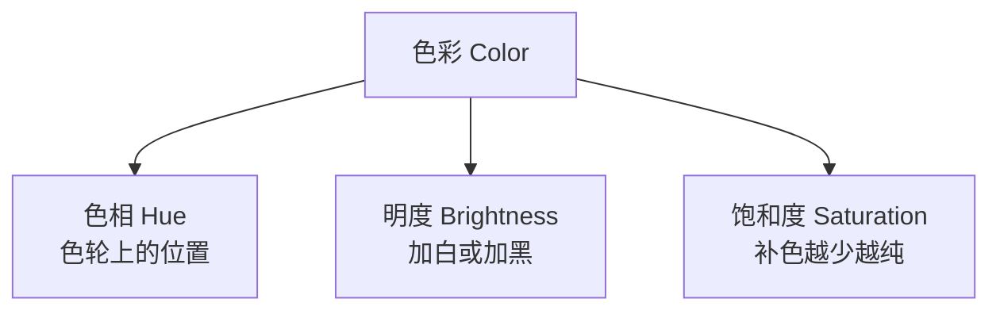

# 色彩系统参考

## 加色系统 (Additive System)

**原理：** 光的不同波长叠加产生新色彩。用于舞台灯光、电视/电脑屏幕。

| 属性 | 说明 |
|---|---|
| 三原色 | **R**ed (红), **G**reen (绿), **B**lue (蓝) |
| 三间色 | R+G=Yellow, G+B=Cyan, R+B=Magenta |
| 互补对 | Cyan&Red, Green&Magenta, Blue&Yellow |
| 等量混合 | 白色 |

## 减色系统 (Subtractive System)

**原理：** 颜料吸收（减去）波长。用于绘画、染料、印刷、自然界的色彩。

| 属性 | 说明 |
|---|---|
| 三原色 | **M**agenta (品红), **Y**ellow (黄), **C**yan (青) |
| 三间色 | M+Y=Red, Y+C=Green, C+M=Blue |
| 互补对 | Magenta&Green, Blue&Yellow, Red&Cyan |
| 等量混合 | 黑色 |

> [!WARNING] 关键警告
> 加色与减色系统是 **两个独立的系统**，不应合并理解。许多混淆源于将两者混合教学。

## 色彩三属性



### 色相 (Hue)
只有 8 种纯色相：Red, Orange, Yellow, Green, Cyan, Blue, Violet/Purple, Magenta。粉、棕、青绿、米色不是色相。

### 明度 vs 饱和度
- 黄色是最亮的高饱和色相；蓝色/品红是最暗的
- 不可能让所有色相同时等饱和度且等明度
- 等化明度会破坏饱和度

## 色彩对比与亲和

| 维度 | 对比 | 亲和 |
|---|---|---|
| 色相 | 多个饱和色相 | 单一色相 |
| 明度 | 灰度阶两极 | 灰度阶局部 |
| 饱和度 | 纯色+褪色混合 | 统一褪色或纯色 |
| 暖/冷 | 冷暖碰撞 | 统一冷暖 |

## 配色方案

```mermaid
mindmap
  Color_Schemes[色彩方案]
  单色
    单一色相变明变暗
    《Matrix》《The Shining》
  互补
    色轮相对
    《Traffic》《Take This Waltz》
  三色分割
    三等分120度
    《The Man in the Moon》
  四色分割
    四等分90度
    《Sleeping Beauty》
```

## 色彩交互规则 (Josef Albers)

1. **色相+黑/白** → 改变表观明度（同时对比）
2. **互补色相邻** → 增加表观饱和度（相继对比 / 残像效应）
3. **类似色相邻** → 色相感觉互相远离

## 制作控制方法

| 方法 | 描述 | 阶段 |
|---|---|---|
| 调色板 (Palette) | 限制实际物体颜色 | 前期美术 |
| 滤镜 (Filters) | 镜头滤镜或灯光色纸 | 拍摄 |
| 时间/地点 | 日光变化、天气、环境 | 拍摄 |
| LUT/数字摄影 | 拍摄时应用色彩查找表 | 拍摄 |
| 胶片选择 | 不同ISO影响饱和度 | 拍摄 |
| 调色 (Color Grading) | 后期数字色彩调整 | 后期 |