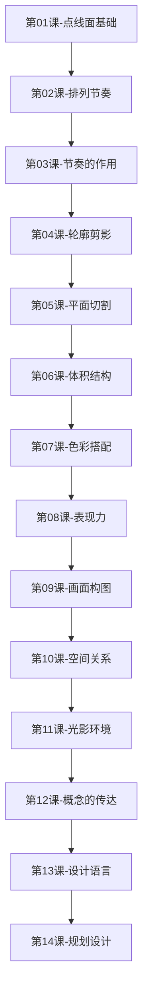

# 课程地图

## 学习路径

## 模块划分

### 基础篇（第01-03课）
| 课程 | 核心知识点 |
|------|-----------|
| 第01课：点、线、面基础 | 点的形式感、线的形式感、面的形式感、点线面相互转化 |
| 第02课：排列节奏 | 节奏元素的对比、变化规律、重复/特异/渐变/发射排列 |
| 第03课：节奏的作用 | 表现力塑造、表现倾向、动态倾向、速度感、模拟自然形态 |

### 造型篇（第04-06课）
| 课程 | 核心知识点 |
|------|-----------|
| 第04课：轮廓剪影 | 剪影意识、剪影塑造、剪影作用、剪影节奏韵律 |
| 第05课：平面切割 | 切割意识、正负形契合、切割塑造、切割作用、切割节奏韵律 |
| 第06课：体积结构 | 体积意识、体积塑造、体积作用、体积节奏韵律 |

### 色彩篇（第07课）
| 课程 | 核心知识点 |
|------|-----------|
| 第07课：色彩搭配 | 颜色属性、色调、属性对比、造型关系对比、材质差异、融合/对比搭配模式 |

### 表现篇（第08-09课）
| 课程 | 核心知识点 |
|------|-----------|
| 第08课：表现力 | 表现力塑造、表现力作用、表现力节奏韵律 |
| 第09课：画面构图 | 画面架构、常见架构形式、对比、取景、动势、平衡、留白 |

### 空间篇（第10-11课）
| 课程 | 核心知识点 |
|------|-----------|
| 第10课：空间关系 | 正负空间、景别层次、透视参照、空气透视、菲涅耳效应 |
| 第11课：光影环境 | 光的基础、阴影、光的吸收、光照方向 |

### 应用篇（第12-14课）
| 课程 | 核心知识点 |
|------|-----------|
| 第12课：概念的传达 | 认同感、印象提炼、元素/节奏/色彩/构图传达概念、故事叙述 |
| 第13课：设计语言 | 表现手法/概括夸张/环境氛围/相似概念统一设计语言 |
| 第14课：规划设计 | 目标解读、规范规划、概念/关卡/氛围/视觉引导/资源/成本规划 |

## 学习建议

1. **顺序学习**：本书知识体系环环相扣，建议按章节顺序学习
2. **理论与实践结合**：每课都配有设计案例，建议边学边练
3. **重点掌握**：第01课（点线面）、第02课（排列节奏）、第07课（色彩搭配）是全书的三大基石
4. **反复回顾**：注意每章最后的"节奏韵律"小节，将本章知识与全书核心概念"节奏"关联