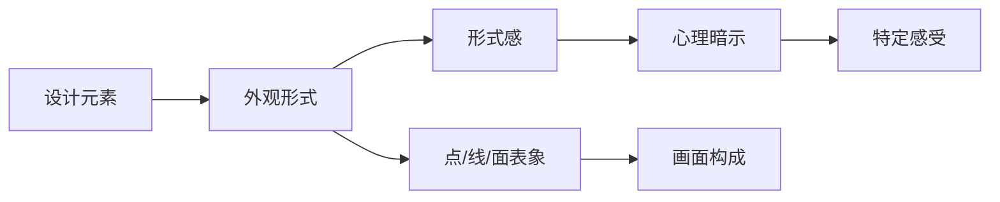
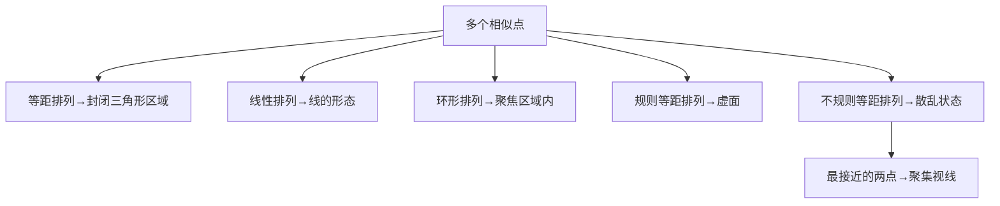
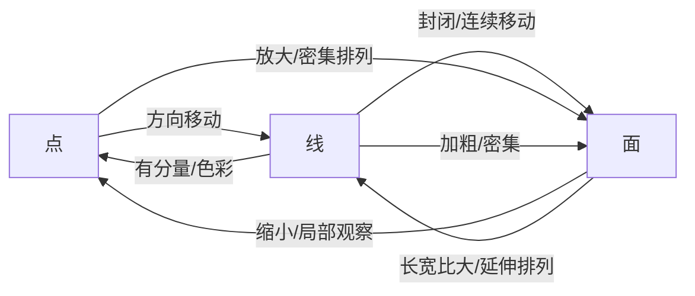

# 第01课：点、线、面基础

## 学习目标

- 理解点、线、面作为设计最基本构成元素的核心定义与形式感概念
- 掌握通过造型、动势、色彩、交汇和生理刺激五种方式制造画面视觉中心的方法
- 熟悉单个点、两个相似点、多个相似点及不同分量点在不同位置的形式感变化
- 掌握线的四种核心作用及直线、曲线、粗线、细线的形式感差异
- 理解实面与虚面的区分，以及面的五种作用与六种形式感类型
- 深入理解点、线、面三者之间相互转化的四种关系及其在设计中的应用

## 核心概念

### 1.1 形式感的概念

画面中不同形态的元素，其外观形式对人的感染力不同，从而能够给予人不同的心理暗示，使人产生不同的感受。这种外观形式给予人的直观感受称为**形式感**（Form Perception）。在设计构成中，不同外观形式的元素往往以**点、线、面**的表象作为基本形状呈现在画面中。

判断画面中的元素是否呈现出点、线、面的结构形式，取决于其外观形式所呈现出的形式感，而非其物理属性的严格定义。

### 1.2 点的定义与作用

**点**是画面中最基础的构成元素。在画面中引导视线、吸引观者注意力的最直接、最有效的方法，是在画面中为设计对象塑造一个**视觉中心点**。一个点可以准确地标明设计对象在画面中的位置，构成画面视觉中心。

制造画面视觉中心的核心方法可以概括为：**通过制造感官刺激吸引观者的注意力**。元素外观形式的表现力越强，则点所制造的感官刺激越强。

以下五种方式可以制造感官刺激，从而在画面中塑造"点"：

#### 造型刺激制造点

造型的差异对比能够制造感官刺激。具有一定分量、造型有多个层次且明显区别于四周元素的物件，可以成为画面的视觉中心。例如六角星在一堆四边形中造型最突出，教堂的造型相对于周围建筑有更强的特殊性。

在同样的造型基础上，塑造不同强弱、虚实的对比也可以制造视觉中心。设计中常通过云雾、蒸汽、沙尘等元素弱化次要部分的素描对比关系，强化虚实关系，从而突出视觉中心。

#### 动势刺激制造点

动态和姿势的差异对比能够制造感官刺激。在分量相似的条件下，具有运动趋势的物件能形成较强的外观形式，成为视觉中心。在角色设计中，赋予角色夸张的动势可以强调其存在感。场景设计中常通过水车、风车、飘扬的旗帜等动态元素塑造视觉中心。

为静态物体加入具有动势的元素或形状（如曲线造型、跳动音符），也能强调其存在感。

#### 色彩刺激制造点

在分量、造型与动势都相似的元素中，视线会集中到颜色最鲜艳、最明亮的元素上。利用多种醒目的颜色进行搭配（如广告牌的高纯度对比配色），能进一步强化色彩刺激所形成的点的表现力。

塑造色彩视觉中心的核心在于：**强调主体的色彩，弱化次要部分的色彩**。常通过云雾、蒸汽、沙尘等元素弱化次要部分的色彩对比关系。

#### 线或面的交汇制造点

线具有方向性，某些结构的面具有指向性。画面中若存在多个有方向性的线或有指向性的面，视线自然会聚集于交汇点。这种方式形成的视觉中心表现力往往较弱，通常用于地砖拼花、窗户拼花等装饰性设计，或用于衬托交汇处的物体。

#### 生理刺激制造点

某些特定题材能引起人类的求生欲、食欲等本能反应——美丽的少女让人感到活力，张开大口露出尖牙的怪物让人恐惧，诱人的食物引起食欲，骷髅让人联想到危险。这些元素是塑造视觉中心最简单有效的方式之一。

> [!TIP] Key Insight
> 五种制造"点"的方式虽有不同，但核心逻辑完全一致：**通过对比制造差异，通过差异吸引注意力**。实际设计中，多种方式常组合使用，产生叠加效应，形成更强的视觉冲击力。

### 1.3 单个点的形式感

相同的点在画面中处于不同位置时，呈现出不同的形式感：

| 位置 | 形式感特征 | 设计应用 |
|------|-----------|----------|
| **画面正中心** | 极强的视线凝聚力，视线向周围无限延伸 | 广场、战斗平台、主体建筑，表现广阔空间感 |
| **画面正上方** | 引导视线往下移动，有坠落感和不安定感 | 需要制造紧张感或引导视线至下方场景 |
| **画面侧上方** | 视线往空白区域延伸，弱化坠落感，安定感较强 | 角色肩甲设计、远景构图，表现安定稳重感 |
| **画面正下方** | 存在感极弱，容易被忽略 | 应尽量避免在此安排精彩内容或重要主体 |
| **画面边缘** | 几乎没有存在感 | 应避免主体被安排在边缘 |

> 物体所处位置直接影响其表现力：位于画面中心的物体表现力最强，由中心向外依次减弱。

### 1.4 两个相似点的形式感

| 分布形式 | 形式感 | 应用案例 |
|---------|--------|---------|
| **左右对称** | 视线停留在两点之间，衬托中间内容 | 火盆衬托角色、神龙雕像衬托入口 |
| **正上方对称** | 赋予设计对象强烈的安定感 | 左右肩甲设计、城门两侧旗帜/雕像 |
| **上下排列** | 上方的点引导视线至下方，下方处于次要地位 | 上方龙头与下方人物角色 |

两个点的表现力越强，被衬托的内容的表现力就越强。在一定范围内，两个点与主体部分的相对位置越偏上，构成的安定感越强。

### 1.5 多个相似点的形式感

多个相似点的形式感取决于其排列方式：

- **三个相似点等距排列**：形成封闭三角形区域，视线聚焦到区域内，常用于警示符号设计。三个点的衬托作用强于两个点。
- **线性排列**：形成线的形态，产生方向感。不同时间段的运动形态可呈现出移动轨迹。
- **环形排列**：视线聚焦到多点形成的区域之内。多点衬托作用强于三个点。
- **规则/不规则等距排列**：点的属性消失，以**虚面**形态呈现，弱化个体属性，表现群体性。
- **非等距排列**：画面较为散乱，视觉张力作用下，视线聚焦到最接近的两点之间。

### 1.6 不同分量点的形式感

- **两个不同分量点排列**：观者先注意到较大的点，随后视线转移到较小的点上。大小对比越强烈，构成的动感越强。可用于赋予静止元素动感表现。
- **两个不同分量点层叠**：大的点衬托小的点，制造层次感，让较小的点更容易被注意到。
- **多个不同分量点线性规则排列**：形成更强烈的趋向性引导，视线从大往小移动。当排列中的点具备一致的方向性时，影响视线整体移动方向。
- **不同分量点不规则排列**：无法形成定向引导，构成混乱状态。点的大小对比越强、散布越无序，混乱感越强，常用于表现野蛮、邪恶、混乱的设计主题。

### 1.7 线的定义与作用

**线**是点方向性移动的轨迹。点与点之间存在张力，越多的点沿着一定方向靠近，就会形成连线的感觉。

线的结构样式在设计中主要起以下四种作用：

1. **制造视觉方向性引导**：视线会随着线条的轨迹移动。线能够规划场景中的主要路线和次要路线。构成线的元素表现力越强，引导效果越强。

2. **制造视觉惯性**：即使线在延伸中出现中断，视线也会沿着原有方向衔接起断开的线，构成画面的连续性，塑造无法表现的空间，强化空间层次。

3. **塑造静与动的倾向**：为静止元素加入线能产生动态倾向。线的方向与主体动势一致时强化动感，相反则弱化动感。当线条排列形成聚合趋势时，产生趋向性。

4. **塑造空间关系**：线可以说明一部分体积关系。通过加入环形的线（如网格袜、环绕漆线）可以强化体积感和空间关系。

### 1.8 不同形状线的形式感

| 类型 | 形式感 | 心理暗示 | 应用题材 |
|------|--------|---------|---------|
| **直线** | 男性化特征，力度与力量 | 坚定、刚硬、直接 | 军事、工程机械 |
| — 水平直线 | 平和、寂静、安定 | 宁静、平稳 | 桥梁、海平面 |
| — 垂直直线 | 安定、崇高、严肃 | 仪式感、庄重 | 石柱、纪念碑 |
| — 倾斜直线 | 不安定感、动势、速度 | 失衡、重心转动 | 动态构图、倾斜立柱 |
| **曲线** | 女性化特征，优雅柔美 | 高贵、动感、自由 | 宫廷装饰、植物、纹饰 |
| **粗线** | 厚重、敦实 | 强壮、坚实、历史感 | 古建筑、粗壮结构 |
| **细线** | 尖锐、脆弱、渺小 | 纤弱、细腻、精密 | 藤蔓、精密器械 |

### 1.9 面的定义与作用

面分为**实面**和**虚面**两大类：

- **实面**：由线的连续移动至终结形成，或点放大形成，也可以是具象元素的剪影。实面轮廓清晰，有较强的领域感和分量感，主体较为安定、坚实。
- **虚面**：由点或线的平面排列或围绕形成。点、线越密集，面的表象越强。虚面没有实体封闭结构，形状较为模糊，主体较为活泼生动。

面的五种核心作用：

1. **制造视觉方向性或指向性引导**：长宽比较大的平行四边形面具有方向性，规则且有趋向性的面具有指向性。
2. **制造视觉惯性**：连续规则排列的面具有延续性，整体趋势不会因个体趋势而改变。
3. **塑造静与动的倾向**：方形面表现平静，正梯形安定，方向性梯形表现出趋势感。
4. **塑造空间关系**：面比线更容易说明空间关系，不同方向的连续面能塑造立体结构。
5. **衬托主体的表现倾向**：不同外观形式的面能有效支撑画面，传递不同情感。这是面区别于线的最大特征，又与点的衬托作用较为相似。

### 1.10 不同形状面的形式感

| 类型 | 形式感特征 | 设计应用 |
|------|-----------|---------|
| **直线形等边面** | 无方向性，安定感强，有序坚实 | 机械舱门、城堡主体 |
| **规则长宽比大平行面** | 直角时安定，锐角时动势强 | 巨大倾斜岩石 |
| **趋向性直线形几何面**（梯形） | 正梯形安定，倒梯形不安定 | 四棱锥建筑、倒梯形结构 |
| **曲线规则面** | 女性化特征，柔软饱满，有动势 | 喷泉、花园、宫廷装饰 |
| **偶然形态面** | 自由奔放，随机性，不安定性 | 血渍、喷漆、爆炸痕迹 |
| **自然形态面** | 有规律但不一定规则 | 山石、树木、动物轮廓剪影 |

### 1.11 点、线、面的相互转化关系

点、线、面的表象是**相对的，不是绝对的**，它们相互依存而非相互独立。元素属性的定义随其在画面中的构成而变化。

四种转化关系：

1. **线或面呈现点的特性**：当线或面具有足够分量、鲜艳颜色或刺激性外形时，能起到点的作用。例如城门上的巨大石墙和长条形旗帜虽具有面和线的表象，但首先引导视线至画面中央，起到点的作用。

2. **面呈现线的特性**：具有一定长宽比的面，观者视线倾向于沿着长线部分移动。方向性连续延伸排列的面，在视觉惯性下构成线的外观形式。分段排列的鱼的方向性强于形态完整的鱼。

3. **点或线在画面局部呈现面的特征**：点越大越趋于面，线在画面局部同样可起到面的作用。例如画面中的炸弹搬运车相对于整体是较小的点，但放大局部后，它相对于周围角色又以面的形态存在。

4. **面的结构中具有点或线的特征**：虚面由点或线排列形成，其结构中必然存在点或线的特征。即使是实面，若构成实面的体积结构具有点或线的样式，也能使面呈现出点或线的特征。

> 创作中，常通过控制面中所呈现的点或线的疏密关系及分量大小，进一步拉开画面结构的层次感，呈现次要部分的主次关系。

## 章节小结

本章从最基础的构成元素出发，系统讲解了设计构成的底层逻辑：

1. **点**——视觉中心的制造者，通过造型、动势、色彩、交汇和生理刺激五种方式形成
2. **线**——方向性和动势的创造者，不同类型的线传递不同的情感和风格特征
3. **面**——空间和分量的塑造者，实面与虚面各有不同的视觉特征和适用场景
4. **转化关系**——三者的相互转化是概念设计中最灵活的思维方式

点、线、面的知识是整个概念设计体系的基石，为后续学习[[lessons/0002-pai-lie-jie-zou|排列节奏]]、[[lessons/0004-lun-kuo-jian-ying|轮廓剪影]]等知识奠定基础。

## 自测练习

> [!QUESTION] 当画面中存在两个分量不同的点时，观者的视线移动规律是什么？这一规律在设计中有何应用？
> 

答案
观者首先会注意到相对较大的点，但随后视线会转移到相对较小的点上。画面中点的分量越大，越接近于面的构成，凝聚力越弱；点的分量越小，凝聚力越强。这一规律可用于制造视觉趋向性引导，例如通过前后车轮大小对比赋予车辆向前运动的动势特性，或通过大王具足虫战舰引导视线至昆虫骑兵。

> [!QUESTION] 简述"线能够制造视觉惯性"的含义，并举例说明其场景设计应用。
> 

答案
视觉惯性指观者的视线会随着线的轨迹延伸，即使线在延伸过程中出现中断，视线也会沿着原有方向自然衔接起断开的线。例如场景中岩石上的蓝色苔藓形成线的表象，虽被地形切割成若干段，但观者的视线依然沿着间断的苔藓往远处延伸，构成画面的连续性，塑造出画面中无法表现的空间层次。

> [!QUESTION] 什么是"虚面"？虚面与实面在形式感上有何区别？
> 

答案
虚面是由点或线的平面排列或围绕形成的面，没有实体封闭结构。点、线越密集，面的表象越强。相对于轮廓清晰、分量感强的实面，虚面的整体形状较为模糊，塑造的主体更加活泼生动。例如垂直生长的树木从个体看是线的形态，但将聚集的一组树木看作整体便形成了虚面形态；而实体的岩石构成的封闭区域则属于实面。

> [!QUESTION] 请列举五种在画面中制造"点"（视觉中心）的方法及其核心原理。
> 

答案

> 1. **造型刺激**：通过造型的差异对比，分量和造型层次丰富且区别于四周的元素成为视觉中心。
> 2. **动势刺激**：利用动态和姿势的差异对比，运动趋势强的元素吸引视线。
> 3. **色彩刺激**：利用颜色的差异对比，鲜艳明亮的元素吸引视线。
> 4. **线或面的交汇**：利用方向性的线或指向性的面在交汇处形成视线聚集。
> 5. **生理刺激**：利用能引起人类本能反应（求生欲、食欲、恐惧）的元素吸引注意力。

> [!QUESTION] 点、线、面之间存在哪四种相互转化关系？请各举一例说明。
> 

答案

> 1. **线或面呈现点的特性**：城门上的巨大石墙和旗帜，虽具有面和线的表象，但首先起点的作用将视线吸引到中央。
> 2. **面呈现线的特性**：具有一定长宽比的岩石，视线沿长线部分移动而呈现线的特性。
> 3. **点或线局部呈现面的特征**：画面中的炸弹搬运车相对于整体是点，但放大后相对于周围角色以面的形态存在。
> 4. **面的结构中具有点或线的特征**：建筑群呈现虚面，但其中不同分量的建筑本质上是不同外观形式的点。

## 延伸阅读

- [[lessons/0002-pai-lie-jie-zou|第02课：排列节奏]] — 学习如何将点线面元素有序排列形成节奏感
- [[lessons/0003-jie-zou-de-zuo-yong|第03课：节奏的作用]] — 了解不同排列节奏如何塑造表现力与动态倾向
- [[lessons/0004-lun-kuo-jian-ying|第04课：轮廓剪影]] — 通过轮廓剪影塑造物体最基础的外观形式