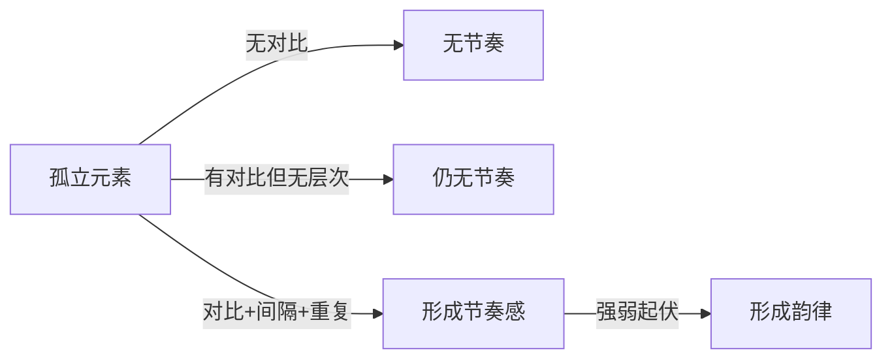
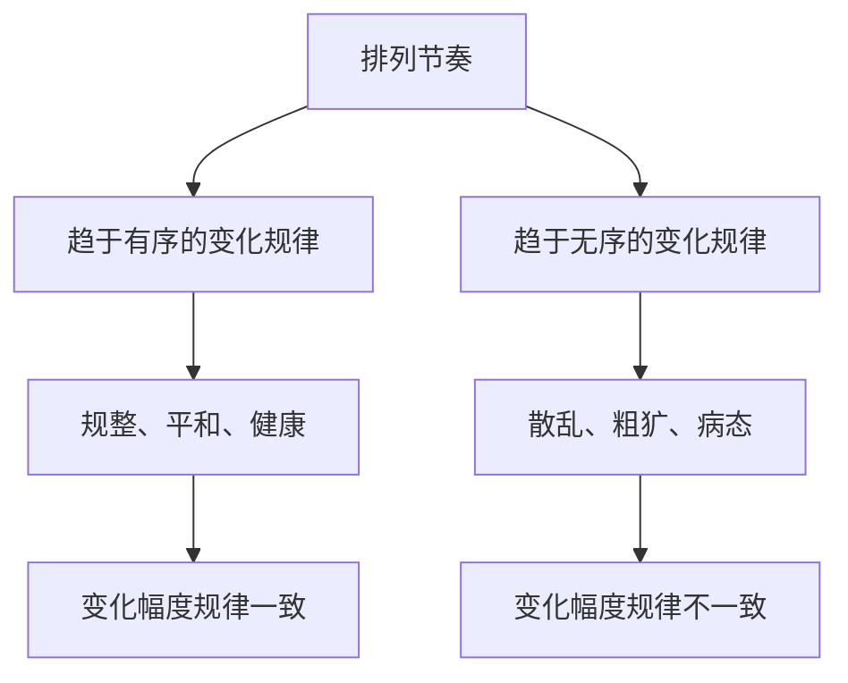
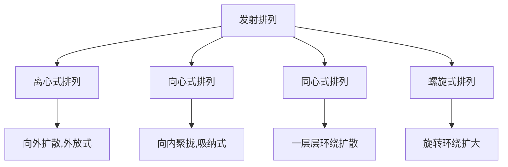

# 第02课：排列节奏

## 学习目标

- 理解排列节奏的基本概念及其与音乐节奏的类比关系
- 掌握通过元素的外观形式、间隔、趋势方向三个维度塑造不同节奏的方法
- 区分有序变化规律与无序变化规律及其对设计主题的影响
- 掌握重复排列、特异排列、渐变排列、发射排列四种节奏形式及其设计应用
- 理解不同排列节奏形式之间的内在联系和组合运用

## 核心概念

### 2.1 节奏的基本概念

在绘画和设计应用中，不同的元素以点、线、面的构成元素呈现，需要将这些元素进行有序地排列，以形成**节奏感**。节奏如同一首乐曲，不同的元素是构成节奏的音符，在画面中以排列的形式呈现，其变化过程呈现出明显的运动轨迹。

形成节奏的三个必要条件：

1. **元素对比**：排列中的基本元素形成对比，产生趋向性的变化
2. **间隔层次**：通过间隔或不同元素相互对比形成间隔，制造变化层次
3. **有规律重复**：变化层次形成有规律的重复组合关系

**韵律**是节奏的更高层次——当赋予节奏中各重复规律以不同强弱对比的起伏变化，形成不同层次的起伏区间时，便塑造了节奏的韵律。

节奏韵律可以存在于两个层面：

- **空间层面的节奏韵律**：静态元素的节奏韵律，如角色、场景、物件在相对静止空间内的造型和色彩节奏。
- **时间层面的节奏韵律**：静态主题呈现出的动态节奏韵律，如角色在不同时间段的动作、特效变化。

> [!TIP] Key Insight
> 节奏的本质是**变化的秩序**。没有变化就没有节奏，有变化但没有秩序则产生混乱。好的设计在"有序"与"无序"之间找到平衡点。

### 2.2 节奏元素的对比

元素之间的对比是形成节奏的基础。对比差异的大小直接影响节奏感的强弱：

| 对比差异 | 节奏感 | 韵律特征 |
|---------|-------|---------|
| 较小 | 较弱 | 不同起伏区间对比不明显 |
| 较大 | 较强 | 不同起伏区间对比明显 |

概念设计主要通过以下三个维度塑造不同的节奏：

#### 维度一：个体元素的外观形式对比

- **外形节奏**：通过元素形状、分量等造型上的对比变化呈现不同特征的节奏。
- **色彩节奏**：通过元素颜色的对比变化呈现不同特征的节奏。

将多个强弱不同的对比变化层次同时应用，可使外观形式呈现出多层次的节奏变化，形成丰富的节奏韵律。例如，巨龙背脊的造型变化强度较大，喉咙部分的造型变化强度较小，上下轮廓不同强弱起伏的节奏让外形具有多层次的韵律。

#### 维度二：个体元素之间的间隔对比

通过元素之间不同间隔的差异变化呈现不同特征的节奏。间隔紧密与间隔稀疏会形成截然不同的节奏特征。多个层次的间隔对比变化能形成丰富的节奏韵律，如武器设计中齿状刀刃的间隔较大，下方尖牙的间隔较小。

#### 维度三：个体元素的方向趋势变化

当排列中的个体元素具有明显的方向趋势特征时，能呈现不同的节奏特征。方向趋势变化是一种特殊的外观形式变化，实际应用中往往伴随着个体元素形状的变化。多个层次的趋势方向变化能形成丰富的节奏韵律。

在实际设计中，这三种节奏形态往往同时应用。例如，树干上不同种类的植物有不同的形状、色彩、间隔变化，同时外形还有方向趋势变化。

### 2.3 节奏的变化规律

节奏的变化规律可以归纳为两个方向：

#### 有序变化规律

相邻个体元素之间的变化幅度一致，呈现相对有序的节奏。可以通过以下方式实现：
- 外观形式变化幅度按一定比例变化
- 间隔变化幅度按一定比例递增或递减
- 方向趋势变化幅度呈一定角度变化

#### 无序变化规律

相邻个体元素之间的变化幅度不一致，呈现相对无序的节奏。可以通过以下方式实现：
- 外观形式变化没有固定比例
- 间隔变化无规律
- 方向趋势无规律

不同规律的排列节奏往往统一于整体的设计中。设计主体呈现出多种规律的排列节奏时，不同规律区间形成不同的起伏区间。例如，围墙整体呈现有序排列，但被破坏的部分呈现无序排列，体现了不同规律特征统一于整体设计中。

### 2.4 重复排列的节奏形式

**重复排列**是最基本的节奏结构表现形式，其特征是：以相同或相近的基本元素为主体，在基本格式内不断连续、有规律地反复出现。

#### 造型重复排列

以形状、大小、方向一致，间隔一致的造型为主体反复排列。弹链形态、二方连续或四方连续拼接的纹饰（墙面花纹、道路花纹、瓦片花纹、地砖花纹）、连续重复的廊柱结构等都是典型应用。

#### 颜色重复排列

以物体造型为基础，不同颜色的属性相互反衬，形成相互间隔并不断重复。红、蓝、黑交替穿插的纹饰是典型例子。颜色的重复排列可以赋予不同结构造型以同样颜色，使其具有重复排列形态。

#### 近似元素排列

由重复排列经过轻微不规则的变化形成，具有重复排列的统一感，同时变化的生动性更强。纹饰造型与固有色经过轻微变化构成的图案更为生动。昆虫一节一节具有相似造型和相似纹饰的躯体是较为典型的近似元素排列，让外观富有生动性。

### 2.5 特异排列的节奏形式

**特异排列**是重复排列的一种特殊表现形式：重复排列的局部插入形态变化较大的元素，形成变异部分与整体的明显反差，从而形成视觉中心。

特异排列的特征：
- 大部分面积由重复排列占据
- 局部元素变异，产生对比并形成视觉中心
- 具有很强的"线"与"点"的外观形式特征

#### 造型特异排列

在造型重复排列的基础上，局部元素出现造型变异。变异可以是形状的分量大小变化，也可以是形状本身的变异。形成特异的元素与整体造型对比差异越大，特异越明显。常用于强调某个局部点的存在感。

#### 颜色特异排列

在颜色重复排列的基础上，对局部色彩做出明显改变。色彩对比越强，颜色特异特征越明显。例如，蓝色油漆的木板中掉漆的木板在固有色上形成鲜明反差，构成颜色特异排列。

#### 间隔特异排列

局部元素与相邻元素的间隔出现变异。间隔对比较大，特异特征越明显。通过相同元素所处相对空间的差异，可强调画面中某个正在进行的事件形态，如导弹发射架中某一枚导弹凸出形成正在发射的状态。

#### 方向趋势特异排列

局部元素在趋势方向上出现变异。形成特异的元素因方向变化，其形状和空间位置也产生变化，因此也属于造型与间隔产生特异的特殊表现形式。例如，开启的盖子与相对闭合的盖子构成正在打开或关闭的事件形态。

### 2.6 渐变排列的节奏形式

**渐变排列**的基本特征：每个个体按一定规律处于递进式的逐渐变化，每个层次变化强度的强弱也呈递进式变化，产生秩序感和趋势感。

#### 造型渐变排列

- **大小渐变**：相同形状个体的大小逐渐变化，是最基础的造型渐变形式之一。如巨龙的尖角在一节节结构上从大到小的变化。
- **形状渐变**：两两相邻的个体具有相似的形状过渡，如圆形逐渐演变成四边形。植物从根部到顶端每一节结构之间都有明显相似形状的过渡。
- **虚实/抽象到具象渐变**：在游戏特效设计中尤为常见，如角色形象的变身、技能释放的形状变化。

#### 颜色渐变排列

- **交织过渡**：不同颜色之间没有明显边界，过渡柔和
- **色块递进过渡**：颜色边界较为明显，色块构成独立平面

实际设计中，颜色渐变排列往往结合平面切割的知识点，赋予不同元素或不同材质以相同或相似的固有色，制造色彩搭配关系。

#### 间隔渐变排列

体现在元素间隔疏密的变化上，可理解成元素之间负空间的间隔逐渐产生大小变化。间隔递增表现加速运动，间隔递减表现减速运动。沿着运动方向赋予拖影，本质是以间隔渐变排列制造速度感。

#### 方向趋势渐变排列

具有方向趋势性的元素在排列中方向逐渐变化。依次改变方向趋势的油桶，其轮廓形态和间距也产生变化，因此也体现出一定的造型和间隔渐变特征。例如，导弹发射架的防护盖依次打开，防护盖的造型在方向上呈现逐渐变化的形态。

### 2.7 发射排列的节奏形式

**发射排列**是重复排列、渐变排列在结构形式上的一种特殊演变，其特征为：

1. 具有较强的聚集点（最显著特征）
2. 具有较强的动感，由四周向中心聚集或由中心向四周扩散
3. 具备点、线、面的特性

#### 离心式、向心式排列

离心式排列呈向外扩散的形态，向心式排列呈向内聚拢的形态。这两种排列常用于地砖纹饰、旗帜纹饰、窗户拼花纹饰等。立体空间中也常见，如武器中嵌入的尖刺构成离心式排列，嵌入的铁块结构构成向心式排列。

#### 同心式排列

从中心聚焦点向外逐渐发射扩展，形成一层层环绕的结构。视觉聚焦效果相对离心式和向心式较弱，但通过拉开不同层次环绕结构的体积对比，可体现较强的空间层次感。当同心式排列运用在立体空间中，不同环绕层次形成球场式结构，具有很强的纵深感。

离心式、向心式、同心式排列在实际应用中往往同时出现，只是所占比例不同。

#### 螺旋式排列

从中心聚焦点向外逐渐旋转环绕并逐渐扩大。相较其他发射排列形式，螺旋式排列具有更大的创作自由度和动感，能表现出更多结构层次变化，常用于表现贴近自然形态或不安定形态的设计主体。

螺旋式排列形成的纹饰难以通过二方连续拼接制作，因此较少用于通用纹饰设计。场景设计中常用螺旋式排列表现自然形态（如岩石的卷曲结构）。

发射排列的结构具有极强的引导视线聚焦于中心的作用，是天然用于强调视觉中心的排列形式。放射状鸟类的羽冠结构、卷曲的生物形态、鹦鹉螺的结构等，都是自然界中发射排列的典型体现。

## 章节小结

本章系统讲解了排列节奏的完整知识体系：

1. **节奏形成的三要素**：对比、间隔、有规律重复
2. **三种对比维度**：外观形式、间隔、趋势方向
3. **两种变化规律**：有序与无序，统一于整体设计
4. **四种节奏形式**：重复排列（最基础）、特异排列（强调视觉中心）、渐变排列（秩序与趋势感）、发射排列（强烈聚集作用）

各节奏形式并非孤立存在，在实际设计中常组合运用，形成丰富的视觉层次。排列节奏是后续学习[[lessons/0003-jie-zou-de-zuo-yong|节奏的作用]]的基础。

## 自测练习

> [!QUESTION] 什么是形成节奏的三个必要条件？请分别说明。
> 

答案
1. **元素对比**：排列中的基本元素形成对比，产生趋向性的变化，这是形成节奏的基础。2. **间隔层次**：通过间隔或不同元素相互对比形成间隔，制造元素的变化层次。3. **有规律重复**：元素之间的变化层次形成有规律的重复组合关系。没有对比就没有节奏，有对比但没有间隔层次则仍无法形成节奏，三者缺一不可。

> [!QUESTION] 特异排列与重复排列是什么关系？特异排列的视觉功能是什么？
> 

答案
特异排列是重复排列的一种特殊表现形式。当重复排列的局部插入形态变化较大的元素时便形成特异排列。变异部分与整体的对比差异不能太大，且要不影响整体排列趋向，与整体形成明显反差。特异排列的功能在于通过局部元素变异产生对比，形成视觉中心，具有很强的"线"与"点"的外观形式特征。例如，一排水晶灯中占据某个位置的喷泉因造型、分量与水晶灯形成明显反差而成为视觉中心。

> [!QUESTION] 渐变排列有哪四种具体形式？其中间隔渐变排列如何表现速度感？
> 

答案
四种形式：1. 造型渐变排列（大小渐变、形状渐变、虚实/抽象到具象渐变）2. 颜色渐变排列（交织过渡、色块递进过渡）3. 间隔渐变排列 4. 方向趋势渐变排列。间隔渐变排列通过元素之间间隔疏密的变化表现速度感：间隔递增表现加速运动，间隔递减表现减速运动。例如鱼雷的间隔渐变排列，间距加大表示速度加快，间距缩小表示速度减慢。

> [!QUESTION] 发射排列有哪四种具体形式？各自的核心形式感特征是什么？
> 

答案
1. **离心式排列**：呈现向外扩散的形式感，外放式。2. **向心式排列**：呈现向内聚拢的形式感，吸纳式。3. **同心式排列**：从中心向外一层层环绕扩散，视觉聚焦效果相对较弱但空间层次感强。4. **螺旋式排列**：从中心向外逐渐旋转环绕扩大，创作自由度和动感最大。这四种形式在实际应用中往往同时出现，只是所占比例不同。离心式、向心式与同心式排列所构成的纹饰可通过二方连续拼接呈现，而螺旋式排列则难以这样处理。

> [!QUESTION] 什么是节奏的"韵律"？它和"节奏感"有什么区别？
> 

答案
节奏感是元素之间的变化层次形成有规律的重复组合关系的基本结构表象。韵律则是节奏的更高层次——当赋予节奏中各个重复的规律以不同强弱对比的起伏变化，形成不同层次的起伏区间时，便塑造了节奏的韵律。可以这样理解：节奏是"拍子"的重复，韵律是"旋律"的起伏。有节奏不一定有韵律，但有韵律必然有节奏。韵律使节奏的变化具有层次感和情感表现力。

## 延伸阅读

- [[lessons/0001-dian-xian-mian-ji-chu|第01课：点、线、面基础]] — 排列节奏的基本元素构成基础
- [[lessons/0003-jie-zou-de-zuo-yong|第03课：节奏的作用]] — 排列节奏如何塑造表现力、动态倾向与速度感
- [[lessons/0004-lun-kuo-jian-ying|第04课：轮廓剪影]] — 轮廓剪影的节奏韵律与排列节奏的关系