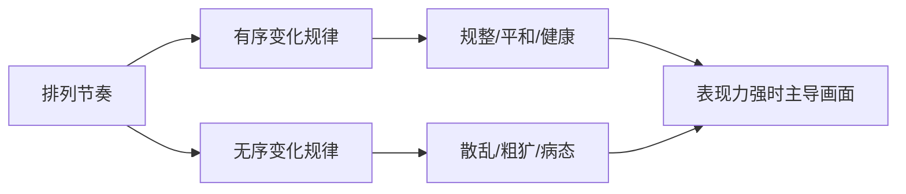
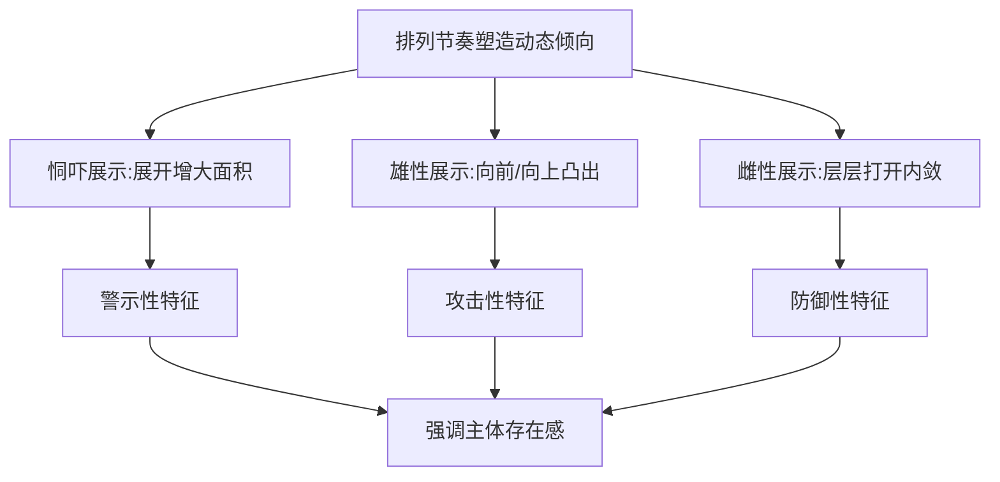
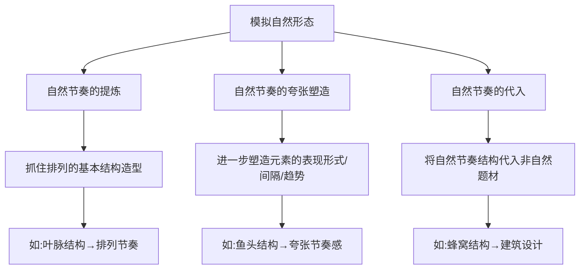

# 第03课：节奏的作用

## 学习目标

- 理解排列节奏如何通过三种方式塑造不同强弱的表现力
- 掌握有序与无序变化规律如何塑造不同的表现倾向
- 理解利用排列节奏塑造动态倾向的三种展示方式
- 掌握排列节奏表现趋势感和速度感的核心方法
- 理解通过提炼、夸张、代入三种方法模拟自然形态节奏

## 核心概念

### 3.1 排列节奏与表现力的关系

不同的排列节奏赋予设计对象不同的外观形式，外观形式的差异能够塑造不同的**表现力**。表现力直接关系到画面权重的呈现，起到传达不同表现强度的作用。

排列节奏塑造表现力主要通过以下三种方式：

#### 方式一：个体元素外观形式的变化幅度

在相似的分量下，个体元素变化幅度的大小让整体形成不同的外观形式。**个体元素之间的对比幅度越大，整体外观形式的表现力越强**。

例如，怪物珊瑚形状的结构对比跨度越大，整体表现力越强。在设计应用中，可赋予主体对象更大的对比跨度，次要对象较小的对比跨度，从而强调主体的表现力。

#### 方式二：个体元素外观形式的结构层次

结构层次的变化同样影响表现力：

- **相同元素排列的结构层次不同**：个体元素的结构层次越丰富，表现力越强。例如，武器中加入金属结构层次后，表现力强于只有骨骼结构的武器。
- **相同元素排列的重复层次不同**：重复层次越丰富，表现力越强。例如，尖刺排列只有一个层次时表现力较弱，更多重复层次的排列则表现力较强。

在场景设计中，结构层次较丰富的建筑表现力更强，重复层次较多、重复结构较明显的部分表现力更强。

#### 方式三：个体元素外观形式的变化规律

不同变化规律形成不同的外观形式。**相对有序的节奏表现力较弱；趋于无序的节奏通过不安定的表现倾向更能引起观者注意，表现力较强**。

例如，主视觉区域的树木轮廓变化规律趋于无序，次要区域的趋于有序，画面呈现出表现力的强弱关系。

> 排列节奏对表现力的塑造是以个体元素的表现力为基础的。若个体元素本身表现力相似，即便排列节奏不同，整体表现力差异也可能不大。

### 3.2 排列节奏塑造表现倾向

不同样式的排列节奏构成的不同外观形式，能够呈现出不同的**表现倾向**。塑造表现倾向，实质上是塑造不同变化规律的节奏。

在同样表现力的条件下，排列节奏中各元素的层次变化规律差异使整体外观形式呈现不同倾向：

| 变化规律 | 表现倾向 | 设计特征 |
|---------|---------|---------|
| **有序** | 规整、有序、平和、健康 | 变化规律一致，传达平静主题 |
| **不规则起伏** | 豪放、自由 | 变化规律有轻微不规则 |
| **无序** | 散乱、粗犷、病态 | 变化规律不一致 |

不同变化规律的排列节奏往往统一于主体的设计中。整体画面的表现倾向，通过节奏的不同表现力强弱来呈现：**当有序的排列表现力较强时，画面以有序表现倾向为主；当无序的排列表现力较强时，画面以无序表现倾向为主**。

### 3.3 排列节奏塑造动态倾向

排列节奏的过程性变化可以让设计对象产生**动态倾向**，赋予静止物体以动态倾向，并让呈现整体节奏排列的设计对象成为画面的视觉中心。

核心原理：赋予画面相同或相似的元素，分别呈现不同阶段的运动形态，让静止的物体呈现动态倾向。例如，飞机不同阶段的方向形态直观呈现运动形态变化。逐渐打开的防护盖让观者感受到过去和未来的状态，赋予静止对象以动态倾向。

排列节奏塑造动态倾向通过以下三种展示方式：

#### 恫吓展示——表现存在感

通过展开身体结构增大存在面积，形成一层层展开的动态倾向。以这种形式表现的主体往往具有更强的**警示性特征**。例如，河豚将军一层层逐渐展开的刀刃在静态画面中呈现出展开过程，构成恫吓展示。

#### 雄性展示——表现存在感

一节节向前、向上凸出的动态倾向，让主体在视觉上表现出逐渐延长的感觉，展示更强的**雄性特征**和**攻击性特征**。例如，电磁炮赋予更多层次、逐渐向前打开的结构特征，在外观形式上呈现更强的攻击性。

#### 雌性展示——表现存在感

一层层逐渐打开的动态倾向，让主体在视觉上表现出内敛、逐渐被吸纳、逐渐展示内核的感觉，展示**雌性特征**和**防御性特征**。例如，山洞结构由里向外层叠展开，呈现防御性特征。

> [!TIP] Key Insight
> 动态倾向的三种展示方式直接来源于自然界生物的演化行为——河豚膨胀、孔雀开屏、贝壳开合。将自然界的生物机制抽象为设计语言，是概念设计的核心思维方式之一。

### 3.4 排列节奏塑造趋势感和速度感

#### 趋势感的形成

1. **方向感是趋势感的基础**：分量相似的元素呈现线性排列能产生方向感
2. **关键元素的对比拉开**：造型变化对比、间隔对比、方向趋势对比都能让排列形成渐变过程，产生趋势感

#### 速度感的形成

排列的间隔让人们通过个体间距差异产生相对距离判断，从而感受画面表现的速度感。赋予个体元素不同间距差异便制造了不同速度感。

趋势感与速度感在设计中往往**共存并成正比**：趋势感强的设计对象速度感也较强，反之亦然。

#### 塑造方法

| 塑造方式 | 弱效果 | 强效果 |
|---------|-------|-------|
| **外观形式对比→趋势感** | 相邻元素大小对比小，趋势感弱 | 相邻元素大小对比大，趋势感强 |
| **间距对比→速度感** | 排列密集，速度感弱 | 排列稀疏，速度感强 |
| **趋势方向对比→趋势感** | 个体方向与整体垂直/相反，趋势感弱 | 个体方向与整体一致，趋势感强 |
| **趋势方向对比→速度感** | 个体方向与加速方向垂直/相反，速度感弱 | 个体方向与加速方向一致，速度感强 |

例如，跑车的涂装纹饰从左至右呈从大到小排列且间距逐渐变大，同时表现趋势感与速度感。飞行器内部图案的趋势方向与整体一致时加强趋势感，垂直时减弱，相反时进一步减弱。

### 3.5 排列节奏模拟自然形态

自然界的结构形式富有生命生长形成的节奏感。排列可以通过模拟自然形态结构的排列造型，让设计对象拥有自然形态结构的外观形式倾向。

自然形态的排列外观形式往往具有**相对秩序化的表现方向**，并在秩序化的基础上存在**错落的变化**。让同一构造分别处于生长的不同阶段，在排列中依次呈现，形成生长过程的变化，从而模拟自然形态的形式感。

模拟自然形态主要有以下三种方法：

#### 自然节奏的提炼

提炼自然界中结构形式的节奏变化是模拟自然形态的基础。关键要点是抓住排列的基本结构造型。例如：
- 提炼叶子的叶脉结构，得到具有叶脉特征的排列节奏
- 提炼动物皮肤上的肌理排列节奏（三角龙头冠肌理、乌贼皮肤条纹、剑鱼鱼鳍斑点）

#### 自然节奏的夸张塑造

在提炼出的结构变化趋势基础上进行夸张塑造。关键点是进一步塑造排列中个体元素的表现形式、间隔、趋势方向等，得到表现力更强的外形结构。例如，在鱼头部结构基础上夸张塑造，得到节奏感更强的外形。对鹦鹉螺尖刺进行不同程度的夸张，呈现不同的表现方向和表现力。

#### 自然节奏的代入

将提炼出的自然节奏结构代入非自然形态题材的设计中。关键点是将自然节奏结构与设计对象的造型相结合，让非自然形态题材具有自然结构特征。例如，将蜂窝结构应用于建筑、机械、武器等不同设计主题中。

设计对象代入什么自然节奏样式，原有自然节奏样式所表现的形式感也将对设计对象的形式感产生影响。例如，窗户结构模拟叶脉结构的外观形式，叶脉贴近自然形态的特征倾向便赋予了窗户。

## 章节小结

本章系统讲解了排列节奏在概念设计中的五种核心作用：

1. **塑造表现力**：通过变化幅度、结构层次、变化规律三种方式，控制设计对象在画面中的权重
2. **塑造表现倾向**：有序与无序的变化规律传达不同的情感倾向
3. **塑造动态倾向**：通过恫吓展示、雄性展示、雌性展示三种方式强调主体存在感
4. **塑造趋势感和速度感**：通过外观形式对比、间隔对比、方向趋势对比控制趋势感和速度感
5. **模拟自然形态**：通过提炼、夸张、代入三种方法赋予设计对象自然生命感

这些作用是排列节奏在概念设计中的核心价值所在。结合[[lessons/0001-dian-xian-mian-ji-chu|点线面基础]]和[[lessons/0002-pai-lie-jie-zou|排列节奏]]的知识，设计师可以系统地控制画面的视觉语言，为后续学习[[lessons/0004-lun-kuo-jian-ying|轮廓剪影]]和造型设计方法奠定基础。

## 自测练习

> [!QUESTION] 排列节奏塑造表现力有哪三种方式？请分别说明。
> 

答案
1. **个体元素外观形式的变化幅度**：个体元素之间的对比幅度越大，表现力越强。2. **个体元素外观形式的结构层次**：个体元素的结构层次越丰富、重复层次越丰富，表现力越强。3. **个体元素外观形式的变化规律**：相对有序的节奏表现力较弱，趋于无序的节奏通过不安定的表现倾向更能引起观者注意，表现力较强。

> [!QUESTION] 什么是排列节奏塑造动态倾向的三种展示方式？各自对应的特征是什么？
> 

答案
1. **恫吓展示**：通过展开身体结构增大存在面积，对应警示性特征。2. **雄性展示**：一节节向前、向上凸出的动态倾向，让主体视觉上逐渐延长，对应攻击性特征。3. **雌性展示**：一层层逐渐打开，内敛、逐渐展示内核的感觉，对应防御性特征。这三种方式的核心目的都是强调设计主体的存在感。

> [!QUESTION] 如何通过排列节奏控制设计对象的趋势感和速度感？请分别列出塑造方法。
> 

答案

> **趋势感**：方向感是基础，关键元素对比拉开使排列形成渐变过程。
> - 外观形式对比：相邻元素大小对比大则趋势感强，对比小则趋势感弱
> - 趋势方向对比：个体方向与整体一致则趋势感强，垂直/相反则趋势感弱
> 
> **速度感**：排列间隔产生相对距离判断。
> - 间距对比：排列密集则速度感弱，排列稀疏则速度感强
> - 趋势方向对比：个体方向与加速方向一致则速度感强，垂直/相反则速度感弱
> 
> 趋势感与速度感在设计中往往共存并成正比。

> [!QUESTION] 模拟自然形态的三种方法是什么？请各举一例说明。
> 

答案
1. **自然节奏的提炼**：抓住自然界中排列的基本结构造型。例如提炼叶子叶脉结构得到具有叶脉特征的排列节奏。2. **自然节奏的夸张塑造**：在结构变化趋势的基础上进一步塑造元素表现形式、间隔、趋势方向。例如在鱼头部结构基础上夸张塑造，得到节奏感更强的外形。3. **自然节奏的代入**：将提炼出的自然节奏结构代入非自然形态题材。例如将蜂窝结构应用于建筑、武器设计中，让非自然题材具有自然结构特征。

> [!QUESTION] 恫吓展示、雄性展示、雌性展示在表现存在感时，其排列结构的形式感有何不同？
> 

答案
恫吓展示的排列结构形式是一层层展开，在视觉上形成主体面积变大的感觉。雄性展示的排列结构形式是一节节向前、向上凸出，在视觉上表现出逐渐延长的感觉。雌性展示的排列结构形式是一层层逐渐打开，在视觉上表现出内敛、逐渐被吸纳、逐渐展示内核的感觉。三者都能强调主体存在感，但分别对应警示性、攻击性、防御性的不同特征。

## 延伸阅读

- [[lessons/0001-dian-xian-mian-ji-chu|第01课：点、线、面基础]] — 点线面基础知识是节奏作用的载体
- [[lessons/0002-pai-lie-jie-zou|第02课：排列节奏]] — 排列节奏的各种形式是节奏作用的基础
- [[lessons/0004-lun-kuo-jian-ying|第04课：轮廓剪影]] — 节奏作用在轮廓剪影层面的具体体现