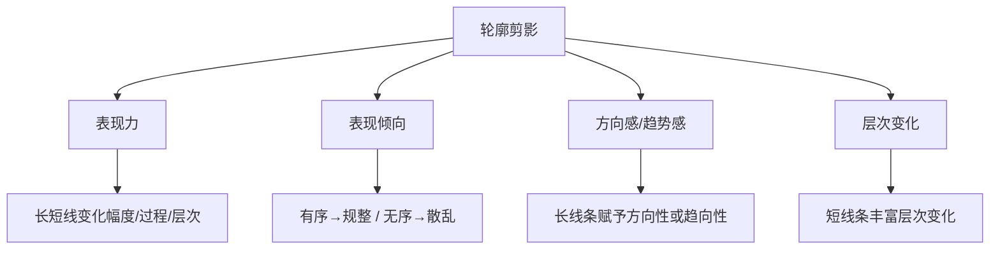

# 第04课：轮廓剪影

## 学习目标

- 建立轮廓剪影的观察意识，理解剪影对设计的基础性作用
- 掌握通过基础造型、不同视角、不同姿势、概括夸张、元素组合五种方式塑造轮廓剪影
- 理解轮廓剪影长短线对表现力、表现倾向、方向感、层次感的影响
- 掌握轮廓剪影节奏韵律的五个维度及其设计应用

## 核心概念

### 4.1 轮廓剪影的意识

**轮廓剪影**是物体概括性的形状。直射光投射于不同造型的物体上，可以获得不同形状的剪影，这种剪影可以在一定程度上呈现出该物体概括性的外形。

通过塑造轮廓剪影，只能呈现出物体最基础的、概括性的形状，以**长线条与短线条的对比变化**表现不同物体的形状特征。无论岩石、树木、建筑还是角色，都可以通过轮廓剪影塑造外观形式。

#### 建立轮廓剪影观察意识

轮廓剪影的观察意识在于：**将任何所观察到的复杂元素的整体外形看作概括性、抽象化的剪影图形**。例如，通过提炼岩石、瀑布、小树林的整体外形变化趋势，以统一色块填充，即可得到呈现概括性形状的轮廓剪影。

在所提炼的轮廓剪影基础上，通过重新组织不同的轮廓剪影形状，也可以呈现出画面的造型特征。

> 轮廓剪影的形状是深入塑造造型的基础，在设计中起到了**基础的形状塑造作用**。同样的剪影通过进一步塑造，有可能最终形成完全不同的元素。例如，同一个齿轮剪影可以衍生出多种不同的齿轮设计。

### 4.2 轮廓剪影的塑造

不同长短线所塑造的轮廓剪影呈现不同的平面切割样式。轮廓剪影的概括性极强，但本质仍在塑造具象元素。

以下五种方法用于塑造轮廓剪影：

#### 方法一：通过基础造型塑造

这是最基本的方法。武器、角色、岩石、树木、建筑、车辆等不同题材的设计原理相同，但需要考虑不同题材的形状合理性：

- **纹饰设计**：最基础的轮廓剪影表象之一，自由度较大。云纹长短线较平均，海浪长短线变化跨度较大。
- **武器设计**：剑身构成轮廓剪影长线，剑柄变化构成短线。长刀长线明显，短刀长短线对比较小。
- **角色设计**：通过不同形状的服饰与装备表现剪影变化。旗帜塑造长线条，羽毛装饰塑造另一种长线条。
- **岩石设计**：需考虑成因——风沙侵蚀形成的岩石与岩浆喷发形成的岩石长短线走向差异较大。
- **植物设计**：需结合环境及植物向上、向阳光、向水源的生长规律。长线条往往表现整体生长走向。
- **建筑设计**：核心是结合建筑结构关系。墙面立柱大多与地面垂直，屋顶可曲线可直线，线条可长可短。
- **机械设计**：需考虑机械结构合理性。车辆的长线条往往与运动方向相对水平。

#### 方法二：通过不同视角塑造

同样的造型因观察视角不同，呈现的轮廓剪影也不同。设计时需尽量选择呈现轮廓剪影较好的角度进行创作。在游戏设计中，以设计对象实际可能呈现在画面中的**主视角轮廓塑造为主**。

#### 方法三：通过不同姿势塑造

同样的造型因姿势不同，轮廓剪影也不同。这在角色设计中尤为常见。主体角色的塑造，在体型、装备、视角确定的前提下，通过较大动作幅度的姿势并结合动态结构（如披风被吹起），进一步塑造轮廓剪影的长短线对比。

#### 方法四：通过概括夸张塑造

通过概括夸张设计对象的形状可以塑造不同的轮廓剪影。尤其在卡通造型中应用广泛。提炼长的背脊轮廓形成画面的长线条部分，与其他短线条部分形成对比。不同的动态和姿势可以得到不同的轮廓剪影，概括夸张的表现方向也因此略有差异。

#### 方法五：通过不同元素组合塑造

同样的一组元素因组合方式不同，轮廓剪影也不同。在画面需要呈现较多元素时，需要考虑多个元素组合所构成轮廓剪影的长短线变化。在场景氛围图中，往往表现为**连贯的景别影调**——画面主体的轮廓剪影由多个物体组合构成，连续排列的物体形成连续的影调。

> [!TIP] Key Insight
> 轮廓剪影的观察意识本质上是一种**抽象化思维**——在设计的初始阶段，暂时忽略细节，只看最概括的形状。这种思维方式能够帮助设计师快速验证设计方案的可行性，避免过早陷入细节而失去整体感。

### 4.3 轮廓剪影的作用

构成轮廓剪影的不同长短线通过相互对比产生，不同的长短线变化构成了不同样式的外轮廓剪影造型，塑造基本的外观形式，表现基础的形式感。

#### 作用一：塑造最基础的表现力

结合排列节奏塑造表现力的知识，轮廓剪影的外观形式能传达最基础的表现力：
- **弱表现力**：外轮廓长线变化幅度小、变化过程柔和、变化层次稀少
- **强表现力**：外轮廓长线变化幅度大、变化过程强烈、变化层次丰富

#### 作用二：塑造最基础的表现倾向

结合排列节奏塑造表现倾向的知识，轮廓剪影的外观形式能传达最基础的表现倾向：
- **规整表现倾向**：长短线变化趋于有序的排列节奏
- **散乱表现倾向**：长短线变化趋于无序的排列节奏

#### 作用三：长线条塑造方向感和趋势感

线和面具有制造方向感和趋势感的特性。在轮廓剪影中，长线条呈现方向性或趋势性，赋予设计对象方向感或趋势感的外观形式特征。设计主体的外观形式长短线变化幅度越大，越趋于具有方向性或趋向性的面和线，方向感和趋势感越强。

长线条让角色具有较强的动势特性。当长线条明显的主体存在于画面中时，整体画面也呈现相应的方向感。例如列车炮作为画面主体，其长条形外观让画面呈现方向感。

#### 作用四：短线条塑造轮廓剪影的层次变化

在长线条赋予的方向感或趋势感外形基础上，通过塑造局部的短线条，能够赋予轮廓剪影层次变化。长线条中包含的短线条变化越丰富，整体轮廓剪影的层次感越强。

例如，倾斜的岩石具有明显的长线条和左右延伸的方向性，局部的小结构构成了长线条中短线条的变化，使岩石既有方向感又有层次变化。

### 4.4 轮廓剪影的节奏韵律

轮廓剪影的节奏由构成轮廓的基本元素——不同方向性的**长短线**构成。长短线作为节奏中的独立元素并互为间隔。轮廓剪影的节奏趋向是沿着物体轮廓剪影的外形**环绕呈现**的。

轮廓剪影的节奏韵律本质上是外观形式节奏在物体轮廓剪影塑造层面上的应用。其五个核心维度如下：

#### 维度一：节奏的塑造

将形成轮廓剪影的元素进行排列，让元素之间的变化形成有规律的重复组合关系，形成轮廓剪影的节奏感。变化规律相同并不断重复是一种较单调的节奏表现形式，往往用于表现较次要的内容。例如，联排建筑的轮廓剪影以相同对比变化不断重复，塑造的建筑主体较为普通。

#### 维度二：节奏的韵律起伏

赋予轮廓剪影节奏中重复的规律以不同强弱对比的起伏变化时，便产生韵律起伏。长短线变化表现出长、短、相对长、相对短的变化形式，构成**疏密关系对比**——稀疏简练、密集复杂、相对简练、相对复杂。例如，分量较小且形成连续变化的建筑构成密集部分，较大分量的建筑具有连贯长线条，形成简练部分。

在场景中，处理场景氛围图时表现为：同一景别层次下，不同元素共同构成剪影长短线的节奏韵律。例如，前景的雕像与树木共同构成该景别层次下轮廓剪影的节奏韵律。

#### 维度三：节奏的对比幅度

- **影响节奏感强弱**：对比幅度较小则节奏感较弱、表现力较弱；对比幅度较大则节奏感较强、表现力较强。
- **影响韵律特征强弱**：节奏感较弱的剪影韵律，不同起伏区间对比不明显；节奏感较强的剪影韵律，不同起伏区间对比明显。

比较题材相同、外观相似的建筑：左图以对比幅度较小的节奏塑造，不同长短线起伏层次接近，韵律特征不明显，外观平庸；右图以对比幅度较大的节奏塑造，不同长短线有明显起伏层次变化，韵律特征明显，外观醒目。

#### 维度四：节奏的变化规律

节奏是元素有规律的重复组合关系，轮廓剪影节奏必然存在变化规律特征并影响主体的表现倾向。以趋于有序的规律塑造轮廓剪影时，设计对象呈现规整倾向；以趋于无序的规律塑造时，呈现偏向混乱倾向。轮廓剪影塑造物体的表现倾向，本质上是通过节奏变化规律的特征在轮廓剪影塑造层面起作用的。

#### 维度五：节奏的局部层次

在元素较丰富的节奏韵律表现中，整体节奏元素中包含细微的变化，构成局部节奏层次。在局部层次上，轮廓剪影的节奏韵律表现为**大的轮廓剪影元素中也包含局部变化较细微的轮廓剪影节奏韵律**。局部的轮廓剪影节奏变化依附于整体的轮廓剪影节奏变化。

例如，斧头具有整体节奏但缺乏局部变化时节奏层次较弱；在整体轮廓剪影节奏韵律基础上加入细微结构变化后，斧头的节奏韵律层次更丰富。在角色设计中，角色的背包、枪械、忍者刀等装备赋予角色造型局部细微变化，丰富整体节奏韵律的层次感。

在内容较丰富的场景中，主体元素的轮廓剪影节奏层次较丰富，次要部分层次感较弱。例如，教堂作为画面主体，其轮廓剪影的节奏韵律变化较强，局部结构塑造丰富了教堂整体造型的局部节奏变化。

## 章节小结

本章系统讲解了轮廓剪影的完整知识体系：

1. **剪影意识**：将复杂元素看作概括性、抽象化的剪影图形，是设计的基础思维方式
2. **剪影塑造五种方法**：基础造型、不同视角、不同姿势、概括夸张、元素组合
3. **剪影的四大作用**：塑造基础表现力、表现倾向、长线条造方向感/趋势感、短线条造层次变化
4. **剪影节奏韵律五维度**：节奏塑造、韵律起伏、对比幅度、变化规律、局部层次

轮廓剪影作为造型设计的最基础环节，直接影响后续[[lessons/0005-ping-mian-qie-ge|平面切割]]和[[lessons/0006-ti-ji-jie-gou|体积结构]]等知识的应用效果。它也是将[[lessons/0002-pai-lie-jie-zou|排列节奏]]知识从抽象层面落到具象造型层面的关键桥梁。

## 自测练习

> [!QUESTION] 什么是轮廓剪影的观察意识？为什么建立这种意识对概念设计很重要？
> 

答案
轮廓剪影的观察意识是指将任何所观察到的复杂元素的整体外形看作概括性、抽象化的剪影图形。例如，通过提炼岩石、瀑布、小树林的整体外形变化趋势，以统一色块填充得到呈现概括性形状的轮廓剪影。建立这种意识非常重要，因为轮廓剪影能够直观地呈现出物体最基本的外观形式，是概念设计在最初阶段传达设计想法、验证设计方案是否切实可行的有效方法。它帮助设计师在开始阶段就把握整体，避免过早陷入细节。

> [!QUESTION] 轮廓剪影的塑造有哪五种方法？
> 

答案
1. **通过基础造型塑造**：不同题材（武器、角色、岩石、植物、建筑、机械）有各自的设计原理和合理性考量。2. **通过不同视角塑造**：同一造型因视角不同轮廓不同，选择呈现最佳的角度。3. **通过不同姿势塑造**（角色设计中常见）：同一造型因姿势不同轮廓不同。4. **通过概括夸张塑造**：在卡通造型中尤为常见，提炼长线条与短线条的对比。5. **通过不同元素组合塑造**：多个元素组合构成的轮廓造型，在场景氛围图中表现为连贯的景别影调。

> [!QUESTION] 轮廓剪影中长线条和短线条各自承担什么作用？
> 

答案
长线条塑造方向感和趋势感。在轮廓剪影中，长线条呈现方向性或趋势性特性，赋予设计对象方向感或趋势感的外观形式特征。设计主体的外观形式长短线变化幅度越大，方向感和趋势感越强。短线条塑造轮廓剪影的层次变化。在长线条赋予的方向感或趋势感外形基础上，通过塑造局部的短线条能够赋予轮廓剪影层次变化。长线条中包含的短线条变化越丰富，整体轮廓剪影的层次感越强。

> [!QUESTION] 轮廓剪影的节奏韵律有哪五个核心维度？
> 

答案
1. **节奏的塑造**：将形成轮廓剪影的元素进行排列，让元素之间的变化形成有规律的重复组合关系。2. **节奏的韵律起伏**：赋予重复规律以不同强弱对比的起伏变化，形成疏密关系对比。3. **节奏的对比幅度**：长短线对比幅度影响节奏感和韵律特征的强弱。4. **节奏的变化规律**：有序规律呈现规整倾向，无序规律呈现混乱倾向。5. **节奏的局部层次**：整体节奏中包含细微的局部变化，丰富节奏韵律的层次感。

> [!QUESTION] 在游戏场景设计中，为什么要选择主视角进行轮廓剪影塑造？举例说明。
> 

答案
因为游戏设计对象在3D游戏中很可能是全方位视角呈现的，设计时不可能顾及每个角度的轮廓。因此，以设计对象实际可能呈现在画面中的主视角轮廓塑造为主。例如，铁匠铺在游戏中往往具有特殊功能，可以引导玩家接近、进入，正面的表现是游戏实际呈现的主视角。塑造其剪影的外轮廓，可以更贴近游戏实际呈现的画面。同样，角色设计中也往往以角色的标准展示视角（如正面或正侧45度视角）作为主要轮廓剪影塑造角度。

## 延伸阅读

- [[lessons/0001-dian-xian-mian-ji-chu|第01课：点、线、面基础]] — 轮廓剪影中的长短线对应点线面知识
- [[lessons/0002-pai-lie-jie-zou|第02课：排列节奏]] — 轮廓剪影的节奏韵律是排列节奏在造型层面的应用
- [[lessons/0003-jie-zou-de-zuo-yong|第03课：节奏的作用]] — 排列节奏的作用在轮廓剪影中的具体体现
- [[lessons/0005-ping-mian-qie-ge|第05课：平面切割]] — 轮廓剪影的下一环节，进一步细化造型分割