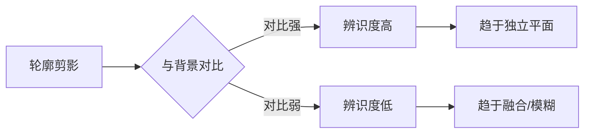
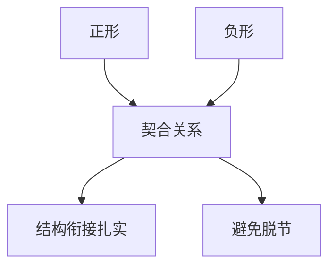
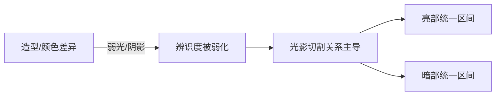
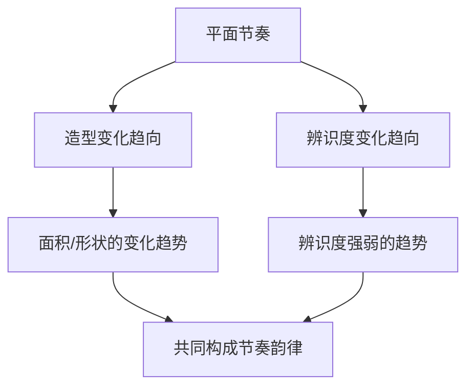

# 第05课：平面切割

## 学习目标

- 理解平面切割的基本概念，建立辨识度意识
- 掌握外轮廓平面与内轮廓平面的区分及其层次关系
- 理解正负形契合关系及其在结构衔接中的应用
- 掌握平面切割的三种塑造方法：疏密对比、固有色/材质对比、光影对比
- 掌握平面切割在表现力、表现倾向、空间关系、结构层次等方面的作用
- 理解并应用平面切割的节奏韵律及其变化规律

## 核心概念

平面切割是概念设计中从轮廓剪影迈向内部结构塑造的关键步骤。轮廓剪影形成外轮廓平面，而通过辨识度的差异进一步切分得到内轮廓平面，由此构成设计对象丰富的层次关系。平面切割的核心在于**辨识度**——封闭区间与背景的对比越强，辨识度越高，越趋于独立的平面。

本章涵盖平面切割的意识建立、正负形契合关系、三种塑造方法、六大作用以及节奏韵律的完整体系。

---

### 5.1 平面切割的意识

#### 辨识度与封闭区间

封闭的轮廓区间能够形成**平面**。当轮廓围合的区间与背景的对比能够形成明显趋于整体的封闭区间时，此独立区间即为一个平面。轮廓剪影的图案与背景的对比越强，辨识度越高，越能够趋于独立的平面。

因此通过辨识度的差异，能够塑造不同层次的平面切割关系。在此基础上，平面主要分为**外轮廓平面**和**内轮廓平面**。

#### 外轮廓平面与内轮廓平面

- **外轮廓平面**：长短线围合形成的轮廓剪影与画面背景对比，具有较高辨识度，形成独立区间，构成最基础的平面。如建筑的剪影、角色的剪影、车辆的剪影，本质上都是大小、形状不同的平面。
- **内轮廓平面**：在外轮廓平面的基础上，进一步塑造更多层次的辨识度，构成封闭区间。如建筑的不同结构、角色服饰的不同材质、车辆的不同元素物件，本质上都是对外轮廓平面进一步塑造辨识度后形成的内轮廓平面。

外轮廓平面与内轮廓平面构成**整体与局部**的层次关系。内轮廓平面包含于外轮廓平面中，其辨识度通常低于外轮廓平面与背景的辨识度。

> [!TIP] Key Insight
> 内轮廓平面之间形成的内轮廓线，同样由不同的长短线构成。长短线的变化节奏韵律直接影响设计对象的外观形式感。

---

### 5.2 平面切割的正负形契合关系

平面切割必然形成**正形**和**负形**的关系，即**图与底**的关系：

- **图**：在画面中成为视觉对象的部分
- **底**：周围其余的部分

> [!TIP] Key Insight
> 正形与负形的塑造是**相辅相成**的——在塑造主体轮廓剪影的同时，事实上也塑造了背景的轮廓剪影。

#### 契合关系

正形与负形相互衔接表现出的过渡关系，是通过**契合关系**实现的，即正形的造型与负形的造型的相互结合关系。

缺乏契合关系会使结构之间脱节；具有契合关系的平面过渡，能够让设计对象的平面衔接关系更为扎实。在对内轮廓线进行塑造时，呈现出正负形契合关系是设计中常见的结构表现形态。

在场景设计中，平面的契合关系还表现为设计主体的正空间通过负空间的间隔形成有一定距离的契合关系。

---

### 5.3 平面切割的塑造

平面切割的塑造可以概括为：**通过制造不同辨识度所构成的相对封闭的区间，从而形成平面切割关系**。主要有三种方法：

#### 1. 造型疏密对比塑造平面切割

通过造型的**简单与复杂**对比制造不同的辨识度。在色调较为单一的设计对象中较为常用：

- 机械设计：外装甲简练与内部机械结构复杂形成对比
- 场景设计：分量小但密集的元素 vs 分量大但结构简练的元素

#### 2. 固有色或材质对比塑造平面切割

不同材质呈现不同的固有色与质感。相同材质呈现的质感能够与固有色形成封闭的区间。

在此基础上，设计中常通过赋予不同材质以相同的纹饰涂装、喷漆或污渍等，弱化原始材质质感，改变平面切割关系，呈现新的样式。

在场景氛围设计中，受空气透视、光线反射等外界因素影响，不同材质可能呈现相同或接近的颜色，从而趋于同一个平面（如天空与海洋颜色接近时构成同一平面区间）。

#### 3. 光影对比塑造平面切割

强烈的光亮或阴影可以**弱化**不同造型和颜色的辨识度，使光影关系所形成的平面切割关系成为主导：

- 强光区域：形成统一的亮部封闭区间
- 阴影区域：形成统一的暗部封闭区间

在场景氛围图中，这种方法最为常用——既可用强光统一远景建筑群，也可用大面积阴影统一岩石暗部。

> [!TIP] Key Insight
> 三种塑造方法可以**叠加使用**，在同一设计中，不同区域的平面切割可能由不同方法主导，共同构成丰富的层次关系。

---

### 5.4 平面切割的作用

平面对比变化可以分为**造型对比变化**和**辨识度对比变化**，主要通过以下几个方面影响设计的形式感：

#### 1. 塑造表现力

平面之间的变化幅度越大、变化过程越强烈、变化层次越丰富，外观形式的表现力越强；反之则越平庸。

#### 2. 塑造表现倾向

内轮廓剪影所形成平面切割关系的排列节奏决定了表现倾向：
- 趋于有序的排列节奏 → 规整的表现倾向
- 趋于无序的排列节奏 → 混乱的表现倾向

#### 3. 塑造方向感、速度感、趋势感和体积感

结合[[lessons/0002-pai-lie-jie-zou|排列节奏]]的知识点：
- 平面趋于大小相似的排列 → 方向感
- 平面趋于聚合或从大到小 → 趋势感
- 平面垂直于外轮廓趋势方向并环绕物体 → 体积感

#### 4. 塑造空间关系

- **同一景别层次**：平面上左右相对位置的空间关系
- **不同景别层次**：平面前后遮挡、空间穿插

#### 5. 通过辨识度对比塑造空间层次

轮廓剪影与背景对比的辨识度越高，不同景别之间的空间层次感越强；辨识度越低，层次感越弱。

#### 6. 通过辨识度对比塑造结构层次

平面切割相互之间的辨识度对比越强，结构层次跨度越大；对比越弱，结构层次越趋于整体。

> [!TIP] Key Insight
> 平面切割的外观形式是概念设计在最初阶段传达设计想法、验证设计方案是否切实可行的有效方法。

---

### 5.5 平面切割的节奏韵律

#### 基本元素与趋向

平面的基本元素是指在平面切割中不同辨识度的封闭区间，直观表现为不同面积、不同长宽比的外观形式。

同一物体平面节奏的变化趋向由以下方面共同构成：
- 造型疏密对比的趋势变化
- 材质与固有色对比的趋势变化
- 光影对比的趋势变化

两种变化趋向：
1. **造型变化趋向**：平面造型基本元素的趋向性变化
2. **辨识度变化趋向**：平面之间辨识度对比的趋向性变化

#### 节奏的塑造

**有规律的重复**是节奏的基本结构表象。对形成平面的元素进行排列，让元素之间的变化形成有规律的重复组合关系。

#### 节奏的韵律起伏

赋予重复的规律以不同的对比呈现**起伏变化**时，节奏便产生韵律：
- 造型变化：大面积→小面积→相对大面积→相对小面积
- 辨识度变化：强对比→弱对比→相对强对比→相对弱对比
- 内轮廓线：相应呈现节奏韵律特征

平面节奏韵律承接[[lessons/0004-lun-kuo-jian-ying|轮廓剪影]]节奏韵律，又是[[0006-ti-ji-jie-gou|体积结构]]节奏韵律的基础。

#### 节奏的对比幅度

- 对比幅度小 → 节奏感弱 → 表现力弱
- 对比幅度大 → 节奏感强 → 表现力强

#### 节奏的变化规律

平面节奏的变化规律特征影响设计主体的表现倾向：
- 趋于有序 → 规整的表现倾向
- 趋于无序 → 混乱的表现倾向

#### 节奏的局部层次

大的封闭区间之中包含局部变化较细微且辨识度较低的平面节奏韵律。局部节奏依附于整体节奏，丰富了整体的层次感。

> [!TIP] Key Insight
> 在角色设计中，可以赋予局部平面结构细微的大小结构过渡、纹理对比等，并赋予其一定的节奏变化，从而丰富平面节奏的层次感。在场景设计中，主体元素平面节奏层次丰富，次要部分则呈现弱对比关系。

---

## 章节小结

平面切割是从轮廓剪影到内部结构塑造的桥梁。通过辨识度的控制，设计师可以在外轮廓平面基础上切分出内轮廓平面，形成丰富的层次关系。正负形契合关系确保了结构的牢固衔接。三种塑造方法（疏密对比、固有色/材质对比、光影对比）为设计师提供了灵活的工具箱。在设计中，平面切割不仅塑造表现力和表现倾向，还能影响方向感、体积感、空间关系和结构层次。而平面切割的节奏韵律，则是抽象的设计形式感在造型层面上的具象化体现。

## 自测练习

> [!QUESTION] 1. 什么是辨识度？辨识度的高低如何影响平面的形成？
> 

答案
辨识度是指封闭轮廓区间与背景对比的明显程度。对比越强，辨识度越高，越能形成独立的平面；对比越弱，辨识度越低，平面越趋于融合。

> [!QUESTION] 2. 外轮廓平面与内轮廓平面的区别是什么？它们之间构成什么关系？
> 

答案
外轮廓平面由轮廓剪影与背景对比形成，是设计对象最基础的平面；内轮廓平面是在外轮廓平面基础上进一步切分形成的，构成整体与局部的层次关系。内轮廓平面包含于外轮廓平面中，其辨识度通常低于外轮廓平面。

> [!QUESTION] 3. 平面切割的三种塑造方法是什么？请各举一个应用实例。
> 

答案
（1）造型疏密对比——机械外装甲简练与内部结构复杂的对比；（2）固有色或材质对比——蒸汽车不同材质（金属、木材、瓦片）形成的颜色区间；（3）光影对比——强光下亮部形成统一封闭区间，或大面积阴影暗部形成统一封闭区间。

> [!QUESTION] 4. 平面切割的正负形契合关系在设计中起到什么作用？缺乏契合关系会有什么后果？
> 

答案
正负形契合关系使不同结构的平面衔接更扎实。缺乏契合关系会使结构之间显得脱节。契合关系同样也是体积结构关系契合的基础。

> [!QUESTION] 5. 平面切割如何塑造空间关系？它能够塑造哪两种空间关系？
> 

答案
（1）同一景别层次下平面上相对位置的空间关系（左右/上下）；（2）不同景别层次下前后遮挡、空间穿插的空间关系。后者通过平面之间的相对位置塑造与空间穿插实现。

> [!QUESTION] 6. 平面切割的节奏韵律包含哪些要素？对比幅度如何影响表现力？
> 

答案
包含造型变化趋向、辨识度变化趋向、内轮廓线变化、韵律起伏、对比幅度、变化规律及局部层次。对比幅度较小时节奏感弱、表现力弱；对比幅度较大时节奏感强、表现力强。

## 延伸阅读

- [[lessons/0004-lun-kuo-jian-ying|轮廓剪影]] — 平面切割的基础，外轮廓平面的来源
- [[lessons/0002-pai-lie-jie-zou|排列节奏]] — 平面切割节奏韵律的理论基础
- [[0006-ti-ji-jie-gou|体积结构]] — 平面切割在立体空间中的延伸
- [[0007-se-cai-da-pei|色彩搭配]] — 通过固有色对比进一步塑造平面切割