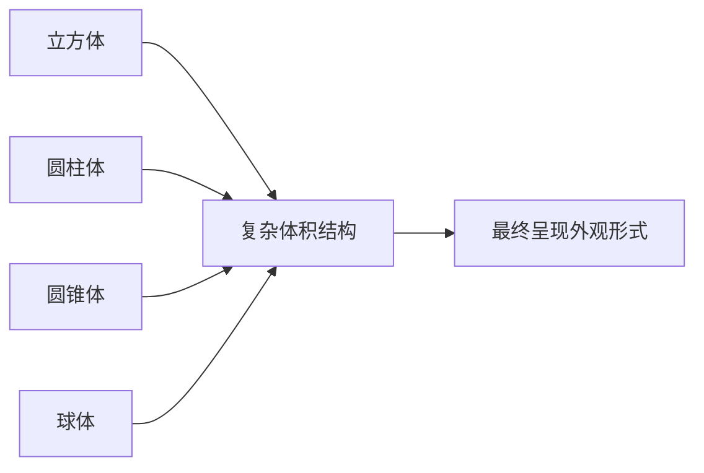
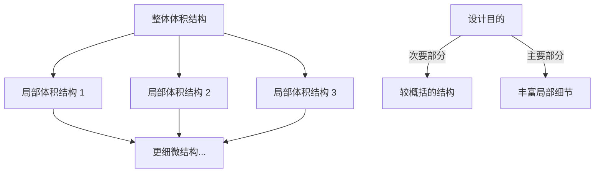
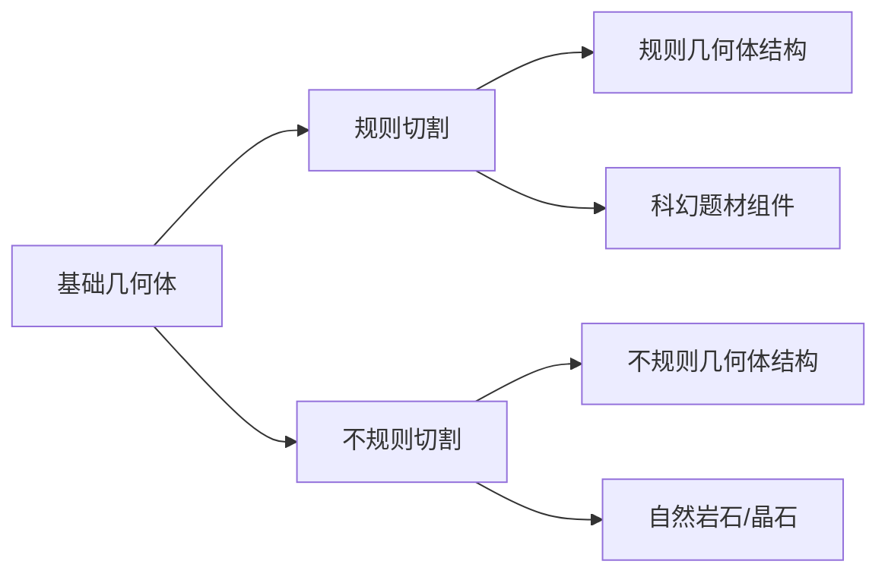
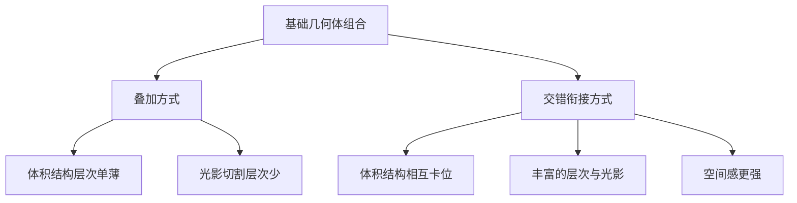
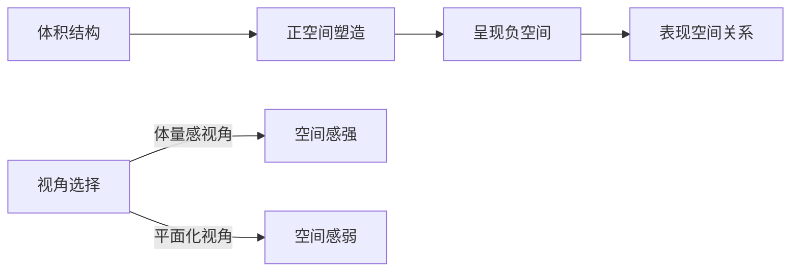
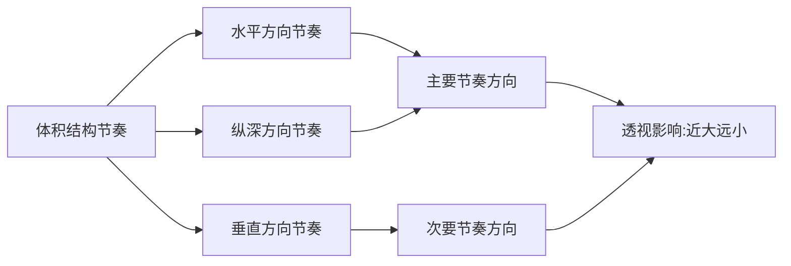

# 第06课：体积结构

## 学习目标

- 建立万物皆由基础几何体结构构成的观察意识
- 掌握观察体积结构的五个重要方面
- 理解平面切割的正负形契合关系在立体空间中的延伸
- 掌握体积结构的四种塑造方法：基础几何体、切割几何体、组合几何体、扭曲几何体
- 理解体积结构在塑造表现力、表现倾向和空间关系中的作用
- 掌握体积结构节奏韵律的塑造方法及其透视影响

## 核心概念

体积结构是概念设计中造型塑造的最终呈现形式。轮廓剪影形成平面，而平面切割的本质是将立体设计案例简化于平面空间内。设计对象的外观形式最终以**立体的造型**呈现于空间中，即元素具有的体积结构。

本章从观察意识的建立入手，系统讲解体积结构的塑造方法、作用及其节奏韵律。

---

### 6.1 体积结构的意识

#### 万物皆由基础几何体构成

建立**万物皆由基础几何体结构构成**的意识，即设计的对象都是由**圆柱体、立方体、圆锥体、球体**等基本的几何体结构演变塑造而来的。

轮廓剪影所塑造的平面切割关系，最终以体积结构呈现其外观形式。因此，在设计轮廓剪影时，也应以体积结构为基础进行塑造。平面切割所形成的正负形契合关系，最终也以**体积结构的契合**呈现。

#### 观察体积结构的五个要点

##### 1. 忽略纹理颜色

物体的固有色往往具有较丰富的变化，会干扰对体积结构形状的判断。应先将物体过滤为单一颜色的几何体进行观察。

> [!TIP] Key Insight
> 同样的体积结构可以通过不同的纹理、颜色呈现不同主题，但其造型本质（体积结构）是一致的。例如纸箱趋于立方体结构，不同的涂装带来不同的主题，但立方体结构不变。

##### 2. 忽略局部结构

整体体积结构不会因为局部结构的差异而改变整体外观形式。观察时应先把握整体，暂时忽略局部。

##### 3. 局部体积结构包含于整体体积结构中

在把握整体结构的基础上，进一步切分观察局部的体积结构，挖掘整体中的细节。越是复杂的物体，从整体到局部体积结构的层次也越多。

##### 4. 带有曲面的体积结构由多个直面构成

任何包含曲面的体积结构，都要将其曲面表面概括为多个**连续的直面**。连续的围合面越多，外形越趋于圆润的曲面。

##### 5. 平面结构的本质是厚度较小的体积结构

在立体空间中，平面的本质是**厚度较小的体积结构**。任何单薄的平面结构（如报纸、光盘），都应将其当作立体空间中的面片体积结构。

---

### 6.2 体积结构的塑造

#### 1. 基础几何体结构的塑造

一些结构较为简单的元素以基础几何体造型呈现，如球体的篮球、圆柱体的车轮、圆锥体的路障、立方体的纸箱等。

特点：整体感强，但结构变化较少，较单调。通常结合较强光照的明暗对比呈现结构关系，在画面中常作为次要部分。

#### 2. 切割基础几何体结构

- **规则切割**：对基础几何体做规则切割，塑造相对规则的体积结构（如科幻题材组件）
- **不规则切割**：对基础几何体做不规则切割，塑造自然的体积结构（如岩石、晶石）

#### 3. 基础几何体结构相组合

对基础几何体或切割后的几何体进行组合，塑造较为复杂的体积结构。

**两种组合方式**：

| 组合方式 | 特点 | 空间感 | 表现力 |
|---------|------|--------|--------|
| 叠加方式 | 层次单薄 | 较弱 | 较弱，用于次要部分 |
| 交错衔接方式 | 层次丰富 | 较强 | 较强，用于主体 |

#### 4. 扭曲基础几何体结构

对基础几何体做扭曲，塑造曲面变化较强的结构，呈现**曲线外观形式**。造型可概括为"拧紧毛巾"的结构特征。

两种扭曲形态：
- **单一扭曲**：如螺旋式生长的树木
- **扭曲并相互缠绕**：若干扭曲结构叠加缠绕，空间感最强

> [!TIP] Key Insight
> 扭曲并产生螺旋式的体积结构在外观表现上最为复杂和富于变化，是体积结构塑造方法中较难掌握的部分。

---

### 6.3 体积结构的作用

轮廓剪影、平面切割的构成形态最终以体积结构呈现于立体空间中，对设计的形式感产生以下影响：

#### 1. 塑造表现力

不同体积结构之间的变化幅度越大、变化过程越强烈、层次越丰富，表现力越强。

#### 2. 塑造表现倾向

立体空间中体积结构的排列节奏决定表现倾向：
- 有序排列 → 规整
- 无序排列 → 混乱

#### 3. 塑造空间关系

相对于[[0005-ping-mian-qie-ge|平面切割]]只能说明一部分空间关系，体积结构能够**直接表现**设计对象处于立体空间中的外观形式。

- 体积结构塑造属于**正空间塑造**
- 在正空间塑造基础上呈现负空间
- 赋予能够体现体积结构关系的视角，空间感更强

---

### 6.4 体积结构的节奏韵律

#### 基本元素与趋向

基本元素是立体空间中不同大小、不同长短、不同厚度及不同外观形式的体积结构，以不同体积结构之间的**负空间**作为间隔形成节奏中的独立元素。

体积结构节奏的趋向在**立体空间**中呈现，往往结合轮廓剪影长线条的趋势，从体积较大的元素向体积较小的元素变化。

#### 透视因素的影响

同样的造型处于空间中的不同位置，因近大远小的影响，整体画面中呈现出不同的表象。透视视野越大，影响也越大。

#### 节奏的韵律起伏

赋予重复规律以不同对比呈现起伏变化时，节奏产生韵律。不同体积结构的变化表现出：较大体积→较小体积→相对较大体积→相对较小体积（或相对长→相对短、相对立体→相对扁平）。

与[[lessons/0004-lun-kuo-jian-ying|轮廓剪影]]和[[0005-ping-mian-qie-ge|平面切割]]不同，体积结构具有较强的独立性，其节奏必然会结合**间隔节奏**进行塑造——即体积结构之间的负空间节奏关系。

#### 节奏的对比幅度

- 对比幅度小 → 节奏感弱 → 表现力弱 → 韵律特征弱
- 对比幅度大 → 节奏感强 → 表现力强 → 韵律特征强

体积结构的对比幅度反过来也会影响轮廓剪影与平面切割的对比幅度。

#### 节奏的变化规律

- 有序变化规律 → 规整表现倾向
- 无序变化规律 → 混乱表现倾向

#### 节奏的局部层次

大的体积结构变化中包含局部变化较细微且较小的体积结构节奏韵律，局部节奏依附于整体节奏。

> [!TIP] Key Insight
> 在机械设计或场景设计中，主体的体积结构节奏变化层次较多、幅度较大；次要部分的层次较少、幅度较小。这是拉开主次关系的重要手段。

---

## 章节小结

体积结构是概念设计中造型的终极呈现形式。建立"万物皆由几何体构成"的观察意识是第一步，通过忽略纹理颜色、忽略局部结构、把握从整体到局部的观察顺序、用直面概括曲面、理解平面的面片本质这五个要点，可以准确分析任何复杂形体的体积结构。四种塑造方法（基础几何体、切割、组合、扭曲）为设计提供了从简单到复杂的完整塑造路径。体积结构直接决定空间关系的表现，其节奏韵律将抽象的设计形式感落实于立体空间之中。

## 自测练习

> [!QUESTION] 1. 观察体积结构时，为什么要忽略纹理颜色和局部结构？
> 

答案
纹理颜色会干扰对体积结构形状的判断；局部结构会干扰对整体体积结构形状的判断。观察应先过滤颜色、先看整体再分析局部。

> [!QUESTION] 2. 四种体积结构塑造方法分别是什么？各自适用于什么场景？
> 

答案
（1）基础几何体结构——简单元素，整体感强，用于次要部分；（2）切割几何体——规则切割用于科幻组件，不规则切割用于自然岩石晶石；（3）组合几何体——复杂结构，叠加方式层次单薄用于次要部分，交错衔接方式层次丰富用于主体；（4）扭曲几何体——曲线曲面结构，螺旋生长或缠绕形态。

> [!QUESTION] 3. 叠加方式与交错衔接方式在组合体积结构时有何不同？
> 

答案
叠加方式使体积结构层次单薄、空间感弱，光影切割层次少，常用于次要部分。交错衔接方式使体积结构相互卡位，层次丰富、空间感强，光影切割层次多，常用于主体元素以强调表现力。

> [!QUESTION] 4. 体积结构如何塑造空间关系？与平面切割相比有何不同？
> 

答案
体积结构属于正空间塑造，通过结构表现画面的空间感，能直接表现设计对象处于立体空间中的外观形式。而平面切割只能通过相对位置和遮挡说明一部分空间关系。体积结构塑造的空间关系更加直接和强烈。

> [!QUESTION] 5. 透视因素对体积结构的节奏有何影响？
> 

答案
同样的造型因在空间中位置不同，受近大远小透视影响，在画面中呈现不同表象。近处的构成较大体积元素，远处的构成较小体积元素。透视视野越大，影响越大。场景设计中建筑由近及远的体积结构节奏变化就是典型例子。

## 延伸阅读

- [[lessons/0004-lun-kuo-jian-ying|轮廓剪影]] — 体积结构的基础造型来源
- [[0005-ping-mian-qie-ge|平面切割]] — 体积结构在平面上的投影与切分
- [[lessons/0002-pai-lie-jie-zou|排列节奏]] — 体积结构节奏韵律的理论基础
- [[0007-se-cai-da-pei|色彩搭配]] — 通过固有色和光影进一步强化体积感