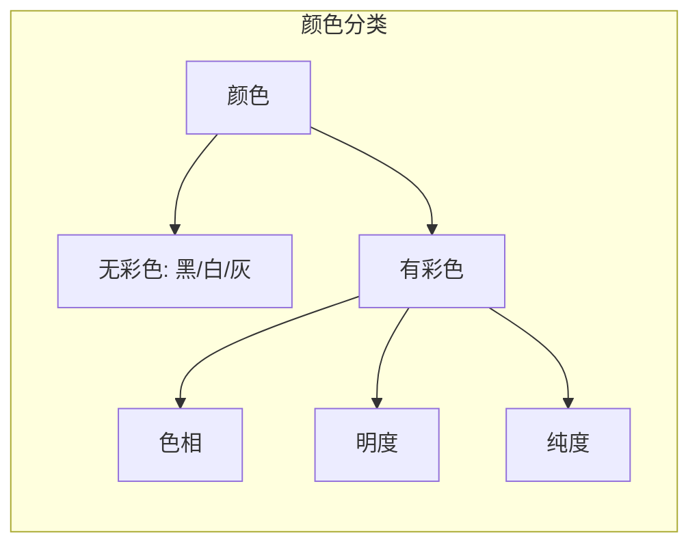
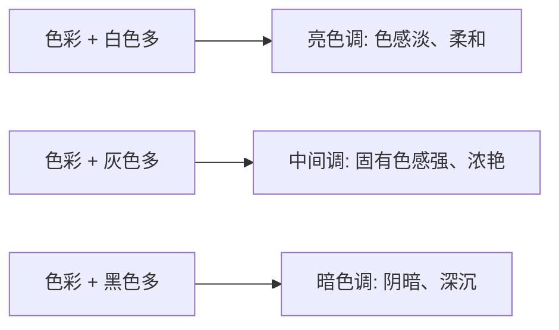
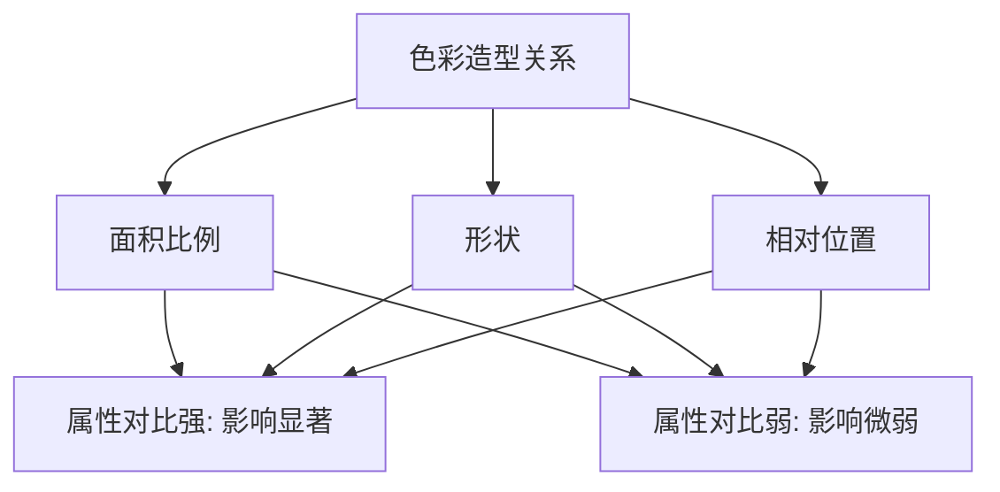
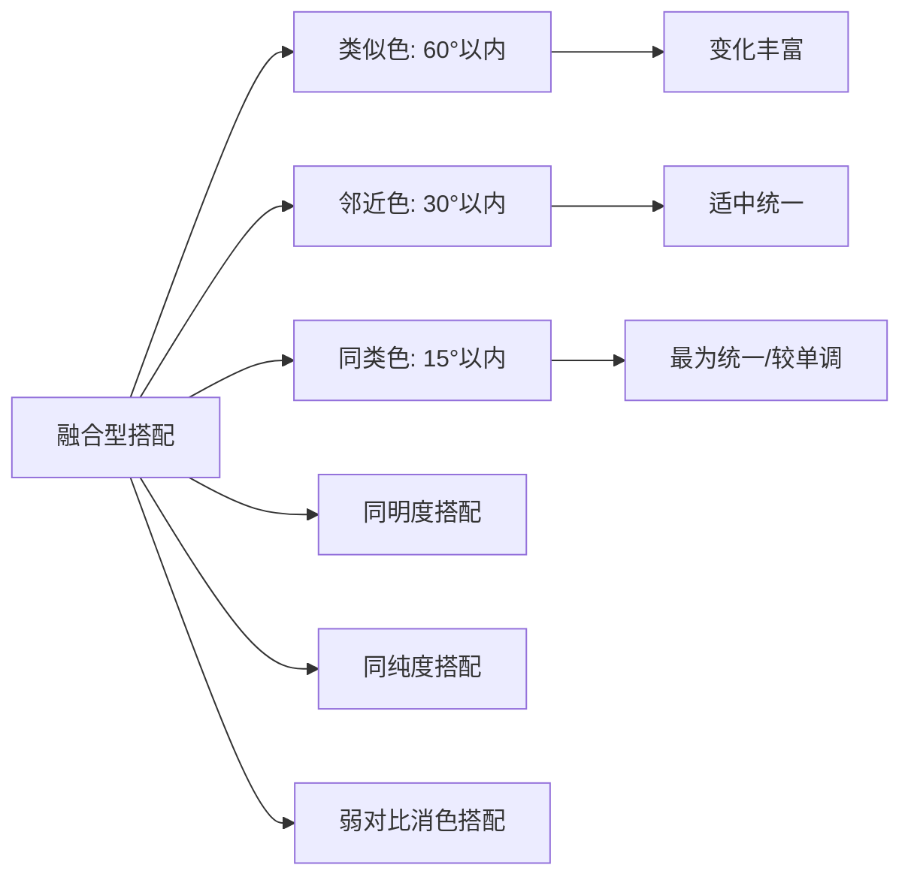
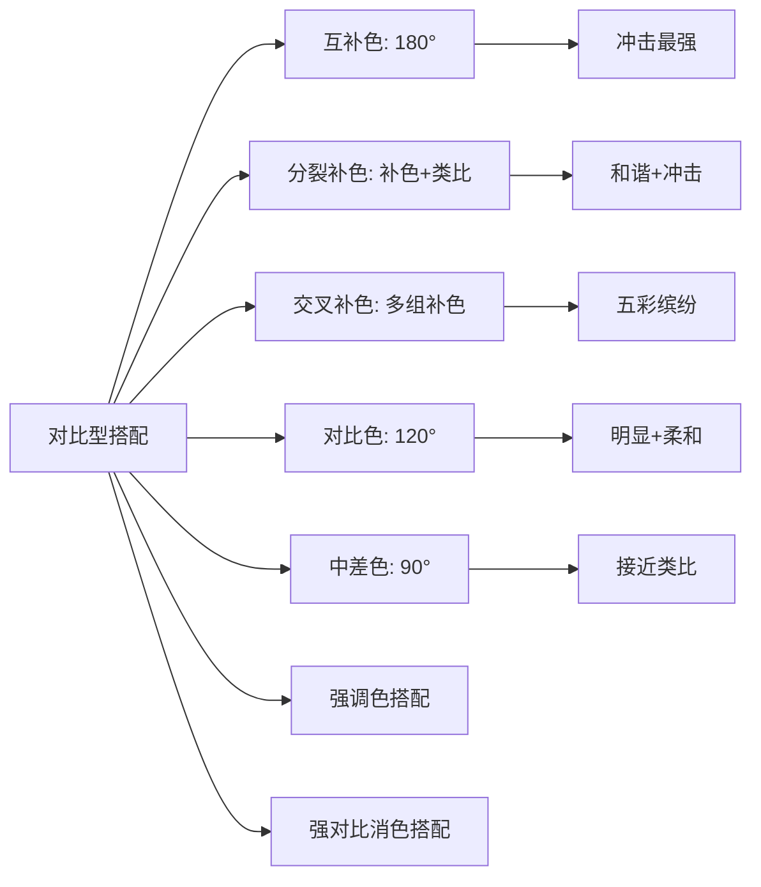
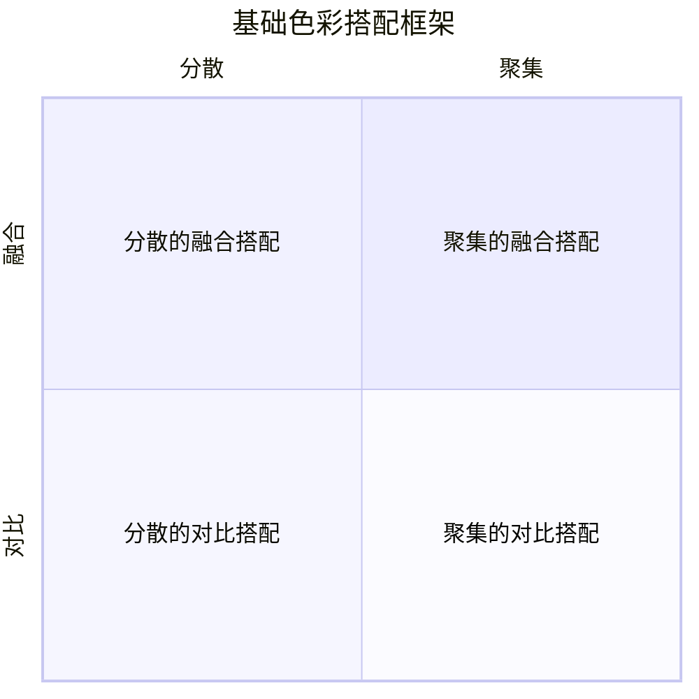
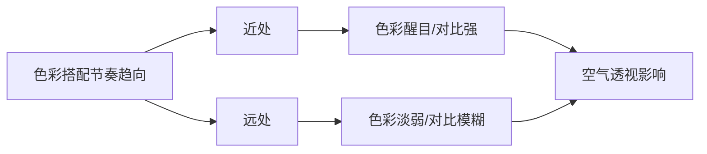

# 第07课：色彩搭配

## 学习目标

- 掌握颜色的三种基本属性：色相、明度、纯度
- 理解色调的形成及其分类方式
- 掌握四种颜色属性对比：消色对比、色相对比、明度对比、纯度对比
- 理解色彩造型关系对比：面积比例、形状、相对位置
- 了解色彩材质差异对比的原理
- 掌握融合型与对比型两大色彩搭配模式及其细分类型
- 理解色彩搭配的塑造方法（基础搭配、色彩数量、调和/隔离、材质）
- 掌握色彩搭配在设计中的五大作用
- 理解并应用色彩搭配的节奏韵律

## 核心概念

色彩搭配是概念设计中将[[0005-ping-mian-qie-ge|平面切割]]的造型关系与颜色属性相结合的过程。不同辨识度的色彩能够形成平面切割关系，而色彩搭配以固有色塑造的平面切割关系为基础，通过推敲颜色属性上的对比变化而形成。同样的平面切割关系，通过色彩完善其外观形式，能呈现不同的形式感，传递不同的情绪。

本章内容极为丰富，涵盖从颜色基础属性到复杂的色彩节奏韵律的完整体系。

---

### 7.1 颜色的基本属性

颜色分为**无彩色**和**有彩色**：

- **无彩色**：单纯表现为黑、白、灰的属性
- **有彩色**：具有色相、明度和纯度的属性

#### 色相属性 (Hue)

色相是颜色的相貌称谓，是色彩最基本的属性。红、橙、黄、绿、青、蓝、紫为基本色相。

**冷暖属性**：
- **暖色**：红色、橙色等 → 温暖、热情
- **冷色**：蓝色、青色等 → 寒冷、安静
- **中性色**：绿色、紫色 → 可趋于冷色也可趋于暖色，取决于搭配环境

> [!TIP] Key Insight
> 中性色可以根据与其搭配的不同颜色呈现不同的冷暖倾向。在设计中，常利用中性色的这一特性，调和画面中整体冷暖对比变化跨度较大的区域，让色彩过渡更柔和。

#### 明度属性 (Value)

明度指颜色的明暗深浅程度，受两方面因素影响：
1. **不同颜色的不同明度**：每种纯色都有与其对应的明度
2. **同一色相的不同明度**：受光照强度影响，或加黑/加白后的变化

#### 纯度属性 (Saturation)

纯度也称饱和度，指颜色中含色成分的比例：
- 有色成分越多 → 纯度越高
- 有色成分越少 → 纯度越低 → 越趋于无彩色

---

### 7.2 色调 (Tone)

**色调**是画面中色彩的总体倾向。单种颜色没有呼应对比，就不能成为色调。

#### 无彩色的色调

根据明暗程度不同，大致分为：**暗色调、浅色调、亮色调**

#### 有彩色的色调

- **以色相划分**：红、橙、黄、绿、青、蓝、紫为倾向的色调 + 冷暖色调
- **以明度划分**：浅、中、深等色调
- **以纯度划分**：鲜明、浓重、钝涩等色调

根据混合的不同分量的黑、白、灰色，可将有彩色色调概括为：

同样的造型以不同的色调搭配，能呈现不同的外观形式与形式感。

**局部色调层次**：在整体色调基础上，画面局部因光照、景别、空气透视等因素，呈现不同色调层次。

---

### 7.3 色彩的颜色属性对比

颜色的属性对比是色彩搭配的基础。较弱的对比 → **融合型搭配**；较强的对比 → **对比型搭配**。

#### 1. 消色对比 (无彩色对比)

无彩色之间只有明暗差别，没有色相和纯度的差别。明暗对比跨度越大，对比关系越强。黑色与白色对比最强。

#### 2. 色相对比 (Hue Contrast)

以色相属性跨度变化为基础的对比关系。色相跨度越大，对比越强，辨识度越高。

色相也具有**冷暖对比**属性：冷色区间与暖色区间的对比。

#### 3. 明度对比 (Value Contrast)

以明度属性跨度变化为基础的对比关系。明度跨度越大，对比越强。

**光影对明度的影响**：
- 处于阴影中的颜色明度低，色相对比辨识度也低
- 大面积阴影具有融合不同色彩的作用

**反射率**：白色反射率最高，在暗部中仍然明显；黑色反射率最低，在亮部中较为明显。

#### 4. 纯度对比 (Saturation Contrast)

以纯度属性跨度变化为基础的对比关系。纯度跨度越大，对比越强。

**底色的影响**：底色比图案色纯度更高时，图案色显得更低；底色比图案色纯度更低时，图案色显得更高。

**光照对纯度的影响**：
- 强光区域：纯度降低，具有融合作用
- 阴影区域：纯度相对较高，对比关系较强

> [!TIP] Key Insight
> 场景设计中常利用景别、光照、空气透视等因素，赋予主要部分高纯度色彩，次要部分低纯度色彩，拉开画面层次。

---

### 7.4 色彩的造型关系对比

色彩搭配效果与颜色的**面积比例**、**形状**和**相对位置**有直接关系，有时甚至比颜色选择更为重要。

#### 1. 色彩的面积比例

| 面积关系 | 效果 |
|---------|------|
| 大面积颜色 | 主导色调，烘托/融合小面积颜色 |
| 相似面积颜色 | 色彩抗衡，对比效果最强 |
| 中央大面积颜色 | 主导画面，弱化边缘颜色 |
| 中央小面积颜色 | 背景主导色调 |

**设计原则**：
- 大面积颜色 → 低纯度或低对比度（降低刺眼感）
- 中等面积 → 中等对比度
- 小面积 → 鲜艳明亮色彩（吸引注意力）

#### 2. 色彩的形状

在颜色属性对比一致的情况下：
- 轮廓**琐碎、复杂**的色彩形状 → 对比关系**弱**
- 轮廓**完整、简练**的色彩形状 → 对比关系**强**

当颜色属性对比关系较弱时，形状差异对色彩对比的影响也较弱。

#### 3. 色彩之间的相对位置

| 位置关系（属性对比强时） | 对比效果 |
|------------------------|---------|
| 距离远 | 对比差异较小 |
| 相互接触 | 对比差异较大 |
| 相互切入 | 对比差异更大 |
| 一色包围一色 | 对比差异最大 |

当颜色属性对比关系较弱时，相对位置差异的影响极其微弱。

---

### 7.5 色彩的材质差异对比

色彩依附于不同材质，不同材质表面的组织结构不同，对光的反射能力也不同。

**不同材质的光学特性**：

| 材质类型 | 光学现象 | 色彩表现 |
|---------|---------|---------|
| 粗糙非透明 | 漫反射 | 色彩光泽度低，明度稍低 |
| 光滑非透明 | 镜面反射 | 色彩光泽度高，对比度高 |
| 透明 | 折射 | 透视后方颜色 |
| 半透明 | 子面散射 | 色彩纯度较高 |

> [!TIP] Key Insight
> 相同的固有色在不同粗糙度或不同透明度的表现下，会呈现出色彩上的差异。设计中可通过赋予不同材质塑造色彩之间的对比差异。

---

### 7.6 融合型的色彩搭配模式

色彩属性对比关系较弱，形成**融合型**搭配。以**类比色**为基础，色调相对统一，更容易营造区域主题氛围。

#### 1. 类似色搭配 (Analogous Colors)

- **范围**：色环上60°以内
- **特点**：色调变化范围最大，画面相对整体且变化丰富
- **感觉**：平静、调和
- **用途**：较为常用

#### 2. 邻近色搭配 (Adjacent Colors)

- **范围**：色环上30°以内
- **特点**：色调变化范围适中，比类似色更统一，比同类色更清晰

#### 3. 同类色搭配 (Monochromatic Colors)

- **范围**：色环上15°以内
- **特点**：色调变化范围最小，画面最为整体，同色深浅
- **感觉**：单纯、柔和、高雅、文静、朴实
- **不足**：对比效果单调

#### 4. 同明度搭配
相似明度的色彩搭配。明度相似时，往往赋予画面较大的纯度对比来拉开层次。

#### 5. 同纯度搭配
相似纯度的色彩搭配。纯度相似时，往往赋予画面较大的明度对比来拉开层次。

#### 6. 弱对比的消色搭配
无彩色对比区间集中于较小范围时，画面内容辨识度不高，较为模糊。

---

### 7.7 对比型的色彩搭配模式

色彩属性对比关系较强，形成**对比型**搭配。以**间隔色**为基础，颜色辨识度高，更容易切割画面、强调重点。

#### 1. 互补色搭配 (Complementary Colors)

- **范围**：色环上相距180°
- **特点**：色调变化范围最大，色彩对比最强
- **感觉**：视觉冲击力强，但可能不安定、不协调
- **处理**：大面积颜色纯度较低，重点突出的小面积颜色纯度高

#### 2. 分裂补色搭配 (Split-Complementary)

- **方法**：同时用互补色及类比色的方法确定颜色关系
- **特点**：既有类比色的整体统一，又有互补色的视觉冲击力
- **优点**：既和谐又有重点

#### 3. 交叉补色搭配 (Double-Complementary)

- **构成**：两组或多组相邻的互补色
- **特点**：具有多组互补色对比特征，相邻颜色形成类比色特征
- **感觉**：五彩缤纷、生动
- **关键**：控制颜色之间的比例

#### 4. 对比色搭配 (Contrast Colors)

- **范围**：色环上间隔120°
- **特点**：色彩对比明显，但比互补色柔和
- **常见**：红色与蓝色、橙色与绿色等两种对比色搭配

#### 5. 中差色搭配 (Intermediate Contrast)

- **范围**：色环上间隔90°
- **特点**：间隔较小，接近类比色的形式感
- **注意**：四种中差色搭配实质形成两组互补色，冲突极强

#### 6. 强调色搭配 (Accent Color)

低明度或低纯度的大面积色块与小面积高纯度色块形成鲜明对比。低纯度/低明度颜色几乎可以和任何高纯度颜色搭配并形成协调关系。

当低纯度足够接近黑、白、灰时，便构成**有彩色和消色**的搭配。

#### 7. 强对比的消色搭配

无彩色对比区间呈现较大范围。其中黑色与白色对比幅度最大，视觉冲击力极强。

---

### 7.8 色彩搭配的塑造

色彩搭配的核心思路：对不同的颜色、不同形状的颜色及不同数量的颜色进行分配，形成不同的比例关系，即**色与形的分配**。

#### 1. 基础色彩搭配与造型的塑造

四种基础方向：

- **分散的融合搭配/聚集的融合搭配**：辨识度较低，可用于次要部分
- **分散的对比搭配**：色彩较为花哨
- **聚集的对比搭配**：色彩对比关系最强，常用于主要部分

#### 2. 色彩数量的塑造

四种方向：
- 少数色彩的融合搭配 / 多数色彩的融合搭配
- 少数色彩的对比搭配 / 多数色彩的对比搭配

融合搭配色彩数量越多，色块辨识度越低，色彩越模糊。对比搭配中多色数量能呈现更多层次，使色块过渡更柔和。

#### 3. 色彩的调和与隔离塑造

- **调和**：色彩对比过强时，利用中间色做调和，中和过强的对比
- **隔离**：色彩对比过弱时，利用与两者对比都强烈的颜色做隔离，切割过弱的对比

#### 4. 色彩材质塑造

对不同材质的塑造可以让相同固有色搭配呈现更丰富的变化：
- 漫反射材质：色彩关系稳定
- 镜面反射/半透明材质：色彩变化较大

> [!TIP] Key Insight
> 塑造色彩搭配的过程往往是同时考虑色彩与形状的过程。基础框架（融合/对比 × 分散/聚集）加上色彩数量的层次，再通过调和/隔离微调，结合材质差异，构成了完整的色彩搭配塑造体系。

---

### 7.9 色彩搭配的作用

#### 1. 色彩塑造表现力

弱对比的色彩 → 变化幅度小 → 表现力平庸
强对比的色彩 → 变化幅度大 → 表现力强

#### 2. 色彩塑造表现倾向

色彩变化有序 → 规整感觉
色彩变化无序 → 混乱感觉

#### 3. 通过配色塑造空间关系

结合光照、视距、空气透视等因素：
- 前景：固有色搭配鲜明
- 中景：色彩对比关系较弱
- 远景：色彩融合，对比模糊

#### 4. 配色影响视觉分量

- **色相**：暖色 → 视觉膨胀（显大）；冷色 → 视觉收缩（显小）
- **明度/纯度**：高明度/高纯度 → 膨胀感；低明度/低纯度 → 收缩感

#### 5. 鲜艳色彩强化色彩刺激

鲜艳的颜色能够制造"点"，形成视觉中心。高纯度的中差色、对比色等强对比搭配常用于广告牌等需要吸引注意力的设计。

---

### 7.10 色彩搭配的节奏韵律

#### 基本元素与趋向

基本元素是**不同属性的颜色**，以不同颜色属性的对比差异作为间隔形成节奏中的独立元素。

色彩搭配节奏的趋向：从**较为醒目的、对比关系较强的**色彩区间，往**较为淡弱的、对比关系较弱的**色彩区间变化。

#### 空间的色彩节奏

同样的色彩处于空间中不同位置，受空气透视影响：
- 近处：色彩对比强烈
- 远处：色彩对比逐渐模糊

#### 节奏的韵律起伏

外观表现上，不同色彩之间的对比变化表现出：
- 醒目的颜色与淡弱的颜色之间 → 较强/较弱对比关系
- 醒目的颜色之间 / 淡弱的颜色之间 → 对比关系

场景设计中，结合画面的影调，将醒目固有色安排在中近景，并结合雾气、尘埃等因素调整色彩对比关系。

#### 节奏的对比幅度

- 对比幅度小 → 融合型搭配 → 节奏感弱
- 对比幅度大 → 对比型搭配 → 节奏感强

色彩节奏的对比幅度同时也是平面辨识度节奏的对比幅度。

#### 节奏的变化规律

色彩的变化规律特征影响设计主体的表现倾向。但色彩单独对表现倾向的影响较小，**色彩结合形状**的变化规律才更明显。

#### 节奏的局部层次

大的色彩搭配对比变化中包含局部色彩对比变化较小的节奏。较小的对比变化可以是：
- 某种颜色的融合搭配
- 色彩出挑但面积较小的点缀

> [!TIP] Key Insight
> 在角色设计中，脖子处局部面积较小的醒目色彩可以起到点缀作用；在场景设计中，前景黄色小植物即使色彩出挑，只要面积足够小，就能在不影响整体色彩节奏的基础上起到点缀作用。

---

## 章节小结

色彩搭配是概念设计中涉及知识面最广、变化最丰富的环节。从颜色的三种基本属性（色相、明度、纯度）出发，通过对色调的把控，设计师可以运用融合型（类比色系）或对比型（间隔色系）搭配模式，结合面积比例、形状、位置等造型关系，以及材质差异对比，塑造出千变万化的色彩方案。色彩搭配的塑造需要综合考虑"色与形的分配"，通过基础框架、色彩数量、调和隔离和材质四个层面来控制最终效果。色彩的节奏韵律贯穿于整个画面，从近到远、从强到弱，与造型共同构成设计对象完整的外观形式。

## 自测练习

> [!QUESTION] 1. 有彩色的三种基本属性是什么？分别简述其含义。
> 

答案
色相：颜色的相貌称谓，是最基本的色彩属性；明度：颜色的明暗深浅程度；纯度：也称饱和度，指颜色中含色成分的比例。

> [!QUESTION] 2. 融合型色彩搭配模式包括哪些细分类型？各自的特点是什么？
> 

答案
（1）类似色（60°以内）：变化最大，画面较统一且丰富；（2）邻近色（30°以内）：介于类似色与同类色之间；（3）同类色（15°以内）：最为统一但较单调。此外还包括同明度搭配、同纯度搭配和弱对比消色搭配。

> [!QUESTION] 3. 互补色搭配和分裂补色搭配有何不同？
> 

答案
互补色是色环上相距180°的两种颜色，对比最强，视觉冲击力大但可能不协调。分裂补色是互补色中一种颜色用其两侧的类比色替代，既保留了类比色的整体统一又具备互补色的视觉冲击力，更加和谐。

> [!QUESTION] 4. 色彩的面积比例如何影响色彩搭配效果？设计中有何原则？
> 

答案
大面积颜色主导色调，相似面积产生色彩抗衡（对比效果最强）。设计原则：大面积用低纯度/低对比度，中等面积用中等对比度，小面积用鲜艳明亮色彩。背景用小面积时用高对比，背景用大面积时可适当提高背景对比度。

> [!QUESTION] 5. 什么是色彩的调和与隔离？分别在什么情况下使用？
> 

答案
调和是当色彩对比过强时，利用中间色做调和使过渡柔和。隔离是当色彩对比过弱时，利用与两者对比都强烈的颜色做隔离来切割过弱的对比，拉开色彩层次。

> [!QUESTION] 6. 色彩搭配如何影响空间关系？
> 

答案
受光照、视距、空气透视影响。前景色彩鲜明（固有色搭配为主），中景色彩对比减弱，远景色彩融合模糊。不同景别的色调差异强调了场景的空间关系。

> [!QUESTION] 7. 色彩搭配的节奏趋向如何变化？受什么因素影响？
> 

答案
从醒目、对比强的色彩区间往淡弱、对比弱的色彩区间变化。受物体所处空间位置影响，同样的色彩因不同距离受空气透视影响不同，近处对比强、远处对比模糊。

## 延伸阅读

- [[0005-ping-mian-qie-ge|平面切割]] — 色彩通过辨识度差异形成平面切割关系
- [[lessons/0004-lun-kuo-jian-ying|轮廓剪影]] — 色彩搭配的基础造型载体
- [[lessons/0002-pai-lie-jie-zou|排列节奏]] — 色彩节奏韵律的理论基础
- [[0008-biao-xian-li|表现力]] — 色彩搭配对表现力的影响