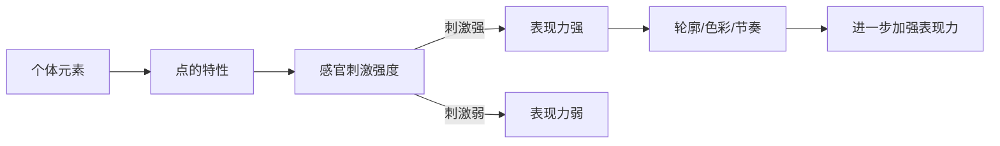
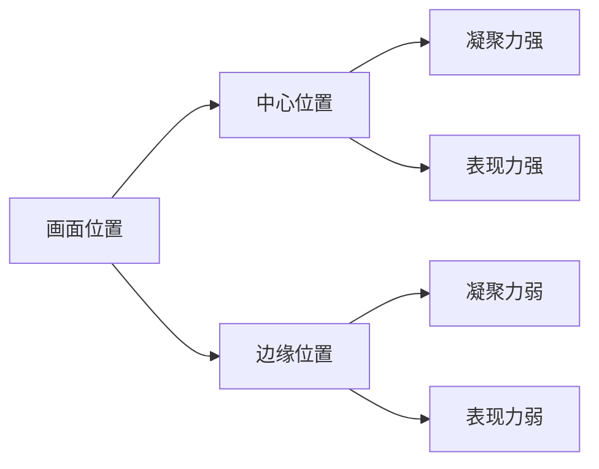
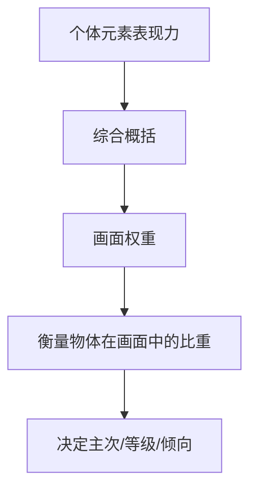
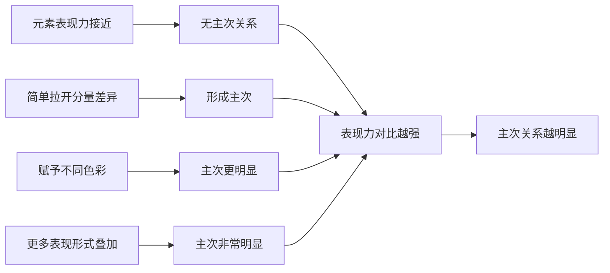
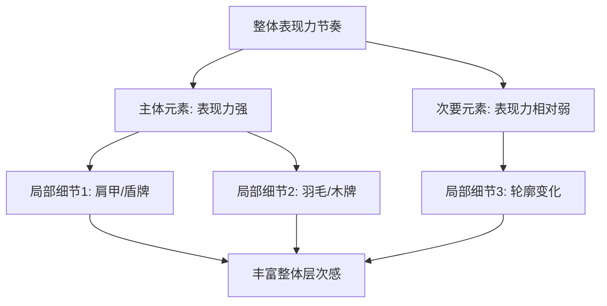

# 第08课：表现力

## 学习目标

- 理解表现力的概念及其与外观形式的关系
- 掌握个体元素表现力与整体表现力的塑造方法
- 了解时效性动态特效、画面位置、音效对表现力的影响
- 理解表现力在画面权重、表现倾向、等级差异、主次关系中的作用
- 掌握表现力节奏韵律的塑造方法与规律

## 核心概念

表现力是对所有外观形式塑造方法的综合与归纳。物体的[[lessons/0004-lun-kuo-jian-ying|轮廓剪影]]、[[0005-ping-mian-qie-ge|平面切割]]、[[0006-ti-ji-jie-gou|体积结构]]、[[0007-se-cai-da-pei|色彩搭配]]，以及相应呈现的排列节奏，都属于对物体不同层面外观形式的塑造。不同的外观形式给予人不同的感官刺激，让物体呈现不同的表现力。

当画面中存在诸多不同元素，表现手法侧重点不一，甚至出现非外观形式的表现手法时，就必须通过**表现力**的概念，归纳物体在画面中的**权重关系**以塑造画面。

---

### 8.1 表现力的塑造

物体的外观形式是形成表现力的基础。表现力通过两个层面塑造：**个体元素的表现力**和**整体的表现力**。

#### 1. 个体元素的表现力塑造

个体元素的表现力通过元素外观形式所具有的**点的特性**呈现。点所带来的感官刺激越强，则物体外观形式呈现出的表现力越强。

以肩甲设计为例：
- 鹰爪装饰 → 表现力强于翅膀装饰
- 鹰头装饰 → 表现力强于鹰爪装饰
- 鹰头 + 加强轮廓节奏 + 醒目色彩 → 表现力最强

> [!TIP] Key Insight
> 表现力是可以通过多种手法叠加增强的——轮廓、色彩、节奏可以共同作用于同一个元素，逐级提升其表现力。

#### 2. 整体的表现力塑造

设计主体中个体元素表现力的强弱，往往决定了整体表现力的强弱。在较为复杂且由较多个体元素组合形成的设计中，表现力由构成整体的个体元素的表现力构成。

以羊驼人设计为例：
- 弓箭装饰 → 表现力弱 → 整体表现力弱
- 斧头+盾牌装饰 → 表现力较强 → 整体表现力较强
- 头饰+颈部配饰+法杖 → 表现力最强 → 整体表现力最强

在场景氛围图中，构成场景中不同元素的个体表现力越强，场景的整体表现力也越强。

#### 其他影响表现力的因素

##### 1. 时效性的动态和特效塑造

当设计对象的外观形式差异不大时，不同动态或特效便构成塑造整体表现力的主要个体元素。动势刺激和醒目的光亮、颜色能塑造"点"，从而影响表现力。

> [!TIP] Key Insight
> 游戏设计中常用动作的幅度、特效的色彩及形状塑造角色的不同表现力特征。

##### 2. 画面位置影响表现力

当点位于画面正中心时，凝聚力最强。物体越接近画面中心，其表现力越强；越接近边缘，表现力越弱。

在场景设计中，主体元素所处的画面位置对其表现力具有较大影响。将主体置于画面中心，表现力强化；挪至边缘，表现力大幅减弱。

##### 3. 音效的表现力塑造

不同强弱、不同节奏、不同类型的音效可以给人以不同画面感的想象，从而塑造不同的表现力。这是非造型因素塑造表现力的典型例子。

---

### 8.2 表现力的作用

表现力的概念整合了所有外观形式的塑造方法及部分非外观形式因素。观者通过点的不同表现力，可以衡量点、线或面在画面中所起作用的呈现力度。

#### 1. 通过表现力强弱直接塑造画面权重

不同的外观形式塑造方法都可以用于呈现设计对象的不同表现力。当两组元素表现力相同时，在画面中的权重也相同。

#### 2. 通过表现力强弱影响表现倾向

无论哪种表现倾向（规整或混乱），都建立在表现力强弱基础上。某种表现倾向的表现力强，相应的表现倾向便构成整体画面的主导因素。

#### 3. 通过表现力强弱塑造等级差异

- **同一等级**：不同元素表现力接近，权重相似
- **不同等级**：表现力强弱对比、权重差异大，构成等级差异

在游戏设计中，同一艺术表现倾向的设计框架内，需要通过表现力规划不同设计对象之间的层级关系，让不同外观形式的设计主体归纳于同一个设计框架内，形成有序的等级关系。

#### 4. 通过表现力强弱塑造主次关系

画面中主次关系的形成以不同元素的表现力对比为基础：

在角色设计中，塑造个体元素表现力差异构成角色整体的主次关系。鱼鳍与鱼鳍之间表现力差异小 → 主次模糊；鱼鳍与珊瑚角之间表现力差异大 → 主次清晰。

在场景设计中，同样外观形式的建筑间表现力差异小 → 主次模糊；不同外观样式的建筑间表现力差异大 → 主次明显。

---

### 8.3 表现力的节奏韵律

#### 基本元素与趋向

基本元素是构成画面中不同外观形式的元素，以不同元素作为节奏中的独立元素互为间隔。

**两种设计情境**：
1. 简单设计（如岩石）：直接以轮廓、分量、色彩等构成外观形式的因素作为基本元素
2. 复杂设计（如肉摊）：还需考虑个体元素的题材、排列等多种局部塑造因素，甚至非造型因素

表现力节奏的趋向：从画面中**表现力最强的点**逐渐往**表现力较弱的点**变化。

#### 1. 表现力节奏的塑造

有规律的重复是节奏的基本结构表象。对不同表现力的元素进行排列，让元素之间的变化形成有规律的重复组合关系，形成表现力的节奏感。一强一弱的视觉中心相互间隔，便是基本的表现力节奏表象。

变化规律相同且不断重复 → 单调的节奏形式，用于特定主体。

#### 2. 表现力节奏的韵律起伏

将节奏中重复的规律以不同的对比呈现起伏变化时，节奏产生韵律。

在轮廓剪影、平面切割、体积结构、色彩搭配及不同题材的共同塑造作用下，表现力呈现出：**表现力强 → 表现力弱 → 表现力相对强 → 表现力相对弱**的变化形式。

这种变化直观地构成画面主次关系的对比，呈现主要、次要、相对主要、相对次要的外观形式。

**表现倾向的节奏**：当所有表现倾向区间的表现力相同时，从左至右武器排列的表现倾向呈现出规整、混乱、相对规整的节奏感。

**景别层次的节奏**：不同元素分布于不同景别中，呈现不同景别之间表现力强弱对比变化的节奏韵律。

#### 3. 表现力节奏的对比幅度

- 对比幅度小 → 节奏感弱 → 整体表现力弱
- 对比幅度大 → 节奏感强 → 整体表现力强

不同元素表现力之间的对比幅度影响韵律特征。韵律特征弱 → 不同起伏区间对比不明显；韵律特征强 → 不同起伏区间对比明显。

#### 4. 表现力节奏的变化规律

表现力节奏的变化规律可概括为**点在节奏中的变化规律**：
- 多个相似点等距规则排列 → 有序
- 多个不同分量的点不规则排列 → 无序

节奏变化规律影响物体的表现倾向，其本质是变化规律的特征通过不同表现力起作用。

#### 5. 表现力节奏的局部层次

整体的表现力节奏韵律变化之中包含局部变化较细微的表现力节奏韵律。局部依附于整体，呈现主要部分或次要部分的主次关系。

在角色设计中，局部元素如肩甲、盾牌、羽毛等由更多层次的设计元素构成，这些局部元素表现力的节奏变化丰富了整体层次感。

在场景设计中，画面中的次要元素也可通过轮廓、局部光亮等表现手法构成局部表现力的节奏感，呈现更多画面内容。

**整体与局部表现倾向的层次**：同一种变化规律的节奏表现力强，则形成主导整体画面的表现倾向；表现力弱的变化规律节奏则构成局部次要的表现倾向。

> [!TIP] Key Insight
> 表现力的节奏不仅仅是对外观形式节奏的重复，而是对所有造型层面（轮廓、平面、体积、色彩）节奏韵律的**综合归纳**。当画面中存在多种表现手法时，表现力的统一衡量为设计师提供了判断画面权重、主次和等级的清晰框架。

---

## 章节小结

表现力是概念设计中最上层的综合概念，它将轮廓剪影、平面切割、体积结构、色彩搭配等所有造型知识，以及动态特效、画面位置、音效等非造型因素统一纳入一个可衡量的框架。表现力通过个体元素和整体元素两个层面塑造，其强弱直接决定画面中元素的权重关系，进而影响表现倾向、等级差异和主次关系。表现力的节奏韵律是对所有造型层面节奏的综合归纳，从表现最强的点到最弱的点形成趋向性变化，加上对比幅度、变化规律和局部层次的调节，构成了完整的画面表现力体系。

## 自测练习

> [!QUESTION] 1. 表现力通过哪两个层面进行塑造？两者之间是什么关系？
> 

答案
（1）个体元素的表现力塑造：通过元素外观形式的点的特性呈现；（2）整体的表现力塑造：在较复杂的设计中，整体表现力由构成整体的个体元素的表现力构成。个体元素表现力的强弱决定整体表现力的强弱。

> [!QUESTION] 2. 影响表现力的非外观形式因素有哪些？各自如何起作用？
> 

答案
（1）时效性的动态和特效：动势刺激和醒目的光亮、颜色塑造点，不同动态/特效构成表现力的主要个体元素；（2）画面位置：物体越接近画面中心表现力越强，越接近边缘表现力越弱；（3）音效：不同强弱、节奏、类型的音效通过听觉想象塑造表现力。

> [!QUESTION] 3. 画面中的主次关系是如何通过表现力形成的？
> 

答案
表现力强弱的对比差异形成主次关系。若元素表现力接近，无法形成主次。拉开表现力差异后形成主次，进一步增加表现形式拉开差异，主次更明显。表现力对比越强，主次关系越明显。

> [!QUESTION] 4. 表现力如何塑造等级差异？在游戏设计中有何应用？
> 

答案
表现力接近时元素处于同一等级；表现力差异大时构成等级差异。游戏设计中常用不同表现力规划不同角色/装备的层级关系，使不同外观形式的设计主体归纳于同一设计框架内，形成有序的等级关系。

> [!QUESTION] 5. 表现力节奏的趋向如何确定？其基本变化规律是什么？
> 

答案
表现力节奏的趋向以画面中表现力最强的点逐渐往表现力较弱的点变化。基本变化规律是感官刺激强度从强到弱的变化。多个相似点等距排列呈有序规律，不同分量的点不规则排列呈无序规律。

> [!QUESTION] 6. 在景别层次丰富的场景设计中，表现力的节奏如何呈现？
> 

答案
不同元素分布于不同景别中，不同景别的外观形式差异构成表现力强弱对比变化的节奏韵律。例如前景角色表现力相对强，中景恐龙表现力更强，远景森林沙漠表现力较弱，背景表现力最弱。

> [!QUESTION] 7. 整体表现倾向与局部表现倾向的层次关系是如何形成的？
> 

答案
同一种变化规律的节奏表现力强，则形成主导整体画面的表现倾向；表现力弱的变化规律节奏则构成局部次要的表现倾向。例如规整排列的木桶（表现力强）构成整体倾向，边上武器排列混乱（表现力弱）构成局部倾向。

## 延伸阅读

- [[lessons/0004-lun-kuo-jian-ying|轮廓剪影]] — 表现力的基础造型来源
- [[lessons/0002-pai-lie-jie-zou|排列节奏]] — 表现力节奏韵律的理论基础
- [[0005-ping-mian-qie-ge|平面切割]] — 通过辨识度切割塑造表现力
- [[0006-ti-ji-jie-gou|体积结构]] — 通过立体造型塑造表现力
- [[0007-se-cai-da-pei|色彩搭配]] — 通过色彩对比塑造表现力