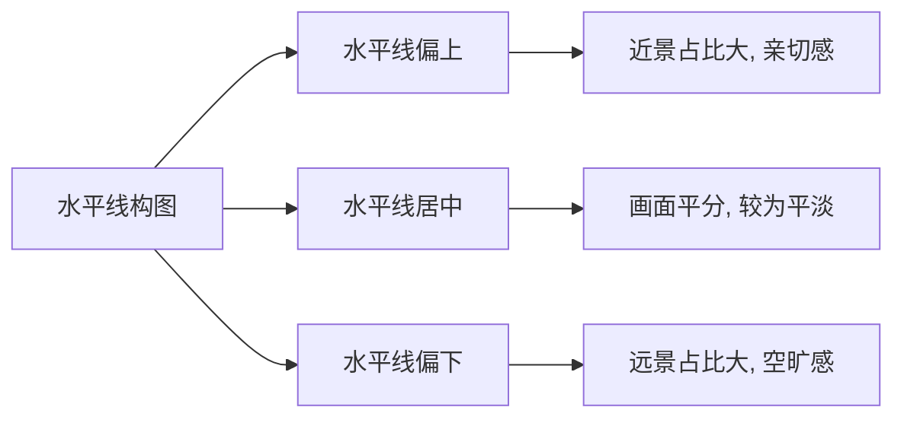
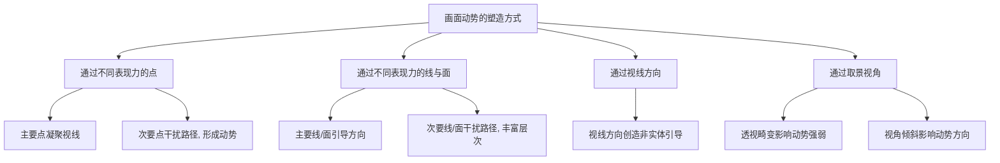

# 第09课：画面构图

## 学习目标

- 理解画面架构意识的概念，掌握从概括形状与色彩入手建立画面基础框架的方法
- 识别并掌握17种常见画面架构形式及其情感特征与应用场景
- 掌握8类画面对比关系的调整方法，能够主动控制画面节奏
- 掌握画面取景的三个塑造阶段：确定主体、主视觉区间、取景视角
- 理解画面动势的产生原理，学会通过不同表现力的元素制造视线引导层次
- 掌握画面平衡的三种塑造方式：对称平衡、重心平衡、视角平衡
- 理解画面留白的作用，学会运用不同面积的留白控制画面氛围

## 核心概念

画面构图是根据绘画题材及设计目标，有意识地规划画面的过程。构图的本质是**针对性地安排画面中的点、线、面等基本元素，有意识地组织画面架构**。一幅好的构图能够让画面形成明确的**权重主次关系**、**视线引导关系**和**画面平衡关系**，从而构成一个协调、完整的画面，传达不同的主题与情感。

本章涵盖七大内容模块：[[0009-hua-mian-gou-tu|画面架构意识]]（构图的基础思维）、[[0009-hua-mian-gou-tu|常见架构形式]]（17种基本构图类型）、[[0009-hua-mian-gou-tu|画面对比]]（控制节奏的手段）、[[0009-hua-mian-gou-tu|画面取景]]（选择看什么与怎么看）、[[0009-hua-mian-gou-tu|画面动势]]（让视线流动起来）、[[0009-hua-mian-gou-tu|画面平衡]]（重量分配的学问）、[[0009-hua-mian-gou-tu|画面留白]]（以少胜多的智慧）。

---

## 9.1 画面的架构意识

**画面架构意识**是进行画面构图的基础。其核心在于**概括画面中连贯的图形结构关系**——通过提炼元素的形状与色彩，让不同元素形成连贯的图形结构，从而建立画面的基础框架。

### 架构意识的建立

架构意识的建立分为三个层次：

1. **提炼基本元素**：将物体概括为简练的图形形状。例如，一个塑料瓶可以提炼出其体积结构和色彩结构，形成概括性的图形形状。

2. **形成连贯结构**：在元素丰富的画面中，概括多种元素的结构和色彩，使不同的元素形成连贯的图形结构关系。这种连贯的结构关系构成了画面的**架构**——即概括的形状与概括的色彩。

3. **建立辨识度对比**：画面架构的表象与画面中不同平面的辨识度密切相关。例如，角色的头发与衣服形成连贯的色彩，与背景形成较强的辨识度对比，这个连贯的图形结构就可以视为整张画面的架构。

### 架构的切割特性

在构图中，往往把**色调接近的暗部与投影概括为统一的整体**，形成连贯的图形结构。例如，岩石大面积的暗部与投影形成独立的封闭区间，亮部也形成独立的封闭区间。不同区间连贯的结构与色彩不仅形成了画面的平面切割关系，也构成了画面构图的**基础架构关系**。

### 架构的通用性

画面架构是**概括的形状与色彩**，因此当创作题材不同但概括形状相似时，不同的画面会呈现出相似的画面架构形式。这意味着**同一种架构形式可以应用于不同题材的设计**，传达不同的主题。虽然画面架构不能表现具体的画面主题，但它本质上形成了画面的基础框架，确定了不同元素之间的关系。

> [!TIP] Key Insight
> 画面架构的本质是**用最简练的图形和色彩概括画面中最主要的形状关系**。它不是细节，而是画面的大局。初学者常犯的错误是一头扎进细节而忽略了整体的架构关系。请记住：**先有架构，后有细节**。

---

## 9.2 常见的画面架构形式

画面架构形式理论上可以有多种表象，在实践中通常用架构形式近似的**几何形状**来命名。以下是17种常见的画面架构形式：

### 1. 水平画面架构形式（水平线构图）

元素排布形成明显的水平线结构。其特点是**安定、平和、宁静、平缓、舒适、稳妥**，具有很强的安定感。在垂直空间上层次较少，因此需要让元素在形状、大小、色彩上形成远近空间对比，以丰富画面。

构图的**核心是对水平线位置的选择**——水平线直接切割了画面对比关系，决定了画面是趋于对比平均还是对比强烈。

### 2. 垂直画面架构形式（垂直线构图）

元素排布形成明显的垂直线结构。其特点是**能够有效呈现主体元素的高度和纵向气势**，使画面具有较强的**秩序感和安定感**。塑造时需要让不同垂直线形成**长短不一的对比**，以强调节奏感。

### 3. 对角斜线画面架构形式（对角斜线构图）

元素排布形成明显的对角斜线结构。其特点是**具有较强动势**，呈现出**不安定感**。若要表现较为安定的主体，需要用安定的形状或在不同景别塑造相反的对角斜线层次来平衡这种不安定感。当画面中存在多条非平行的对角斜线时，往往呈现出近似于三角形构图的架构。

### 4. L字形画面架构形式（L字形构图）

元素排布形成明显的L字形结构。其特点是**视线容易聚焦到两条边的交汇处及其中一条边上**。L字形越向画面边缘延伸，越靠近两条线边缘的画面内容则越容易被忽视。

### 5. S字形画面架构形式（S字形构图）

元素排布形成明显的S字形结构。其特点是**具有较强的动势特性和由近及远的指向性**，能表现很强的画面动感和空间感。S字形上方的端点往往是视线引导的终点。自然界中蜿蜒的道路、溪流等元素都直观地呈现出S字形架构。

### 6. C字形画面架构形式（C字形构图）

C字形可以理解为S字形减少了一个层次的蜿蜒转折。其特点是**具有较强的流动性和空间感**。通常将主体元素放置于**中间点**的位置，近处位置摆放第一次要元素，远处位置用以加强空间层次的延伸。

### 7. 三点式画面架构形式（三点构图）

相似元素排布形成间距差别不大的三角形结构。其特点是**具有较强的安定感**。

### 8. 方形画面架构形式（方形构图）

较大面积的主体元素或元素排布形成明显的方形结构。其特点是**横平竖直，天然具有安定感**，但单一的方形结构也容易**呆板**。需要通过适当破坏方形的边缘结构，或搭配多个几何形状来丰富层次感。

### 9. 三角形画面架构形式（三角形构图）

较大面积的主体元素或元素排布形成明显的三角形结构。**三条边由不同方向的直线轮廓聚合而成**，是最常见的构图形式之一。等边三角形让画面趋于安定，趋势感较强的三角形让画面具有较强的动势特征。

### 10. 倒三角形画面架构形式（倒三角形/V字形构图）

当倒三角形作为画面中的**正形**时，画面具有较强的不安定感；当倒三角形作为画面中的**负形**时（如分置于画面两边的正三角形围合而成），画面具有较强的安定感，同时具有框架式构图的特点。

### 11. O字形画面架构形式（O字形/圆形构图）

元素排布形成明显的O字形结构。其特点是**具有较强的整体感和向心力**，给人以旋转、运动和收缩的感觉。但圆形构图往往将视线封闭于圆形之内，**缺乏冲击力和活力**，需要通过改变圆形外形或加入局部结构层次来增强画面活力。

### 12. 框架式画面架构形式（框架构图/U字形/N字形构图）

占据主体的元素排布形成左右对称的架构。其特点是**以框架作为前景引导视线聚集于主体**。相较于圆形构图，框架构图的外形轮廓变化更丰富，视线的"出口"更多，画面更生动。

### 13. 十字架形画面架构形式（十字架形构图）

元素排布形成明显的十字架形结构。其特点是**具有明显的水平和垂直元素交错**，视线很容易聚焦到交汇处，能够呈现出较为直观的**空间穿插结构**，表现较强的空间感。

### 14. 放射线形画面架构形式（放射线形构图）

元素排布形成明显的放射线形结构。其最大特点是**能够通过线或面聚焦表现出视觉中心**，将视线集中于某个聚焦位置。放射线形辨识度越高，视线聚焦效果越明显，同时也能较好地表现近大远小的空间感。

### 15. 格式结构画面架构形式（格式结构构图）

相似形状或相似元素的重复排列。其最大特征是**极度缺乏视觉中心**。塑造重点在于拉开不同元素之间平面的对比变化关系及疏密关系，使不同元素具有微弱的表现力变化。

### 16. 支点形画面架构形式（支点形构图）

两组具有明显大小差异的元素排布于中央两侧。其特点是**类似天平结构**，较大的元素构成主体，较小的元素起到衬托作用。这也是一种常见的塑造画面平衡感的方式。

### 17. 画像形画面架构形式（画像形构图）

画面明显以某个主体对象为主进行塑造，背景及次要元素的表现较为忽视。其特点是**视线往往只停留在主体对象上**，同时根据主体对象的形状特征，画面也具有其他形式构图的特点。

### 多种架构形式的共存

在较为复杂的场景设计图中，往往存在**多种架构形式**。当哪一种架构形式在画面中占据主导地位时，就将其归纳为哪种架构形式。例如，山体呈现明显的三角形架构，但同时也存在S字形和对角斜线架构，此时以三角形为主来命名构图类型。

> [!TIP] Key Insight
> 17种构图的根本在于**形状与情感的对位关系**。水平=平静，垂直=秩序，斜线=动感，曲线=流动，三角=稳定，倒三角=不安。掌握了这个对应关系，你就能根据想要传达的情感来选择构图，而不是死记硬背构图的名称。

---

## 9.3 画面对比

画面对比的本质是**点、线、面等元素通过轮廓剪影、平面切割、体积结构、色彩搭配及相应表现力节奏的综合应用**。对比关系强则画面抢眼，对比关系弱则画面平淡，过于平均则画面平庸。

**控制画面对比关系的核心**在于通过各个元素的对比把控整体画面节奏，避免过于平均的对比关系。

### 1. 调整画面疏密对比

强化画面中**稀疏和密集部分的对比**，是所有对比关系中最基本的对比关系。

### 2. 分配画面切分比例

画面切分比例对比的本质是**平面切割节奏在构图层面的应用**。首先需要注意**避免平分画面**，其次要**避免等分画面**。暗色和亮色影调的面积不宜接近，应让某一方占据主导。

### 3. 调整画面元素的分量

强化画面中**不同元素分量的对比**。分量的大小差异越明显，画面的节奏感越强。

### 4. 分配画面色彩面积比例

首先表现为**不同物体固有色的面积比例**，其次表现为**不同物体环境色的面积比例**。以分量对比和影调面积比例为基础，强化不同元素的色彩对比。

### 5. 调整画面趋势对比

调节画面中**不同趋势结构的对比幅度**。趋势越明显，画面的节奏感越强。

### 6. 调整画面刚柔对比

调节画面中**不同刚性形状（直线）和柔性形状（曲线）的对比幅度**。刚柔并济往往比单一形式更有节奏感。

### 7. 调整画面虚实对比

把握好画面中不同主次元素刻画的**细致程度**，拉开虚实对比。通过概括次要物体来衬托需深入塑造的物体。

### 8. 调整画面动静对比

调节画面中**不同动势元素的对比幅度**，可以是形状带来的对比（如垂直线与斜线的对比），也可以是具体内容的对比（如站立角色与夸张动作角色的对比）。

---

## 9.4 画面取景

画面取景通过不同的取景方式让画面表现出不同的核心内容，可以在画面中**剔除无用信息**，明确所要塑造的元素和主题。

画面取景分为三个塑造阶段：

### 阶段一：确定画面主体元素

画面的主体元素以两种方式呈现：
1. 画面主体作为**视觉中心**
2. 画面主体作为**衬托主要视觉区间的元素**

画面取景首先要确定不同元素的**权重关系**，明确哪些元素构成主体，哪些构成次要部分。

### 阶段二：确定主视觉区间

主体元素在画面中的位置影响表现力、画面平衡及画面动势。经常运用**黄金分割线**或**三分线**来确定主体元素的位置，将元素布置于画面中心点、分割点或分割线上。

### 阶段三：确定取景视角

同样的元素通过取景视角的差异，能够影响主体元素在画面中呈现出的**形状**，进而影响画面动势和画面平衡。

- **平视角**：自然、均衡、稳定，但也较为平淡
- **俯视角**：广阔、深远的感觉
- **仰视角**：高大、宏伟的感觉，较强的空间立体感和视觉冲击力

---

## 9.5 画面动势

画面动势源自**不同形态的点、线、面在画面中呈现出的不同表现力**。表现力强、画面权重大的元素构成视线引导的主要因素；表现力弱、画面权重小的元素构成视线引导的次要因素。

**制造画面动势的核心意义**在于：利用不同的视线引导层次，使画面架构对视线的引导产生流动性，让视线在画面中能够"运动"起来，避免视线受困于某个画面区间。

### 四种影响画面动势的方式

1. **通过不同表现力的点影响动势**：利用主要的点凝聚视线，利用次要的点"干扰"视线，构成视线引导层次。这是**景别层次塑造**的关键——远处的次要元素能够将视线从主体引导向纵深空间。

2. **通过不同表现力的线与面影响动势**：线或具有趋向性的面天然能形成画面动势。多个方向不同的趋势线可以创造丰富的动势层次。

3. **通过视线方向影响动势**：当角色或怪物作为画面主体时，主体的视线方向能够影响画面动势。但视线对动势的影响较小，通常需要结合实体结构线（如注视的目标）来强调。

4. **通过取景视角影响动势**：透视畸变越大，画面动势越强；取景视角倾斜时，动势方向也随之倾斜。

> [!TIP] Key Insight
> 画面动势的核心是**"干扰"**——没有干扰的视线路径是单调的。你想要让观者的视线在画面中"旅行"而不是"直达终点"，就需要在主要的视觉路径上设置一些次要的"路标"（不同表现力的点、线、面），让视线产生迂回和停留。

---

## 9.6 画面平衡

画面平衡是指画面中**元素之间、元素的趋势方向、光影色调面积比例以及元素和空间的分配关系**。塑造画面平衡前，需建立**画面重量**意识：

- 表现力强、画面权重大的元素 > 表现力弱、画面权重小的元素
- 体积大的元素 > 体积小的元素
- 颜色深的元素 > 颜色浅的元素
- 趋势方向的底端 > 趋势方向的顶端

### 三种画面平衡的塑造方式

#### 1. 对称的画面平衡

**绝对的平衡、静态平衡**。左右、上下或围绕某个中心点的元素大小、形状、色彩及位置完全一致。对称平衡的画面较安定，但缺少变化。

#### 2. 画面重心的平衡

**相对的平衡、动态平衡**。核心在于不相同的外观形式元素构成等量的平衡状态，类似秤盘与秤砣的关系。

- **单一元素画面的重心平衡**：受到趋势方向、动势层次、视线方向、元素位置的影响。趋势方向前方留白大则平衡，留白小则失衡。动势层次多则平衡，少则失衡。
- **多元素画面的重心平衡**：受到不同单一元素的趋势方向、色彩、分量大小、表现力及位置的影响。包括**平面空间平衡**（上下左右的平衡）和**纵深空间平衡**（前后景别的平衡）。

#### 3. 取景视角的画面平衡

通过主观地**倾斜取景角度**让画面形成不同的平衡状态。客观世界本身是平衡的，采用水平的取景视角呈现的画面往往具有平衡特性；倾斜取景视角则必然呈现出失衡画面，常用于表现动荡不安、焦躁狂乱的主题。

---

## 9.7 画面留白

留白是画面构图的重要组成部分。留白不等于完全的空白或白色，也包括作为画面背景中**色调、影调相接近的部分**，从属于衬托画面实体元素的部分，直观地表现为**弱对比关系的色彩搭配模式**，通过较为朦胧的画面内容突出实体主体。

### 小面积留白——背景衬托

留白的基本作用是**衬托画面主体**。舍弃次要、繁杂、琐碎的内容，减少不必要内容对主题的干扰，从而对画面主题加以强调。

### 大面积留白——传达意境

留白的核心作用是**营造画面氛围**。大面积的留白使"空白"成为画面的主体，虽然画面中的内容不多，但为观者提供了**想象的空间**，从而营造画面的氛围，让画面更富有意境。

---

## 章节小结

本章系统阐述了画面构图的七大核心要素：

1. **画面架构意识**：从概括形状与色彩入手，建立连贯的图形结构关系
2. **常见架构形式**：17种基本构图类型，各自具有不同的情感特征与应用场景
3. **画面对比**：8类对比关系（疏密、切分、分量、色彩、趋势、刚柔、虚实、动静）是控制画面节奏的核心手段
4. **画面取景**：三个塑造阶段——确定主体、确定主视觉区间、确定取景视角
5. **画面动势**：通过不同表现力的元素制造视线引导层次，让视线在画面中流动
6. **画面平衡**：三种塑造方式——对称平衡、重心平衡、视角平衡
7. **画面留白**：控制留白面积，小面积起衬托作用，大面积营造意境

构图是一门"做减法"的艺术——**先有大局（架构），再有方向（动势），最后丰富层次（对比）**。优秀的构图让观者第一眼就被吸引，视线自然地在画面中流转，最终感受到画面传达的情感与主题。

---

## 自测练习

> [!QUESTION] 1. 什么是画面架构？建立画面架构意识的核心是什么？
> 

答案
画面架构是概括的形状与概括的色彩，是画面中不同元素形成的连贯图形结构关系。建立画面架构意识的核心在于**概括画面中连贯的图形结构关系**，将不同元素通过形状和色彩的相似性统一起来，形成画面的基础框架。

> [!QUESTION] 2. 如果你想传达一种"不安定、动荡"的氛围，你会优先选择哪几种画面架构形式？
> 

答案
可以选择**对角斜线构图**（倾斜的线具有不安定感）、**倒三角形构图**（当倒三角作为正形时具有不安定感）、**放射线形构图**（具有强烈的视线聚焦和动势）。此外，还可以通过**倾斜取景视角**来打破客观世界的平衡感，制造失衡效果。

> [!QUESTION] 3. 画面对比的8个维度中，哪一个是"最基本的对比关系"？为什么？
> 

答案
**疏密对比**是最基本的对比关系。因为轮廓剪影、平面切割、体积结构的节奏都有疏密对比特性，其他对比关系（如切分比例、分量对比、色彩面积对比等）都是在疏密对比的基础上进一步展开的。没有疏密对比，画面就会显得"平"。

> [!QUESTION] 4. 什么是画面动势？制造画面动势的核心意义是什么？
> 

答案
画面动势是指利用不同的视线引导层次，使画面架构对视线的引导产生流动性。制造画面动势的核心意义在于**让视线在画面中能够运动起来**，避免视线受困于某个画面区间或形成较为单调的观察路径。通过布局不同表现力的点、线、面，形成多层次的视线引导关系。

> [!QUESTION] 5. 什么是"画面重量"？举例说明哪些因素会影响画面重量。
> 

答案
画面重量是指画面中元素在视觉上呈现出的"轻重"感受。影响因素包括：**表现力强的元素比表现力弱的元素重**、**体积大的元素比体积小的元素重**、**颜色深的元素比颜色浅的元素重**、**趋势方向的底端比顶端重**。例如，画面中的深色巨石比浅色小石头的画面重量大得多。

> [!QUESTION] 6. 留白有哪些作用？不同的留白面积分别产生什么效果？
> 

答案
留白有两种主要作用：一是**背景衬托**——小面积留白舍弃次要内容，强调画面主体；二是**传达意境**——大面积留白为观者提供想象空间，营造画面氛围。小面积留白让主体更醒目，大面积留白让画面更富有意境和空间感。

---

## 延伸阅读

- [[0005-ping-mian-qie-ge|第05课：平面切割]]——深入理解画面架构中的平面切割关系
- [[0008-biao-xian-li|第08课：表现力]]——掌握不同元素表现力对视线引导的影响
- [[0010-kong-jian-guan-xi|第10课：空间关系]]——学习如何通过构图进一步表现空间感
- [[0011-guang-ying-huan-jing|第11课：光影环境]]——构图与光影结合，塑造更强的画面表现力