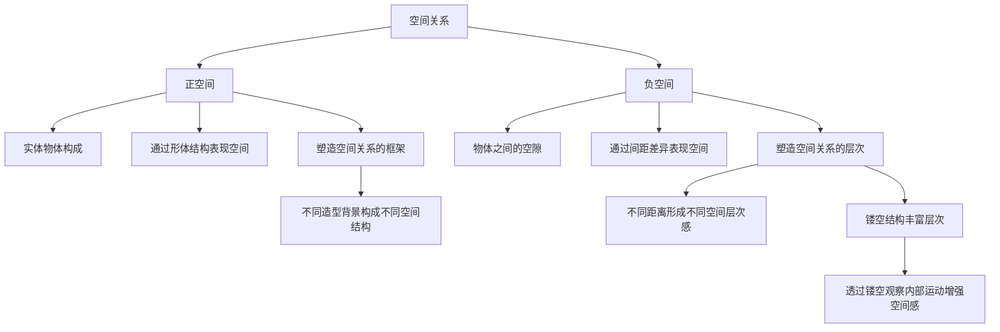
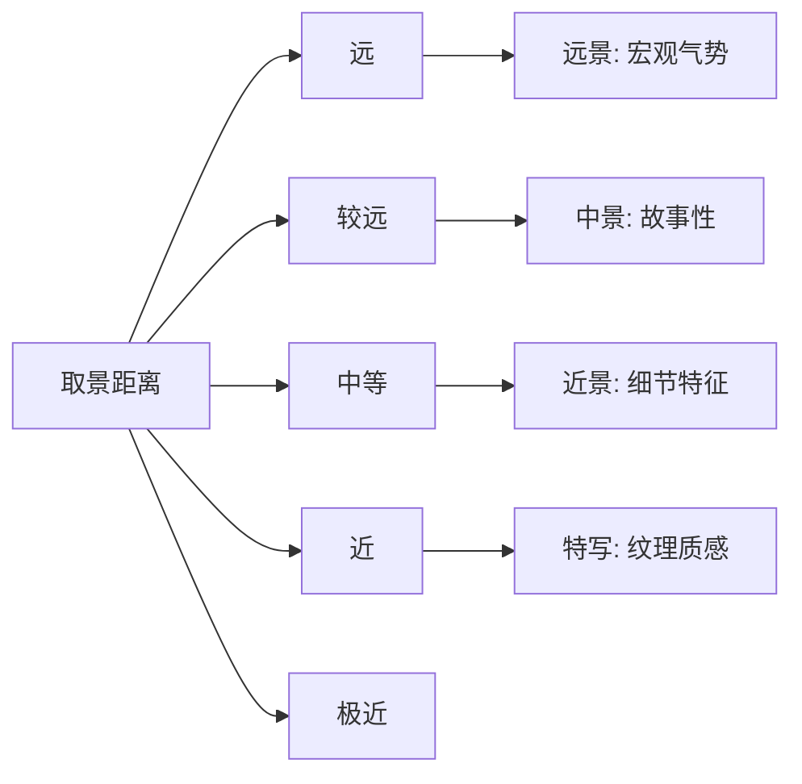
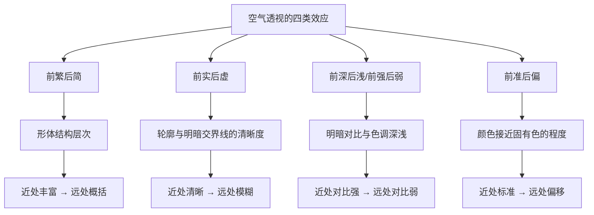

# 第10课：空间关系

## 学习目标

- 理解正空间与负空间的概念及其在画面中的相互关系
- 掌握通过素描结构、线、面三种方式塑造正空间的方法
- 掌握利用基础造型、围合、空间穿插、取景视角四种方式塑造负空间的方法
- 理解景别层次（远景、中景、近景、特写）对空间关系的表现作用
- 掌握利用透视参照（结构参照、相同物体参照、相似物体参照）表现空间关系的方法
- 掌握空气透视的四类表现效应及其对空间关系的影响
- 理解菲涅耳效应及其在表现空间关系中的应用

## 核心概念

空间关系是概念设计中极为重要的内容。无论角色设计还是场景设计，都需要强调设计对象在**立体空间中的构成关系**。尤其是场景设计，其本质就是**对空间关系的设计**。

本章系统讲解七大空间关系知识模块：[[0010-kong-jian-guan-xi|正空间与负空间]]（空间关系的基础框架）、[[0010-kong-jian-guan-xi|正空间的塑造]]（塑造实体结构的三种方法）、[[0010-kong-jian-guan-xi|负空间的塑造]]（塑造空隙的四种方法）、[[0010-kong-jian-guan-xi|景别层次]]（取景范围与空间感）、[[0010-kong-jian-guan-xi|透视参照]]（近大远小的空间判断）、[[0010-kong-jian-guan-xi|空气透视]]（大气介质对空间感的影响）、[[0010-kong-jian-guan-xi|菲涅耳效应]]（反射与视角的空间关系）。

---

## 10.1 正空间与负空间

空间关系包含**正空间**与**负空间**两个层面：

- **正空间**：画面中由具象的实体物体构成的空间，通过元素的**形体结构**表现空间关系
- **负空间**：画面中不同物体之间的空间，或特定结构造型形成的空间（如镂空、空隙）

### 正空间与负空间的多层表现

1. **平面层面的正负形关系**：在简单的平面图中，正空间与负空间直观地以正负形的形式呈现。例如，不同造型结构的门呈现出不同的正空间形状，对应不同形状的门也呈现出不同形状的负空间（门洞）。

2. **立体空间中的景别关系**：在场景氛围图中，正空间与负空间还表现为**不同景别的关系**。建筑之间的镂空结构可以视为同一景别层次中平面层面的负空间，而建筑与远处火山则形成了不同景别层面的负空间。

### 正空间与负空间的作用

- **正空间塑造空间关系的框架**：物体体积结构的正空间奠定了空间关系的基础。相同物体在不同形状的背景中，会呈现出不同的空间结构关系。
- **负空间塑造空间关系的层次**：不同物体之间的负空间说明了不同体积结构的**相对位置关系**。物体之间距离的差异形成了不同的空间层次感。

> [!TIP] Key Insight
> 正空间与负空间是一体两面的关系——**没有正空间就没有负空间，反之亦然**。在设计时，不仅要考虑"我要画什么"（正空间），还要考虑"我在哪里留空"（负空间）。初学者常常只关注正空间而忽略负空间，导致画面空间感单薄。**聪明的设计师同时塑造正负空间**。

---

## 10.2 正空间的塑造

正空间的塑造核心在于**对形体结构的塑造**——有形状、有体积才有空间感。主要通过以下三种方式：

### 1. 通过素描和结构层次塑造正空间

素描关系绘制得越深入，空间感越强。在游戏制作中，**烘焙光照的精度越高，光影层次越充足**，渲染出的物体素描关系表现越充分，空间感越强。当深入素描关系应用于复杂的造型结构中时，空间感会进一步增强。

### 2. 通过线塑造强调正空间

线可以说明一部分体积关系。**线的特征越明显，正空间的空间感越强**。例如，圆柱体上的曲线纹饰能够使圆柱体体积结构更加明显。

### 3. 通过面塑造强调正空间

面可以直接塑造空间关系。**不同面的特征越明显，正空间的空间感越强**。例如，车辆不同部位的色彩涂装强调了设计对象的体积关系，色彩对比关系越强，面的特征越明显，空间感越强。

---

## 10.3 负空间的塑造

负空间的塑造建立在正空间的基础上，核心在于**对元素间距差异的塑造**，以此表现空间关系。主要通过以下四种方式：

### 1. 利用基础造型结构塑造负空间

一些特定题材具有天然能形成负空间的基础造型结构，如**镂空的窗户、门、拱形的桥洞、风化形成镂空的岩石**等。在设计中赋予设计对象类似的镂空或半封闭结构，能使单调的造型呈现出空间层次感。

### 2. 利用不同形状的围合塑造负空间

当元素不具备形成负空间的自身结构时，可以通过对多个物件的**围合**来塑造负空间。围合形状的相对距离不能太大，应尽可能让围合的形状形成一个整体。这种方式**自由度较大**，几乎任何物体都可以用此方式塑造负空间。

### 3. 利用空间穿插塑造负空间

任何形状都可以通过**前后遮挡穿插**塑造负空间。穿插元素的趋势特征越明显，穿插的相交区间越大，产生的前后负空间关系越强。

在塑造空间穿插时，要**避免轮廓嵌套轮廓**的样式，否则会导致前景轮廓被远景轮廓稀释，形成不了有效的空间穿插。

空间穿插在塑造**局部物件空间关系**上十分有效——这是因为局部物件的间距较小，空气透视作用微弱，难以利用空气透视表现空间感。

### 4. 利用取景视角塑造负空间

通过调整设计对象的特定角度来制造负空间。相同的体积结构在不同取景视角下形成的轮廓造型差异，可以塑造画面中的负空间。例如，仰视视角能让不同景别的门洞形成相互穿插，构成更多大小不一的负空间形态。

---

## 10.4 景别层次表现空间关系

**景别**（也称取景范围）指由于取景位置与被塑造物体的距离不同，而造成被塑造物体在画面中呈现出的**范围大小**的区别。景别直接影响画面中主要景物的占位面积。

一般来说，取景范围可分为四种：

### 1. 以远景塑造为主

取景位置和画面主体的相对距离较远，远景中的物体占位面积较大。具有**广阔的视野、极强的视觉冲击力**，充分展现场景的空间感，常用来表现较大空间的整体氛围。

### 2. 以中景塑造为主

取景位置和画面主体的相对距离适中。比远景更加强调**画面主体所具有的重要地位**，能够对主体的体积结构、色彩、细节、材质等进行深入刻画，塑造画面的**故事性**。

### 3. 以近景塑造为主

取景位置比中景更靠近画面主体。更容易表现主体的**局部体积结构、色彩、细节、材质**等，突出对象的具体外观形式特征。独立的单体设计是典型的近景塑造。

### 4. 以特写塑造为主

取景位置比近景更靠近画面主体，被塑造对象的**局部充满画面**。可以更清晰地呈现主体的纹理、质感等细节特征，使局部体积结构、色彩有更细腻的表现。

### 景别层次的关键技巧

不同景别的**轮廓剪影形状**直接影响到景别层次感。赋予不同景别的轮廓剪影以**不同繁简程度的对比**，制造外观形式差异，能够让不同景别轮廓剪影的形状互为衬托，拉开景别层次。

---

## 10.5 透视参照表现空间关系

透视是在平面画面中描绘物体空间关系的方法，它让物体产生**近大远小**的表象，使观者能够对画面中元素之间的相对距离进行判断。透视主要包括一点透视、两点透视、三点透视等。

利用透视参照表现空间关系的核心在于以画面中的元素作为**相对参照**，通过判断不同物体在空间中的相对位置来表现空间关系。

### 1. 结构参照

让画面中元素的结构沿着透视线方向形成**线性排布**，起到表现空间关系的作用。核心在于**延续结构所形成的远近空间中的连续对比**。例如岩石的裂缝走向、城门的结构走向，都是沿着透视线方向塑造的延续结构。

### 2. 相同物体视距参照

让画面不同空间位置以**相同分量的造型作为比例参照**。在不容易判断相对比例大小的自然形态场景中，这种方法尤为有效。例如在场景中加入角色作为比例参照，观者就能通过近大远小的表象判断物体的大致空间位置。

### 3. 相似物体视距参照

利用能够直观判断出相对比例的**相似元素**来表现空间关系。例如，即便近处建筑和远处车辆分量不同，但通过对两者近大远小表象的判断，仍然可以感知画面中元素的大致空间位置。

---

## 10.6 空气透视表现空间关系

**空气透视**（也称色彩透视）是光线通过大气层时，大气及空气介质对光线产生扩散作用，使近处景物与远处景物呈现显著形状和色彩差异的视觉现象。

形成空气透视的元素主要有：**大气、云层、雨、雪、烟、雾、尘土、水**等。

**空气介质的浓度**直接影响空气透视的效果：介质越稀薄，能见度越高，空间感越弱；介质越浓厚，能见度越低，空间感越强。

空气透视通过以下四种方式影响空间关系：

### 1. 影响物体形体结构层次变化

在空气透视作用下，出现**前繁后简**的表象——近处物体形体结构层次丰富、立体感强；物体越远，结构层次越少，渐变为概括平面状。

### 2. 影响物体形状虚实变化

在空气透视作用下，出现**前实后虚**的表象——近处物体外轮廓和明暗交界线形状清晰；物体越远，外轮廓和明暗交界线形状越模糊。

### 3. 影响物体色调深浅对比变化

在空气透视作用下，出现**前深后浅、前强后弱**的表象——近处物体明暗对比强，色彩丰富；远处明暗对比弱，色调趋于接近而呈现一片灰色。

### 4. 影响物体颜色倾向变化

在空气透视作用下，出现**前准后偏**的表象——近处物体颜色更接近固有色；远处颜色被空气介质弱化，逐渐偏离实际固有色。

---

## 10.7 菲涅耳效应表现空间关系

**菲涅耳效应**是一种材质的反射和视角之间的现象。在真实世界中，大部分物体都有不同程度的菲涅耳效应。其表现为：当视线垂直于物体表面时，反射较弱；当视线不垂直于物体表面时，**夹角越小，反射越强**。

### 菲涅耳效应的设计应用

1. **表现相对空间关系**：通过塑造菲涅耳效应，能够有效呈现取景位置和画面主体之间的相对空间关系。不同的观察视角下，地面呈现出不同的反射表象。

2. **透明物体的菲涅耳效应**：呈现出**近处透明、远处反射强烈**的表象。例如，站在岸边看近处水面是透明的，能看到水底景象；看远处水面，反射非常强烈，看到的是反射景象。

3. **水波纹与菲涅耳效应**：水波纹起伏的两侧与观者的视线角度有明显差异，因此波纹一侧反射较强烈，另一侧反射较弱、趋于透明。

4. **与平面切割结合**：菲涅耳效应塑造空间关系往往会结合平面切割，将不同的反射层次分割开，使空间层次感更加明晰。

> [!TIP] Key Insight
> 空气透视和菲涅耳效应都是"**近与远的视觉差异**"的具体表现。空气透视回答的是"介质如何影响我们看远处的物体"，菲涅耳效应回答的是"角度如何影响我们看到反射"。两者结合起来使用，可以让画面空间的表达更加真实、丰富和细腻。

---

## 章节小结

本章系统阐述了空间关系的七大知识模块：

1. **正空间与负空间**：空间关系的基础框架——正空间奠定框架，负空间丰富层次
2. **正空间的塑造**：通过素描结构、线、面三种方式塑造实体体积结构
3. **负空间的塑造**：通过基础造型、围合、空间穿插、取景视角四种方式塑造空隙
4. **景别层次**：远景、中景、近景、特写四种取景范围各自的作用
5. **透视参照**：结构参照、相同物体参照、相似物体参照，通过近大远小判断空间关系
6. **空气透视**：前繁后简、前实后虚、前强后弱、前准后偏四类效应
7. **菲涅耳效应**：利用反射与视角的关系表现空间相对位置

空间关系是场景设计的核心议题。掌握正负空间的辩证关系，熟练运用透视和空气透视等工具，才能在二维的纸面上创造出令人信服的**三维空间幻觉**。

---

## 自测练习

> [!QUESTION] 1. 正空间与负空间分别指什么？它们各自在空间关系中起什么作用？
> 

答案
**正空间**是指画面中由具象实体物体构成的空间，通过形体结构表现空间关系，其作用是**塑造空间关系的框架**。**负空间**是指画面中不同物体之间的空间或特定结构形成的空隙，其作用是**塑造空间关系的层次**——通过不同物体之间的距离差异形成不同的空间层次感。

> [!QUESTION] 2. 塑造正空间的三种方式分别是什么？请简要说明每种方式的核心原理。
> 

答案
三种方式为：① **通过素描和结构层次**——素描关系绘制得越深入，光影层次越充足，空间感越强；② **通过线**——线可以说明体积关系，线的特征越明显，正空间的空间感越强；③ **通过面**——不同面的特征越明显，面的对比关系越强，正空间的空间感越强。

> [!QUESTION] 3. 什么是"空间穿插"？在利用空间穿插塑造负空间时，需要避免什么？
> 

答案
空间穿插是指通过前后遮挡穿插来塑造负空间的方式。任何形状都可以通过这种方式来形成前后景别的差异。需要避免的是**轮廓嵌套轮廓的样式**——即小物体的轮廓完全包含在大物体的轮廓之中，这会导致前景轮廓被远景轮廓稀释，形成不了有效的空间穿插。

> [!QUESTION] 4. 空气透视通过哪四种效应影响空间关系？请用四个四字词语概括。
> 

答案
四个效应为：① **前繁后简**（形体结构层次的变化）；② **前实后虚**（形状虚实的变化）；③ **前强后弱**（色调深浅对比的变化，也可概括为前深后浅）；④ **前准后偏**（颜色倾向的变化）。

> [!QUESTION] 5. 什么是菲涅耳效应？它在设计中如何帮助表现空间关系？
> 

答案
菲涅耳效应是指视线与物体表面夹角越小、反射越强的光学现象。当视线垂直于物体表面时反射较弱，不垂直时反射较强。在设计中，通过塑造菲涅耳效应的表象，能够有效呈现取景位置和画面主体之间的**相对空间关系**。例如，水面近处透明、远处反射强烈的现象就是菲涅耳效应的典型表现。

> [!QUESTION] 6. 在场景设计中，如果想让不同景别的轮廓层次更加分明，应该怎么做？
> 

答案
赋予不同景别的轮廓剪影以**不同繁简程度的对比**——让前景的轮廓剪影与背景的轮廓剪影在疏密节奏上产生差异。例如，前景森林的轮廓剪影较为复杂细碎，背景岩石的轮廓剪影则相对简练，这样两者就能互为衬托，拉开景别层次。如果两者的疏密关系相似，则层次感就会较弱。

---

## 延伸阅读

- [[0006-ti-ji-jie-gou|第06课：体积结构]]——深入学习体积结构的塑造方法
- [[0007-se-cai-da-pei|第07课：色彩搭配]]——色彩对空间感的影响
- [[0009-hua-mian-gou-tu|第09课：画面构图]]——构图与空间关系的结合应用
- [[0011-guang-ying-huan-jing|第11课：光影环境]]——光影如何进一步增强空间感