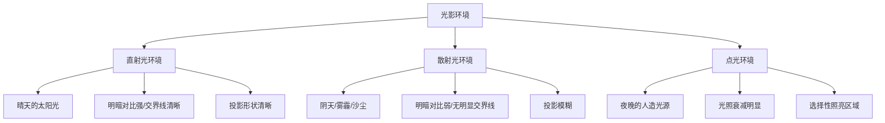
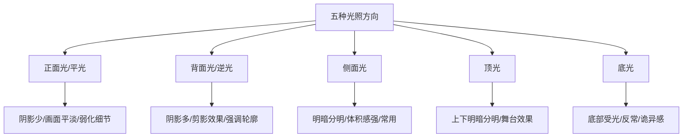

# 第11课：光影环境

## 学习目标

- 理解平行光、点光、散射光三种光源类型及其形成的不同光影环境
- 掌握光的四种反射方式（漫反射、镜面反射、折射、子面散射）及其在画面中的表现
- 理解阴影的形成原理及其受光源面积、距离、角度的影响规律
- 掌握光的吸收与辐射效应，理解有色光对物体色彩的影响
- 掌握直射光、散射光、点光三种光影环境的塑造方法及其组合应用
- 掌握五种光照方向（正面光、背面光、侧面光、顶光、底光）的特征及应用场景

## 核心概念

光影环境是概念设计中塑造画面氛围的关键手段。不同的光影环境能够使**相同造型及相同固有色的题材呈现出完全不同的氛围**。了解基本的光影环境知识有助于设计师主动控制画面的情绪与表现力。

本章涵盖五大知识模块：[[0011-guang-ying-huan-jing|光的基础知识]]（光源类型与光的反射方式）、[[0011-guang-ying-huan-jing|阴影]]（阴影的形成与影响因素）、[[0011-guang-ying-huan-jing|光的吸收]]（物体如何吸收和反射色光）、[[0011-guang-ying-huan-jing|不同光影环境的塑造]]（直射光/散射光/点光的表现方法）、[[0011-guang-ying-huan-jing|光照方向]]（五种光照方向的情感特征）。

---

## 11.1 光的基础知识

### 光源类型

常见的光源主要有以下类型：

1. **平行光**：光线互相平行，如太阳光。在宇宙环境中，太阳本质上是点光源，但地球离太阳极远，光线扩散角度非常小、趋于平行，因此相对地表而言太阳光是平行光。

2. **点光**：光线从一点向四周扩散，如灯泡发出的光。

3. **散射光**：由于光子与物质分子相互碰撞，光子的运动方向发生改变而向不同角度散射，如天空光。太阳光通过大气时遇到空气分子、尘粒、云滴等质点时发生散射，形成天空光。

### 光影环境的分类

根据光源的不同，光影环境大致可以划分为：

- **直射光环境**：如晴朗天气，具有明确的明暗区域及突出的明暗反差
- **散射光环境**：如阴雨、沙尘、雾霾天气，没有明显明暗界限
- **点光环境**：如夜晚的人造光源环境，光照衰减明显

### 光的反射

光线会发生反射。反射光线和入射光线分居在法线两侧，反射角等于入射角。光路是可逆的，通过多次反射可以使光线传播到主光源难以直接照射到的空间。光的反射主要受**材质**影响：

#### 1. 漫反射

光投射在**粗糙表面**上，被粗糙表面无规则地向各个方向反射。世界上大部分物体都具有不光滑的表面，因此光线通过漫反射从各个方向射入眼中，人们才能够观察到物体的**体积和色彩**。

#### 2. 镜面反射

光投射在**光滑表面**上，被光滑表面规律性地平行反射。常见于人造材质（镜子、抛光的金属表面等）。镜面反射可以使反射光集中照亮某个特定的暗部区域。

#### 3. 折射

光从一种透明介质斜射入另一种透明介质时，传播方向发生偏折。折射现象在液体中较为常见——例如斜插入水中的筷子看起来向上弯折。

#### 4. 子面散射（次表面散射）

光进入物体后经过内部散射，又通过物体表面其他顶点射出。在半透明材质中特征最为明显——会让材质内部的颜色**更纯、更柔和、更通透明亮**，如蜡烛、宝石、皮肤等。溢出的光线还会影响到环境。

### 光照衰减

随着光的传播距离越来越远，光的强度越来越弱。光照衰减与**光源能量强弱**有关：太阳光在室外几乎观察不到衰减；人造光的光照衰减比较明显。反射光由于能量较弱，衰减得更快。通过控制光照衰减，可以强调或弱化画面中特定元素的体积感。

> [!TIP] Key Insight
> 四种光的反射方式（漫反射、镜面反射、折射、子面散射）决定了**物体表面的"质感"**。在概念设计中，理解这些反射方式意味着你不仅可以画出正确的光影，还可以主动控制不同材质的视觉表现——让金属更"亮"（镜面反射强），让皮肤更"通透"（子面散射丰富），让布料更"柔软"（漫反射为主）。

---

## 11.2 阴影

有光就有阴影。阴影分为两种：

- **轮廓阴影**（附着阴影）：光线无法照射到的物体自身暗部
- **投射阴影**：物体在承影面上投下的阴影

### 阴影的明度

理论上阴影应该是绝对的黑色，但在有大气和反射光的环境下，阴影不会是纯黑色的——受**天空光和反射光**的影响。只有在太空中（没有大气散射光，也没有反射光和辅光），阴影才会呈现出统一的黑色。

### 影响阴影形状的因素

1. **光源面积**：面积大的光源 → 阴影边缘模糊；面积小的光源 → 阴影边缘清晰

2. **光源与被照射物体的距离**：距离近 → 阴影边缘模糊；距离远 → 阴影边缘清晰（太阳距离极远，阴影边缘清晰）

3. **光线与承影面的角度**：夹角越小 → 投影越长、面积越大；夹角越大 → 投影越短、面积越小

### 闭塞阴影

当物体相互之间距离非常近时，无法被直射光和反射光照射到的极小阴影区域形成**闭塞阴影**。闭塞阴影往往是画面中最暗的部分，常见于不同物体的结合处、缝隙（如两面墙相交处、物体与地面的接触处）。无论在哪种光影环境中，闭塞阴影的特征都基本相同。

---

## 11.3 光的吸收

### 物体颜色的产生原理

太阳发出的白光实际上是**一系列波长的有色光的混合**。不同颜色的物体通过选择性的吸收与反射来呈现颜色：

- 白色物体表面反射所有可见光
- 黑色物体吸收所有可见光
- 红色物体吸收除了红色光以外的所有可见光，只反射红色光
- 以此类推

### 有色光的影响

1. **有色光照射消色物体（黑白灰）**：反射光颜色与入射光颜色相同。例如，暖色光照在白球上，白球呈暖色。

2. **多种有色光同时照射消色物体**：物体颜色呈现两种有色光叠加后的颜色。例如，红光和蓝光同时照射白色物体，物体呈紫色。

3. **有色光照射有色物体**：当光源色与固有色相同时，物体仍然呈现相应颜色；当光源色与固有色**对比跨度越大**时，能被反射的颜色成分越少，物体看上去越暗。

### 辐射效应（相邻物体颜色的相互影响）

白色光碰到什么颜色的物体，该物体表面就会相应反射出什么颜色的反射光，这些反射光又能通过**辐射效应**到达其他物体表面，进一步影响其他物体的色彩。

辐射效应需要考虑**色彩明度反射率**——明度高的颜色容易对周围物体产生较强影响，明度低的颜色影响较弱。

> [!TIP] Key Insight
> 光的吸收与辐射效应告诉我们：**没有物体是"孤立着色"的**。在场景设计中，每个物体的颜色都受到主光源颜色、天空光颜色、周围物体反射光颜色的共同影响。理解这一点，你就能画出色彩丰富、关系和谐的画面，而不是简单的"固有色平涂"。

---

## 11.4 不同光影环境的塑造

### 1. 直射光环境的塑造

直射光环境除了有方向明确的主光源外，大部分情况下还有辅光源（如天空的散射光）。其特征是：物体有**界限分明的明暗区域**及**突出的明暗反差对比**，有清晰的投影形状及明暗交界线。

直射光环境的作用：
- 有效呈现画面的**体积感和空间感**
- 利用主光源的光照方向，让明暗面对画面主体进行**平面切割**

### 2. 散射光环境的塑造

散射光环境没有明确方向的主光源。其特征是：物体**没有明显的明暗界限区分**，无显著明暗反差，投影模糊，整体呈现柔和渐变状态。

散射光环境因为光线柔和、没有强光干扰，画面色彩饱和度相对更高。因此**塑造散射光环境以表现色彩为主**。

### 3. 点光环境的塑造

点光环境具有明确方向的主光源（单一或多个点光源中能量最强、距离最近的）。其特征是：光照影响范围内的物体有明暗区分，但随着光照衰减，明暗交界线逐渐模糊。投影会沿着光线照射方向**扩散**出去。

点光环境的作用：
- 结合光照衰减，**选择性地强调或弱化某些区域的体积**
- 利用点光源及其照亮的区域形成画面的**视觉中心**

### 四种环境的相对性

直射光环境、散射光环境、点光环境不是绝对的，而是**相对的**。例如：
- 直射光照射一堆木箱所形成的阴影区域，本质上可以理解为直射光环境中的**散射光环境**
- 在阴影内部用点光源照亮物体，则构成了阴影中散射光环境下的**点光环境**

因此，塑造光源较多的氛围图时，需要充分考虑**整体氛围的光照特征**及**局部的光照特征**。

---

## 11.5 光照方向

主光源的位置与观者取景的视角共同决定了光照方向。有明确主光源的画面会受到光照方向的极大影响。

### 1. 正面光（平光/顺光）

光源位于取景位置的正后方。特征是阴影较少，整体画面被大面积的光照笼罩。画面较为平淡，缺乏体积感和空间感，但同时能有效**弱化物体细节**，使画面相对柔和。

在场景设计中，利用正面光使画面统一于较明亮的明度色调区间中，需要利用透视参照来塑造空间关系。

### 2. 背面光（逆光）

光源位于取景位置的正前方。特征是阴影较大，画面以**剪影**的形式呈现。主体细节被阴影弱化，与光源形成鲜明的明暗对比。常用于塑造**神秘、诡异、悬疑**的主题。

在场景设计中，背面光使不同景别的元素与背景都能形成明显的明暗对比，**不同景别的轮廓剪影节奏变化**成为画面表现的重点。

### 3. 侧面光

光源位于取景位置的左右两侧。特征是有**明显的明暗面**，层次分明，能够有效表现**体积感和空间感**。侧面光在场景设计中较为常用，因为它能同时兼顾色彩在画面中的表现。

### 4. 顶光

光源位于画面主体的正上方。光照强烈，**顶部受光多，垂直面受光少**，投影较短。能够使画面主体形成较大的明暗反差对比，有较强的**舞台效果**，赋予主体一定的戏剧性和神秘感。

场景设计中较少使用顶光，但通过顶光形成的舞台效果能够强调画面主体的存在感。

### 5. 底光

光源位于画面主体的正下方。**底部受光多，垂直面受光少**，往往没有投影。能够使画面主体形成较大的明暗反差对比，同时会让常见的物体呈现出**反常效果**，使主体呈现出诡异、邪恶、恐怖的特点。

场景设计中底光比顶光更少使用，往往表现为位于画面下方的大面积点光源，用于呈现神秘、诡异的气氛。

> [!TIP] Key Insight
> 光照方向的选择本质上是一种**叙事工具**——正面光让一切清晰可见但缺乏戏剧性，侧面光塑造体积和真实感，逆光强调轮廓和神秘感，顶光创造舞台效果，底光制造恐怖的"反自然"感。**你想让观众感受到什么情绪，就选择对应的光照方向**。

---

## 章节小结

本章系统阐述了光影环境的五大知识模块：

1. **光的基础知识**：三种光源类型（平行光、点光、散射光）、四种反射方式（漫反射、镜面反射、折射、子面散射）、光照衰减

2. **阴影**：轮廓阴影与投射阴影、影响阴影形状的三因素（光源面积、距离、角度）、闭塞阴影

3. **光的吸收**：物体颜色的产生原理、有色光对物体色彩的影响、辐射效应（相邻物体颜色的相互影响）

4. **三种光影环境的塑造**：直射光（强调体积和平面切割）、散射光（以色彩表现为主导）、点光（选择性强调和形成视觉中心）、三种环境的相对性

5. **五种光照方向**：正面光（柔和统一）、背面光（剪影/神秘）、侧面光（体积感强）、顶光（舞台效果）、底光（反常/恐怖）

光影环境是概念设计中**最具情绪感染力的设计工具**之一。掌握光影知识，设计师就能用"光"这支无形的画笔，为一幅画注入灵魂和情感。

---

## 自测练习

> [!QUESTION] 1. 平行光、点光、散射光分别是什么？请各举一个现实生活中的例子。
> 

答案
**平行光**：光线互相平行，如晴朗天气的太阳光（太阳距离地球极远，光线趋于平行）。**点光**：光线从一点向四周扩散，如灯泡发出的光。**散射光**：光子与物质分子碰撞后向不同角度散射，如天空光（太阳光通过大气时遇到空气分子、尘粒等发生散射）。

> [!QUESTION] 2. 光的四种反射方式分别是什么？其中哪一种让人们能够观察到物体的体积和色彩？
> 

答案
四种反射方式为：**漫反射**、**镜面反射**、**折射**、**子面散射**。其中**漫反射**让人们能够观察到物体的体积和色彩——因为世界上大部分物体具有不光滑的表面，光线通过漫反射从各个方向射入眼中，我们才能看到物体。

> [!QUESTION] 3. 影响阴影形状的三个因素是什么？分别如何影响？
> 

答案
三个因素：① **光源面积**——面积越大，阴影边缘越模糊；面积越小，阴影边缘越清晰。② **光源与被照射物体的距离**——距离越近，阴影越模糊；距离越远，阴影越清晰。③ **光线与承影面的角度**——夹角越小，投影越长、面积越大；夹角越大，投影越短、面积越小。

> [!QUESTION] 4. 什么是闭塞阴影？它通常在什么情况下出现？
> 

答案
闭塞阴影是指物体相互之间距离非常近时，无法被直射光和反射光照射到的一小片阴影区域。它往往是画面中最暗的部分，常见于不同物体的结合处、缝隙（如两面墙相交处、物体与地面接触处）。在不同光影环境中，闭塞阴影的特征基本相同。

> [!QUESTION] 5. 直射光环境、散射光环境、点光环境分别有什么特征？各适合表现什么类型的画面？
> 

答案
① **直射光环境**：物体有界限分明的明暗区域及突出的明暗反差，适合表现**体积感和空间感**，并通过光影进行平面切割。② **散射光环境**：物体无明显明暗界限，无显著明暗反差，适合以**色彩表现为主导**的画面。③ **点光环境**：光照衰减明显，有限区域有明暗区分，适合**选择性强调某些区域**和形成**视觉中心**。

> [!QUESTION] 6. 五种光照方向分别什么特征？如果我想表现一个角色"神秘恐怖"的感觉，应该选择哪种光照方向？为什么？
> 

答案
五种方向特征为：**正面光**柔和统一但缺乏体积感；**背面光**以剪影呈现，适合塑造神秘感；**侧面光**体积感强，最为常用；**顶光**有舞台效果；**底光**底部受光，呈现反自然、诡异的效果。要表现"神秘恐怖"，可以选择**背面光**（主体的面部完全处于阴影中，呈现剪影效果）或**底光**（底部受光让常见物体呈现出反常效果，带来诡异、恐怖的感受）。

---

## 延伸阅读

- [[0006-ti-ji-jie-gou|第06课：体积结构]]——光影是塑造体积感的直接手段
- [[0007-se-cai-da-pei|第07课：色彩搭配]]——光的吸收与辐射效应对色彩的影响
- [[0005-ping-mian-qie-ge|第05课：平面切割]]——直射光通过明暗面对画面进行平面切割
- [[0009-hua-mian-gou-tu|第09课：画面构图]]——光影与构图的结合
- [[0010-kong-jian-guan-xi|第10课：空间关系]]——光影进一步增强空间感