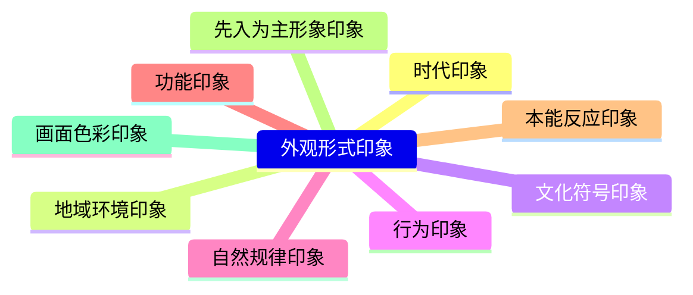
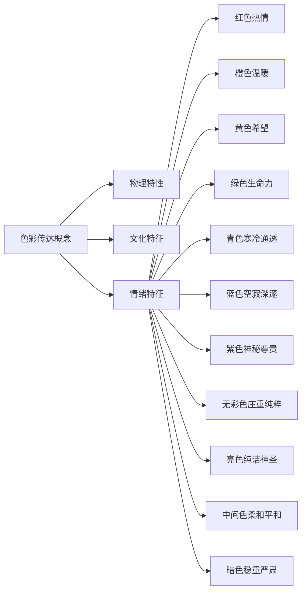
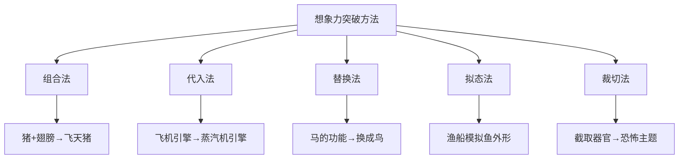

# 第12课：概念的传达

## 学习目标

- 理解概念传达的本质——传达思维活动而非绘画本身
- 掌握建立广泛认同感的四种设计方法
- 熟悉九种外观形式印象的提炼方式
- 学会利用元素、排列节奏、色彩、构图四种手段传达概念
- 掌握画面叙事的基本方法：元素叙事、节奏叙事、行为叙事与冲突叙事
- 理解故事线中画面节奏韵律的塑造原理
- 掌握想象力突破的五种思维方法

## 核心概念

### 概念传达的本质

绘画与概念设计虽然在视觉表现上有相似之处，但二者的专业目标存在本质区别。绘画作品本身就是最终产品；而概念设计的最终产品并不是所画的画面，而是在画面内容指引下生产出的产品。**概念是思维活动的产物，设计的核心在于传达思维活动**。所有通过绘画或非绘画手段呈现的造型、色彩、氛围等表象，都是为了传达产品的最终效果。绘画只是传达概念的一种手段，但不是必要手段。

> [!TIP] Key Insight
> 概念设计的本质不是"画得好"，而是"传达到位"。画笔只是工具，思维才是核心。一个成功的概念设计，让观者看到的不是画面本身，而是画面背后的产品蓝图。

---

### 12.1 建立概念传达的认同感

概念设计不能随心所欲、凭空想象地进行，必须以客观事物为基础，并在广泛的认知条件下进行，才能设计出具有广泛认同感的画面。**认同感的建立是概念设计的必要条件**。

#### 1. 考据设计对象结构的正确性与可行性

**结构正确性**：在设计某个题材时，必须具备相应的知识积累。以建筑设计为例，无论哪种文化背景的建筑，都具备地基、立柱、墙面、横梁、屋顶等基本结构形式。即便是设计现实中不存在的建筑，也应遵循建筑结构逻辑（例如用动物的骨骼做立柱、用鳄鱼皮做屋顶，但建筑结构逻辑依然源于现实）。

**结构可行性**：在塑造非现实设计对象时，赋予其现实中的可行元素，能增强可信度。例如四足挖掘机的液压系统、传动装置都来源于现实，使得非现实存在的挖掘机具有功能实现的可行性。

**避免过分考据**：在传达概念时，考据应以核心外观形式带来的认同感为参照。例如飞行器设计中不一定精确符合空气动力学，但机翼元素能传达出"能够飞行"的感觉即可。

#### 2. 以广泛认识的元素作为设计取材基础

选用常见的、被广泛认知的元素能快速建立认同感。例如在设计拉丁美洲古代印第安文明题材时，使用玛雅金字塔、阿兹特克纹饰（而非木制棍棒、黑曜石）更容易让普通观者建立画面认同感。

#### 3. 以先入为主的形象作为设计取材基础

利用人们已有的刻板印象来建立认同感。例如恶魔通常有夸张的角，天使有翅膀——这些约定俗成的形象特征是辨识的依据。

#### 4. 避免产生设计歧义

避免使用容易产生混淆的元素。例如唐刀和日本武士刀外形相似，容易产生误认，需通过修改装饰来消除歧义。

---

### 12.2 外观形式的印象提炼

人们对不同形象的客观物体都有固定印象。元素的形状、色彩或排列节奏可以从不同角度归纳出多种印象。

**1. 时代印象**：不同时代的科技、工艺、文化赋予元素不同的时代特征。交通工具的科技水平、服饰风格、代表性生物（恐龙、剑齿虎、狮子）都能传递时代印象。

**2. 地域环境印象**：茂密树木→湿润环境；风沙侵蚀岩石→干旱环境。服饰差异和生物特征（猛犸象浓密体毛 vs 大象稀疏体毛）也传递地域环境印象。

**3. 文化符号印象**：云纹、龙纹→东方文化；抽象纹饰→印第安文化；交织线形纹饰→维京文化。纹饰的粗犷或规整也传达了不同的文化倾向。

**4. 行为印象**：尖牙利爪→肉食动物；温顺可爱→草食动物。人物性格差异也表现出不同的外貌与行为特征。

**5. 自然规律印象**：地质活动、生命生长演化等自然规律呈现出的外观形式。

**6. 功能印象**：尖刺→锋利穿刺；圆形→不安定、动性强（车轮、齿轮）。

**7. 本能反应印象**：食物引发食欲，恐惧元素引发求生欲等本能反应。

**8. 先入为主的形象印象**：东方龙（鹿角、长条身体）与西方龙（蜥蜴结构、翅膀）的差异。

**9. 画面色彩印象**：绿色→春季生长；黄色→秋季丰收。

---

### 12.3 利用元素传达概念

核心思路：利用不同的外观形式呈现不同的形式感，表现不同类型的设计主题。

**通过外形特征传达主题**：客车截面趋于长方形（速度感弱），跑车截面趋于菱形（速度快）。外形特征由多种基础元素构成，可通过大小车轮对比、整体轮廓形状趋势等方法塑造。

**通过题材特征传达主题**：同样的饮水机结构，用骨头木架元素→兽人风格，用坛子木雕元素→古代东方风格。角色设计中，指南针+铁锹+望远镜→挖宝探险者；药瓶+货物→商人。

---

### 12.4 利用排列节奏传达概念

当排列结构形式为外观形式主导时，利用不同的节奏传达不同的主题。

**排列节奏的作用**：同样的武器，规整排列→有序感，散乱排列→无序感。排列节奏可以从趋势感强弱、规整/混乱程度四个角度传达主题表现方向。

**统一排列节奏**：复杂设计主体的多种元素需有相对统一的排列节奏，使设计主题方向更为明确。酒瓶和花瓶统一趋于规整或统一趋于散乱，都能明确传达主题。

**在角色设计中的应用**：河豚将军的盔甲、肩甲、爪子以规整排列呈现，赋予角色规整外观；怪物身上的护甲、骷髅、武器以不规则排列呈现，赋予野蛮、暴力的外观。

**在场景设计中的应用**：规整的桥梁→宁静平和；粗犷的排列→喧嚣不安。

---

### 12.5 利用色彩传达概念

**通过色彩呈现物理特性**：同样的喷泉造型，赋予白银、黄金、水晶的不同固有色及光影关系，传达不同主题。

**通过色彩呈现文化特征**：红色在东方象征喜庆，在西方象征暴力。塑造宗教、贵族文化用明亮色彩；塑造市井文化用灰暗色彩。

**通过色调呈现情绪特征**：色相对心理影响最大。红（热情兴奋）、橙（温暖/消沉）、黄（轻快希望）、绿（健康生命力）、青（寒冷通透）、蓝（空寂深邃）、紫（尊贵神秘/恐惧）、无彩色（黑暗庄重/纯粹透明）、亮色（纯洁神圣）、中间色（柔和平和）、暗色（稳重严肃/罪恶恐惧）。

---

### 12.6 利用构图传达概念

**一般性插图构图**：固定背景中应用点线面构图知识塑造画面形式感，传达主题。

**锁定视角的构图设计**：相机位置固定，设计主要可行走区域的构图即可。第三人称视角需安排同屏幕元素的主次关系和道路指引。

**自由视角的构图设计**：玩家观察区域不固定，需通过地形规划主动塑造构图。利用地势落差、山坡、沿路岩石等塑造不同位置的画面架构和动势。观察视角（平视 vs 俯视）影响氛围塑造——平视强调建筑主体，俯视表现整体环境氛围。

---

### 12.7 利用画面叙述故事

**通过元素传达故事性**：完整的斧头无法引发联想，碎裂结构和血迹→使用过的故事。僵尸狼踩到捕兽夹 vs 身中箭矢→不同的故事。小屋悬挂狐狸皮→狩猎故事；建筑摆放怪兽头颅→强大战斗力。

**通过排列节奏传达故事性**：不规则的排列节奏在故事性表现上强于规则的排列节奏。规整排列的武器难以呈现故事性，不规则排列的武器更容易引发事件联想。

**通过行为传达故事性**：角色的肢体语言能塑造性格特征，传达故事性。游戏选人界面中角色的装备、站姿、动作、声音等全面展示角色形象与故事。

**通过冲突传达故事性**：
- **元素冲突**：野蛮人武器店中出现精致刀剑、火枪→贸易或战利品故事
- **排列节奏冲突**：城墙规整部分与坍塌混乱部分形成冲突→战争故事
- **行为冲突**：少女挖鼻屎→灵魂互换等反常故事

---

### 12.8 故事线中的画面节奏韵律

游戏故事线需对连续的单幅画面进行有序规划，使整体故事线具有节奏感。

**节奏元素**：环境氛围、角色（不同表现力）、音效和音乐共同构成节奏元素。

**故事线画面节奏的塑造方法**：

1. **基础节奏**：以有规律的重复组合呈现不同剧情画面
2. **韵律起伏**：以不同对比呈现起伏变化，形成起承转合
3. **对比幅度**：对比幅度小→节奏平淡；对比幅度大→节奏感强、感染力强
4. **变化规律**：采用具有一定无序特征的规律性节奏，最终回归有序的核心剧情
5. **局部层次**：整体节奏包含细微的局部变化，丰富节奏的层次感

**空间维度与时间维度的画面节奏**：
- **空间维度**：随玩家在地图中移动而产生位置变化，塑造不同环境氛围
- **时间维度**：空间位置固定时，通过不同时间段场景画面的演变设计来表现

---

### 12.9 想象力的突破

单纯再现客观事物无法呈现有创意的概念设计，必须突破想象力。五种思维方法：

**1. 组合法**：加入另一种表现印象的元素，得到全新概念。猪+翅膀→有翅膀的猪。怪物设计中常组合各种动物的角。

**2. 代入法**：用另一种元素代替原有元素，保留大部分原有主体框架。猪鼻子→大象鼻子。飞机引擎→蒸汽机引擎（改变时代背景印象）。

**3. 替换法**：用新题材替换整体元素并实现其功能。马的功能→用鸟替换（不同样式的坐骑设计）。

**4. 拟态法**：用完全不同的造型形态模拟表现对象。渔船模拟鱼的外形。

**5. 裁切法**：截取部分直接作为独立主题。截取生物器官营造恐怖氛围。

**综合应用**：各种方法需结合使用。双髻鲨摩托艇同时运用组合法（摩托车+潜艇）与拟态法（模拟双髻鲨外观）。

> [!TIP] Key Insight
> 想象力突破不是天马行空的胡思乱想，而是建立在客观事物认知基础上的"有规律的创新"。无论是组合、代入还是拟态，核心是以合理可行的方式让不同元素的结构自然结合，从而产生既新颖又可信的设计。

---

## 章节小结

本章系统阐述了概念传达的完整体系：从建立认同感的基础条件，到外观形式印象的九种提炼方式；从元素、排列节奏、色彩、构图四种传达手段，到画面叙事的多种方法；从故事线节奏韵律的空间与时间维度，到想象力突破的五种思维方法。概念传达的核心可以归纳为：**以客观事物为基础建立认同感，通过不同形式感的手段传达思维活动的产物**。设计者需要在这些原理的基础上，灵活运用多种方法，才能实现从"画得好"到"传达到位"的跃升。

## 自测练习

> [!QUESTION] 1. 概念设计与传统绘画的本质区别是什么？
> 

答案
传统绘画中，绘画作品本身就是最终产品；而概念设计中，最终的**产品**并不是所画的内容，而是在画面指引下生产出的产品。概念是思维活动的产物，设计的核心在于**传达思维活动**，绘画只是传达的手段之一。

> [!QUESTION] 2. 建立概念传达认同感有哪四种方法？请简要说明。
> 

答案
①**考据结构正确性与可行性**：依据客观世界的结构逻辑塑造设计，并通过现实中的可行元素增强可信度。②**以广泛认识的元素取材**：使用常见元素确保观者能够建立认同，避免知识盲区。③**以先入为主的形象取材**：利用人们已有的刻板印象（如恶魔有角、天使有翅膀）。④**避免设计歧义**：避免使用容易产生混淆的元素。

> [!QUESTION] 3. 外观形式印象提炼包含哪些类型？请至少列出六种。
> 

答案
九种类型：①时代印象 ②地域环境印象 ③文化符号印象 ④行为印象 ⑤自然规律印象 ⑥功能印象 ⑦本能反应印象 ⑧先入为主的形象印象 ⑨画面色彩印象。

> [!QUESTION] 4. 想象力的突破有哪些思维方法？以猪为基础分别举例说明。
> 

答案
五种方法：①**组合法**：猪+翅膀→飞天猪。②**代入法**：猪鼻子换成大象鼻子。③**替换法**：用猪替换马作为坐骑。④**拟态法**：模拟鱼的外形塑造猪。⑤**裁切法**：截取猪具有特征性的部分作为独立主题。

> [!QUESTION] 5. 游戏的画面节奏在空间维度和时间维度上分别如何体现？
> 

答案
**空间维度**：随着玩家在地图中的移动产生空间位置变化，不同位置发生不同事件→不同环境氛围、不同角色的画面变化→形成节奏感。**时间维度**：空间位置相对固定时，通过不同时间段固定场景的画面演变设计来表现节奏→场景环境演变、角色技能表现力增强、背景音效变化等。

> [!QUESTION] 6. 画面叙事可以通过哪些途径实现？请列出四种并简要说明。
> 

答案
四种途径：①**元素叙事**：利用元素本身传递故事信息（斧头的碎裂和血迹）。②**排列节奏叙事**：通过元素的规整或散乱排列传达故事性（散乱武器→意外事件）。③**行为叙事**：通过角色肢体动作传达性格和故事（选人界面展示）。④**冲突叙事**：通过元素冲突、排列节奏冲突、行为冲突制造与现实印象的反差，传达更强的故事性。

## 延伸阅读

- [[lessons/0009-hua-mian-gou-tu|第09课：构图与视觉引导]]
- [[lessons/0007-se-cai-da-pei|第10课：色彩与固有色]]
- [[lessons/0003-jie-zou-de-zuo-yong|第11课：节奏韵律]]
- [[0013-she-ji-yu-yan|第13课：设计语言]]
- [[0014-gui-hua-she-ji|第14课：规划设计]]