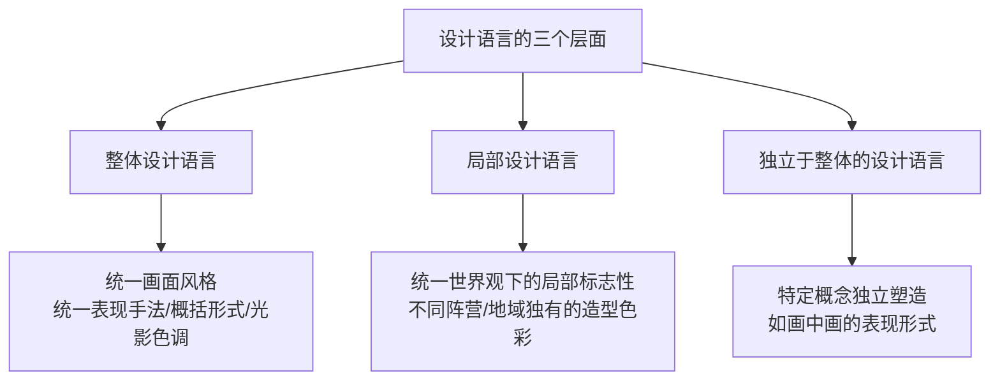
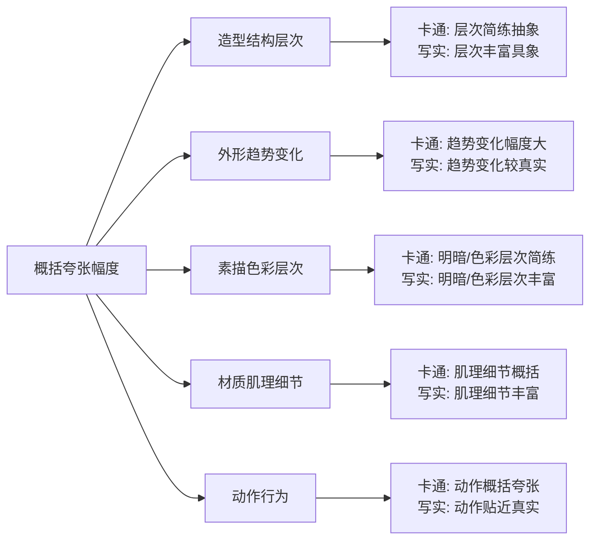
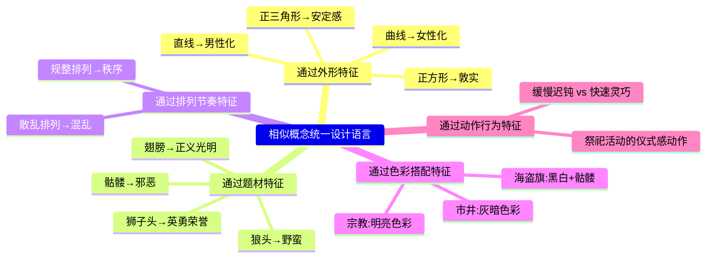

# 第13课：设计语言

## 学习目标

- 理解设计语言的三个层面：整体、局部、独立
- 掌握通过表现手法特征统一设计语言的方法
- 掌握通过概括夸张特征（造型结构、外形趋势、素描色彩、材质肌理、动作）统一设计语言
- 掌握通过环境氛围特征（整体色调、光影明暗对比、明暗面色调倾向）统一设计语言
- 掌握通过相似概念（外形、题材、排列节奏、色彩搭配、动作行为）统一设计语言

## 核心概念

### 设计语言的本质

不同种类的艺术创作活动，运用独特的物质材料媒介，以特有的审美法则创作，形成了自身独特的艺术表现特征。提取这些独有的艺术特征并应用于产品的包装设计，使产品具有整体、统一的艺术表现形式，这些统一的艺术包装形式即构成了产品的**设计语言**。

相同的形象，通过不同的绘画表现手法和设计节奏变化，会呈现出完全不同的外观形式。然而，不同的外观形式难以以统一的美术风格存在于产品中，因此必须在进行概念设计时建立设计语言的意识。

---

### 13.1 设计语言的意识

设计语言具有统一的普遍性和风格特征标志性，包含三个层面：

**1. 整体的设计语言**：以统一的画面风格（美术表现手法、概括形式、光影色调）塑造不同的形象，使不同的角色尽管主题不同，但能以统一的画面风格存在于作品中。

**2. 局部的设计语言**：在统一画面风格基础上，结合世界观架构，塑造局部具有标志性的概念设计。例如恶魔与天使阵营各自的武器、环境背景、纹饰具有极大差异，构成了各自阵营的设计语言。

**3. 独立于整体的设计语言**：赋予特定概念以不同的艺术形式，使其独立存在于整体设计语言框架之外但不显突兀。典型表现为"画中画"——角色进入卷轴与画中巨蛇战斗，这一部分可以以卷轴画的设计语言进行独立塑造。

---

### 13.2 表现手法特征统一设计语言

不同创作方式应用不同的材料和媒介形成不同的创作表现手法。独特的表现手法产生独特的画面效果，呈现出特有的画面风格，可直接构成整体设计语言。

**常见表现手法**：水彩、素描、油画、钢笔画、水墨画、剪纸画等。

**核心原理**：同样外观形式的物件，通过模拟不同的创作表现手法，能形成各不相同并具有不同创作媒介特征的画面表象。一把剑用钢笔画法 vs 水墨画法，呈现完全不同的画面风格。

**应用要点**：
- 以赋予画面某种创作方式的表现手法作为画面风格导向
- 表现手法导向也应应用于动作特效等美术风格中
- **取舍策略**：为保证某种表现手法的呈现效果，需舍弃一些非核心表现因素。例如为突出钢笔画风格，减少色彩层次并削弱体积细节。

---

### 13.3 概括夸张特征统一设计语言

以特有的审美法则进行不同程度的概括夸张塑造，能形成极具风格辨识度的画面。通过把控概括夸张的幅度，可以统一设计语言。

本质是通过形与色的节奏塑造，呈现不同的画面风格（轮廓长短线节奏、平面节奏、体积节奏、固有色搭配节奏等）。概括性越强→节奏层次越简练→越趋于卡通、抽象风格；细节层次越丰富→越趋于写实风格。

#### 1. 概括夸张造型结构层次

趋于卡通的角色造型更加抽象化、结构简练；趋于写实的角色造型更加具象、结构层次丰富。同一画面风格框架内，不同设计案例需保持一致的概括夸张特征。

#### 2. 概括夸张外形趋势变化

常见于物体受力后的外形变化。铁皮包裹木头：卡通风格夸张受力后的形状变化，写实风格则不太强调。植物的S形曲线造型受重力、生长等多种力的作用，是概括夸张中较难表现的题材。

#### 3. 概括夸张素描色彩层次

卡通风格：简化明暗对比，使画面更抽象。写实风格：更多素描关系层次，细节丰富。同一风格框架内的不同设计图保持一致的概括夸张特征和色彩搭配跨度区间。

#### 4. 概括夸张材质肌理细节

材质肌理细节包括造型细节表现程度和色彩细节表现程度。同一风格框架内的不同武器设计，整体外形差异大但材质肌理刻画程度一致，也能形成统一画面风格。

**特殊说明**：卡通画面风格中可以在局部塑造卡通风格的图案；写实画面风格中也可以点缀卡通风格的图案（如枪身上的棕熊卡通图案），并不突兀。因为卡通、抽象等艺术表现形式在现实世界中也是存在的。

#### 5. 概括夸张动作

具象画面风格：角色的动作更贴近真实运动逻辑。抽象画面风格：主观减少关节结构的影响，使动作特征更加抽象。同一风格框架内的不同角色需要有一致的动作概括夸张特征。

---

### 13.4 环境氛围特征统一设计语言

不同的光影色调塑造能产生独特的环境氛围特征，呈现出特有的画面风格。核心在于**主观性地塑造具有某种强烈色彩表现特征的环境**。

#### 1. 整体色调特征

根据色调倾向性的强弱，分为三种表现：
- 色调倾向弱：元素固有色表现明显，色彩独立性强
- 色调倾向中等：整体呈现某种色彩倾向（如黄绿色调），元素色彩独立性较弱
- 色调倾向强：整体呈现高度统一的色彩倾向，元素几乎没有独立色调

#### 2. 光影明暗对比特征

根据光影明暗对比关系的强弱：
- 几乎不强调明暗对比：以固有色色彩搭配为主
- 明暗对比适中：亮部和暗部都有丰富的色彩层次
- 明暗对比极强：暗部接近纯黑色，以光影塑造为主（美式漫画风格）

#### 3. 明暗面色调倾向特征

在光影对比较强的基础上，对亮部或暗部赋予色调倾向：
- 暗面趋暖→亮面丰富冷色固有色（鲜明对比）
- 暗面趋冷→亮面丰富暖色固有色（鲜明对比）
- 暗面无彩色→亮面有彩色（鲜明对比）

> [!TIP] Key Insight
> 环境氛围是设计语言的"情绪滤镜"。同样的造型放在不同的光影色调环境中，会传达完全不同的设计语言。这种统一方式尤其适合快速建立系列作品的视觉辨识度。

---

### 13.5 相似的概念统一设计语言

在统一画面风格基础上，结合特定世界观，利用统一的设计规则塑造外观形式特征相似的不同元素，传达一系列成体系的概念，统一局部设计语言。

**1. 通过外形特征统一**：不同设计主体具有同样的形状特征（如都采用三角形或正方形），使设计样式统一且具有标志性。

**2. 通过题材特征统一**：以相似的题材特征传达不同概念。人类阵营用狮子元素（英勇正义），野蛮人阵营用骷髅元素（野蛮暴力）。想象力突破尺度也可统一设计语言——骑兵题材统一用现实生物（马、牛、大象）或用幻想生物（翼龙、蜥蜴、角龙）。

**3. 通过排列节奏特征统一**：相同的排列节奏特征应用于多组设计方案。恶魔头领的骷髅排列规整（有智慧的等级感），恶魔监狱长的骷髅排列混乱（野蛮无序）。

**4. 通过色彩搭配特征统一**：色彩搭配须结合特定形状或题材才能有效传达信息。海盗旗的黑白+骷髅图案成为海盗阵营的标志性色彩特征。普通民房用灰褐色，宫殿用橙色、米黄、紫色及蓝色。

**5. 通过动作行为特征统一**：群体角色统一的行为特征在不同地域、文化或阵营中最具标志性。祭祀活动中不同角色的仪式感动作行为可统一设计语言。

---

## 章节小结

本章详细阐述了设计语言的完整体系。设计语言是产品整体、统一艺术表现形式的体现，包含整体、局部和独立三个层面。统一设计语言有四大途径：通过表现手法特征、概括夸张特征、环境氛围特征和相似概念特征。这些途径既可单独使用，也可结合运用。设计语言的本质是在多样化的设计内容中建立统一的视觉识别系统，让不同的元素、角色、场景在同一世界观中和谐共存，并形成独特的风格辨识度。

## 自测练习

> [!QUESTION] 1. 设计语言包含哪三个层面？请分别说明。
> 

答案
①**整体的设计语言**：以统一的画面风格（表现手法、概括形式、光影色调）塑造不同形象。②**局部的设计语言**：在统一画面风格基础上，不同阵营/地域/文化独有的标志性造型、色彩、主题。③**独立于整体的设计语言**：以不同的艺术形式呈现特定概念，独立存在但不显突兀（如画中画）。

> [!QUESTION] 2. 通过环境氛围特征统一设计语言，可以从哪三个方向进行塑造？
> 

答案
①**整体色调特征**：不同色调倾向塑造不同画面风格（弱倾向→固有色明显，强倾向→整体色彩统一）。②**光影明暗对比特征**：从几乎无明暗对比到极强明暗对比，形成不同画面风格。③**明暗面色调倾向特征**：对亮部或暗部分别赋予冷暖色倾向，形成鲜明对比。

> [!QUESTION] 3. 概括夸张特征可以应用于哪些方面？每种请简要说明其对画面风格的影响。
> 

答案
五个方面：①**造型结构层次**：概括→卡通风格（层次简练抽象），丰富→写实风格（层次细腻具象）。②**外形趋势变化**：夸张受力变化→卡通风格，真实变化→写实风格。③**素描色彩层次**：简化明暗→卡通，多层次明暗→写实。④**材质肌理细节**：概括肌理→卡通，丰富肌理→写实。⑤**动作行为**：概括抽象动作→卡通，贴近真实动作→写实。

> [!QUESTION] 4. 通过相似的概念统一设计语言有哪五种途径？请列出并举例。
> 

答案
①**外形特征**：多组建筑都用三角形外形。②**题材特征**：人类阵营用狮子题材，野蛮人阵营用骷髅题材。③**排列节奏特征**：高等级恶魔的骷髅规整排列，低等级恶魔的骷髅散乱排列。④**色彩搭配特征**：海盗阵营的黑白+骷髅图案。⑤**动作行为特征**：祭祀活动中统一的仪式感动作。

> [!QUESTION] 5. 为什么在突出某种表现手法时需要有所取舍？请举例说明。
> 

答案
为了保证某种表现手法在画面中的呈现效果，需要舍弃一些非核心表现因素，削弱对其的干扰。例如为了呈现钢笔画的欧式漫画风格，需要减少整体画面的色彩层次并削弱体积细节，让钢笔画的线条表现更加突出。如果不做取舍，多种表现手法相互干扰会导致画面风格不纯粹。

## 延伸阅读

- [[0012-gai-nian-de-chuan-da|第12课：概念的传达]]
- [[lessons/0007-se-cai-da-pei|第10课：色彩与固有色]]
- [[lessons/0003-jie-zou-de-zuo-yong|第11课：节奏韵律]]
- [[0014-gui-hua-she-ji|第14课：规划设计]]