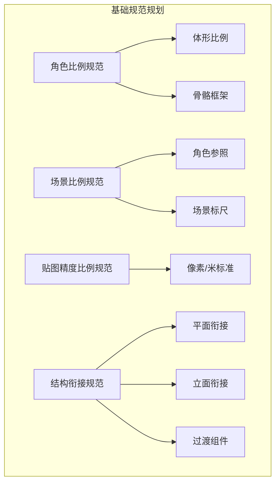
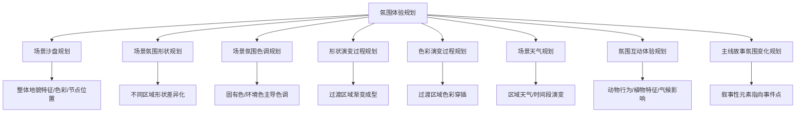
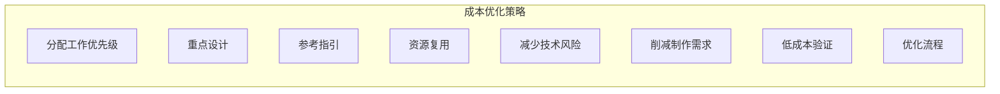

# 第14课：规划设计

## 学习目标

- 掌握解读设计目标的四种方法
- 理解基础规范规划（角色比例、场景比例、贴图精度、结构衔接）的要点
- 掌握概念规划中横向规划与纵向规划的运用
- 理解关卡规划的核心原则（交互规则、加载规则、模块化拼接）
- 掌握氛围体验规划的八个层面
- 理解视觉引导规划中标志物设计的关键要素
- 熟悉重复资源规划的各种连续结构与贴图类型
- 掌握资源量化规划的三种统计方法
- 理解设计成本优化的多种策略
- 学会设计方案的落实与反馈迭代方法

## 核心概念

### 规划设计的本质

概念设计最终服务于产品，其本质是对产品的规划。一个游戏产品需要大量不同种类、题材、表现力的设计方案，往往需要多人甚至多个团队协作完成。因此需要充分规划，明确设计方向，在整体框架内推动局部的概念设计。

---

### 14.1 解读设计目标

概念设计以目标为导向，需要理性思维。规划设计的前提是明确设计目标。

**模糊目标的后果**：设计尺度边界过大，内容过于宽泛，方向偏离。多人协作时因理解不统一，结果差异巨大。

**清晰目标的优势**：有效约束设计边界，让不同设计师的设计方案趋向一致。

**解读设计目标的四种方法**：

1. **找到核心目标要求**：每个设计对应到相应的目标要求。木箱→可爆炸或可开启？树根设计→核心目标是阻隔作用，因此应设计成密集结构而非空隙较大。

2. **剔除可有可无的需求信息**：当次要目标与核心目标冲突时，应适当舍弃次要信息。可爆炸火药桶：最主要的是爆炸物警示性图案，其次是体积结构，最次要的是木材纹理。

3. **通过参考元素明确目标要求**：参考图能有效传达形状、色彩、题材、表现力等信息，约束设计尺度。以鹦鹉螺为参考，设计元素被有效约束在其外观特征中。

4. **区分阶段性设计目标需求**：研发初期需要快速搭建框架，使用简单资源（立方体即可）；中后期在框架基础上进行迭代，侧重细节和氛围塑造。

---

### 14.2 基础规范规划

基础规范规划的核心是以技术实现可行性为基本条件，制定底层设计标准和相对比例关系。

**1. 角色比例规范**：
- **体形比例规范**：不同身材的角色及不同生物的基础体形
- 提升资源复用率：同一基础体形更换不同服饰即可呈现不同主题
- **骨骼规范**：复用体形时，运动结构必须在原有骨骼框架内
- 高重要度的角色可不强调复用率，作为独立元素设计

**2. 场景比例规范**：以角色为参照，通过门、窗、桌椅等直观物件作为比例标尺。路面宽度影响引导性——越宽越趋于"面"，越窄越趋于"线"。

**3. 贴图精度比例规范**：在不同技术条件下保证美术资源最终呈现精度一致。以64像素/米的精度标准为例，2米的图案需128像素贴图。

**4. 结构衔接规范**：针对场景建筑设计的平面结构和立面结构的拼接规则。差异较大的组件需设计过渡组件（如塔楼衔接围墙和廊道）。

---

### 14.3 概念规划

概念的规划可以概括为**用一种设计语言去塑造一个世界**。

**1. 整体设计语言规划**：用标志性的画面风格塑造虚拟世界的不同元素。需充分考虑游戏实际视角：第三人称视角突出角色上半身塑造，横板视角强调侧身塑造；角色在画面中的比例影响细节概括程度。

**2. 概念设计横向规划**：从宏观到局部的规划设计。
- 第一层：不同题材地图规划（森林、山谷、火山等）
- 第二层：每张地图中不同区域氛围规划（瀑布、浅滩、海岸）
- 第三层：每个种类的元素不同外观形式规划（不同造型的植物、动物）
- 包含局部设计语言规划（云纹应用于同人文背景的不同元素）
- 包含个体元素的不同动作、技能表现形态规划

**3. 概念设计纵向规划（等级规划）**：对同一元素进行不同阶段的规划设计。
- 角色等级变化：同一个怪物的不同阶段外观形式
- 等级越高→动作技能、特效、音效表现力越强
- 场景等级规划：通用物件（表现力弱）vs 特殊物件（表现力强，形成视觉中心）

---

### 14.4 关卡规划

关卡规划是剥离美术、技术及故事后，对游戏底层交互结构的规划。美术包装建立在明确的关卡规划基础上。

**1. 规划结构满足游戏交互规则**：关卡结构需满足基础交互规则的实现。2D横板游戏以高度作为设计要求；3D游戏要考虑立体空间影响，封闭其他通过方式，将跳跃作为唯一可行方式。动态关卡（倒下的柱子造成伤害）需验证大小、路径、间隔等可行性。

**2. 规划结构满足加载规则**：以摄像机或角色为中心，由近及远加载资源，不断卸载画面外资源。自由视角3D游戏需利用LOD（多细节层次）技术，降低远处物体面数。通过遮挡结构（Z字形、半弧形、屏风形）限制同画面内数据量。

**3. 规划结构适应模块化拼接**：将资源设计成通用性模块以适配不同地图。树林、草地、石堆、沼泽、沙地分别作为独立模块进行组合。

**4. 规划结构表现基础的美术框架**：以简单几何体构建的框架决定了后续美术表现的方向，是氛围体验规划设计的基础。

---

### 14.5 氛围体验规划

以故事线中的画面节奏韵律为基础，针对游戏全局画面所做的规划。

**1. 场景整体沙盘规划**：传达整体氛围信息的框架图。自由视角需先通过平面图明确体验节点位置。

**2. 场景氛围形状规划**：利用概括性相同的形状塑造同一区域，拉开不同区域的形状差异。

**3. 场景氛围色调规划**：利用概括性相同的色调塑造同一区域，拉开不同区域的色调差异。

**4. 形状演变过程规划**：过渡区域同时包含两个区域的元素，进行逐渐过渡的穿插，形成渐变演变。

**5. 色彩演变过程规划**：两个区域色彩通过过渡区域进行穿插层次，形成渐变演变。

**6. 场景天气规划**：天气影响虚实、色彩、空间层次关系。可规划不同区域的天气差异，也可规划同一区域不同时间段的天气演变。

**7. 氛围互动体验规划**：利用与场景氛围对应的特征性互动元素——不同区域的角色、不同习性的动物、不同生长特征的植物。动物的行为随环境和天气变化，影响玩家互动体验。

**8. 主线故事氛围变化规划**：利用多个叙事性元素指向事件点，逐渐增强故事代入感。

---

### 14.6 视觉引导规划

视觉引导规划也称为地标规划——利用画面中不同元素对玩家视线的影响引导游戏体验。

**1. 规划标志物表现力强弱关系**：
- 主线标志物：整张地图核心，表现力最强，放置最高，形成标志性记忆点
- 支线标志物：局部空间有一定表现力，形成局部记忆点（如城镇钟楼）
- 次要标志物：略微改变外观形式，影响范围有限（如街道商店）

**2. 规划标志物的题材**：有明确题材的标志物能讲述故事背景，增加探索欲望。骸骨暗示危险，铁匠铺与装备升级相关，废弃教堂暗示剧情展开。

**3. 规划标志物的位置**：根据游戏规则机制和沙盘图，形成延续性、递进式的排列。次要标志物围绕主要标志物分布——帮助玩家定位中心并提供方向参照。

**4. 规划标志物的层次关系**：玩家接近标志物时，其在取景画面中的面积增大，点的作用减弱。需同时考虑远处取景（屋顶重点塑造）和近处取景（大门重点塑造）。

---

### 14.7 重复资源规划

**1. 连续贴图规划**：
- **二方连续贴图**：两个方向纹理可重复衔接，应用于路面、装饰物包边
- **四方连续贴图**：四个方向纹理可重复衔接，应用于大面积地面、墙体
- **环绕连续贴图**：围绕圆心环绕，应用于圆形广场、圆形纹样
- 多层次的环绕连续贴图：外圈环绕次数多，内圈少，保证密度一致

**2. 混合连续贴图规划**：对多张连续贴图分别选取不同肌理区间进行混合，解决单张贴图纹理单调的问题。本质是对平面切割节奏和内轮廓线节奏的把控。

**3. 连续结构规划**：二方连续结构（围栏）、四方连续结构（凹凸墙面）、环绕连续结构（半圆形花窗）。用有限的模型资源表现大范围空间结构，常用于衔接不同区域的遮挡结构。

**4. 重复组件规划**：单一元素重复排列（木箱不同朝向摆放）和多种元素重复排列（岩石、灌木不同位置组合）。建筑组件可拆分为墙面、转角、屋顶等可自由拼接的单元。

---

### 14.8 资源量化规划

**1. 单分量化统计规划**：基于横向与纵向规划明确单体设计数量。角色数量→对应套装、武器、动作、特效设计。

**2. 模块化量化统计规划（拆分规划）**：将复杂设计主题（如村落、城镇）划分为若干设计片区，分别对不同范围内的元素进行拆分统计。

**3. 设计盲区补充统计规划**：自由视角游戏中存在画面背面、室内等盲区。通过补盲设计（以贴近实际的视角设计，用简单结构指引和固有色填充），整合到整体模块的量化统计中。

---

### 14.9 设计成本规划

核心是做**性价比高的设计方案**——让落实难度尽可能低，呈现效果尽可能好。

**1. 分配工作优先级**：主力设计师负责重要度高、制作难度大的目标；同时跟进次要工作以保障品质。

**2. 重点设计**：重要度高的目标投入更多预算（如大门用精致雕像），重要度低的目标用通用元素节省成本。

**3. 参考指引**：完成度高的设计方案指引后续制作，减少深入工作时间。

**4. 资源复用**：同一基础造型修改得到多个次要角色；高品质资源（如雕像）在不同场景重复利用。

**5. 减少技术风险**：避免技术实现难度大、通用性弱的美术表现（如3D游戏中的2D水墨效果）。

**6. 削减制作需求**：在满足游戏机制的前提下缩小地图面积、减少NPC数量、合并任务线。

**7. 低成本验证**：在研发初始阶段用简单模型验证规则机制和美术效果，在前期解决不确定因素。

**8. 优化流程**：加入模型验证环节，减少不必要流程。小项目用线性流程（稳定、修改代价小），大项目用多线并行（同步推进，降低时间成本）。

---

### 14.10 设计方案的落实

设计师不仅要做设计，还要对后续制作环节进行充分说明并跟进，保证设计方案落实到位。

**落实的本质**：从最基础的轮廓剪影到最终完成，是不断自我反馈、修改完善，使设计方案逐步向正确目标迭代的过程。

**落实的关键方法**：
- **目标同步**：通过会议沟通让团队达成共识
- **目标方向性拆分**：减少次要因素干扰。木箱设计的不同目标→爆炸功能/美术风格/场景气氛→反馈重点不同
- **目标阶段性拆分**：不同流程阶段侧重不同。植物组合设计：剪影→规格尺寸→固有色材质→组件组合。场景设计：基础形状→固有色/色调→光照/细节

> [!TIP] Key Insight
> 规划设计不是限制创意的枷锁，而是让创意"多快好省"地落地的路线图。好的规划让所有人朝同一个方向前进，让每一分投入都产生最大的视觉回报。概念设计不仅需要艺术家的感性灵感，更需要项目经理的理性统筹。

---

## 章节小结

本章全面阐述了概念设计的规划设计体系，涵盖设计目标解读、基础规范规划、概念规划、关卡规划、氛围体验规划、视觉引导规划、重复资源规划、资源量化规划、设计成本规划和设计方案落实十大方面。规划设计从宏观到微观、从抽象到具体，构建了一套完整的管控流程。规划设计不仅确保多人协作的设计方向统一、资源制作高效，更直接关系到产品的成本控制和最终品质。概念设计师需要从纯粹的创作者转变为兼具管理者思维的产品推动者。

## 自测练习

> [!QUESTION] 1. 解读设计目标有哪四种方法？请简要说明。
> 

答案
①**找到核心目标要求**：每个设计对应相应目标，以核心目标为主要设计依据。②**剔除可有可无的需求信息**：次要目标与核心目标冲突时适当舍弃。③**通过参考元素明确目标要求**：参考图直观传达设计信息，约束设计尺度。④**区分阶段性设计目标需求**：研发初期用简单资源验证框架，中后期完善细节和氛围。

> [!QUESTION] 2. 关卡规划设计必须满足哪四个前提条件？
> 

答案
①**满足游戏交互规则**：关卡结构需确保基础交互规则（跳跃、跑动、攀爬等）的实现。②**满足加载规则**：利用LOD技术和遮挡结构减少同画面内数据量。③**适应模块化拼接**：设计通用性模块以提高地图制作效率。④**表现基础美术框架**：简单的几何体框架为后续美术表现奠定基础。

> [!QUESTION] 3. 概念设计的横向规划和纵向规划分别指什么？
> 

答案
**横向规划**：从宏观到局部，对整个世界的不同元素进行规划设计。包括地图规划→区域氛围规划→元素外观形式规划→局部设计语言规划→动作技能特效规划。**纵向规划（等级规划）**：对同一元素的不同阶段进行规划设计，如怪物等级递进的外观变化、技能特效增强等。

> [!QUESTION] 4. 视觉引导规划中，标志物的表现力强弱如何影响其引导作用？请举例说明。
> 

答案
标志物表现力越强，引导作用越强，影响范围越大。**主线标志物**（如火山）：整张地图核心，放置最高，在大部分位置都能观察到。**支线标志物**（如城镇钟楼）：局部空间表现力强，形成局部记忆点。**次要标志物**（如街道商店）：略微改变外观，影响范围有限。引导力强的标志物往往分量大、位置高、表现力突出。

> [!QUESTION] 5. 设计成本优化可以通过哪些途径实现？请列出至少六种。
> 

答案
八种途径：①**分配工作优先级**：主力设计师负责重要目标，同时跟进次要工作。②**重点设计**：重要目标多预算，次要目标通用元素。③**参考指引**：高完成度设计图指引后续制作。④**资源复用**：基础造型修改出多个角色，高品质资源重复利用。⑤**减少技术风险**：避免技术难度大、通用性弱的美术表现。⑥**削减制作需求**：缩小地图面积、合并任务线。⑦**低成本验证**：前期用简单模型验证，将问题解决在低成本阶段。⑧**优化流程**：小项目线性流程，大项目多线并行。

> [!QUESTION] 6. 在设计方案的落实过程中，目标同步、目标方向性拆分、目标阶段性拆分分别解决什么问题？
> 

答案
**目标同步**：通过会议沟通让团队达成共识，确保所有人方向一致。**目标方向性拆分**：将设计方案按不同目标方向拆分，减少次要因素干扰，让每种目标有明确的反馈重点。**目标阶段性拆分**：将设计过程分成若干阶段，每个阶段聚焦不同侧重点（如先形状后色彩再细节），减少流程相互干扰，稳步推进目标实现。

## 延伸阅读

- [[0012-gai-nian-de-chuan-da|第12课：概念的传达]]
- [[0013-she-ji-yu-yan|第13课：设计语言]]
- [[lessons/0009-hua-mian-gou-tu|第09课：构图与视觉引导]]
- [[lessons/0003-jie-zou-de-zuo-yong|第11课：节奏韵律]]