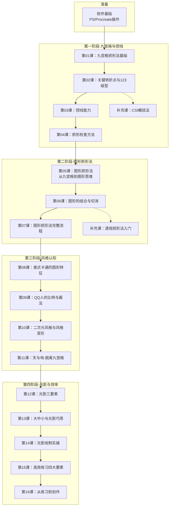

# 课程地图

## 学习路径总览

## 各阶段目标

| 阶段 | 核心工具 | 目标 | 主要讲师 |
|------|---------|------|---------|
| 学前 | PS/Procreate | 能用软件完成绘画练习流程 | 小狮子 |
| 一 | 九宫格 | 掌握抓形基础、手眼协调、控线 | 小刀 |
| 二 | 图形法 | 建立图形思维、脱离九宫格依赖 | 韦叶 |
| 三 | 五边形 | 理解风格本质、掌握QQ人画法 | Y材 |
| 四 | 光影 | 光影绘制、高效练习、创作起点 | 蘑菇coco |

## 课程节奏

- **每日作业**：概念题 + 热身线条练习 + 抓形练习 + 每日总结
- **阶段测试**：每阶段第10天综合测试（BOSS关）
- **直播安排**：每阶段1节正课 + 2节带画答疑
- **总时长**：49天（4阶段 × 11天 + 3天补卡 + 结营）

## 课程理念

> 让零基础学员能用画家的角度去观察事物，知道怎么看、怎么分块、怎么测量——从大到小，先抓型再细化。

[[index|← 返回首页]]