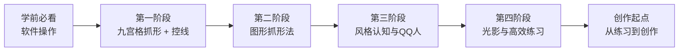

# 破晓之秋

> KK零基础绘画训练营 第0期·破晓之丘 — 49天从零开始掌握绘画观察法

**课程受众**：从未接触过电脑绘图的零基础学员  
**课程目标**：掌握"画家之眼"——用画家的角度观察事物、抓形临摹，建立手眼板一致的绘画基础能力  
**核心产出**：四个阶段系统训练 → 九宫格抓形 → 图形抓形 → 风格认知 → 光影与创作思维

## 课程地图

- **阶段一**：[[lessons/0001-jiu-gong-ge-zhua-xing|第01课：九宫格抓形法基础]] → [[lessons/0002-guan-jian-zhuan-zhe-dian|第02课：关键转折点与123级型]] → [[lessons/0003-kong-xian-neng-li|第03课：控线能力]] → [[lessons/0004-zhua-xing-jian-cha|第04课：抓形检查方法]] → [[lessons/s01-csi-gai-kuo-fa|补充课：CSI概括法]]
- **阶段二**：[[lessons/0005-tu-xing-zhua-xing-fa|第05课：图形抓形法——从九宫格到图形思维]] → [[lessons/0006-tu-xing-zu-he-yu-qie-xiao|第06课：图形的组合与切消]] → [[lessons/0007-wan-zheng-liu-cheng|第07课：图形抓形法完整流程]] → [[lessons/s02-tou-shi-zhua-xing-fa|补充课：透视抓形法入门]]
- **阶段三**：[[lessons/0008-mei-shi-ka-tong|第08课：美式卡通的图形特征]] → [[lessons/0009-qq-ren-bi-li|第09课：QQ人的比例与画法]] → [[lessons/0010-er-ci-yuan-feng-ge|第10课：二次元风格与风格变形]] → [[lessons/0011-tian-yu-di|第11课：天与地——脱离九宫格]]
- **阶段四**：[[lessons/0012-guang-yin-san-yao-su|第12课：光影三要素]] → [[lessons/0013-da-zhong-xiao|第13课：大中小与光影巧思]] → [[lessons/0014-guang-yin-hui-zhi|第14课：光影绘制实操]] → [[lessons/0015-gao-xiao-lian-xi|第15课：高效练习四大要素]] → [[lessons/0016-lian-xi-dao-chuang-zuo|第16课：从练习到创作]]

## 参考文档

- [[reference/抓形方法对比表|抓形方法对比表]]
- [[reference/光影术语速查表|光影术语速查表]]
- [[reference/线条控制练习指南|线条控制练习指南]]
- [[reference/常用快捷键速查|常用快捷键速查]]