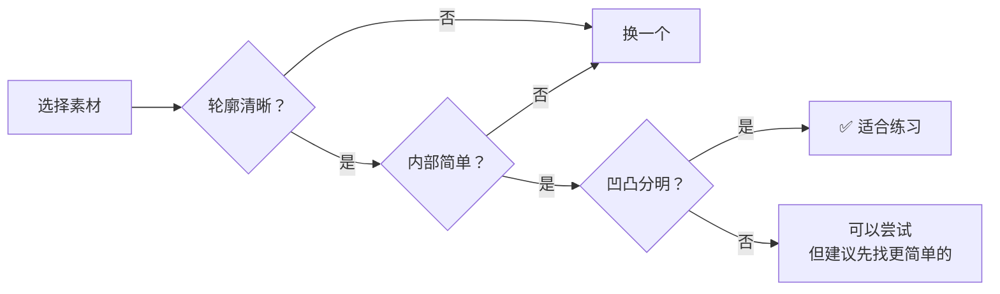

# 第01课：九宫格抓形法基础

## 课程总览

本训练营共 **49天**，分为 **四个阶段**，每阶段约11天：

| 阶段 | 主题 | 主讲 | 天数 |
|------|------|------|------|
| 一 | 九宫格抓形与控线 | 小刀老师 | 11天 |
| 二 | 图形抓形法 | 韦叶老师 | 11天 |
| 三 | 风格认知与QQ人 | Y材老师 | 11天 |
| 四 | 光影与高效练习 | 蘑菇coco老师 | 11天 |

每阶段包含 1 节正课 + 2 节带画答疑，最后 3 天为补卡和结营。每日作业包括概念题、热身线条练习、抓形练习和每日总结。

## Learning Objectives

- 理解九宫格抓形法的核心原理及其对零基础学员的意义
- 掌握满格原则和坐标轴思维，能正确摆放素材并定位关键点
- 独立完成一次完整的九宫格抓形流程

## 什么是九宫格抓形法？

九宫格（9-grid）是将画面用 2 条竖线和 2 条横线平均分成 9 个相等方格的一种辅助框架。对于零基础学员而言，九宫格最大的作用是**将复杂的轮廓拆解为多个小块**，每次只需要关注其中一个格子里的形状，大大降低了抓形的心理门槛。

> 当你面对一整张复杂的图片不知从何下手时，九宫格就是你的"分而治之"武器。

## 核心原理

### 1. 满格原则

素材放置到九宫格中后，主体物应当**尽量填满格子**，既不要太小（周围太空），也不要太大（超出格子）。具体标准：

- **太小的表现**：主体物在格子里只占不到 1/3 的面积，周围大量空白
- **太大的表现**：主体物超出格子边界，无法看到完整轮廓
- **适中的标准**：主体物的外轮廓距离格子边界约 0.5~1cm 的间距

> [!TIP] 调整方法
> 在 Procreate 或 Photoshop 中导入素材后，可以用自由变换（Ctrl+T / Cmd+T）缩放素材，使其适配九宫格。建议在新建画布时就按照素材比例设置画布尺寸。

### 2. 坐标轴思维

把九宫格的每一条网格线想象成数学课上学过的坐标系：

- 横向网格线 ≈ X 轴
- 纵向网格线 ≈ Y 轴
- 每条线都有固定的位置（从左到右第 1 条竖线、第 2 条竖线……）

当你在原图上定位一个点时，同时用横向和纵向的网格线去交叉定位。例如：

- 点 A 在"第 1 条竖线右侧约 1/3 格"且"第 2 条横线上方约 1/4 格"
- 把这个位置关系**原样复制**到你的画布九宫格中

这种思维是九宫格抓形法的底层逻辑——**不是复制形状，而是复制位置关系**。

### 3. 素材难度选择

初学者最常见的误区是选错素材。合适的素材应当：

- ✅ 轮廓清晰，边缘明显
- ✅ 内部细节不多（没有复杂花纹或阴影）
- ✅ 主体单一或少量组合
- ✅ 有明确的凹凸变化（便于找关键点）

> [!WARNING] 避坑提醒
> 不要一上来就挑战眼睛、嘴巴等五官特写，也不要选毛发凌乱（如蒲公英、狮子鬃毛）的素材。**最简单的素材 = 水果、简单静物、几何化的卡通角色**。

## 九宫格抓形完整流程

### Step 1：放置参考图到九宫格

在软件中导入参考图，叠加九宫格图层，调整大小使其满足满格原则。

### Step 2：在参考图上勾勒外轮廓

新建一层（红色或蓝色），用**较粗的画笔**沿主体物边缘勾勒出清晰的轮廓线。这一步的目的是：

- 让你的眼睛先"过一遍"轮廓
- 找出边缘上所有的重要转折

### Step 3：找出关键点并标记 ABCD

在参考图的轮廓上，找出 4 个以上的关键点。关键点通常是：

- 最左侧 / 最右侧的点
- 最上方 / 最下方的点
- 明显的凹陷或凸起

标记为 A、B、C、D，注意观察每个点在九宫格中的**坐标位置**（横纵比）。

### Step 4：在相邻九宫格中对应标记并连线

在画布九宫格中，根据同样的坐标位置标记 A'、B'、C'、D'，然后用直线或弧线将它们连接起来。先勾勒大轮廓，不必立刻追求精细。

### Step 5：细化调整

在大轮廓的基础上，逐步添加次一级的细节，修正线条的弯曲程度，使形状更加接近参考图。

## 复杂物件的简化处理

遇到复杂边缘（如树叶的边缘锯齿、衣服的褶皱碎边），**不要逐个小凹凸都画**：

- 先抓**大趋势**——整体是圆形、方形还是三角形？
- 忽略小于 2mm 的细微起伏
- 细节永远在大形准确之后再添加

> "先画整体，再画局部；先画大的，再画小的。"——这是贯穿整个课程的核心思想。

## 笔刷选择

本阶段推荐的笔刷：

| 笔刷 | 特点 | 用途 |
|------|------|------|
| **石墨笔刷** | 有轻微颗粒质感，适合练习线条 | 勾勒轮廓、涂色块 |
| **尖角笔刷** | 无压感、无透明度变化、边缘锐利 | 精确定位、标记关键点 |

> 初学者请不要使用带有压感或纹理的笔刷，这些会增加线条控制难度。

## 学习心态调整

很多同学在第一节课后会感到挫败——"明明看了教程，自己画出来就是不对"。这是**完全正常**的。

进步是**阶段性**的：
1. **看不懂阶段**：不知道从哪里下笔
2. **能看懂但画不准阶段**：知道问题在哪里，但手跟不上
3. **逐渐准确阶段**：手眼协调逐渐建立
4. **自动化阶段**：不再需要九宫格也能抓准

你现在处于第一阶段或第二阶段，给自己多一点耐心。

## 自我检测

> [!QUESTION] Self-check
> 1. 什么是满格原则？为什么它很重要？
> 2. 坐标轴思维的核心是什么——是复制形状还是复制位置？
> 3. 在九宫格抓形流程中，应该先画大轮廓还是先画细节？
> 4. 如果你选择的素材毛发特别多，你应该怎么做？
> 5. 当你觉得"自己画得太丑"时，应该放弃还是继续？

参考答案

1. 主体物放置后应尽量填满格子，既不太小也不太大。这能保证你的画面利用率和参考图保持一致，避免比例失调。
2. 复制**位置关系**，而不是复制形状本身。通过坐标交叉定位来还原关键点的空间位置。
3. **先画大轮廓**（一级型），再逐步添加细节（二级型、三级型）。
4. 简化处理！忽略小的毛刺和碎边，先抓住头部/身体的大趋势轮廓。
5. **继续**！第一节课画不好是正常的，把这次的作品保存下来，等课程结束后对比，你一定会看到进步。

## Next Step

恭喜你完成了九宫格抓形的理论基础！接下来请进入 [[0002-guan-jian-zhuan-zhe-dian|第02课：关键转折点与123级型]]，学习如何更精确地找到轮廓上的关键位置。