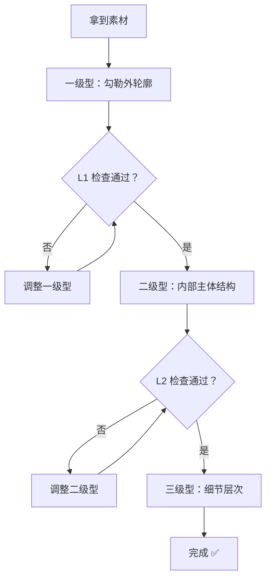

# 第02课：关键转折点与123级型

## Learning Objectives

- 学会在轮廓上识别两类关键转折点：凹凸点与弧线顶点
- 理解 123 级型的层级逻辑，能够对任意素材进行分级拆解
- 掌握圆弧物件的切线分割画法
- 建立"先大后小"的抓形思维模式

## 关键转折点（Key Turning Points）

在上一课中，我们用九宫格定位了 A、B、C、D 四个粗略的关键点。本节课将教你更系统的方法来找到轮廓上**真正重要的点**。

### 类型一：最凹最凸的点

任何物体的外轮廓都像一条波浪线，有凸出去的部分和凹进来的部分。**最凸的点**和**最凹的点**就是第一优先级需要标记的位置。

```
  凸凸凸凸凸凸凸
                 凹    凹
  凸              凹 凹
                 凹
  凸凸凸凸凸凸凸凸凸凸凸凸
```

- 把所有"最凸点"依次连接 → 得到物体的**外轮廓骨架**
- 把所有"最凹点"依次连接 → 得到物体内部的**结构分界线**
- 这些点连起来之后，一个复杂的形状就被简化成了多边形

> [!TIP] 实操技巧
> 当你盯着一个轮廓不知道从哪开始画时，先找这个物体**最左边**、**最右边**、**最上边**、**最下边**的四个点。把它们标出来，你就已经有了一个"包围盒"，剩下的点都是在这个框架内部来定位的。

### 类型二：弧线顶点

当物体的边缘是一段光滑弧线时（没有明显的凹凸转折），弧线上**离弦线最远的点**就是弧线顶点。找到这个点的方法：

1. 先连一条弦线（弧线两个端点之间的直线）
2. 找到弧线上距离弦线最远的那个位置
3. 这个位置就是弧线顶点

```
       · ← 弧线顶点
      / \
     /   \
    /     \
   /———————\ ← 弦线（两端点的连线）
```

> "弧线顶点 + 两个端点"这三点就构成了一条弧线的"骨架"，再用平滑曲线连接三点即可复现弧线。

### 点中有点：关键点连线 = 简化轮廓

把两类关键点全部找到并连接，你会发现：

- 原轮廓有 50 个小凹凸
- 你只用了 8~12 个关键点就抓住了**90% 的形状特征**
- 多余的 10% 是细微波浪，可以后期再微调

这就是**点中有点（Dots within Dots）**——在无数个可能的点中，只选出最关键的那些。

## 123 级型（Level 1-2-3 Shapes）

这是本课最重要的概念框架，贯穿整个绘画学习过程。

### 什么是 123 级型？

任何物体的形状都可以拆解为三个层级：

| 层级 | 名称 | 描述 | 示例 |
|------|------|------|------|
| **一级型（L1）** | 外轮廓 | 物体的外边缘，最大的形状 | 整个头部的剪影 |
| **二级型（L2）** | 内部主体结构 | 主要内部结构的边缘 | 眼睛轮廓、鼻子侧面、嘴巴形状 |
| **三级型（L3）** | 细节层次 | 小细节、花纹、纹理 | 瞳孔反光、眉毛的毛流、嘴唇纹路 |

### 123 级型的关键逻辑

**永远先完成 L1，再推进 L2，最后才是 L3。**



这个流程意味着：

- L1 不准绝不画 L2
- L2 不准绝不画 L3
- 每个层级做完后检查 1~2 次再推进

> [!WARNING] 常见错误
> 初学者最常犯的错误就是**跳级**——外轮廓还歪着，就急着去画眼睛里的高光。结果是改了又改，事倍功半。请严格遵守"L1 → L2 → L3"的顺序。

### 圆弧物件的处理方法

对于圆形、椭圆形或包含大量弧线的物体（例如苹果、水杯、气球），不要试图一笔画出完美的弧线。

正确方法：**把圆弧切分成几段直线去画**

1. 在圆弧上标记 3~5 个关键点
2. 用短直线连接相邻的点 → 得到一个多边形
3. 将多边形"切角"——逐步把边缘修圆

```
原始弧线 →  标记关键点 → 直线连接 → 切角修圆
   ⌒            ··          /\         ⌒
              ·    ·       /  \      /  \
             ·      ·    /    \    /    \
                         ——————  ————————
```

这本质上和"弧线顶点"方法是相通的——都是用**有限的关键点**来**逼近一条曲线**。

## 一个重要的规则：只画黑色轮廓，不涂黑色色块

在抓形阶段（尤其是 L1 和 L2），你只需要捕捉物体边缘的**轮廓线**，不需要填充内部的黑色区域。

**错误的做法**：看到参考图中有块黑色，就把整个黑色区域涂满。

**正确的做法**：只勾勒黑色区域的**边缘轮廓**，把它当作一个形状来画。

这个规则能让你保持清晰的线条画面，避免画面变得杂乱。

## 应用示例

以一只简单的小鸟素材为例：

- **L1**：鸟的整个身体剪影（头+身体+尾巴）→ 找到最凸（头顶、胸、尾尖）和最凹（脖子与身体连接处）的点
- **L2**：翅膀的轮廓线、眼睛的圆形、嘴巴的三角形 → 这是大块内部结构
- **L3**：瞳孔中的高光、羽毛的边缘纹路、爪子上的小关节

每一层都是独立的形状，每一层都用九宫格定位关键点的方法来处理。

## 自我检测

> [!QUESTION] Self-check
> 1. 两类关键转折点分别是什么？如何识别它们？
> 2. 什么是弧线顶点的"弦线法"？
> 3. 123 级型中，哪个层级的优先级最高？
> 4. 如果你在画一个水杯（圆柱体），应该直接画弧线还是先切直线？
> 5. "只画黑色轮廓，不涂黑色色块"是什么意思？

<details>
<summary>参考答案</summary>

1. 类型一：最凹最凸的点（轮廓上起伏最大的位置）；类型二：弧线顶点（弧线上离弦线最远的点）。
2. 先连接弧线两端形成一条直线（弦线），再从弧线上找到与弦线距离最远的点，即为弧线顶点。
3. **一级型（L1）**，即外轮廓。外轮廓不准，内部细节画得再好也没用。
4. **先切分成直线**——在圆柱体两侧的弧线上标记多个关键点，用短直线连接，再逐步修圆。
5. 看到黑色区域时，不要填充涂黑，而是勾勒该黑色区域的**边缘线**，把它当作一个形状轮廓来处理。
</details>

## Next Step

本节课结束后，建议用一张简单素材完整地做一次"L1 → L2"的分级抓形练习。接下来请进入 [[0003-kong-xian-neng-li|第03课：控线能力]]，学习如何画出干净流畅的线条。