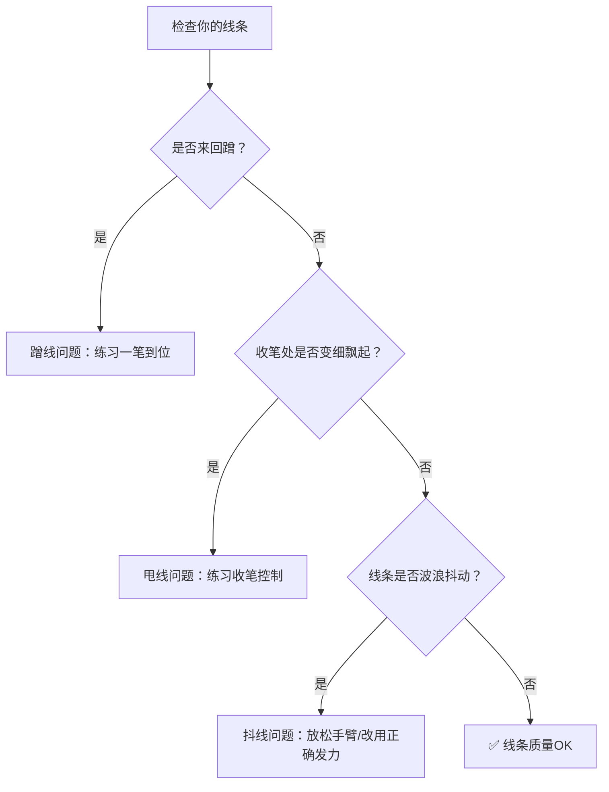

# 第03课：控线能力

## Learning Objectives

- 诊断并纠正三种常见的线条问题：蹭线、甩线、抖线
- 掌握手腕、前臂、整条手臂三种用笔方式及其适用场景
- 完成 3 种坡度的直线练习、C 曲线和 S 曲线练习
- 掌握点对点连线（走迷宫）方法，提高起笔收笔的精准度

## 初学者的三种线条问题

在进入练习之前，先来看三个最常见的线条问题。请你打开画布随便画几条线，对照看看自己有没有中招：

### 1. 蹭线（Scratching）

**表现**：画一条线来回反复描，线条是由很多短碎线段拼成的，边缘毛糙。

**原因**：不自信，害怕一笔画不准，所以用小碎步一样的方式"蹭"出一条线。

**解决**：每一笔**只能画一次**，不要重复描。如果画歪了，Ctrl+Z 撤销重来，而不是在原线上修补。

### 2. 甩线（Flicking）

**表现**：起笔重、收笔时突然变轻、线条末端飘起来，像被甩出去一样。

**原因**：手腕在收笔时抬起过早，笔尖还没到头就已经离开了板面。

**解决**：收笔时保持按压，直到线条终点后再抬笔。练习起笔重、中间稳、收笔也重。

### 3. 抖线（Trembling）

**表现**：线条呈波浪状抖动，像手在颤抖。

**原因**：手部过度紧张、发力方式不对（用小手臂/手腕做太大跨度的运动）、绘画速度过慢。

**解决**：放松肩膀和手臂，使用正确的用笔方式（见下文），适当加快绘画速度。



> [!TIP] 关键字：一笔到位
> 好的线条要：起笔果断 → 行笔均匀 → 收笔干脆。每根线条尽量一笔画完，宁可撤销重画，也不要修补。

## 正确的用笔方式

你的手臂可以分为三个"关节段"，不同长度的线条需要使用不同的关节来驱动：

| 线条长度 | 驱动部位 | 适合场景 |
|----------|----------|----------|
| **短线（< 3cm）** | 手腕 | 小细节、L3 级型、瞳孔、眉毛 |
| **中长线（3~8cm）** | 前臂（手肘固定） | L2 级型、中等大小的轮廓 |
| **长线（> 8cm）** | 整条手臂（肩膀驱动） | L1 级型、大型外轮廓 |

**演示方法**：

- 把手腕贴在板面上，只动手指和手腕 → 画短线
- 手肘支撑，前臂左右摆动 → 画中长线
- 肩膀放松，整条手臂带动 → 画长线

> [!WARNING] 最常见错误
> 画长线时只用手腕结果画成了抖线。**长线一定要用肩膀带动整条手臂**，手腕保持稳定不主动发力。

## 直线练习

将直线按照"坡度"分为 3 个类别。每一类都需要单独练习。

### 3 种坡度

```
坡度  角度      示例方向
--------------------------
大坡度  67.5°    近乎垂直的斜线
中坡度  45°      标准对角线
小坡度  22.5°    接近水平的斜线
```

### 练习方法

1. 在画布上画 3 个**田字格**（或使用九宫格模板）
2. 每个格子里练习一种坡度
3. 每种坡度**重复画 3 遍**
4. 目标：同一坡度的一组线条**角度一致**、**间距均匀**、**首尾干净**

> 先画满一格检查，发现问题再画下一格。而不是机械地画完 3 遍再去看。

## 曲线练习

### C 曲线

从一个端点出发，画一条平滑的弧线到达另一个端点。注意：

- 弧线的弯曲度保持一致（不能一边陡一边平）
- 起笔和收笔的切线方向可控
- 练习 3 种坡度方向上的 C 曲线

### S 曲线

S 曲线 = 2 段 C 曲线反向拼接。

- 一段 C 向左弯 + 一段 C 向右弯 = S 曲线
- 关键：两个弧线的过渡要**平滑自然**，中间不能有"折角"
- 同样练习 3 种坡度方向

```
C 曲线：     ⌒    （单一弧线）
S 曲线：    S     （两段反向弧线）
```

> S 曲线练习时，试着感受"手腕先往一个方向转，再往反方向转"的连贯动作。

## 点对点连线（走迷宫法）

这是控线练习中**最实用、最接近实战**的练习方法。

### 基本原理

- **2 点连线**→ 画直线：给定起点和终点，一笔画出直线
- **3 点连线**→ 画曲线：给定起点、中间点、终点，一笔画出穿过中间点的平滑曲线

### 练习示例：青蛙

在画布上用九宫格放一只简笔青蛙的参考图，但只标记出关键点（ABCDE...）。你的任务：

1. 观察每个点的坐标位置
2. 按顺序把点连起来
3. **每段线只画一笔**
4. 每段线最多撤销不超过 2 次

```
青蛙轮廓的关键点布局（示意）：
    A(头顶正中)
       \
  D ←—— B(左眼外侧)    C(右眼外侧) ——→ E
         \            /
          F(左嘴角)  G(右嘴角)
              \    /
                H(下巴尖)
```

> [!TIP] 练习要点
> - 不要先打草稿再描线——要练的正是**一笔抓准的能力**
> - 如果一段线画了 3 次还画不准，先停下来分析：是位置判断错了还是线控制不好？
> - 是位置问题 → 回看 [[0001-jiu-gong-ge-zhua-xing|第01课：九宫格定位]]
> - 是线控制问题 → 继续本节课的坡度和曲线练习

## 综合练习建议

建议每天的练习顺序：

1. **热手**：5 分钟，自由画圈圈、8 字形线条
2. **直线**：10 分钟，3 种坡度各画 1 组
3. **曲线**：10 分钟，C 曲线和 S 曲线各 1 组
4. **点对点连线**：15~20 分钟，选一张简单素材
5. **收尾**：5 分钟，回顾今天哪类线条进步了、哪类还需要加强

## 自我检测

> [!QUESTION] Self-check
> 1. 蹭线、甩线、抖线分别是什么？你能在检查自己的画时识别出它们吗？
> 2. 画一条 10cm 的长线应该用哪些关节驱动？
> 3. 3 种坡度的直线分别对应多少度角？
> 4. S 曲线和 C 曲线有什么关系？
> 5. 点对点连线练习中，如果一段线画错了，最佳做法是什么？

<details>
<summary>参考答案</summary>

1. 蹭线 = 反复描一条线；甩线 = 收笔时变细飘起；抖线 = 线条波浪抖动。练习时打开「线条透视」或回放功能可更清楚地看到问题。
2. **整条手臂，肩膀驱动**。手腕保持稳定不主动发力。
3. 小坡度 22.5°、中坡度 45°、大坡度 67.5°。
4. S 曲线 = 2 段反向的 C 曲线平滑拼接而成。
5. Ctrl+Z 撤销重画（最多 2 次），而不是在原线上反复修补。如果超过 3 次还画不准，停下来分析原因再继续。
</details>

## Next Step

控线能力不是一节课就能练好的，每天坚持 15 分钟的热手练习，两周内你会看到明显的进步。接下来请进入 [[0004-zhua-xing-jian-cha|第04课：抓形检查方法]]，学习如何科学地检查自己的画是否准确。