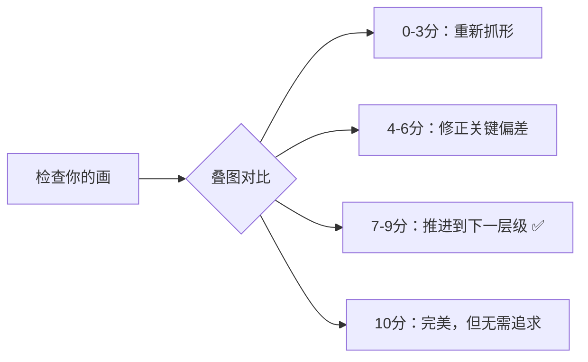

# 第04课：抓形检查方法

## Learning Objectives

- 建立形准的量化标准（0~10 分评价体系）
- 掌握红线检查法和叠图检查法两种检查手段
- 理解不同线稿层级（外轮廓/内轮廓）的合理线宽
- 识别并避免初学者的四大常见错误

## 前置条件：1:1 尺寸匹配

在进行任何检查之前，确保你的画和参考图**尺寸完全一致**（1:1）。

为什么？

- 如果画比参考图大，所有比例都会失真
- 如果画比参考图小，无法准确叠图对比
- 只有 1:1 才能让检查有意义

**正确的流程**：新建画布时，直接将参考图复制到画布中，然后新建图层画在参考图旁边或上方。

> [!TIP] Procreate 用户
> 使用"参考"功能，把参考图拖到画布一侧的正上方，调整到与画布中内容相同尺寸。检查时把参考图层拖过来叠图即可。

## 红线检查法

红线检查法是最基础、最推荐初学者使用的检查手段：

1. 在参考图图层上方新建一个**红色图层**
2. 用红色线条沿参考图的外轮廓（L1）和主要内部结构（L2）描一遍
3. 关闭参考图图层，只保留红线
4. 把红线拖到你的画旁边，**肉眼对比**你的画和红线的形状差异

```
参考图      →    红线描边     →    关闭原图    →    对比你的画
                   🔴                   🔴
   🌸                 🌸                  🌸               🔴 vs ✏️
```

红线法的作用：

- **客观化**：把"我觉得画得还行"变成"这条线偏右了 2mm"的客观判断
- **去细节**：红线只画轮廓，不会被参考图内部的颜色和纹理干扰

> [!WARNING] 不要只做一次红线
> 建议在每个层级完成后都做一次红线检查。L1 做一次、L2 做一次、L3 做一次。不要等到全部画完才发现外轮廓有问题。

## 叠图检查法

叠图检查是将你的画层半透明化，直接**叠放在参考图上方**进行对比。这是最直观、最精确的检查方法。

### 操作步骤

1. 全选你的画 → 复制 → 粘贴到参考图文件中
2. 将你的画层设为**半透明模式**（不透明度 30%~50%）
3. 将画层移动到参考图上方，对齐定位点
4. 观察**偏差区域**——参考图露出来的部分就是偏差

### 偏差分析

| 偏差类型 | 视觉表现 | 可能原因 |
|----------|----------|----------|
| 位置偏移 | 整体偏左/偏右 | 定位点没对齐 / 九宫格坐标判断错误 |
| 比例偏差 | 局部偏大/偏小 | 关键点间距判断错误 |
| 角度偏差 | 斜线方向不对 | 坡度和斜率判断错误 |
| 形态偏差 | 形状"歪了" | 弧线顶点位置不准 |

> 建议拍照或截图保存每次的叠图结果，建立自己的"形准档案"，每个月对比一次进步情况。

## Ctrl+T 变形调整法

### 正确理解

很多同学发现偏差后，直接用自由变换（Ctrl+T / Cmd+T）去"拉伸"画层让它对齐参考图。

**正向用法**：这是一种**检查工具**——拉一下变形的滑块，看看你的画在哪些方向被拉长或压缩了，从而理解偏差的性质。

**错误用法**：用变形来"修好"你的画——这不会提升你的抓形能力。

> "Ctrl+T 能帮你找出问题，但不能帮你解决问题。解决问题唯一的方式是：撤销重画。"

## 形准标准（0~10 分系统）

建立一个客观的评分标准，帮助你判断是否应该推进到下一步：

| 分数 | 等级 | 标准描述 | 操作 |
|------|------|----------|------|
| **0~3 分** | 差距大 | 外轮廓整体不对，形状完全不同 | 重新抓形，回到九宫格定位 |
| **4~6 分** | 低标准 | 轮廓基本正确但有明显偏差 | 可以接受，进入下一层级前先修正关键偏差 |
| **7~9 分** | 高标准 | 轮廓几乎准确，只有微小偏差 | 目标区间，可以推进到下一层级 |
| **10 分** | 完美匹配 | 和参考图完全一致 | 不需要追求，浪费时间 |



> [!TIP] 目标设定
> 初学者合理的形准目标：**L1 达到 7 分**、L2 达到 6~7 分、L3 达到 5~6 分。不需要每个细节都 9 分。

## 检查次数

| 层级 | 建议检查次数 |
|------|-------------|
| L1（外轮廓） | 检查 1~2 次 |
| L2（内部主要结构） | 检查 1~2 次 |
| L3（细节） | 检查 1 次 |

超过这个次数说明两件事：

1. **练习量不够**——花更多时间不如多画一张
2. **检查本身变成了拖延**——不要用"再调整一下"来逃避"画下一张"

## 线稿层级与线宽

完成抓形后，最终线稿需要区分层级关系：

| 层级 | 建议线宽 | 说明 |
|------|----------|------|
| **外轮廓线** | 3~4 px | 最粗，突出主体边界 |
| **内部轮廓线** | 1~2 px | 较细，区分内部结构 |
| **细节线** | 0.5~1 px | 最细，L3 细节 |

这条规则模拟了人眼的视觉焦深——**外轮廓的粗细决定了画面的"骨架感"**。

## 四大常见错误（及解决方案）

### 错误一：花太多时间

**表现**：一张画反复改了 4~5 个小时还在调整。

**原因**：追求完美，不愿意接受"六十分即可"。

**解决**：设定时间上限（L1 最多 30 分钟、L2 最多 30 分钟、L3 最多 20 分钟），到了就保存作品，开始下一张。

### 错误二：调整次数过多

**表现**：一张画反复检查了 5~6 次还在改。

**原因**：不信任自己的眼睛，总想确认再确认。

**解决**：严格按照"每层级检查 1~2 次"的规则执行。

### 错误三：画了太多细节

**表现**：L3 画了阴影、纹理、高光等复杂的填充内容。

**原因**：把"抓形"和"完成"混为一谈。本阶段只抓形不画光影。

**解决**：**跳过阴影**，本阶段只画线框轮廓，不上调子不画光影。

### 错误四：线条质量不合格

**表现**：轮廓线存在蹭线、甩线、抖线（回看 [[0003-kong-xian-neng-li|第03课：控线能力]]）。

**原因**：跳过线条基本功直接开始抓形。

**解决**：每天先做 15 分钟控线热身练习再开始抓形。

## 自我检测

> [!QUESTION] Self-check
> 1. 在进行任何检查之前，必须先确保什么条件？
> 2. 红线检查法的主要目的是什么？
> 3. 形准标准中，7~9 分代表什么？你应该追求 10 分吗？
> 4. L1 层级的建议检查次数是多少？
> 5. 外轮廓线和内部轮廓线的建议线宽分别是多少？
> 6. 如果用了 Ctrl+T 变形后画变准了，这说明什么？

<details>
<summary>参考答案</summary>

1. 画和参考图**1:1 尺寸匹配**，否则所有对比和叠图都会失真。
2. 用红色线条在参考图上描边，关闭原图后与自己的画进行客观对比，排除内部颜色和纹理的干扰。
3. 7~9 分代表"几乎准确，只有微小偏差"，是目标区间。**10 分不需要追求**，不值得花那个时间。
4. 1~2 次。
5. 外轮廓线：3~4 px；内部轮廓线：1~2 px。
6. Ctrl+T 变形只能帮你**发现偏差**（哪里被拉长了、哪里被压扁了），但不能真正提升你的抓形能力。想提升还是得撤销重画。
</details>

## Next Step

本节课是抓形检查的完整方法指南。在后续的每一张练习中，都应该用本节课的方法做自我检查。接下来请进入 [[0005-tu-xing-zhua-xing-fa|第05课：图形抓形法]]（或直接开始你的第一张完整抓形练习）。