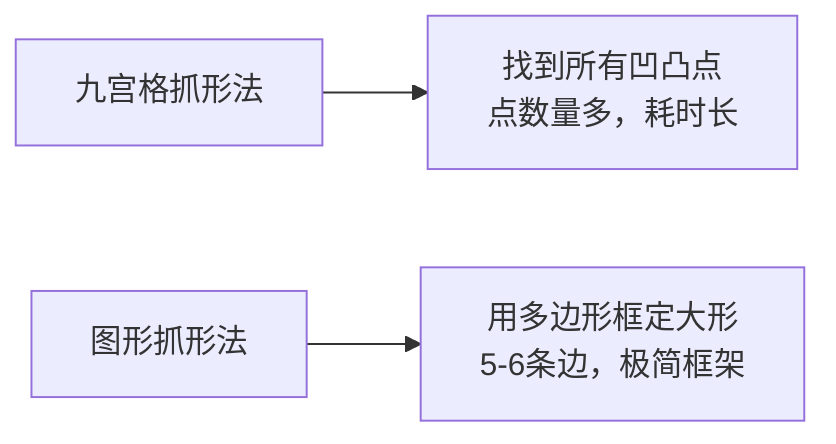
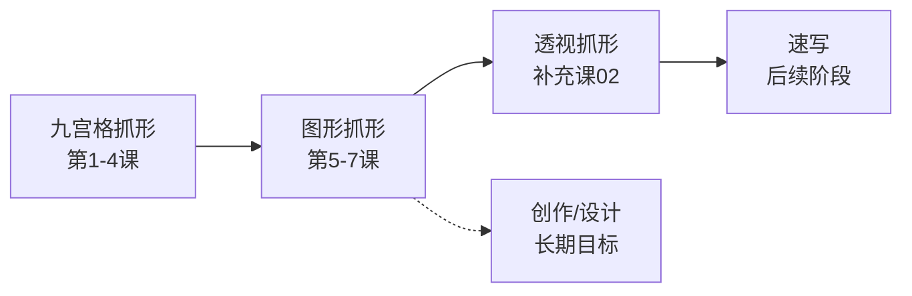
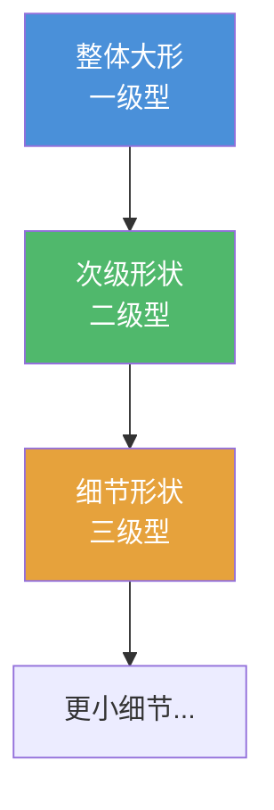

# 第05课：图形抓形法——从九宫格到图形思维

## Learning Objectives

- 理解九宫格抓形法与图形抓形法的核心区别，掌握一级型分割方式的转变
- 背诵图形抓形法的三大优势，能在实际描图中有意识地运用
- 掌握简单图形的定义（五到六边形以内），能主动将复杂轮廓化简
- 建立层级思维——从大到小、面积对比，将二三极型归纳为简单封闭图形
- 运用定点描图法训练转折点判断与CSI选取能力

## Core Idea

### 从九宫格到图形法：一级型的革命

在[[0001-jiu-gong-ge-zhua-xing|第01课 九宫格抓形法]]中，我们依赖九宫格来定位所有凹凸点，这是**九宫格抓形法**的核心逻辑——先画九宫格、再找所有转折点、最后连点成线。它的优点是"无脑"，缺点是"太慢"。

**图形抓形法**彻底改变了一级型的切割方式：

九宫格法找的是**点**，图形法找的是**几何形状**。这一转变让你的眼睛从"定位器"升级为"形状识别器"。

### 图形抓形法的三大优势

> [!TIP] 三大优势
> **1. 速度快**——不再需要画两个九宫格（九宫格+斜线格），直接用多边形框定形状，节省约50%的时间。
>
> **2. 建立图形思维**——学会像大师一样处理形状。所有优秀的画师都在用图形思维作画，而不是数格子。长期训练能内化为直觉。
>
> **3. 为速写做准备**——速写的核心能力是"复杂轮廓整理"。图形抓形法训练的就是这种能力——把杂乱的轮廓归纳为清晰的几何形，这是通往速写的必经之路。

### 学习路径图

本课程的整体学习路径如下：

九宫格是拐杖，图形法是学走路，透视抓形是跑步，速写是飞翔。**不要跳级**，每一步都在为下一步打基础。

### 什么是"简单图形"

简单图形 = 基本几何形，最多不超过六边形：

| 图形 | 说明 | 例子 |
|------|------|------|
| 圆形/椭圆 | 没有直线边的封闭曲线 | 头部、水果 |
| 四边形 | 四条边（矩形、梯形、平行四边形） | 躯干、箱子 |
| 三角形 | 三条边 | 鼻子、耳朵、翅膀 |
| 半圆形 | 圆的一半 | 拱形、驼峰 |
| D字形 | 一边直一边弧 | 下巴、背部 |
| 五边形/六边形 | 五到六条边（上限） | 复杂结构的归纳 |

> [!WARNING] 核心原则
> **绝对不要用七条边以上的图形**。如果一个形状需要七条边以上才能描述，说明你还没有充分简化。继续简化直到不超过六条边。

### 减少复杂图形：外轮廓与内部轮廓

复杂图形无处不在，图形抓形法的核心就是把它们变简单。需要简化的不只是**外轮廓**，还有**内部轮廓**：

- **外轮廓**——物体的最外围边界
- **内部轮廓**——物体内部的形状分割（衣纹、肌肉结构、道具）

两者都需要归纳为简单封闭图形。

### 层级思维：从大到小

**面积大小对比是核心**。先看最大的形状，再逐个看次大的，最后才是小细节。千万不要一上来就去抠眼睛鼻子——这是新手最容易犯的错误。

### 二三极型：归纳为简单封闭图形

二级型和三级型为什么要归纳为简单封闭图形？

1. **便于记忆**——封闭图形在脑海中有"形状感"，比散乱的线条更容易记住
2. **便于再现**——当你临摹时，只需要回想"这是一个D形+三角形"而不是"这里有一条线凹进去，那里有一条线凸出来"
3. **便于检查**——封闭图形之间有明确的面积对比关系，容易比较比例是否正确

### 定点描图法

定点描图法是训练图形思维的有效方法：

1. 选一张参考图
2. 用**定点**的方式（只点关键转折点，不连线）在纸上标记所有一级型顶点
3. 检查点的位置：CSI（大小、形状、倾斜度）是否正确
4. 将点连成多边形，看是否构成了你预期的图形
5. 填充内部细节

这个方法的目的是训练你的**转折点判断能力**——哪些点是关键顶点，哪些点可以被忽略或合并。

> [!QUESTION] 定点描图的关键
> 定点时你要问自己三个问题：
> - 这个点是**必须**的吗？去掉它会丢失重要形状信息吗？
> - 这个点能不能和相邻点合并？
> - 连接这些点后，得到的形状是"简单图形"（<=6边）吗？

## Worked Example

**例：用图形法抓取一只侧面的猫**

1. **一级型分析**：猫的整体可以归纳为一个**大椭圆**（身体）+ **一个三角形**（头部）+ **一个四边形**（尾巴基座）
2. **定点**：在猫的身体轮廓上标记6个关键点——头顶、下巴、胸部、臀部、尾巴根部、前脚
3. **连线**：连接这6个点，你会得到一个六边形——这就是猫的一级型
4. **二级型**：在六边形内部继续划分——耳朵是两个小三角形，眼睛是两个小椭圆
5. **对比检查**：用空想坐标系检查各部分的斜率是否与原图一致

你会发现，一旦一级型的六边形画准了，后面二级型和三级型的位置自然就准了。**大形准了，小形不会差太远。**

## Practice

> [!QUESTION] Self-check
> **Q1**: 图形抓形法与九宫格抓形法最根本的区别是什么？
>
> **Q2**: 图形抓形法的三大优势是什么？
>
> **Q3**: 什么是"简单图形"？最多允许几条边？
>
> **Q4**: 为什么要把二三极型归纳为简单封闭图形？
>
> **Q5**: 实操题——找一张参考图，用定点描图法标记关键转折点，连接后确认你得到了一个不超过六边形的形状。

Reveal answer

**A1**: 最根本的区别是一级型的切割方式。九宫格法找"所有凹凸点"，图形法找"简单几何形"。九宫格以点为分割单位，图形法以多边形为分割单位。

**A2**: ① 速度快——不用画两个九宫格；② 建立图形思维——学会像大师一样处理形状；③ 为速写做准备——训练复杂轮廓整理能力。

**A3**: 简单图形是基本几何形（圆、四边形、三角形、半圆、D字形），最多不超过六边形。

**A4**: 三个原因：便于记忆（形状感），便于再现（回想图形而非线条），便于检查（面积对比一目了然）。

**A5**: 检查你的定点是否不超过6个关键点，连线后是否得到一个6边以内的封闭多边形。如果是，恭喜你掌握了图形思维的第一步。

## Next Step

Continue with the next lesson — [[0006-tu-xing-zu-he-yu-qie-xiao|第06课：图形的组合与切消]] — 学习如何使用组合和切消技巧处理更复杂的物体。