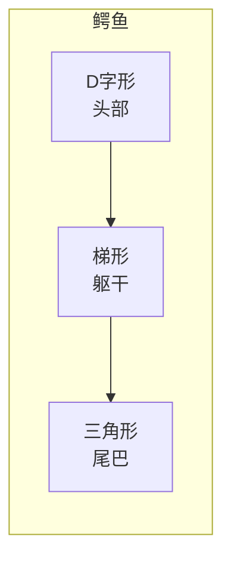

# 第06课：图形的组合与切消

## Learning Objectives

- 掌握图形组合（Combination）的核心方法，能将多个部分合并为简单几何形
- 掌握图形切消（Cutting）的技巧，能将复杂形状切割再重组
- 理解D字形概括法的使用场景，能在不确定时主动尝试D形
- 运用斜率对比（空想坐标系法）和色块观察法辅助判断
- 能评估不同图形方案的效率优劣

## Core Idea

上一课我们学习了用简单图形框定一级型。但在实际应用中，一个物体往往**不能**用一个简单图形概括——这时候就需要**组合**和**切消**。

### 图形的组合（Combination）

组合的核心思想：**把多个部分拼成一个简单几何形**。

```
复杂物体 = 图形A + 图形B + 图形C...
            ↓
          简单几何形（设计L1的时候就要让L2和L3更好画）
```

> [!TIP] 前人栽树，后人乘凉
> 设计一级型（L1）的时候，要想好怎么让二级型（L2）和三级型（L3）更好画。一二级型是"设计"出来的，不是"描"出来的。

**例：鳄鱼**
- 头部 → D字形
- 身体 → 梯形
- 尾巴 → 三角形
- 整体 → D形 + 梯形 + 三角形 的组合

你可以把鳄鱼的一级型看作一个**拉长的六边形**，其中头部和身体是两个不同的"区块"，但被框在了同一个大局之中。



### 图形的切消（Cutting）

切消的核心思想与此相反：**把复杂形状切割成多个简单图形**。

这和组合并不矛盾——**我出去了，我又回来了**：


切消的步骤：
1. 观察整体轮廓，找到"可以下刀"的地方（自然凹陷/转折）
2. 沿着这些位置切割，得到3-5个简单图形
3. 将这些图形重新组合，看能否还原为简化后的整体

> [!WARNING] 注意
> 切消和组合不是二选一的关系。**可以同时使用**。对一个复杂物体，你先切消再组合，这是非常常见的策略。

### 核心原则

无论使用哪种方式，都需遵循：

1. **从大到小** —— 永远先定大局，再处理细节
2. **无论切削还是组合都用基本图形** —— 不超过六边形
3. **可以同时用组合和切消** —— 灵活运用
4. **不超过六边形** —— 这是铁律

### D字形概括法

D字形是图形抓形法中最常用的图形之一。它的特点是：**一边直，一边弧**。

适用场景：
- 下巴/脸部侧面
- 动物背部
- 物体的一个侧面
- **当你不确定该用什么图形时，试试D字形**

> [!TIP] 同一个物体，不同的D形分割
> 一个侧面人像的脸部，可以有不同的D形划分方式：
> - 方式A：整个头部一个D形（最简）
> - 方式B：面部一个D形 + 后脑勺一个半圆（更细）
> - 方式C：面部D形 + 头发另一个D形（适合有复杂发型）
>
> 没有"唯一正确"的分割，只有"更适合你的临摹目标"的分割。

### 斜率对比：空想坐标系法

没有九宫格比对了，怎么判断斜线方向是否正确？

**空想坐标系法**：
1. 在脑海里想象一个X轴（水平线）和Y轴（垂直线）
2. 用视线对比：这条边和水平线/垂直线之间的夹角是多少？
3. 或者在脑海中"延长"这条边，看它和画面的边框在哪里相交

```
现实：    你在脑海中画坐标系：
   \          ↑ Y
    \         |
     \        |    /
      \       |   /
              |  /
              | /
             /| X
            /   (想象的水平线)
```

这个方法不需要真的在纸上画线，而是在脑海中构建坐标系。初期可能需要练习，但一旦掌握，速度远超九宫格。

### 色块观察法

另一个强大的辅助技巧：**把形状涂成色块**。

- 将你划分出的图形在脑海中填充颜色（比如红色、蓝色、黄色）
- 或者眯起眼睛看，忽略细节，只看到"色块"
- 对比不同色块之间的**面积大小、形状比例、位置关系**

色块观察法的优势在于：**颜色让你忽略线条的干扰，直接看到形状与形状之间的关系**。

### 效率评估：ABCD哪个方案最好？

> [!QUESTION] 框架选择
> 假设一个复杂物体，有四种图形划分方案：
> - A方案：用2个图形（最快最简，但可能不够准）
> - B方案：用4个图形（平衡了速度和准确度）
> - C方案：用6个图形（更精确，但耗时增加）
> - D方案：用8个图形（极度精确，但已经违背了"不超过六边形"原则）
>
> 哪个最好？
>
> 答案是：**都可行，但B或C通常最有效率**。D方案违反了图形法的基本原则——如果用到8个图形，不如直接用九宫格。A方案又太粗糙，定位不准会导致后期调整耗时更多。
>
> 图形法的精髓不是"越少越好"，而是在**准确度和速度之间找到最优平衡**。

## Worked Example

**例：用组合+切消抓取一把吉他**

1. **观察**：吉他的轮廓包括琴头（小矩形）、琴颈（长条形）、琴身（葫芦形）
2. **切消**：将吉他分为三个部分——琴头、琴颈、琴身
3. **简化**：
   - 琴头 → 小四边形
   - 琴颈 → 细长的矩形（两条平行边）
   - 琴身 → 由两个D字形组成（上半圆D形 + 下半圆D形）
4. **组合**：将三个部分组合成整体——一个拉长的形状
5. **斜率检查**：用空想坐标系检查琴颈的倾斜度是否符合原图
6. **色块观察**：眯眼观察，琴身（色块面积最大）→ 琴颈（中等）→ 琴头（最小），比例是否正确？

## Practice

> [!QUESTION] Self-check
> **Q1**: "前人栽树后人乘凉"在图形抓形法中指的是什么？
>
> **Q2**: "我出去了我又回来了"描述的是哪种操作？请简述过程。
>
> **Q3**: D字形概括法最适合什么场景？请举一个可以用D字形概括的物体。
>
> **Q4**: 空想坐标系法的核心步骤是什么？
>
> **Q5**: 实操题——找一个复杂物体（比如一把椅子或一个动物），尝试用三种不同的图形方案来概括它，比较哪种方案最有效率。

<details>
<summary>Reveal answer</summary>

**A1**: 指在设计一级型（L1）的时候就要考虑如何让二级型（L2）和三级型（L3）更好画。好的L1设计能为后续工作节省大量时间。

**A2**: 描述的是"切消后再组合"的过程：先把复杂物体切割成多个简单图形（出去了），再将这些简单图形重新组合为一个新的封闭整体（回来了）。目的是在不丢失精度的前提下大幅简化形状。

**A3**: D字形最适合"一边直一边弧"的形状。常见例子：侧脸的下巴和额头、动物的背部弧线、瓶子的侧面轮廓、手臂的正面等。当你不知道用什么图形时，D字形通常能行。

**A4**: ① 脑海中构建X轴（水平）和Y轴（垂直）；② 对比边的方向与坐标轴的夹角；③ 或"延长"边看其在画面边框的交点。

**A5**: 比较三个方案时，关注：每个方案用了几个图形？是否都在六边形以内？哪个方案让你最容易看出比例关系？哪个方案画起来最快？通常"图形数量适中、切割位置符合物体自然结构"的方案最有效率。

</details>

## Next Step

Continue with the next lesson — [[0007-wan-zheng-liu-cheng|第07课：图形抓形法完整流程与细化]] — 学习完整的图形抓形三步流程，以及如何通过线稿层级提升完成度。