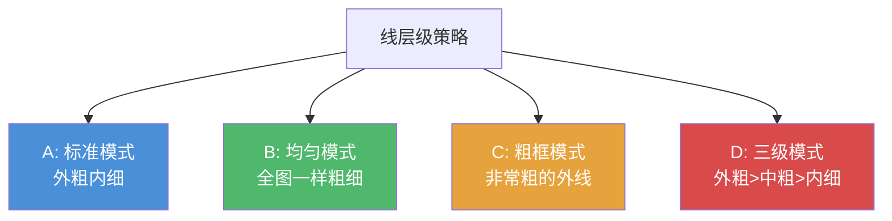

# 第07课：图形抓形法完整流程与细化

## Learning Objectives

- 掌握图形抓形法的三步流程（分析框架、临摹框架、细化修整）
- 区分"抓形"与"造型"的目标差异——先求准，再求美
- 掌握外轮廓粗内轮廓细的线稿层级原则
- 理解四种线层级语境（A/B/C/D）的差异和适用场景
- 运用涂黑技巧提升线稿完成度

## Core Idea

### 图形抓形法三步流程

图形抓形法的完整流程分为三步，每一��都对应不同的"能力"：


#### 第一步：分析框架 — 用脑力

这是最需要动脑子的一步：

1. 观察物体，找到最大的形状（一级型）
2. 判断用哪些简单图形来概括（组合？切消？还是直接一个形状？）
3. 确定图形的顶点位置和连接顺序
4. 在心中构建图形的框架

> [!TIP] 分析阶段的时间分配
> 新手最容易犯的错误是：**分析不足就急于动笔**。建议花40%的时间在分析上。分析到位了，后面的临摹会非常顺畅；分析不到位，越画越痛苦。

#### 第二步：临摹框架 — 用眼力

在纸上画出分析好的框架：

1. 用轻笔触画出��型图形（大形状的位置和比例）
2. 不要一次就画实线——先用长直线或长弧线"试探"位置
3. 检查框架比例（用空想坐标系法对比斜率）
4. 确认框架正确后，再画二级型和三级型的框架

这一步拼的是**观察力**——你的眼睛对比参考图和画面，不断调整。

```
参考图                         你的画面
┌──────────────┐           ┌──────────────┐
│  大形 ABCD   │   对比    │  大形 A'B'C'D'│
│  斜率 ~30°   │   ─━━   │  斜率 ~35°    │
│  面积比 2:1  │           │  面积比 2:1   │
└──────────────┘           └──────────────┘
                         ↑ 发现斜率偏了，调整！
```

#### 第三步：细化修整 — 提升完成度

框架正确后，开始细化：

1. 从外到内细化——先外轮廓后内部细节
2. 加强线稿层级（见下文）
3. 添加必要的涂黑
4. 清理草稿线条，保留干净的最终线稿

### 抓形 vs 造型

这是一个非常重要的区分：

| 维度 | 抓形 | 造型 |
|------|------|------|
| 目标 | **准度** ≈ 100% | **美感**优先 |
| 方法 | 忠实复制参考图 | 可加入主观处理 |
| 对比控制 | 尽量一致 | 可拉长/压短对比 |
| 直曲控制 | 尽量一致 | 可强化曲直对比 |

> [!WARNING] 本训练营只要求抓形
> 在零基础阶段，我们不要求你做造型（那需要更深的功底）。我们的训练目标就是**抓形准度**——你画的形状和参考图越接近越好。
>
> 记住：**你还没学会走路，就先别想着跑**。造型是更高阶的能力，等你抓形熟练了再学也不迟。

### 外轮廓粗，内轮廓细

完成度提升的"作弊码"——**线稿要有粗细变化**：

```
- 外轮廓线：3~4px（粗）
- 内部轮廓线：1~2px（细）
```

为什么这样效果好？

```
外轮廓粗       内轮廓细
══════════     ──────────
> 像物体的    > 像表面的
  投影/边界      纹理/褶皱
> 有体积感    > 不会抢外轮廓
> 视觉聚焦    > 层次分明
```

### 线层级的四种语境

不同的画风适合不同的线层级策略：



- **A — 标准模式**：外轮廓粗（3~4px）、内轮廓细（1~2px）。这是最通用的策略，适用于大多数情况。
- **B — 均匀模式**：全图一样粗。适合需要后续上色的线稿（太粗的线会被颜色覆盖）。
- **C — 粗框模式**：外轮廓非常粗。适合涂鸦风格/街头风格，视觉冲击力强。
- **D — 三级模式**：外轮廓粗、中等结构线中等、细节线最细。最成熟、完成度最高的处理方式。

> [!TIP] 新手策略
> 建议新手先从**A模式**开始，掌握了外粗内细后，再尝试D模式。B和C适合特定需求。

### 完成度提升 ≈ 化妆魔法

```mermaid
graph LR
    A[裸线稿] -->|加外轮廓粗线| B[有了轮廓感]
    B -->|加内轮廓细线| C[有了层次感]
    C -->|加涂黑| D[有了轻重感]
    D -->|加细节| E[完成！
```

就像化妆一样：
- 外轮廓粗线 ≈ 粉底（大的基调）
- 内轮廓细线 ≈ 眉毛/眼线（结构）
- 涂黑 ≈ 眼影/修容（立体感）
- 细节 ≈ 唇彩/高光（最后的精致）

### 涂黑的技巧

在画面中适当加入黑色填充（涂黑），可以显著提升完成度：

1. **涂哪里** —— 阴影区域、物体内部的深色部分、缝隙、衣纹凹陷处
2. **怎么涂** —— 均匀涂满，边缘干净
3. **不要涂哪里** —— 亮部区域、外轮廓之外

涂黑遵循"**少即是多**"的原则——涂太多会脏，涂太少没效果。通常涂黑占画面面积的 5%~15% 比较合适。

## Worked Example

**例：用完整流程临摹一个侧面人像**

1. **分析框架（用脑力）**：
   - 整体：一个纵向的六边形
   - 头部：D字形（下巴到后脑）
   - 头发：额外一层D字形（包裹在头部之上）
   - 颈部：小四边形
   - 确定了5个关键顶点

2. **临摹框架（用眼力）**：
   - 轻笔触画出六边形框架
   - 用空想坐标系检查：下巴的倾斜度约45°，头顶约水平
   - 对比面积比：头部面积 : 颈部面积 ≈ 4 : 1
   - 修正：发现下巴画太尖了，调整平缓一些
   - 框架确认后，添加眼鼻口的位置

3. **细化修整（提升完成度）**：
   - 外轮廓线加粗（3px）
   - 内轮廓线保持细（1px）
   - 在头发阴影处和颈部下方涂黑
   - 擦除多余的草稿辅助线

完成后的效果：线稿有层次感、有轻重节奏、轮廓清晰分明。

## Practice

> [!QUESTION] Self-check
> **Q1**: 图形抓形法的三步流程是什么？每一步分别"用"什么能力？
>
> **Q2**: "抓形"和"造型"有什么不同？本训练营的要求是什么？
>
> **Q3**: 四种线层级语境（A/B/C/D）分别是什么？哪种最适合新手？
>
> **Q4**: 涂黑的目的是什么？涂黑面积一般控制在多少？
>
> **Q5**: 实操题——找一张参考图，完成图形抓形法的完整三步流程，并在最后一步尝试加入外粗内细的线稿层级和涂黑。对比细化前后的完成度差异。

<details>
<summary>Reveal answer</summary>

**A1**: ① 分析框架（用脑力）→ ② 临摹框架（用眼力）→ ③ 细化修整（提升完成度）。第一步找图形，第二步画图形，第三步美化图形。

**A2**: 抓形追求准度（≈100%忠实复制），造型追求美感（可加入主观处理如拉长对比、强化直曲）。本训练营只要求抓形，不要求造型。先求准，再求美。

**A3**: A-标准模式（外粗内细，新手首选）、B-均匀模式（适合上色）、C-粗框模式（涂鸦风）、D-三级模式（外粗>中粗>内细，最成熟）。新手从A开始。

**A4**: 涂黑是为了增强立体感和轻重节奏，通过填充阴影/凹陷区域来提升完成度。一般控制在画面面积的5%~15%。

**A5**: 对比细化前后的画面，应该能明显感觉到：① 加了线层级后，外轮廓和内轮廓有了视觉主次；② 加了涂黑后，画面有了"重量感"；③ 整体完成度视觉上提升了30%~50%。

</details>

## Next Step

Now that you have completed the core图形抓形法 lessons, you may proceed to the supplementary lesson — [[s02-tou-shi-zhua-xing-fa|补充课02：透视抓形法入门]] — 学习如何处理透视空间中的形状。