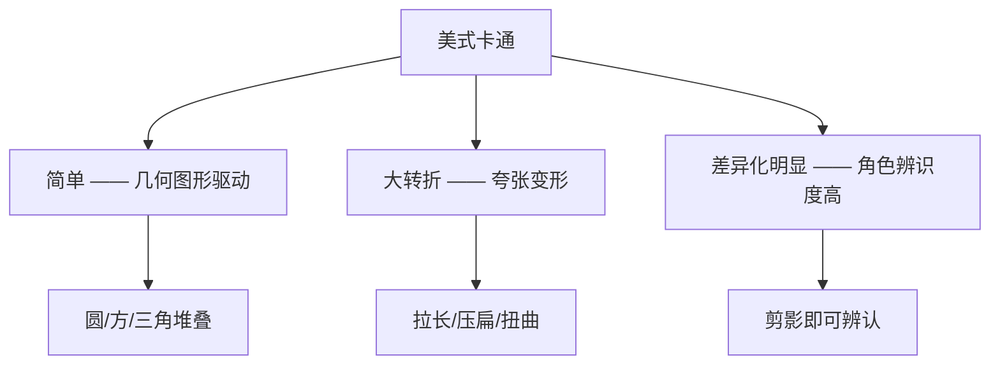
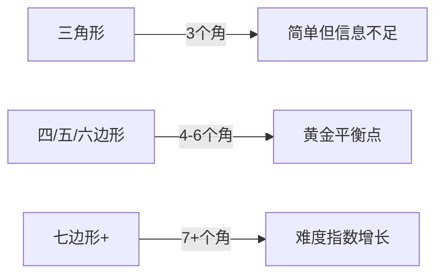
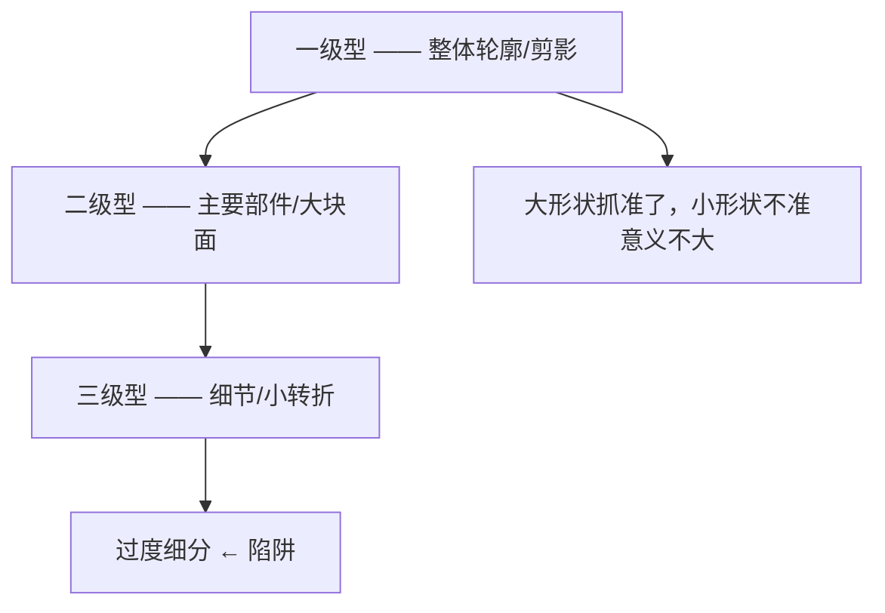
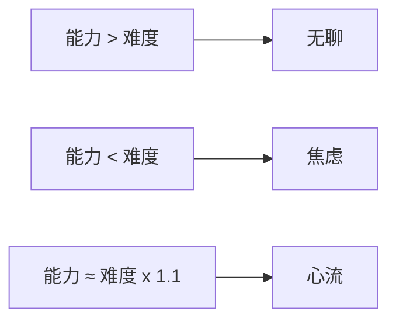

# 第08课：美式卡通的图形特征

## Learning Objectives

- 理解美式卡通的三大核心特点及其与日韩风格的差别
- 掌握五边形概括法的原理与临场策略
- 学会两种量化标准方法：零部件分法与颜色区块分法
- 理解一级型、二级型、三级型的层级关系，避免过度细分
- 运用心流理论建立可持续的练习心态

---

## Core Idea

美式卡通是所有绘画风格中最适合**锻炼概括能力**的入口。它的图形结构清晰、转折大胆，能让初学者快速建立起"用图形看世界"的思维方式。

### 美式卡通的三大特点



1. **简单（几何图形驱动）**：美式卡通角色的身体几乎都可以拆解成圆形、方形和三角形的组合。一个角色就是一个几何积木堆叠。
2. **大转折（夸张变形）**：相比于真实人体的微妙曲线，美式卡通在关节、动作、表情上做了极大夸张。这种"夸张"让图形关系变得非常清晰易读——转折越大，图形边界越明显。
3. **差异化明显**：每个角色的剪影（silhouette）都不同——好的美式卡通，只看剪影就能认出是谁。这背后是对图形比例的极端控制。

### 为什么学美式卡通

很多初学者一上来就想画二次元，但二次元的转折过于微妙，图形边界模糊，初学者很难看出"哪里是形状的分界"。

> [!TIP] Key Insight
> 学美式卡通不是因为你要成为卡通画家，而是因为**美式的夸张让图形关系暴露无遗**。等你能轻松分解美式卡通时，再回头看二次元——那些微妙转折就不再是迷雾，而是"被压扁的美式"。

**三个学习收益**：
- 锻炼概括眼力——把复杂对象看成简单图形的能力
- 训练抓形能力——特别是大形体的边界判断
- 降低学习预期——美式卡通允许"不够像"，减轻心理负担

---

### 五边形概括法

五边形概括法是本课的核心工具。它的思路是：**尽量把看到的图形概括成四边形、五边形或六边形**。

**为什么是四/五/六边形，而不是七边形或更多？**



这是一个关键认知：**每增加一个顶点，难度不是加法增长，而是乘法增长。**

- 三角形：3个顶点，共3条边的关系需要判断
- 四边形：4个顶点，6对关系
- 五边形：5个顶点，10对关系
- 六边形：6个顶点，15对关系
- 七边形：7个顶点，**21对关系**

这就是 `7+7+7` 和 `7x7x7` 的区别——每增加一个顶点，需要协调的"相邻关系"呈几何级数上升。

> [!WARNING] 常见误区
> 初学者容易贪多，试图用八边形、九边形去"精确"概括一个形状。结果是顶点越多，每个顶点的位置越不确定，反而画不准。**五个点够了，四个点也行，六个点是极限。**

---

### 两种量化标准方法

观察对象时，你需要决定"把什么当作一个图形"。有两种思考方式：

#### 方法一：零部件分法

把角色拆解成**物理部件**作为分形单位：

```
头 —— 五边形
身体（躯干） —— 六边形
左大臂 —— 四边形
右大臂 —— 四边形
左小臂 —— 四边形
右小臂 —— 四边形
盆骨/胯部 —— 五边形
大腿 —— 四边形
小腿 —— 四边形
```

这种方法适合：**结构清晰、有明确关节分割的角色**。

#### 方法二：颜色区块分法

把**同颜色的区域**作为一个整体来看待：

```
红色区域（上衣） —— 一个形状整体
蓝色区域（裤子） —— 一个形状整体
肤色区域（头+手+腿） —— 多个肤色形状
```

这种方法适合：**色彩简洁、平涂风格的角色**。它训练的不是"看结构"，而是"看色块"——这在后期上色阶段非常有用。

---

### 避免过度细分——三级型理论

图形是有层级的，从大到小分为三级：



- **一级型**：整个角色的外轮廓、剪影（最重要）
- **二级型**：头、身体、四肢等大块面的形状
- **三级型**：手指、衣纹、五官等细节形状

核心原则是：**大形状抓准了，小形状准不准意义不大。**

如果头的轮廓（一级型）画错了，眼睛画得再像也没有用；如果身体的动态线（二级型）对了，手指画错了也不会太影响整体感觉。

> [!TIP] 训练建议
> 练习时，每画一个图形先问自己：这是在抓一级型、二级型还是三级型？如果是在三级型上花了超过20%的时间，停——先回去检查一级型和二级型。

---

### 心流理论

心流（Flow）是指人完全沉浸在某项活动中的心理状态。它的触发条件是：**任务的难度刚好比你的能力高一点点。**



这就是为什么我们选择美式卡通而不是照片写实——照片写实的难度远超初学者能力，会导致焦虑；而美式卡通的图形概括刚好在"稍微超出能力"的范围，让你感到挑战但又不会崩溃。

> [!NOTE] 心态提示
> 画不出来不是你的问题，是难度没控制好。**降低对象复杂度，增加练习频率**——这是所有绘画进步的不二法门。

---

## Worked Example

以《辛普森一家》的角色为例，演示五边形概括法：

**角色：Homer Simpson**

1. **一级型观察**：整体是一个上大下小的梨形
2. **零部件分解**：
   - 头：近似圆形（但注意下巴的凸出）
   - 身体：一个大椭圆形（被衣服覆盖）
   - 手臂：两个四边形
   - 腿：两个短四边形
3. **颜色区块**：
   - 黄色区域 —— 头部+身体（连成一片）
   - 蓝色区域 —— 裤子
   - 白色区域 —— 衬衫领口
4. **五边形概括**：把头部+身体+手看作一个大的五边形，腿是下方延伸的两个小四边形

实际绘画步骤：
1. 先用九宫格打底（如果你还需要的话）
2. 画出最大的五边形（头+身体）
3. 在五边形内部切割出头和身体的边界
4. 用四边形添加四肢
5. 最后添加五官等三级型细节

---

## Practice

> [!QUESTION] Self-check
> **练习1**：找一张你喜欢的卡通角色图片，用五边形概括法将其分解为 4-5 个四边形/五边形/六边形。画完后检查——你的最大图形在整体中的比例是否正确？
>
> **练习2**：同一张图，分别用"零部件分法"和"颜色区块分法"各分析一次。对比两种方法的结果——哪种让你更容易抓住形状？
>
> **练习3**（进阶）：找一张真人照片，尝试用美式卡通的思维方式将其图形化。不用画得像，只要求用四到六边形完成概括。

<details>
<summary>Reveal answer</summary>

**练习1参考**：
- 正确的五边形概括应该覆盖角色的主体轮廓
- 检查方法：眯眼看原图，再看你的概括——模糊后的形状是否相似？
- 常见的错误：用了超过6个顶点，或者图形没有覆盖主要体积

**练习2参考**：
- 零部件分法更适合结构清晰的站姿角色
- 颜色区块分法更适合色块分明的角色
- 两种方法没有对错，关键在于找到**当前最适合观察对象的方式**

**练习3提示**：
- 真人照片的转折比卡通微妙得多
- 不要追求精确——先强行把看到的一切压成四边形、五边形
- 过度精确反而是障碍
</details>

## Next Step

掌握图形概括后，下一步是将其应用到具体的比例系统中。[[0009-qq-ren-bi-li|下一课：QQ人的比例与画法]] 将带你进入第一个具体的风格应用——在图形法基础上加入比例控制。

在进入下一课前，花 10 分钟找一个身边的物体（椅子、杯子、手机），用五边形概括法画一遍。这个习惯会让你的图形思维越来越强。